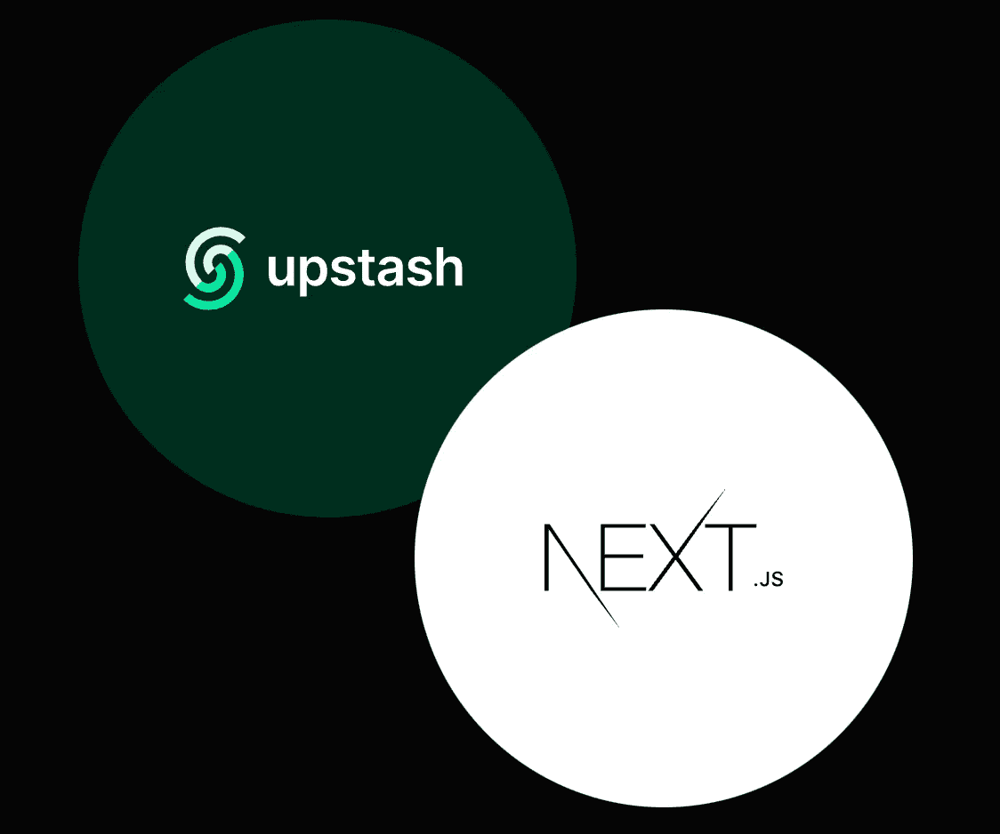

# 最简约的 Next.js TODO 应用

> 原文：<https://javascript.plainenglish.io/the-most-minimalist-next-js-todo-app-e7b28c80264?source=collection_archive---------13----------------------->

## 如何构建一个极简的基于 Next.js 的无服务器 TODO 应用？



在本文中，我们将构建一个基于 Next.js 的无服务器 TODO 应用程序。我们会尽量做到极简。它不会有任何数据库连接。除了 Next.js 之外，它不会有任何额外的依赖项，也不会有任何按钮。此外，`minimalism`很酷，很干净，我喜欢它，因为我是一个懒惰的开发者:)

# 为什么我们要避免数据库连接？

Next.js 是一个现代框架，它使前端开发人员能够开发全栈应用程序。对于 Next.js 开发人员来说，无服务器函数在简化后端开发方面有着重要的作用。您可能知道，无服务器函数不喜欢数据库连接，因为它们具有无状态的特性。参见[这里的](https://stackoverflow.com/questions/63208960/vercel-creates-new-db-connection-for-every-request)和[这里的](https://blog.upstash.com/serverless-database-connections)作为无服务器功能内部数据库连接问题的例子。

# 休息是一个答案

REST 允许客户端和服务器在没有会话信息的情况下进行通信。这种无状态性及其简单的本质使得 REST 成为无服务器环境的完美通信协议。我们将使用 REST 访问[upshosh Redis](https://upstash.com/)。

# 项目堆栈

*   前端: [Next.js](https://nextjs.org/)
*   后端: [Vercel 函数](https://vercel.com/docs/serverless-functions/introduction)
*   数据库:[用](https://upstash.com/) [REST API](https://docs.upstash.com/features/restapi) 更新 Redis

看演示:[https://nextjs-todo-zeta.vercel.app/](https://nextjs-todo-zeta.vercel.app/)

参见代码:[https://github.com/upstash/examples/tree/master/nextjs-todo](https://github.com/upstash/examples/tree/master/nextjs-todo)

# 项目设置

创建一个 Next.js 应用:`npx create-next-app`

在 AWS-US-EAST-1 区域创建一个[upsh Redis 数据库](https://console.upstash.com)，并复制其余的 URL 和令牌。

该项目将是一个具有 3 个 API 端点的单页应用程序:

*   pages/api/list.js:列出待办事项。
*   pages/api/add.js:添加 TODO 项。
*   pages/api/remove.js:删除 TODO 项。

# 代码

添加 pages/api/list.js，如下所示:

```
export default async (req, res) => {
   const token = "REPLACE_YOUR_TOKEN";
   const url = "[https://REPLACE_YOUR_ENDPOINT/lrange/todo/0/100?_token=](https://REPLACE_YOUR_ENDPOINT/lrange/todo/0/100?_token=)" + token;return fetch(url)
       .then(r => r.json())
       .then(data => {
           let result = JSON.stringify(data.result)
           return res.status(200).json(result)
       })
}
```

添加 pages/api/add.js，如下所示:

```
export default async (req, res) => {
   if(!req.query.todo) {
       return res.status(400).send("todo parameter required.")
   }
   let todo = encodeURI(req.query.todo)const token = "REPLACE_YOUR_TOKEN";
   const url = "[https://REPLACE_YOUR_ENDPOINT/lpush/todo/](https://REPLACE_YOUR_ENDPOINT/lpush/todo/)" + todo + "?_token=" + token;return fetch(url)
       .then(r => r.json())
       .then(data => {
           let result = JSON.stringify(data.result)
           return res.status(200).json(result)
       })
}
```

如下所示添加 pages/api/remove.js:

```
export default async (req, res) => {
   if(!req.query.todo) {
       return res.status(400).send("todo parameter required.")
   }
   let todo = encodeURI(req.query.todo)const token = "REPLACE_YOUR_TOKEN";
   const url = "[https://REPLACE_YOUR_ENDPOINT/lrem/todo/1/](https://REPLACE_YOUR_ENDPOINT/lrem/todo/1/)" + todo + "?_token=" + token;return fetch(url)
       .then(r => r.json())
       .then(data => {
           let result = JSON.stringify(data.result)
           return res.status(200).json(result)
       })
}
```

更新 pages/index.js，如下所示:

如您所见，这是一个使用钩子的基本 React 应用程序。我们有 3 个与 API 交互的方法:addTodo、removeTodo 和 loadTodos。

最后，在这里将 styles/Home.module.css 文件更新为。

# 运行和部署

使用`npm run dev`在本地运行您的项目。如果一切正常，您可以通过运行项目文件夹中的`vercel`来部署您的项目。Vercel 将为您的 API 函数创建无服务器函数。Vercel 函数的默认区域是 US-EAST-1，这就是为什么我们在同一个区域创建数据库。

# 笔记

*   将数据库令牌保存在 [Vercel 环境变量](https://vercel.com/docs/environment-variables)中更安全。
*   为了提高性能，最好将无服务器功能和 Redis 数据库放在同一区域。
*   我们可以使用 Redis 客户端来代替 REST API。但是正如我之前提到的，数据库连接会导致无服务器函数内部的问题。此外，请注意，我们没有看到 Upstash REST API 和 native API 之间的主要性能差异。

用`npm run dev`在本地运行你的项目。如果一切正常，您可以通过运行项目文件夹中的`vercel`来部署您的项目。Vercel 将为您的 API 函数创建无服务器函数。Vercel 函数的默认区域是 US-EAST-1，这就是为什么我们在同一个区域创建数据库。

*原载于 2021 年 7 月 9 日*[*https://blog.upstash.com*](https://blog.upstash.com/nextjs-todo)*。*

*更多内容请看*[***plain English . io***](http://plainenglish.io/)