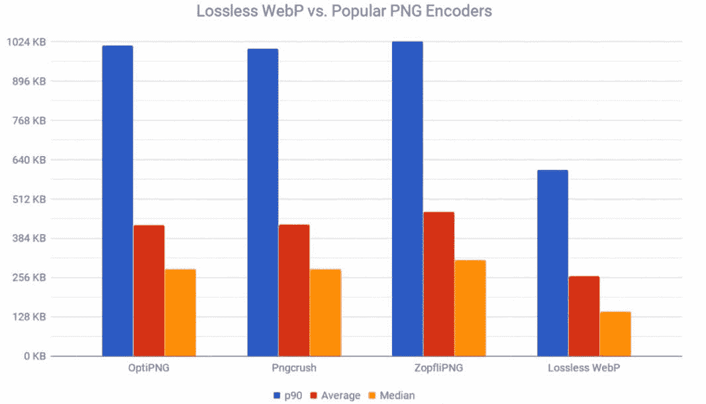
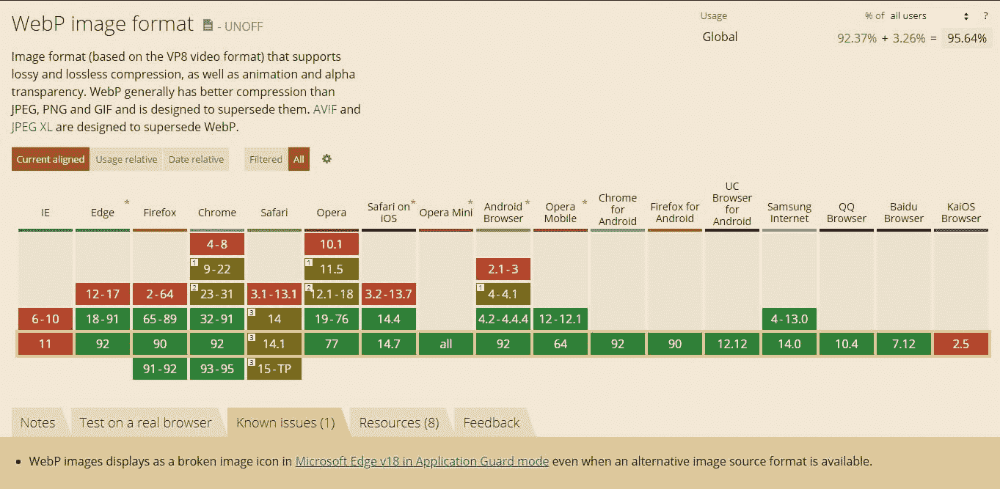

# WebP:关注性能的 Web 开发人员的图像格式

> 原文：<https://javascript.plainenglish.io/the-new-image-format-for-web-webp-5db1ffd59260?source=collection_archive---------13----------------------->


New Image Format For Web

WEBP 是一种图像压缩技术，可以在不影响质量的情况下创建更小的文件

与 JPEG、PNG 和 GIF 相比，它可以将文件大小减少 20%到 80%(甚至更多)



# 关键特征

🔷由谷歌在 2010 年开发

🔷开放源码

🔷扩展->。webp

🔷MIME 类型->图像/网页

🔷无损压缩

🔷支持动画

🔷支持 Alpha 透明度

🔷由谷歌、Bind、脸书使用

# 浏览器支持

✅铬> =第 9 版(2011 年)

✅火狐> = v65 (2019 年)

✅歌剧院> = 11.5 版(2011 年)

✅边缘> = v19 (2019 年)

✅野生动物园 iOS >= v14.4 (2020 年)

✅ Safari* >= v14 (2020 年)// Safari 需要 macOS 11 或更高版本

⛔ Internet Explorer*(无本机支持)// IE 需要回退/聚合填充



# 如何使用

1.使用`<picture>` + ``标签

```
<picture>
  <source srcset="img/original.webp" type="image/webp">
  <source srcset="img/fallback.jpg" type="image/jpeg"> 
  
</picture>
```

注意建议使用此选项，浏览器将选择自己支持的格式

2.仅使用``标签

```

```

注意仅当您不关心旧浏览器(如 Internet Explorer)时，才选择此选项

# 如何创造

谷歌为 Linux、Windows 和 macOS 开发了自己的软件包，带有命令行工具，可以用来将你现有的图像(PNG、GIF、JPG)转换成 WEBP 格式

链接:[developers.google.com/speed/webp/download](https://developers.google.com/speed/webp/download)

该套装包括:

*   libwebp 库，可用于向您的程序添加 webp 编码或解码。
*   cwebp — WebP 编码器工具
*   dwebp — WebP 解码器工具
*   vwebp — WebP 文件查看器
*   webpmux — WebP 复用工具
*   gif2webp —将 gif 图像转换为 webp 的工具

用法(Windows 示例)

```
cwebp.exe delivery_parcel.png -q 80 -o delivery_parcel.webp
```

*   `delivery_parcel.png` -源文件
*   `-q 80` -质量参数设置为 80%
*   `-o delivery_parcel.webp` -输出文件

在线转换器

*   [cloudconvert.com/webp-converter](https://cloudconvert.com/webp-converter)
*   [convertio.co/png-webp](https://convertio.co/png-webp/)

# CMS 和 JS 框架支持

羧甲基淀粉钠

*   drupal.org/project/webp
*   Joomla:[extensions.joomla.org/instant-search/?jed_l..](https://extensions.joomla.org/instant-search/?jed_live%5Bquery%5D=webp)
*   magento:[marketplace.magento.com/catalogsearch/resul..](https://marketplace.magento.com/catalogsearch/result/?q=webp)
*   wordpress.org/plugins/search/convert+webp

JS 框架(优化了图像组件)

*   NextJS
*   盖茨比（姓）
*   Nuxt

# CDN 自动转换

一些 cdn 支持图像的自动下一代转换，如 Cloudflare(尽管它不是免费功能，并附带一个 PRO 计划——每月 20 美元)

> 感谢阅读👍
> 
> 在推特上关注我—[twitter.com/therceman](https://twitter.com/therceman)

*更多内容尽在*[***plain English . io***](http://plainenglish.io)