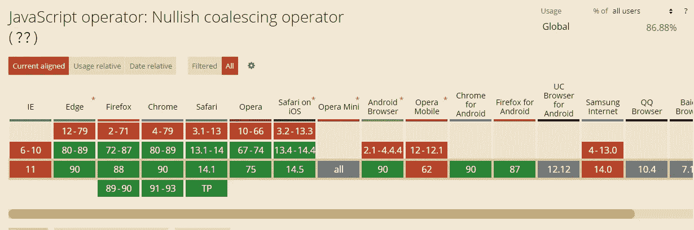

# 用例子解释 JavaScript 中的 Nullish 合并操作符

> 原文：<https://javascript.plainenglish.io/the-nullish-coalescing-operator-in-javascript-explained-with-examples-3e056e49a2c2?source=collection_archive---------10----------------------->

## 通过示例了解 JavaScript 中的 Nullish 合并运算符。


Photo by [Nathan da Silva](https://unsplash.com/@silvawebdesigns?utm_source=medium&utm_medium=referral) on [Unsplash](https://unsplash.com?utm_source=medium&utm_medium=referral)

如今，JavaScript 有很多强大的特性，开发者可以在代码中使用它们。这是因为 JavaScript 创建者试图添加尽可能多的特性，以使开发人员编写 JavaScript 代码更加容易。

我经常看到的特性是逻辑运算符。在旧的 JavaScript 版本中，我们只有三个逻辑操作符(OR、AND、NOT)。但是现在有了新的 ECMAScript 规范，我们有了更多。比如短路操作符、可选链接和 nullish 合并操作符。

这就是为什么在本文中，我们将学习 JavaScript 中的 nullish 合并操作符。所以让我们开始吧。

# 什么是无效合并？

nullish 合并`??`是 JavaScript 中的一个逻辑运算符，我们在两种数据类型之间使用。

操作符检查两种数据类型，如果第一种是`null`或`undefined`，则返回第二种数据类型。否则，如果第一个数据类型不是`null`和`undefined`，则返回第一个数据类型，而不是第二个数据类型。

代码语法如下所示:

```
firstData **??** secondData
```

# 使用零化合并运算符

在 nullish 合并操作符`??`之前，我们必须使用 or 操作符`||`，如果我们想为一个变量提供一个默认值。如您所知，操作符`||`有点类似于 nullish 合并操作符。唯一的区别是 OR 运算符`||`检查所有的 falsy 值，而不仅仅是`null`和`undefined`。

顺便说一下，如果你不知道 JavaScript 中什么是 falsy 值。分别是:`false`、`0`、`null`、`undefined`、`NaN`、`-0`、`0n`、`""`(空字符串)。

现在的问题是运算符`||`并不是在所有情况下都有用。因为它检查并避免所有错误的值。例如，有时我们需要 0 和空字符串作为程序中的有效选项。我们不能用 OR 运算符来实现这一点。

这就是为什么 nullish 合并操作符开始发挥作用。它只覆盖`null`和`undefined`。

下面是一个比较 OR 运算符和 nullish 合并运算符的示例:

*   *使用 OR 运算符:*

```
//Give an empty string as a name for a variable.
let name = "";/*using the OR operator to give a default name(John) for our variable.*/
**let setName = name || "John";**
**console.log(setName)**; //prints: "John" because "" is a falsy value.
```

*   *使用无效合并运算符:*

```
//Give an empty string as a name for a variable.
let name = "";//using the nullish coalescing operator.
**let setName = name ?? "Mehdi";**
**console.log(setName)**; /*prints: ""(empty string) because the first data type(name)is not null and not undefined.*/
```

如你所见，这就是两个操作符的区别。nullish 合并操作符的好处在于它检查第一个数据类型是`null`还是`undefined`。如果是，它返回第二种数据类型。否则，它返回第一种数据类型。

这里还有一个例子可以让你明白:

```
let name = "John";
let age = null;let setName = **name ?? "Mehdi"**;
console.log(setName); /*prints "John" because name is not null or undefined*/let setAge = **age ?? 21**;
console.log(setAge); //prints 21 because age is null.
```

我们可以只使用条件语句和 OR 操作符编写相同的代码，向您展示 nullish 合并操作符是如何工作的，以及为什么它更简洁。

下面是一个例子:

```
let name = "John";
let age = null;let setName;if(name === null || name === undefined){
 setName = "Mehdi"**;**
}else{
 setName = name;
}if(age === null || age === undefined){
 setAge = 21**;**
}else{
 setAge = age;
}console.log(setName); //John
console.log(setAge); //21
```

这就是我们如何使用条件句达到同样的目的。这比使用 nullish 合并操作符要困难得多，代码对我来说也不干净。这就是为什么在这种情况下推荐使用 nullish 合并操作符。

# 浏览器支持

IE 以及最早版本的 Chrome 和 Safari 不支持 nullish 合并运算符。但是，它在除 Opera mobile 之外的所有最新版本中都受支持。

这是从“我可以使用吗[中截取的一段视频:](https://caniuse.com/?search=nullish%20coalescing%20operator)



Capture by the author.

# 结论

如您所见，nullish 合并操作符比您想象的要简单得多。它仅覆盖带有`null`和`undefined`的值。我会一直推荐使用它，因为它使代码更干净，并且易于编写。

感谢您阅读这篇文章。希望你觉得有用。

**更多阅读**

[](/5-useful-javascript-es2017-methods-that-you-should-know-9192d4da48db) [## 你应该知道的 5 个有用的 JavaScript ES2017 方法

### JavaScript ES2017 中引入的有用方法。

javascript.plainenglish.io](/5-useful-javascript-es2017-methods-that-you-should-know-9192d4da48db) 

*更多内容请看*[*plain English . io*](http://plainenglish.io/)