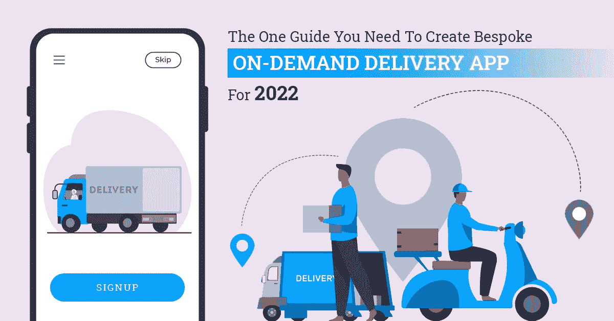
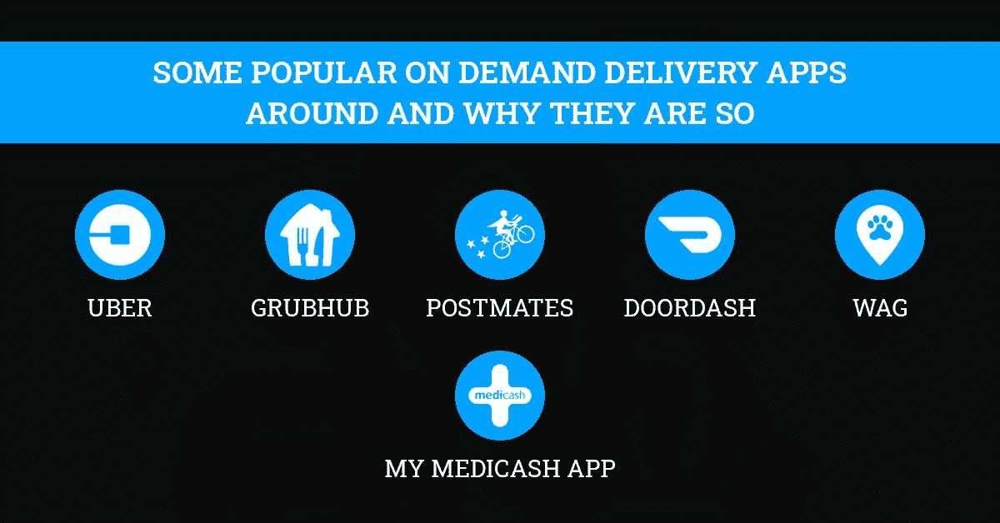

# 创建 2022 年定制按需交付应用所需的指南

> 原文：<https://javascript.plainenglish.io/the-one-guide-you-need-to-create-bespoke-on-demand-delivery-app-for-2022-9568d8eb60d5?source=collection_archive---------5----------------------->

## **以下是如何让你的 2022 年定制交付应用由最好的技术厨师**开发&

一个总是匆匆忙忙的世界要求它的日常用品也要随时可用。互联网以同样的方式通过应用程序创建和使用按需交付服务。难怪近年来这种送货服务的数量激增(2021 年至 2025 年期间，平台到客户的细分市场预计将以 [10.39%](https://www.statista.com/outlook/dmo/eservices/online-food-delivery/worldwide) 的速度增长)——它们消除了必须自己完成任务的麻烦，更好的是，让商品送货上门。而这一切都是由定制移动应用开发服务创建的交付应用实现的。

虽然最初 [**为该行业开发食品和饮料应用**](https://www.suntecindia.com/blog/how-much-does-it-cost-to-build-a-food-ordering-app-like-grubhub/) ，但按需交付应用迅速扩展到其他领域，包括 [**药品交付和医疗保健应用**](https://www.suntecindia.com/blog/how-to-build-an-effective-healthcare-app/) ，以及珠宝和艺术品等奢侈品。他们甚至为市内客户提供快递服务，在某些情况下，还提供城际快递服务。如果你是一家希望利用自己的交付应用来驾驭这一增长浪潮的企业，你应该 [**从一家优质应用开发公司雇佣软件开发人员**](https://www.suntecindia.com/hire-dedicated-developers.html) 来交付你需要的应用。

# 在采用按需应用程序开发解决方案之前规划您的交付应用程序

客户总是希望更快、更安全的交付。竞争对手总是竞相迎合这些日益增长的需求。你应该考虑在这两个方面保持领先的最佳方式，以发展你的送货业务，你的送货应用程序应该具备帮助你实现这一目标的所有必要条件。

这种竞争优势只有在为应用程序制定一个稳健的计划时才有可能实现。构建优步、GrubHub、远程医疗等应用程序的规划过程必须考虑到应用程序应该反映的业务的关键方面。

您应自行或在 [**企业应用程序开发服务**](https://www.suntecindia.com/mobile-app-development-services.html) 合作伙伴的帮助下确定以下事项后，方可进行应用程序创建:

## **1 .你的业务目标**

光是说你想成为最好的快递服务运营商并继续努力是不够的。你的商业目标必须被量化，并且应该有一个阶段性的目标，和完成它们的实际期限相对立。

这样做很重要，因为你的应用程序将围绕这些目标构建。它成为你的主要资产，帮助你实现这些目标。因此，它们必须尽可能精确和明确。例如，要 [**构建约会应用**](https://www.suntecindia.com/blog/how-to-create-a-dating-app/) ，必须确定其用户数量、预算、预期收入等。根据你目前的业务情况，在一段固定的时间内。

**2 .你的目标受众**

你为谁构建这个应用程序？你希望谁使用你的服务？这些问题的答案对于决定应用程序开发的结果至关重要，最终也决定了您的业务。在雇佣移动应用程序开发人员从事开发工作之前，您必须彻底了解目标受众。

市场调查是深入了解目标受众偏好的最佳手段。透过目标受众提供的社交媒体内容进行窥视，也是收集他们相关信息的一种便利方式。浏览目前可获得的关于他们的统计数据也有所帮助。

## **3 .你的竞争对手**

对竞争对手的分析不仅揭示了可能的幕后方法，还揭示了一些新颖的前端手段。

这些知识让您可以进一步优化您的独特卖点(USP)，并改进您的战略以击败他们。有了定制移动应用开发服务的支持，你就能获得一款通过运用这种策略而拥有优势的应用。

## **4 .来自测试受众的反馈**

在产品上市之前测试产品的最佳性能和外观，对于其在市场上的成功至关重要。移动应用也不例外。你可以聘请专门的移动应用程序开发人员，为你提供尽可能最好的应用程序，但如果不检查其所有重要参数，它仍然可能失败。

传统的方法是开发一个具有有限功能集的原型应用程序，称为 [**【最小可行产品(MVP)**](https://www.suntecindia.com/mvp-development-company.html) ，并将其发布给测试受众。他们产生的反馈将极大地有助于最终产品的进一步开发。你甚至可以在精选的门户网站上推介你的应用创意，让人们对它给出反馈。

## **5。App 平台**

谷歌 Android 版的 Play Store 和苹果 iOS 版的 App Store 是放置你的应用的显而易见的选择。它们服务于地球上大多数的智能手机用户。根据你的操作市场，你可能不得不选择 [**iOS 应用程序开发服务**](https://www.suntecindia.com/ios-application-development-company.html) 或他们的 Android 对手。

由于 Android 在智能手机市场的份额比 iOS 更大，因此谨慎的做法是让该应用对更广泛的受众更具吸引力。但与 iOS 相比，它不能以牺牲整体用户体验为代价。有[**负担得起的 android 应用程序开发服务**](https://www.suntecindia.com/android-application-development-company.html) 可以快速廉价地为你提供应用程序。

## **6。预算**

外包你的送货应用程序开发是一个很好的方式来削减你的开支。内部雇佣移动应用程序开发人员，你将不得不在他们和所需的基础设施上花钱。两者都会严重影响你的财务状况。但是不考虑公司的财务状况就进入 it 行业并不是最好的方法。

你不仅要为应用程序开发本身做好预算，还要为推广应用程序所需的营销活动做好预算。这个数量将决定你的应用程序有什么和没有什么，因为你想要的功能越多，开发成本就越高。

## **7。这些技术**

雇用 iOS 应用程序开发人员或 Android 开发人员，事实是技术总是在变化，你需要跟上它，以提供最佳的客户体验。更新的软件工具和编程语言不断涌现，为应用程序的用户体验增加了新的维度。

你应该咨询雇佣的机构，或者确定开发应用程序将使用的技术。当需要时，必须有更新的空间。它将使您的应用程序面向未来，您不必担心您的企业应用程序开发服务提供商因应用程序长时间离线进行维护和升级而中断您的业务。

# 送货应用程序中一些常见的必备功能

突出特色是获得客户关注和转化率的途径。事实上，定制移动应用程序开发服务的存在正是为了这个目的:创建一个与竞争对手相比尽可能独特的应用程序。

然而，对创新的追求不能脱离每个交付应用程序应该提供的基本功能。虽然这些可能会根据用户类型或层次结构而变化，但它们必须以某种形式存在。应用程序(或应用程序，取决于方法)必须服务的三个主要相关方是最终用户/客户、交付代理和管理员/管理层。

## **1。注册**

该应用程序必须为客户和交付代理提供注册的方法。在客户方面，包括的选项是通过社交媒体注册或通过电子邮件和电话号码注册公司特定的帐户。递送代理应该通过他们公司提供的凭证注册，类似于管理员。

雇用掌握技术的软件开发人员来提供这些注册选项。他们必须能够顺利工作，因为这个帐户是从根本上连接各自的人与服务，并生成他们的独特数据。

## **2。基于 GPS 的位置跟踪**

所有三个相关方必须知道成功交货所需人员的下落。送货代理必须知道客户的位置，反之亦然。

管理部门必须知道送货代理人和客户的位置，以便联系最近的代理人。要做到这一点，你必须雇佣能够将任何手机的 GPS 设备与应用程序集成的移动应用程序开发人员。

## **3。支付网关**

数字支付方式现在是支付任何东西的标准方式。统计数据显示，在 2022 年，美国消费者将只在 17%的时间里通过现金支付。您的 iOS 应用程序开发服务以及 Android 应用程序开发服务(如果参与的话)必须允许通过电子钱包、借记卡和信用卡、礼品卡、优惠券和代金券等多种方式在应用程序中进行在线支付。

最终用户将在他们的应用程序版本中看到支付选项，而管理部门应该有实时账户更新。交付代理应该有一个到其银行账户的网关链接，用于即时支付，或者分别在交付和发薪日之后接收客户和管理部门的支付确认。

## **4。通知/更新**

订单状态和交付状态的快速更新对于服务的运营至关重要。 [**按需应用程序开发服务**](https://www.suntecindia.com/web-development-case-studies.html) 必须包括对所有相关方的及时通知，系统向每一方传递适当的消息。

客户必须收到订单确认通知，其中包含送货代理的详细信息、他们的位置和预计到达时间、代理到达客户位置的时间、付款确认和选择的付款方式、任何 OTP 或安全信息以及最终交货确认。你甚至可以雇佣软件开发人员在这里加入促销通知。

代理必须收到本地订单的通知，以便接受、客户的位置信息、服务提供商处的订单状态、在源头提货的确认以及在客户处最终交货的确认。

或者，客户可以是要交付的商品的来源，应用程序也应该反映这一点。最后，他们应该收到付款确认。管理部门必须随时收到每项活动的通知。

## **5。评论和评级**

无论你是雇佣 iOS 应用程序开发者还是他们的 Android 兄弟，或者两者都雇佣，他们都不能忽略应用程序中评论和评级的重要功能。它在客户端是强制性的，在发货代理端是可选的。

顾客可以对服务的各个方面给出反馈，帮助企业解决问题。如果送货代理商有这样的设备，他们也可以对客户进行评级，这样他们就可以改善服务的用户基础，提高代理商的安全性。

## **6。合适的用户界面**

该应用程序反映了企业的品牌，并为其愿景和使命提供了一个可视化的方面。使用负担得起的 Android 应用程序开发服务和/或其 iOS 版本并不意味着失去一个既有吸引力又能满足其用途的应用程序界面。

最终用户版本应该是最美观的，因为它有助于客户参与。管理和交付代理端应该关注功能和易用性，因为他们将同时处理大量数据。代理的版本应该在驾驶过程中易于使用，否则，它可能是一个严重的道路安全问题。

## **7。数据分析和报告**

这种功能是为管理层保留的，尽管它的某些部分可能会到达交付代理和最终用户。企业应用程序开发服务必须考虑将实时流经系统的海量数据，并使应用程序能够分析和生成相关报告。

递送代理可以查看他们的递送记录，并且客户可以查看他们的购买历史。

# 一些流行的按需交付应用程序及其原因

市场上有一些杰出的应用程序，它们从按需应用程序开发解决方案提供商那里获得了最大的回报。他们有一些共同和特殊的功能，包括帮助他们脱颖而出，以及他们的服务质量。

> 优步和 Grubhub 是美国最受欢迎的两个按需服务应用程序，已经在应用商店排名中普遍登顶。

**优步不仅因其独特的商业模式而闻名，还因其用户友好的应用程序而闻名，该应用程序拥有人们可能需要的所有元素，如司机和客户的实时 GPS 定位、ETA、直接司机联系、预定费率、在线支付选项，以及对司机和客户进行评级和审查的能力，与应用程序和公司本身保持一致。**

**[**Grubhub**](https://www.suntecindia.com/blog/how-much-does-it-cost-to-build-a-food-ordering-app-like-grubhub/) 以其独特的使用定制移动应用开发服务紧随其后。它将应用分为管理、餐厅、骑手和客户用例。每个人都能在不太混乱的情况下获得他们需要的信息。完成烹饪订单的预计时间非常重要，可以告知顾客和配送员食物的状态。为了方便起见，它还使用了最新的技术堆栈。所有这些帮助它扩展到全国 4000 个城市。**

> **开发成本因地理位置不同而有很大差异。在美国，开发一个送餐应用程序每小时需要 50 至 250 美元，而像印度这样的发展中市场每小时只需 15 至 45 美元。因此，出于成本考虑，雇佣海外移动应用开发者是有意义的，最好是老牌开发机构。**

# **想要您的客户想要的定制交付应用程序？**

**按需交付服务是未来，而有吸引力的交付应用是实现这一目标的途径。 [**专注的移动应用开发者**](https://www.suntecindia.com/hire-mobile-app-developers.html) 可以根据您对业务需求的初步评估和对执行功能的周到考虑，为您提供所需的优质应用。您将获得定制交付应用程序，该应用程序将通过满足客户的愿望来实现您的业务增长愿望。**

# **回答的热门问题:**

## ****1。哪些行业可以使用送货 app？****

**交付应用不限于食品饮料、医药等常见行业。曾经被认为超出他们权限的行业已经开始从中受益。一个例子是将燃料运送到客户所在地。递送服务也将顾客的物品从一个地方转移到另一个地方，而不是 B2C。而且不限于 B2C。B2B 交付服务近年来也出现了，因此有多个行业使用一个交付应用程序的空间。**

## ****2。定制移动应用开发服务还提供哪些服务？****

**每个企业都有不同的构建方式，因此你可以让一家交付应用开发公司在应用开发的同时提供数字营销和客户服务，而其他公司可能只专注于应用开发。你决定和谁一起去将取决于你的业务目标和情况。开发公司提供的一些辅助服务可能是数据输入和分析、应用程序开发和维护合规性的法律支持、云支持、交付代理的招聘及其薪资管理等。**

## ****3。如何推广 app？****

**你必须像对待自己生产的产品一样对待你的应用，并采取一切必要的步骤来推广它，同时专注于推广你的核心服务。既然是数字产品，你的主要推广手段必须是数字营销。社交媒体网站、搜索引擎和其他应用内广告空间上的付费广告是主要目标。你必须使应用程序尽可能本地化和搜索引擎优化友好，以将其放在各自的应用程序商店 SERPs 的高位。开展传统的广告活动也应该包括在内，尤其是在运营市场上的创意广告牌。**

## ****4。如何在 app 上获得更多正面的评分和评论？****

**最直接的选择是为您的客户提供无可挑剔的服务。提供竞争对手没有的服务，拥有友好的交付代理，回应各自应用商店关于应用的反馈，拥有令人愉悦且易于使用的用户界面，所有这些都有助于人们对应用进行排名和评级。不要忘记提醒人们在每次交付后进行评级，因为这有助于跟踪评论和评级，并保持其真实性，同时人们会随着时间的推移忘记体验。**

**如果您对您的垂直业务感兴趣或正在寻找更多的应用程序开发解决方案，那么您可以 [**联系我们**](https://www.suntecindia.com/contactus.htm) 并获得您的免费评估，或者在下面提出疑问。**

***更多内容看* [*说白了。在这里注册我们的*](http://plainenglish.io/) [*免费周报*](http://newsletter.plainenglish.io/) *。***