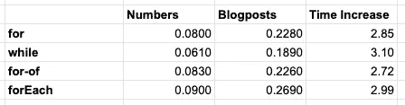

# 对我们大多数人来说唯一重要的 JavaScript 循环基准

> 原文：<https://javascript.plainenglish.io/the-only-javascript-loop-benchmark-that-matters-for-the-most-of-us-77ec819eb23e?source=collection_archive---------1----------------------->

## 如果你正在处理数组，你应该如何遍历它们以获得最快的结果？有关系吗？


所以你在 JavaScript 中有一个数组。假设它有 1000 个条目。问题是，你应该如何循环遍历它们，才能得到最快的结果？

我研究了几种不同的循环方法，并比较了它们之间的速度差异。

但是在向您展示我的代码和我取得的结果(在 NodeJS 上)之前，我想提一下:

速度差别不大，但最慢的结果仍然足够快，你真的不应该太在意。因为最慢的时间仍然非常快，你不得不怀疑可读性是否比节省几毫秒更重要。

此外，这里取得的任何结果都是快照，而不是平均值。如果你再次运行相同的代码，总会有变化。这也是本文的重点。

# 循环类型

我想比较 JavaScript 中几种类型的循环，并对它们进行一些测试。我要看的循环类型:

*   `for`
*   `while`
*   `for-of`
*   `forEach`

# 简单数据集

因此，当查看循环基准时，您总是看到人们循环一百万个项目，但是您多久处理一次如此巨大的数据集呢？因此，我们将着眼于一个更加现实的数据集。1000 个项目。

我当然知道，计算机是强大的机器，所以用一百万个项目进行测试可以更好地展示不同循环之间的速度差异，但我个人对用循环来做稍微复杂一些的事情会发生什么，以及相比之下很小的循环的性能感兴趣。您将要处理的大多数数据集将会是

让我们来定义我们的数据，这是一个由 1000 个条目组成的数组，它们的键在值中。

## 简单循环

我们要执行的第一个循环，就是用`Math.pow()`将这个数和它自身相乘。在性能上已经有了明显的差异。我们先来看代码。

我使用`console.time`来记录每个部分的持续时间，然后我们的输出显示如下:

```
for: 0.080ms
while: 0.061ms
forOf: 0.083ms
forEach: 0.090ms
```

如您所见，差异非常小，您不必考虑它们中任何一个的性能，您只需选择您认为最合适的即可。

当我将项目从 1000 更改为 10000 时，我们会得到这些结果

```
for: 0.650ms
while: 0.595ms
forOf: 0.714ms
forEach: 0.607ms
```

尽管如此，对于 10k 行，我们仍然比 1 毫秒快。同样，它足够低，您不需要担心性能差异。

如果你对微秒级的性能改进如此着迷，你可能也应该重新考虑你安装的 1000 个 npm 包。我现阶段的建议？选择代码中最容易理解的循环，或者你最熟悉的循环。

# 现实的数据集

好了，我们已经在一个数组中建立了超过 1000 或 10k 个元素的循环，其中只有一个数字，对它们进行简单的计算，实际上根本不需要时间。但是您可能要处理的潜在数据集呢？

我们将保持所有代码不变，但数据生成会有所不同。这次我们将这样生成数据:

如你所见，我们使用了一个为我们生成随机数据的包，在这个例子中是博客文章。让我们看看它生成的一个输出。

所以我们在一个数组中有了标题、内容、创建日期和一些关键字。看起来很现实，对吗？也许仍然有点小，但它会做我们的工作，比较这是如何表现的。

因此，让我们再次运行我们的示例代码，看看它现在的表现如何。这是我们的结果:

```
for: 0.228ms
while: 0.189ms
forOf: 0.226ms
forEach: 0.269ms
```

总的来说，看起来我们的代码变得慢了 3 倍，尽管我们没有做任何改变。让我们来计算实际的差异



所以快速计算显示所有的循环增加了大约 3 倍的时间。时间增加最少的是 for-of，最多的是 while。但是，这段代码只运行了一次，这仅仅是一个快照。也许我的机器在不同的基准测试之间做得更少(或更多)。有一点是肯定的，每次运行代码，我都会得到稍微不同的结果。考虑到它们的密集度都接近 3 倍，我认为可以肯定地说，这没多大关系。最后，这一切只花了不到 1/3 毫秒。

为了好玩，我曾经用 100k 博客帖子运行我的代码，得到了下面的结果。

```
for: 15.271ms
while: 12.549ms
forOf: 18.343ms
forEach: 14.043ms
```

即使那样，时间也很接近。太接近了，以至于不在乎差异。老实说，我们中有多少人会同时在内存中处理 10 万篇博客文章？

## 添加一些进一步的计算

所以让我们在数据上添加一些进一步的、真实的计算。我们将计算内容有多少个字符，我们将计算标题和内容的长度之比，我们将从标题中创建一个 url，然后我们还将使用`MomentJS`使时间戳可读。

为此，我将创建一个函数，每个循环都将调用同一个函数。这是我的计算函数的样子:

基于一些测试，我得出结论，这个函数最差的部分是`MomentJS`。是的，我知道它不是处理日期最好/最快的库，但它是一个常用的库，这也是我使用它的原因。

经过一些测试后，我还得出结论，第一个循环的表现总是比第二个循环差，所以我将分别测试它们，而不是在同一个文件中。

## 测试 1:没有力矩

首先，我将禁用`MomentJS`行，只用我自己的代码进行测试。结果是这样的:

```
for: 1.260ms
while: 0.999ms
forOf: 1.156ms
forEach: 0.764ms
```

我想重复我自己，这些测试不是确凿的事实，而只是在我自己的机器上的即时测试。结果有时会因`nodejs`或我的 Mac 的感觉而异，而不是实际可测量的结果。这也正是我写这篇文章的原因，不是为了证明一个比另一个快，而是为了向您展示它们是如此接近，以至于您使用什么都不重要。

## 测试 2:带力矩

现在我将再次运行相同的测试，但是这次启用了`MomentJS`。结果如下:

```
for: 52.884ms
while: 51.455ms
forOf: 50.531ms
forEach: 52.349ms
```

这是他们所有人的第一个结果，但这里有一个问题:

我多次运行每个测试，所有循环都显示了 49-55 毫秒的结果。这正是我写这篇文章的原因，对于一个合理的数据集，循环之间的差异在生产机器上是不可测量的。

但是，如果您同时按顺序运行所有循环，您会得到以下结果:

```
for: 50.346ms
while: 22.444ms
forOf: 16.450ms
forEach: 15.701ms
```

因此，在这个过程中的某个地方，JavaScript 会看到重复的计算，它会执行得更好。因此，如果你有复杂的代码，不断地做各种各样的事情，你的结果会有更大的不同。

那么，当所有 4 个循环都启用了 100k blogposts 时，这段代码会有什么表现呢？幸运的是，我做了测试，结果如下:

```
for: 978.380ms
while: 884.993ms
forOf: 882.864ms
forEach: 957.400ms
```

所以 100 倍的数据，20 倍的时间。因此，JavaScript 似乎在处理更大的数据集时变得更有效率。我在之前的 1k 循环中看到的“第一循环最慢”效应似乎也适用于此。

而且，实际上，我的代码中大多数性能受到影响的是`MomentJS`。这是没有`MomentJS`的 100k 博客帖子的结果

```
for: 69.448ms
while: 67.378ms
forOf: 68.693ms
forEach: 65.682ms
```

# 最后

所以我的结论很简单，你选择什么样的循环并不重要，它们的性能相当，你应该关心代码的可读性，而不是循环的性能。

所以下次有同事评论你的公关，说你应该因为绩效原因改变你的循环，你可以把他们链接到这篇文章。我会对你的同事说:

> 是的，我肯定一个循环的性能不同于另一个，但我们没有处理足够的数据来证明这一点。因此，除非您希望每次都运行成千上万行，否则差异非常小，我们不应该因为性能原因而讨论循环类型。我们来谈谈可读性吧。

你能从我的文章中得到的唯一真实的结论？`MomentJS`有糟糕的表现，但即使如此，它也足够快，你不会真的注意到它。

想看看我最终的测试代码，这样你就可以自己运行了？你可以在 [Github](https://gist.github.com/Topener/4d816028fb61954e617ef82ed275dc76#file-final_code-js) 上找到