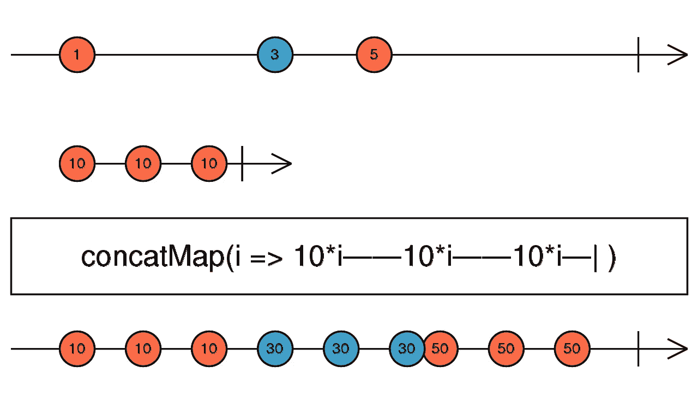

# 今日操作符:连接图

> 原文：<https://javascript.plainenglish.io/the-operator-of-the-day-the-concatmap-f7a416945663?source=collection_archive---------9----------------------->

它会把虫子赶走的！

Photo by [Volodymyr Hryshchenko](https://unsplash.com/@lunarts?utm_source=unsplash&utm_medium=referral&utm_content=creditCopyText) on [Unsplash](https://unsplash.com/?utm_source=unsplash&utm_medium=referral&utm_content=creditCopyText)

我已经开始了这一系列的文章来研究 RxJS 中的每一个操作符、creational 和其他操作符。虽然我以前和认识很多，但我不知道他们中的每一个。很多时候，我意识到如果我只知道一个操作者，会有一个更干净或更短的做事方法。我想让这些文章简短，但有几个例子有意义，所以我决定每篇文章用一个操作符。

# 基础知识

让我们看看医生们对今天的操作符 **concatMap** 是怎么说的。

> 将每个源值投影到一个可观察对象中，该可观察对象合并到输出可观察对象中，以序列化的方式等待每个对象完成，然后再合并下一个对象。

Image from [RxJS’s documentation](https://rxjs-dev.firebaseapp.com/api/operators/concatMap)

从 marble 图和文档中可以看到，也可能从名字中猜到，这个操作符用于将其他所谓的内部可观察对象连接到源。这里的关键字是 concat。你一定不要忘记**这个操作符会在开始新的观察之前，等待每一个内部观察完成。这种行为有时是可取的，但有时不是。让我们看一些例子:**

RxJS’s docs example

首先，我们来看一个和 RxJS 网站上 marbles 写的一样的例子。我使用 marble testing 来创建代码样本，我发现这是一种很好的可视化方式来表现操作员是如何工作的。

你可能注意到的第一件事是，内部可观察的模式(大理石)可以在预期的输出可观察到。这应该是您所期望的，因为文档还说 concatMap 将在处理下一个发出的值之前等待内部可观察对象完成。这也意味着它将等待它完成。

concatMap with non-emitting inner observable

上面的例子表明，如果我把内部可观察对象变成一个热可观察对象，它根本没有完成，我们的输出可观察对象会更长，或者它甚至不会完成或发出值。这可能会引起混乱。例如，您可能将一系列事件连接到您的源可观察对象中，而该事件恰好根本没有被引发，那么您的输出可观察对象将永远不会发出任何值，也不会完成。

concatMap to a hot Observable that completes before the source emits

如果您将一个映射连接到一个内部可观察对象，这个内部可观察对象是热的，虽然是完整的，但是在任何值到达您的源可观察对象之前，它就已经完成并发出了值。这将导致一个空流，无论有多少值来自源，它都不会发出任何值。

# 摘要

**使用 concatMap 运算符，当:**

*   你想映射到一个内在的可观察对象，它是冷的，你确信它会完成。
*   您希望将您的可观察对象映射到一个不重复出现的 HTTP 请求。(“不重复”部分在这里很重要，因为 concatMap 将等待每个内部可观察对象完成)

**使用 concatMap 运算符时，请小心**，如果:

*   您将映射连接到一个内部可观察对象，它表示一个重复的 HTTP 请求。通常，当新值到达时，您希望取消旧的 HTTP 请求。因此，在这种情况下，要确保通过 HTTP 处理由源 observable 发出的每个值。

**避免**，使用 concatMap 运算符，当:

*   你必须映射到一个你无法控制的热可观察点。就像一连串你无法完成的事件或主题，或者你不知道它何时完成。
*   你必须映射到一个内部可观察对象，它比你的源可观察对象发出值要慢。因为它在等待每个内部可观察对象完成，这可能会导致内存/性能问题。

*更多内容尽在*[plain English . io](http://plainenglish.io/)