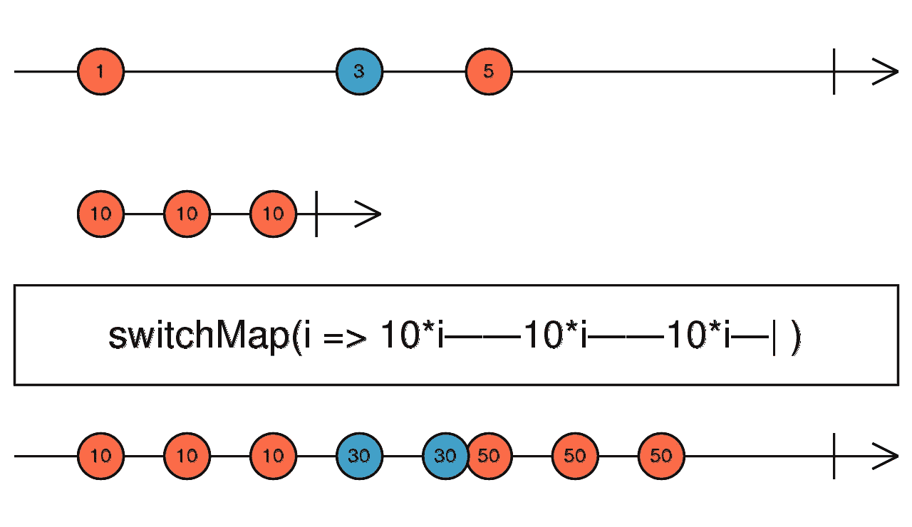

# 今日操作:开关图

> 原文：<https://javascript.plainenglish.io/the-operator-of-the-day-the-switchmap-86c0bb969554?source=collection_archive---------9----------------------->

它会把虫子赶走的！

Photo by [Volodymyr Hryshchenko](https://unsplash.com/@lunarts?utm_source=unsplash&utm_medium=referral&utm_content=creditCopyText) on [Unsplash](https://unsplash.com/?utm_source=unsplash&utm_medium=referral&utm_content=creditCopyText)

上次，我们从 [concatMap 操作符](/the-operator-of-the-day-the-concatmap-f7a416945663)开始。我们检验了它是如何工作的，以及它是如何处理不同种类的可观察现象的。今天，我们将继续讨论**开关图**操作员。

# 基础知识

像上次一样，让我们先来看看关于这个的官方[文件](https://www.learnrxjs.io/learn-rxjs/operators/transformation/switchmap)。

> 将每个源值投影到合并到输出可观察值中的可观察值，仅从最近投影的可观察值中发出值。

Image from [RxJS’s documentation](https://rxjs-dev.firebaseapp.com/api/operators/switchMap)

您可能已经从描述中发现，这个操作符的角色与 concatMap 非常相似。你可以用这个算子切换到所谓的内部可观测。这个内部可观察值将被合并到输出可观察值中。

这个运算符的特别之处在于它的合并方式。与 concatMap 操作符不同， **switchMap 不会等待内部观察完成。如果一个新的值从源可观察对象发出，并且它被投射到一个新的可观察对象，换句话说，当一个新的内部可观察对象到达时，它将切换到那个可观察对象，并且如果旧的可观察对象还没有完成，它将取消订阅旧的可观察对象。**

这种行为可能是有用的，但是如果它导致了一些问题，并且您不知道这个操作符到底是如何工作的，那么就很难处理了。让我们看一些例子:

RxJS’s docs example in code

像上次一样，让我们看看在 RxJS 的文档中可以看到的同一个例子。我再次使用大理石测试，因为我认为这是一个很好的视觉方式来展示运营商是如何工作的，也是一个很好的方式来测试可观的。

您可能已经注意到，它与 [concatMap](/the-operator-of-the-day-the-concatmap-f7a416945663) 有一些相似之处。就像，内部可观察对象的大理石图案可以在输出可观察对象的大理石上看到。但是，也有一些不同之处。

就在第一个模式的末尾，您可以看到源可观测值上的第二个值恰好出现在内部可观测值发出第三个也是最后一个值的时候。这就是 switchMap 和 concatMap 的不同之处，switchMap 将**立即切换到新的内部可观察对象，并将取消订阅旧的内部可观察对象。**

switchMap to a slower inner observable

上面的例子显示了如果你切换贴图到一个发射速度比源慢的可观察物体会发生什么。

基本上，这里发生的事情是，当一个新值到达源时，内部可观察对象将发出一个值，因此切换图将切换到新的内部可观察对象。在这种特殊情况下，只有当源可观察对象稳定下来，内部可观察对象才有时间处理值并发出新值时，输出可观察对象才会发出值。

如果源长时间不稳定并且非常频繁地发出值，这种行为可能是一个问题。想象一下，内部的可观察对象是一些 HTTP 请求，这意味着我们在每个源值上启动一个新的 HTTP 请求，但是它们将被取消，直到源稳定下来。

switchMap from a hot observable that never completes

在这个例子中，我将源更改为一个热可观察对象，它永远不会完成。在这种情况下，可观测的输出将永远不会完成。我想添加这个例子，因为这可能会有很大的误导，因为除了完成之外，一切都很好，但如果我们没有取消订阅输出可观察，那么它将永远运行。因此，这可能是订阅泄漏的一个来源。

假设源是来自服务的某种主题。您在一个组件中使用它，并切换映射到另一个内部可观察对象，这恰好是一个 HTTP 请求。如果您在组件被销毁时没有取消订阅输出，那么它将继续运行并启动那些 HTTP 请求，即使创建它的组件并不存在。如果恰好再次创建了同一个组件，那么它将再次订阅该组件，现在您会看到两个 HTTP 请求发出。

switchMap to a hot observable

让我们看看，如果我们切换到一个热的可观测值，会发生什么，在我们开始处理冷源可观测值之前，它就已经在发射数值了。如果你不知道内在可观察的是热的，那么预期的大理石可能会有点令人惊讶。即使我们有三个由内部可观测值发出的值，也有三个由源可观测值发出的值，我们只看到两个由输出可观测值发出的值。

这背后的原因是热的可观测物质在它产生后就开始发射，所以我们错过了它的第一次发射。然后，第一个值到达我们的源可观测值，在那个时间框架内，我们的内部可观测值没有任何值，因此我们有一个空的'-'在那里。然后，内部热可观测发射一个值，我们处理它，它成为值 10 的第一次发射。在那之后，我们有了第二个来自内部热可观测值的值。然后，我们从源获得新的值，但由于内部可观察对象是热的，当我们切换到它时，它不会“重启”，它不会发出任何值，所以我们的输出可观察对象不会发出任何更多的值。

# 摘要

**在以下情况下，请使用**开关映射运算符:

*   你想切换到一个冷的可观察的，你不必处理来自源的每一个值
*   当新的内在观察到来时，你想要取消以前的内在观察。如果内部可观察对象是一个 HTTP 请求，并且您不必对每个源值都完成请求，那么这将非常有用

**在以下情况下使用切换映射操作符时要小心**:

*   你的可观察源发射非常频繁，你不能确定它何时稳定下来。不要忘记，即使开关图正在取消每一个过时的内在可观察，它仍然开始它们。例如，如果那些内部可观察到的是 HTTP 请求，那么它们都将被启动，然后被取消，这会给服务器带来一些压力。

**避免**使用开关映射操作符，当:

*   你切换到一个你无法控制的热点观察。比如一连串的事件，或者一个你无法控制的主题，或者不知道它是如何产生价值的。

*更多内容尽在*[***plain English . io***](http://plainenglish.io/)