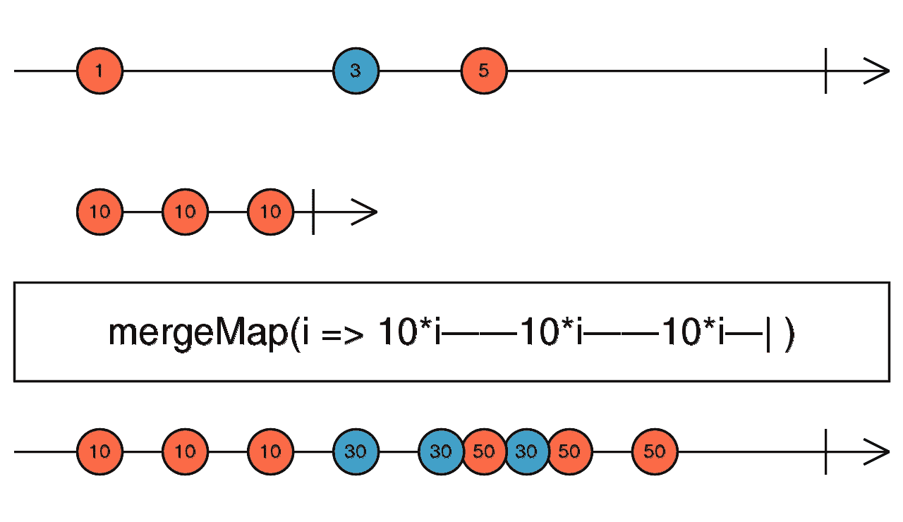

# 每日操作员:什么是 mergeMap？

> 原文：<https://javascript.plainenglish.io/the-operator-of-the-day-what-is-the-mergemap-28d77b5ba887?source=collection_archive---------19----------------------->

## RxJS 中 mergeMap 操作符的介绍性指南，以及它的注意事项。

Photo by [Volodymyr Hryshchenko](https://unsplash.com/@lunarts?utm_source=unsplash&utm_medium=referral&utm_content=creditCopyText) on [Unsplash](https://unsplash.com/?utm_source=unsplash&utm_medium=referral&utm_content=creditCopyText)

我们已经讨论了[串联映射](/the-operator-of-the-day-the-concatmap-f7a416945663)和[切换映射](/the-operator-of-the-day-the-switchmap-86c0bb969554)，让我们继续合并映射。和往常一样，我们将通过一些例子来展示这个操作符的边缘情况，然后我尝试用一些该做和不该做的事情来总结这篇文章。

# 基础知识

像往常一样，让我们从 RxJS 文档开始，看看定义和基本示例。

> 将每个源值投影到一个可观察值，该可观察值合并到输出可观察值中。

Image from [RxJS’s documentation](https://rxjs-dev.firebaseapp.com/api/operators/mergeMap)

这个运算符也用于连接两个或多个可观测量。这一个，顾名思义，会把内部的可观察量合并成一个输出的可观察量。这意味着所有的内部可观察值将在到达时发出它们的值，因此源值可能不会按照它们到达时的顺序进行处理。这可以在蓝色“30”值的大理石上看到。最后一个值比第一个“50”值稍晚到达。这个操作符很像[的 switchMap](/the-operator-of-the-day-the-switchmap-86c0bb969554) 和[的 concatMap](/the-operator-of-the-day-the-concatmap-f7a416945663) ，区别还是在于它处理内部可观察对象的方式。

# 示例和边缘案例

同样，让我们从重新创建 docs 站点的例子开始。

RxJS’s docs example

如我所说，mergeMap 操作符与 [switchMap](/the-operator-of-the-day-the-switchmap-86c0bb969554) 和 [concatMap](/the-operator-of-the-day-the-concatmap-f7a416945663) 非常相似。不同之处在于它处理内在可观察事物的方式。该操作符没有对内部可观测值做任何特殊处理，它没有等待任何一个内部可观测值完成就开始下一个内部可观测值，也没有取消任何一个内部可观测值。**它基本上订阅每一个内部可观察对象，并将来自它们的值转发给输出可观察对象。**

这其中的一个含义是，源可观测值的顺序可能不会保留在输出可观测值中。让我们看一个例子。

mergeMap to a varied speed observable

如您所见，源值的顺序没有保持。我故意让第一个源值的处理非常慢，但让第二个和第三个内部可观察值的处理很快。这样，即使值“1”最先到达，它最后被处理，而值“10”作为输出可观测值的最后一个值到达。现实世界中的一个例子是，HTTP 请求，你不能真正控制请求的速度，在 mergeMap 的情况下，如果其中一个请求花费的时间更长，那么它可能会比一个较新的值晚到达。在某些情况下这不是问题，也许你对结果不感兴趣或者你通过时间戳处理每个结果。但是，如果您实际显示这些结果，就会产生问题，在这种情况下，您可能会向用户显示过时的数据。

mergeMap to a non-completing observable

在上面的例子中，你可以看到当你的一个内在观察完全没有完成时会发生什么。在上面的代码中，你可以看到，在第一个源值上，我们合并了一个没有完成的内部可观测值，在第二个和第三个发射上，我们合并了正在完成的可观测值。由于合并映射不会取消或等待任何内部可观测量，这将导致输出可观测量，它可能看起来正确，但并不完整。这是因为我们的第一次内在观察还没有完成。这可能真的很危险，因为除了完成之外，没有任何错误，所以你可能认为一切都很好。这可能会引入一些非常难以解决的错误，甚至会导致一些内存泄漏，因为如果您订阅了这个可观察的事件，并且希望它能够完成，那么您甚至可以不去取消订阅，因为在完成时它应该会自动发生。

mergeMap to a hot observable

另一个有趣的边缘案例是当你把一个地图合并到一个内部可观测的地图时，这是一个热点，而且它已经开始了。正如您在示例中看到的，就像 concatMap 和 switchMap 的情况一样，我们错过了热可观测的第一次发射，因为它比源上的第一个值更早到达。有趣的部分开始于我们从源获得我们的值。因为内部可观察对象是一个热对象，它永远不会完成，当它发出一个值时，所有以前的源值都将被处理。这就是为什么当第三个值来自我们内在的可观测值时，我们会同时得到两个发射。内部可观测量没有完成，合并地图不会取消订阅以前的内部可观测量，所以基本上在第三次发射时，我们有两个订阅。同样，如果您希望发生这种情况，这可能会很有用。当发生某个用户事件时，您可能希望重新计算来自冷可观察对象的一些值，这些值由内部热可观察对象发出。但是，请注意，您必须手动取消订阅，因为内部观察永远不会完成。

# 摘要

**在以下情况下，请使用**merge map 运算符:

*   你想把内在的可观察事物合并成一个，而你对处理的顺序不感兴趣

**谨慎**，当:

*   你用它来合并一个热的可观测的。请务必取消订阅或使用 takeUntil 来完成您的输出 observable 当您需要它。不要忘记，每次你的源发出一个项目时，mergeMap 将订阅内部的热可观察。

**避免**使用 mergeMap 操作符，当:

*   你想映射到一个热的可观测物体，而你的源发射了很多物品
*   按照源值到达的顺序处理它们是很重要的

*更多内容尽在*[***plain English . io***](http://plainenglish.io/)