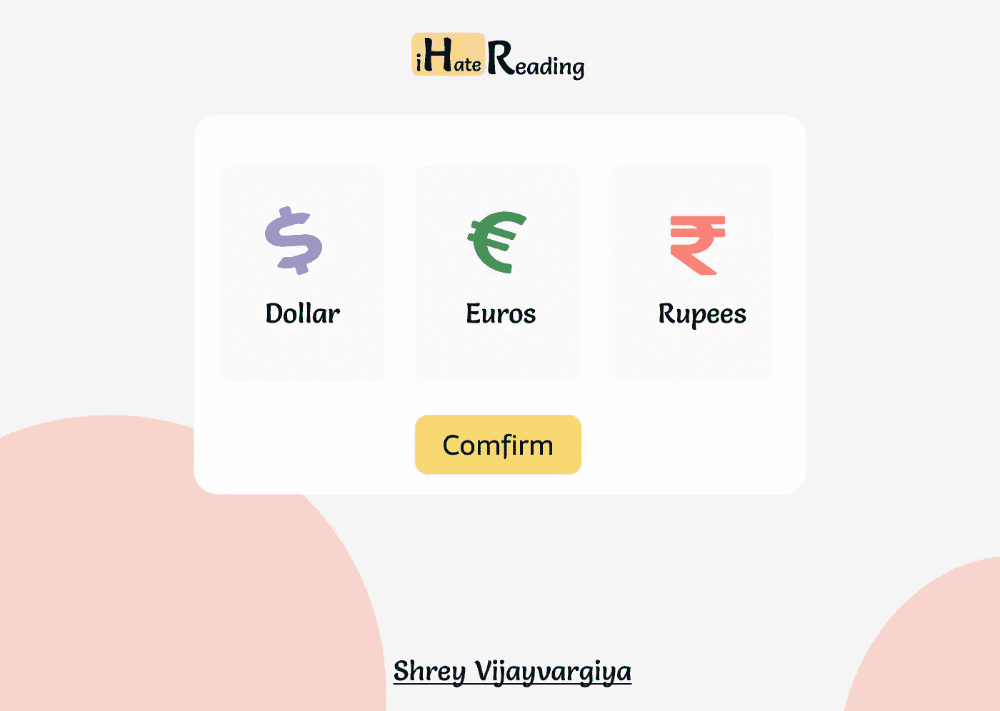

# 为过滤货币创建完美的端点

> 原文：<https://javascript.plainenglish.io/the-perfect-endpoints-for-filtering-currencies-in-88945e6a81c7?source=collection_archive---------9----------------------->

我们不需要使用第三方库来搜索和过滤货币。



[Reach the website](http://ihatereading.in)

# 在后台

过滤国家或为用户提供搜索他/她所属国家的搜索功能不是一件容易的事情。大多数时候，我们最终会在前端或后端使用第三方库来创建 it 端点。

我们将开发的终端

```
[https://ihatereading.in/projects/search-currency?type=introduction](https://ihatereading.in/projects/search-currency?type=introduction)
```

# 概观

今天，我们将创建一个基本端点来获取所有国家及其各自货币的列表，并使用国家代码或名称过滤货币。

我们已经在前端创建了一个搜索和过滤国家的组件。下面提供了链接。

[](https://shreyvijayvargiya26.medium.com/one-json-object-for-developing-the-complete-currency-select-b6da93dacc4e) [## 一个用于开发完整货币选择的 JSON 对象

### 从单个 JSON 对象在 react 应用程序中创建货币选择下拉列表

shreyvijayvargiya26.medium.com](https://shreyvijayvargiya26.medium.com/one-json-object-for-developing-the-complete-currency-select-b6da93dacc4e) 

# 入门指南

我将使用 simple Express 和 Node.js 来创建一个端点。

如果你是我的追随者或者是我文章的忠实读者，那么你应该知道，大多数时候，我会提供知识库的链接，但是今天，我们不会这样做。相反，我将指导您自己创建存储库的步骤。

按照步骤添加使用 Express 创建端点的基本设置。

*   安装快速主体解析器和 cors
*   添加`**package.json**`文件
*   在`**package.json**`中添加脚本标签
*   在根目录中为路由端点创建一个名为 routes 的文件夹
*   创建一个名为 Controller 的文件夹来定义端点方法

这个过程完成后，您的基本设置就准备好了:

```
yarn inityarn add express body-parser cors nodemon// Inside package.json
"scripts": {
   "dev": nodemon server.js
}
```

确保你的完整代码存在于`**server.js**`根目录下。

# 创建端点

第一步是下载所有国家及其各自货币的列表。我将使用的 JSON 对象可以从下面的链接下载。

```
[https://gist.github.com/Fluidbyte/2973986](https://gist.github.com/Fluidbyte/2973986)
```

## 获取所有货币的第一个端点

我已经创建了一个端点`**/search-all-currencies**`，它基本上从 JSON 对象导入货币列表，并简单地将它们与响应中的一些更关键的值一起导出，比如 API 响应的长度和状态。


`**/searchAllCurrencies**` response in the localhost

我还返回了作为 API 状态和数据长度的成功键值，它基本上给出了返回的所有货币的计数。

## 对货币列表进行分页

有时在前端，我们不想一起获取 119 个对象，这需要大量的数据获取，所以为了防止过度获取，我们简单地添加一个限制，只返回第 **x** 页上的第一个 **x** 项。例如，如果限制是 10，页面是 1，那么我们将只返回从索引 0 开始的 10 个项目。

在端点中提供 limit 和 pagination 作为查询总是一个好方法，这使得前端中的一切都变得更容易，以避免一次性获取过多的数据。

在同一个 endpoint/search-all-currency 中，我们将在查询中接受来自用户的限制和页码，并相应地过滤数据。


Paginated data on the basis of limit and page value in the query object

请注意，查询中返回的值默认为字符串类型，所以我们使用`**Number**`构造函数将它们转换为数字。

## 用于筛选单一货币的端点

下一个过程是根据国家的名称过滤货币，该名称将由用户在请求对象的查询中提供。

我们将使用名称过滤货币，通过 javascript 的`**toUpperCase**`方法将每个货币名称转换为大写，然后使用 javascript 的`**includes**`方法在数组中搜索查询值。

首先，我们导入所有货币，然后根据查询中提供的名称过滤货币，最后我们获取这些货币并在响应中返回。

## 使用代码过滤货币

我们可以添加一个端点，使用查询中提供的`**code**`值来过滤货币。您还可以在请求对象的主体中包含多个查询或一个 while JSON 数据来过滤数据。

这个过程与我们按名称过滤货币的过程相同。


Response object of the currency filtered using code

## 根据用户在货币查询中键入的任何内容过滤货币

我们现在将向前迈进一步，提供更好的搜索体验。如果用户在查询中提供任何值，而不是映射确切的关键字，如名称、符号或代码，我们会将它们映射在一起，以向用户返回一些内容。

这是一种罕见的情况，但假设您在网站上有搜索输入，用户仍然根据前 2/3 个字符输入任何内容，我们会向用户返回一些内容。这种用户体验基本上不会迎合用户的欠数据图像。

我们将接受查询，并简单地尝试查找与符号或代码或 name_plural 的名称匹配的值，并在响应中返回该项。


Filtered currency on the basis of value

# 结论

这个 JSON 对象使得一切都变得如此简单，为过滤货币提供了一个无缝且轻松的端点。请继续关注，获取更多关于技术问题的更新。

这是你的作者[T5 ShreyT7。下次见。祝大家愉快。](http://ihatereading.in/squad)

[*更多内容尽在 plainenglish.io*](http://plainenglish.io/)