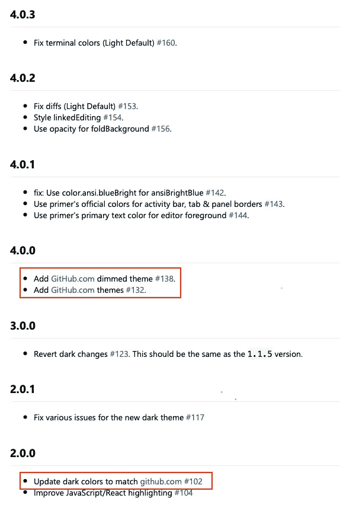
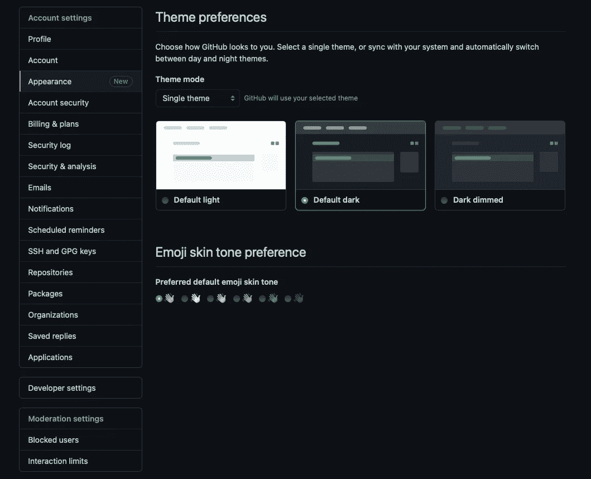
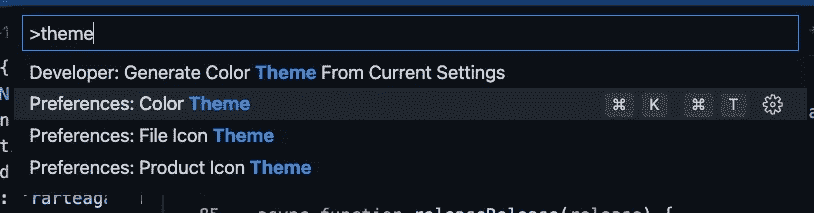
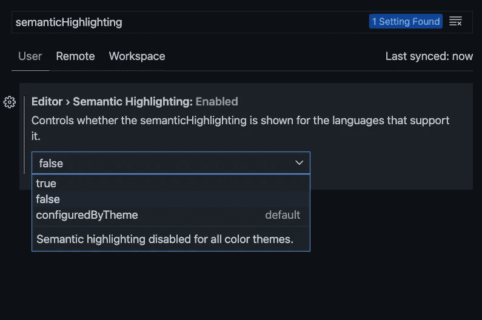
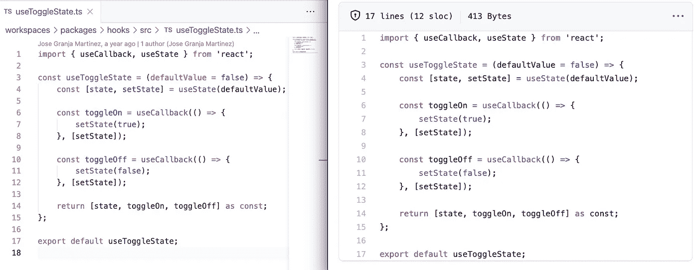
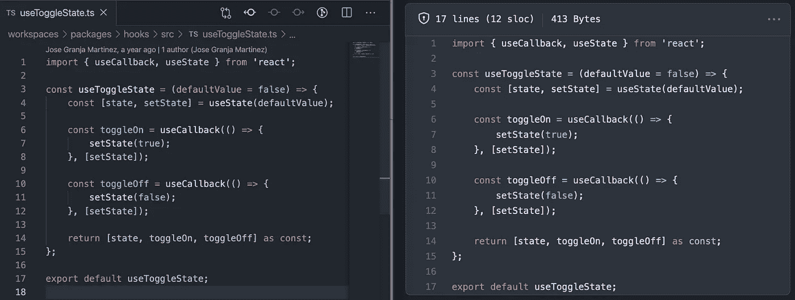
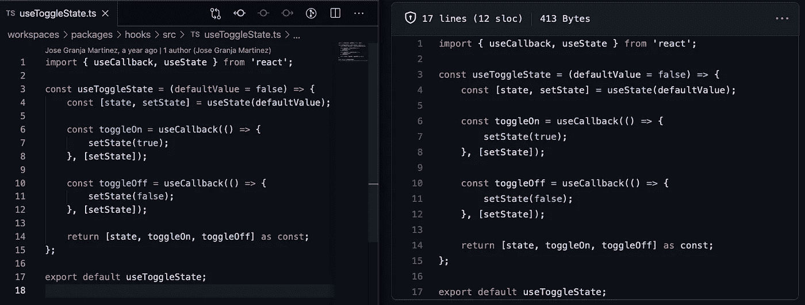

# GitHub 用户的完美 Visual Studio 代码主题

> 原文：<https://javascript.plainenglish.io/the-perfect-visual-studio-code-theme-for-github-users-86ee26083be5?source=collection_archive---------3----------------------->

## 如果您使用 GitHub 来存储您的 git 库，有一个主题可能会有所不同。


Photo by [Pankaj Patel](https://unsplash.com/@pankajpatel?utm_source=medium&utm_medium=referral) on [Unsplash](https://unsplash.com?utm_source=medium&utm_medium=referral)

Visual Studio 代码是一个很好的工具。它是可扩展的，这导致了一个非常定制的开发者体验。你首先要配置的是你的主题。但是你怎么能从这么多选项中选择呢？这不可避免地导致了选择的悖论:

> [“自主](https://en.wikipedia.org/wiki/Autonomy)和自由[选择](https://en.wikipedia.org/wiki/Choice)对我们的[安康](https://en.wikipedia.org/wiki/Well-being)至关重要，而选择对自由和自主至关重要。尽管如此，尽管现代美国人比以前的任何群体都有更多的选择，因此，大概也有更多的自由和自主权，但我们似乎并没有从心理上受益。—苏斯博士论选择的悖论

通常我倾向于坚持默认主题以保持简单。我喜欢让我的编辑器尽可能的轻便。然而，如果您使用 GitHub 来存储您的 git 库，有一个主题可能会有所不同:


Caption by Author

这个主题比默认的好吗？不就是又一个随意的主题吗？是的，但有一个非常大的区别:它将为您提供与他们的 web 平台相同的外观和感觉。这将缓解 GitHub 和 VS 代码之间的过渡。当您从编码转换到代码审查时，这尤其有用。它会给你的日常工作生活带来一致性。

为什么是现在？VS 代码主题已经存在一段时间了。然而，直到最近他们才在最新版本中完善了这个主题。

让我们看看他们最新的发布日志:



Caption from Author

我们清楚地看到，他们正在走向一致性，这是一个令人振奋的消息。

# 如何改变你在 GitHub 上的主题？

这非常直观:

1.  转到设置。
2.  转到外观。
3.  选择适当的主题。



Caption from author

你所要做的就是在 GitHub web 应用程序上选择你喜欢的主题，然后在 VS 代码上选择相同的主题。

# 你是怎么安装的？

它就像其他 VS 代码插件一样。以下是安装步骤供参考:

1.  前往 [VS 市场](https://marketplace.visualstudio.com/items?itemName=GitHub.github-vscode-theme)。
2.  点击“安装”按钮。
3.  然后[选择一个主题](https://code.visualstudio.com/docs/getstarted/themes#_selecting-the-color-theme)。目前，以下主题可用:

*   `GitHub Light`
*   `GitHub Dark`
*   `GitHub Light Default` ✨新✨
*   `GitHub Dark Default` ✨新✨
*   `GitHub Dark Dimmed` ✨新✨

您也可以使用**命令面板:**使用`CMD + SHIFT + P`:



Caption by Author

为了更接近 GitHub 的主题，您可以通过在`settings.json`配置文件中添加以下内容来禁用`semanticHighlighting`。

稍后，您可以依靠`configuredByTheme`选项。我用`Typescript`语言来界定它的范围，因为它是我主要使用的语言。您可以将其添加为常规设置。

```
...
  "[typescript]": {
    "editor.semanticHighlighting.enabled": false,
  },
...
```

或者，您可以使用编辑器的`UI`来更改该设置:



Caption by Author

# 显示优点的东西

让我们看看我们的最终结果。我通常使用默认的深色主题。对于这篇文章，我将添加两个使用最多的主题。

示例:TypeScript +默认灯光主题:



VS Code (Left) vs GitHub Web (Right) Default Light Theme

TypeScript +默认暗调主题:



VS Code (Left) vs GitHub Web (Right) Default Dark Dimmed Theme

Typescript +默认深色主题:



VS Code (Left) vs GitHub Web (Right) Default Dark Theme

它还不完美，因为还有一些事情需要解决。然而，未来是有希望的。

在撰写本文时，有 44 个问题悬而未决。欢迎任何人帮助改进这个主题。点击查看他们的知识库[。](https://github.com/primer/github-vscode-theme)

# 最后的想法

正如我们所见，主题不是一场`100%`比赛，但它足够接近，差异几乎不明显。当从编辑器切换到进行代码审查或只是浏览代码时，这个主题将有助于使其成为无缝体验。

这消除了任何不必要的过渡期，在此期间你必须习惯主题的不同。一致性的好处怎么强调都不为过。随着你对主题越来越习惯，你阅读代码的速度会更快，因为你对主题本身的注意力会更少。

对我来说，你最好停止定期寻找完美的 Visual Studio 代码主题——它根本不存在。

干杯！

**相关:**

[](https://betterprogramming.pub/8-vs-code-plugins-to-improve-your-productivity-ee4497cebefa) [## 8 VS 代码插件，提高您的工作效率

### 帮助你日常工作的必备插件

better 编程. pub](https://betterprogramming.pub/8-vs-code-plugins-to-improve-your-productivity-ee4497cebefa) 

[*更多内容尽在 plainenglish.io*](http://plainenglish.io/)