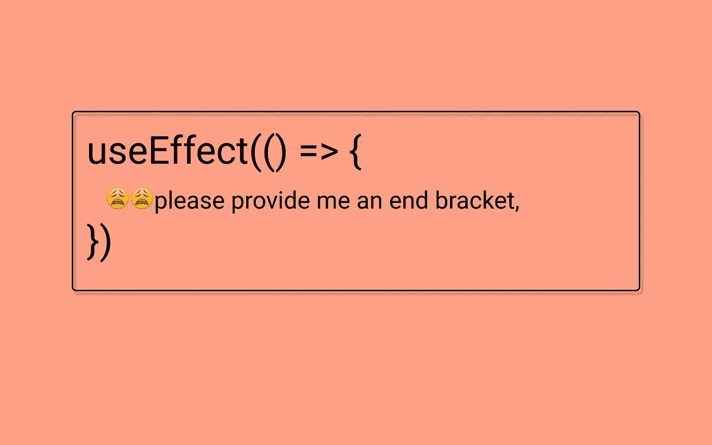

# 使用 React 的 useEffect 挂钩的最佳方式

> 原文：<https://javascript.plainenglish.io/the-perfect-way-to-use-useeffect-hook-of-react-a6d08af0e3fa?source=collection_archive---------14----------------------->

你可能已经以不同的或者完全错误的方式使用了 **useEffect** 钩子。



# 在后台

先说基本的，最常用的挂钩。我将尝试让你深入了解如何以更好的、近乎完美的方式实现 useEffect。

## 内侧端托架使用效果

我们可以使用 useEffect 控制 React 组件的条件呈现。useEffect 钩子非常强大，它已经取代了我们在类组件中使用的许多钩子方法。让我解释一下。**shouldcomponentdimount**应该返回一个布尔值，并根据该布尔值，React 决定是否重新呈现 DOM。因此，通过在 **shouldComponentDidMount** 方法中提供一个条件，我们可以控制 React 组件的重新呈现。如何使用效果是通过提供一个括号作为第二个参数。

useEffect 是一个接受两个参数的钩子，第一个是回调函数，第二个是一个带有单个或多个可变属性或状态的括号。括号内定义的值帮助 useEffect 决定是否重新渲染 React 组件。

```
const [ data, setData ] = useState()useEffect(() => {}, 
 // Inside the bracket always add some value don't leave it empty 
[ data ]
);
```

## 更好使用的提示

始终为括号提供一个值是一个好习惯。我们经常忘记在第二个参数的 useEffect 括号内添加任何值，这就像虚张声势 React 虚拟 DOM 或钩子。React 依赖于这个括号来决定其特定组件的重新渲染条件。因此，在 useEffect 括号内提供一个值作为第二个参数总是一个好的做法。

## 清除 useEffect 中的函数

这是大多数开发者所不知道的。一旦 React 组件被卸载，useEffect 钩子确实提供了一种取消函数或清除函数的方法。

如果您使用了一个类组件，那么您必须知道一旦特定的 React 组件被卸载，就会调用的 **componentDidUnMount** 方法。

在 useEffect 回调中，我们可以返回一个指示 useEffect 的函数，以便在组件被卸载后清除该函数。

```
const [ data, setData ] = useState()useEffect(() => {},// This return will get called on unmounting of this component
 return () => {
  clearInterval(() => {})
 }[ data  ]
);
```

当您希望在一个被卸载的特定组件和下一个组件被装载之前进行 API 调用时，这种情况非常有用。

## useEffect 内部的异步回调

大多数 API 本质上都是异步的，为了获取任何组件的数据，我们总是倾向于 useEffect。因此，在这种情况下，您还可以提供一个异步回调函数来使用 Effect。

我已经使用了 async-await 功能从 API 中获取数据，并在状态中更新 API 中的数据。这是从 useEffect 内部的 API 加载数据的最完美的方式。您甚至可以将 Axios 方法解耦到另一个函数中，用 **fetchData** 作为方法名。

## 取消 Axios 请求

使用 Axios 发出 API 请求后，您可以在卸载组件期间取消该请求。为此，您可以使用 Axios 的 cancel 方法。

如果用户立即转到另一个页面，这对于避免过量提取或不必要的 API 请求非常重要。

# 结论

单一的 useEffect 钩子如此强大，以至于它的单一句柄取代了 React 生命周期的类组件的所有方法。我曾经在一次采访中被问到——功能组件能控制 React 的每一个生命周期吗？

好吧，我说是的，尽管面试官并不信服，也许是因为他对功能组件的先入为主的怀疑。是的，功能组件非常强大，可以控制 React 生命周期的每个阶段。

下次见。祝大家愉快！

[](https://medium.com/nerd-for-tech/3-minute-roadmap-to-master-the-next-js-in-2021-e022fee244b0) [## 掌握 2021 年下一个 JS 的 3 分钟路线图

### 2021 年掌握下一个 JS 的完整指南

medium.com](https://medium.com/nerd-for-tech/3-minute-roadmap-to-master-the-next-js-in-2021-e022fee244b0) [](https://medium.com/nerd-for-tech/understanding-javascript-creating-sample-json-data-4500db528b9b) [## 理解 JavaScript —创建示例 JSON 数据

### 创建用户的样本 JSON 数据。

medium.com](https://medium.com/nerd-for-tech/understanding-javascript-creating-sample-json-data-4500db528b9b) [](/everything-in-react-native-starts-with-cards-and-ends-with-cards-7d35979f6023) [## React Native 中的一切都是以卡开始，以卡结束

### 开发可重用组件的秘密。

javascript.plainenglish.io](/everything-in-react-native-starts-with-cards-and-ends-with-cards-7d35979f6023) 

*更多内容尽在*[*plain English . io*](http://plainenglish.io/)