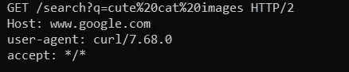
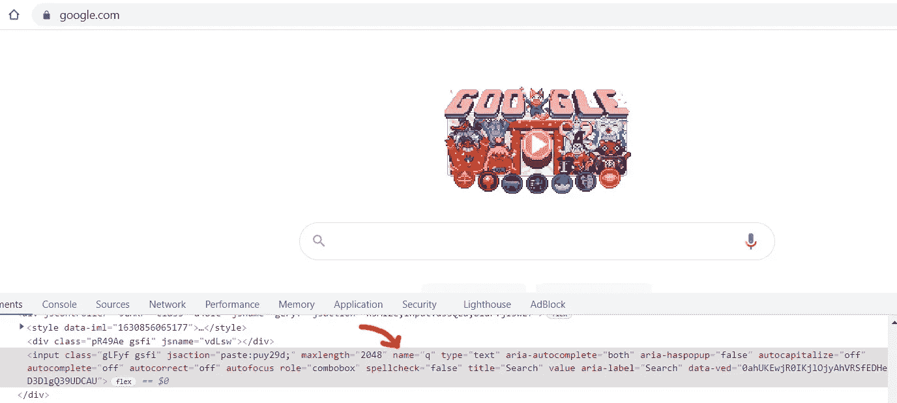
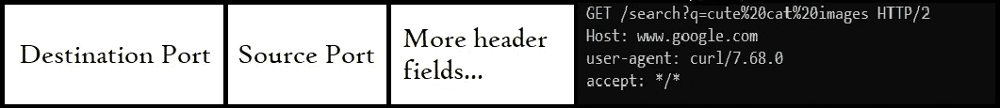
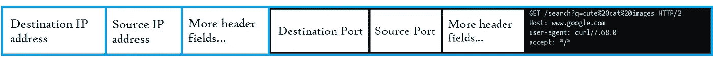
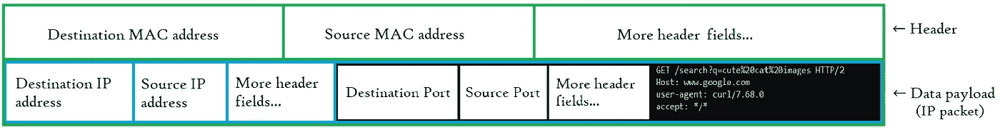
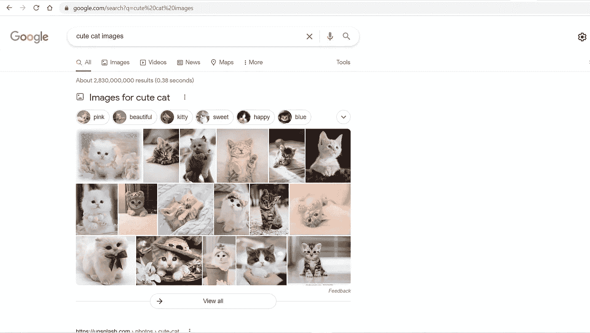

# HTTP 请求的危险旅程

> 原文：<https://javascript.plainenglish.io/the-perilous-journey-of-an-http-request-9aa7ea6f00cb?source=collection_archive---------7----------------------->

## 这是一个孤独的 HTTP 请求在浩瀚的互联网海洋中航行的故事。

Photo by [Johannes Plenio](https://unsplash.com/@jplenio?utm_source=medium&utm_medium=referral) on [Unsplash](https://unsplash.com?utm_source=medium&utm_medium=referral)

这一切都是从一双疲惫的人类眼睛在可爱的猫图像中寻找平静开始的。

Google Search for “cute cat images”

这就是一个 *HTTP 请求*的诞生:一个由一些必要信息组成的文本消息，这些信息是按照**超文本传输协议(HTTP)** 命令的方式构建的。出生地:*应用*层。

它看起来像这样:

The HTTP Request

第 1 行是*请求行*。它包括 *HTTP 方法*，该方法将告诉目的主机，当它到达那里时，它应该如何处理它。这是一个`GET`请求:它请求服务器获取一个资源(“可爱的猫图片”的搜索结果页面)，并将它们发送回*客户端*:我们的浏览器。

它还包括*请求-URI* ，又名*路径*，这将让服务器知道它需要获取哪个资源。我们的请求路径包括一个*查询字符串* `?q=cute%20cat%20images`，它向服务器传递一些关于所请求资源的附加信息。

这里暂停一下，讨论一下查询字符串——这个`q`是什么，为什么我们在搜索框中输入的单词之间会有一些奇怪的字符分隔？

`q`是我们填写的输入字段的名称。我们可以在这里看到:

Notice the `name` attribute of the input element

“奇怪”的字符，特别是`%20`，是因为我们不能在 URL 中有空格。因此，我们使用 [ASCII 十六进制代码](https://www.rapidtables.com/code/text/ascii-table.html)来表示前面有`%`的空格(数字 20)，这只是一个保留字符，用于在 URL 中输入 ASCII 代码来编码不允许或不安全使用的字符。

右括号。

最后指定使用中的 *HTTP 版本*:`HTTP/2`。

在请求行下面是一个必要的*头*，它标识接收主机`[www.google.com](http://www.google.com.)`、[。](http://www.google.com.)我们不会进入以下两个标题。

我们都准备好去旅行了吗？绝不可能。HTTP 请求在准备好踏上危险的旅程之前，必须经历一次转换。

## 成为 TCP 段

它现在进入*运输* *层*。这一层的指挥者通常是**传输控制协议(TCP)** 。TCP 非常认真地对待自己的工作，希望确保发送的每个数据段都能被接收到，并且顺序正确。

让我们在这里稍作休息，简单地讨论一下 TCP 如何实现这些特性，以确保在客户机和服务器之间建立可靠的连接。

首先，它遵循一个被称为 *TCP 三次握手*的过程。在“握手”期间，客户机和服务器交换几条消息。

1.  客户端主机发送一个设置了`SYN`标志的数据段。
2.  服务器用带有`SYN` — `ACK`标志的数据段来响应。
3.  客户端发送带有`ACK`标志的最后一个数据段。

一旦握手完成，HTTP 请求就可以安全地传输了。

此外，为了确保请求确实到达了目的地，一个*确认*消息从服务器发送回我们计算机的网络接口。如果没有收到确认，则重新传输该数据段。

最后，如果一个消息太大而不能一次发送，它会被分成几个片段，每个片段都有自己的*序列* *编号*(也位于报头字段中)。这样，当它们到达目的地时，它们将按正确的顺序被处理。

HTTP 请求被封装在 TCP 数据段中。该数据段有一个报头和一个数据有效载荷(HTTP 请求现在所在的位置)。

The TCP Segment (outlined in black) encapsulates the HTTP Request

那么头里面是什么呢？

传输层负责将数据段从发出请求的应用程序(在本例中是 web 浏览器)发送到 Google 服务器中的正确进程(HTTP 请求在这里被处理)。它通过使用*端口*来实现:0–65535 范围内的整数，作为主机中特定应用程序或进程的标识符。

我们的 TCP 段的报头将包含(除了其他信息之外)由我们的操作系统分配给该应用程序的*源端口*和*目的端口。*HTTP 的默认端口是 80。

这样，当片段到达谷歌的服务器时，它将被定向到端口 80，在那里服务器*监听*HTTP 请求*。*

但是它如何到达谷歌的服务器呢？

## 成为一个 IP 包

向上，向下，到*互联网层*。

在这里，TCP 数据段被**互联网协议(IP)** 转换成 *IP* *数据包*。

互联网协议是一种能使数据包从你家传送到世界另一端的服务器的协议。

The IP Packet (outlined in blue) encapsulates the TCP Segment

TCP 数据段会自动跳到数据包中。IP 把它封上，并在上面写上回邮地址和邮寄地址。寄件人地址或*来源*地址是我电脑的 *IP 地址*(需要可爱猫咪图片的是我)。收件人或目的地是谷歌服务器的 IP 地址:在互联网上识别该计算机的唯一数字序列。

IP 地址可能看起来像这样:`[207.126.144.10](http://207.126.144.100/)0`，表示 IPv4，或者这样:`2a02:687:1211:7500:c8cb:bcf9:7acb:a966`，表示 IPv6。

(*注:* IPv4 和 IPv6 都是 IP 协议的版本，IPv6 是最新版本，可以容纳比 IPv4 多大约 10 倍⁷的 IP 地址)。

一切就绪；下一层，也就是最后一层。

## 成为以太网帧

我们的请求已经正式到达了它的最后准备阶段:数据*链路层**。以太网协议负责这一层。*

*以太网将包含 TCP 段的 IP 数据包(包含 HTTP 请求)打包成一个*帧。帧头上的*是源和目的地 *MAC 地址*。除了，在这种情况下，目的地还不是谷歌的服务器，位于数英里之外，而是队列中的下一个节点。所谓节点，我指的是信息将首先传输到的最近的联网设备——通往谷歌的下一个“跳”。现在，它可能是我的路由器。*

**

*The Ethernet Frame (outlined in green) encapsulates the IP Packet*

*这就是以太网的作用:它负责将帧送到网络中的下一个“跳”。一旦它到达那里，目的 MAC 地址将改变指向下一个节点。这很像真实的包裹如何在世界各地旅行:每个快递员(节点)处理包裹(帧)，并将其分派给下一个快递员，直到它到达最终目的地。*

**

*Photo by [Daniel Falcao](https://unsplash.com/@danielsfalcao?utm_source=medium&utm_medium=referral) on [Unsplash](https://unsplash.com?utm_source=medium&utm_medium=referral)*

*现在怎么办？混乱，电缆和电线。帧采取最终的形式:它成为一个比特流，以电信号(或光信号或无线电波)的形式向目的 MAC 地址传输——路由器将充当通往外部世界的网关。*

*以同样的方式，HTTP 响应将在谷歌的服务器上准备好，并一路传回我的家，我的电脑，最终从我的浏览器传到我疲惫的眼睛。*

**

*The HTTP Response message interpreted as a web page*

## **总结**

1.  *出于本文的目的，使用了 [TCP/IP 模型](https://en.wikipedia.org/wiki/Internet_protocol_suite)。*
2.  *每一层都可以使用不止一种协议。例如，在传输层，UDP 可能被一些应用程序用来代替 TCP。*
3.  *在 google.com 实际使用的 HTTPS 的例子中，HTTP 请求首先由 TLS 协议加密，这样就可以安全地传输。*
4.  *不幸的是，还有比本文提到的更多的事情在发生。*

**更多内容尽在*[***plain English . io***](http://plainenglish.io)*