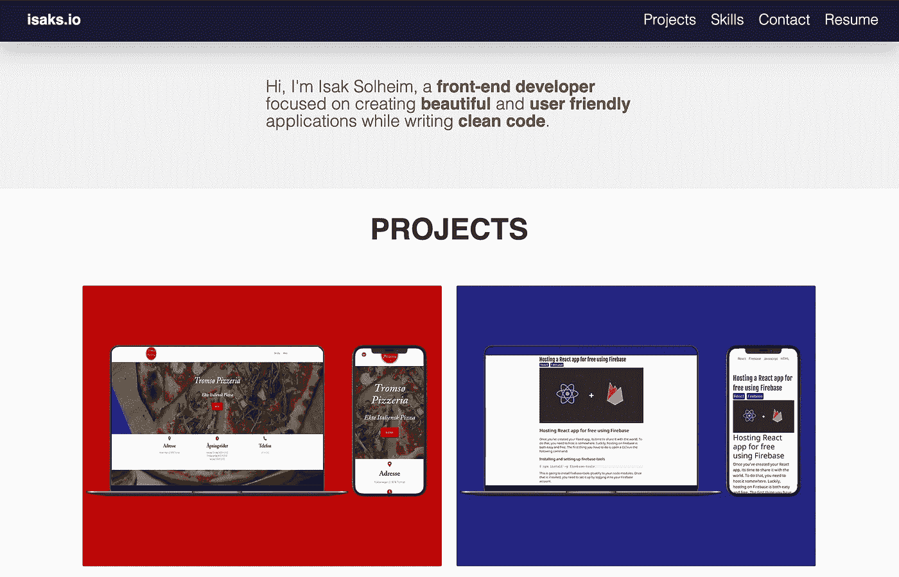
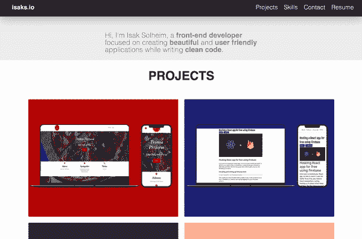
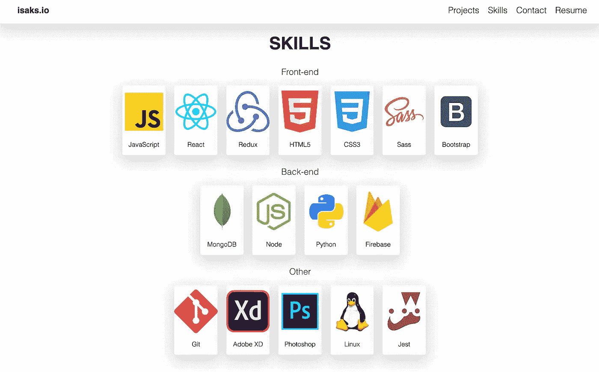
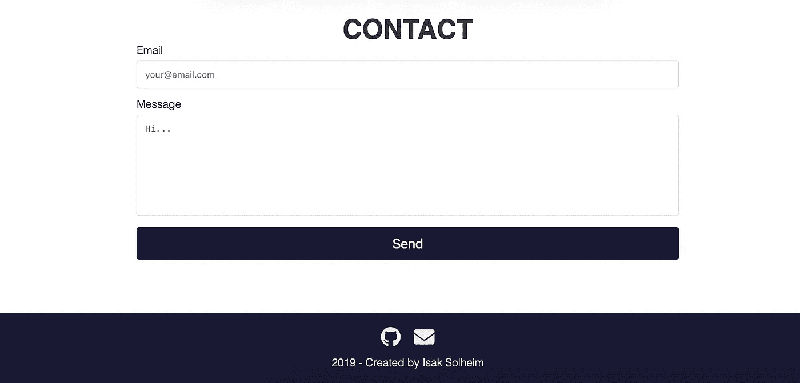
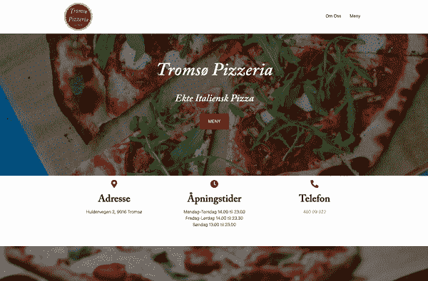
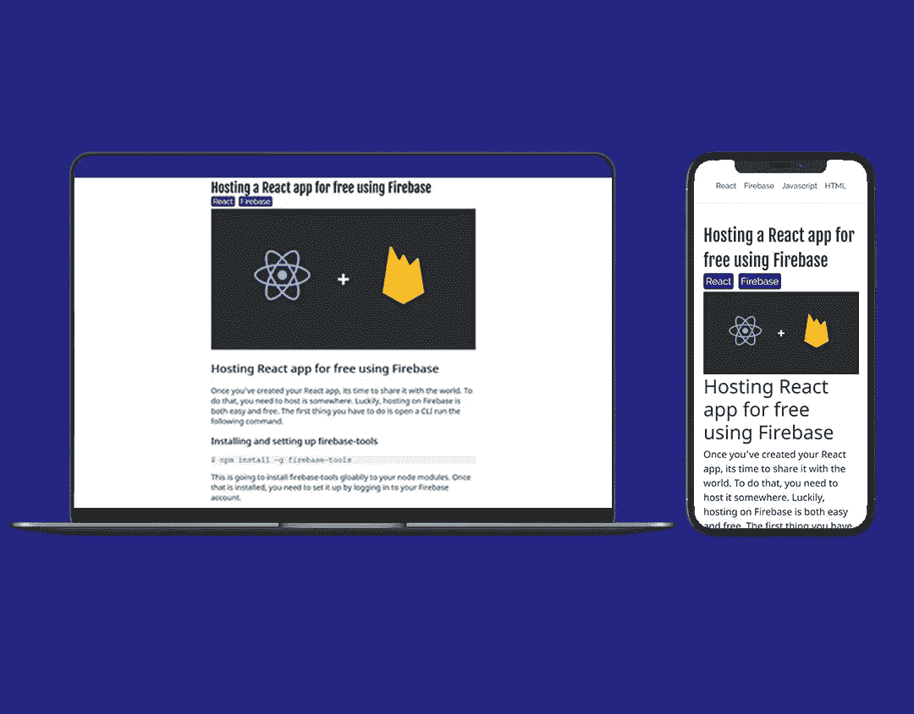
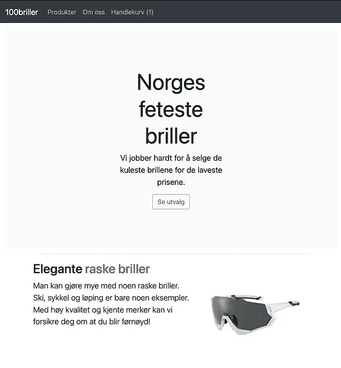
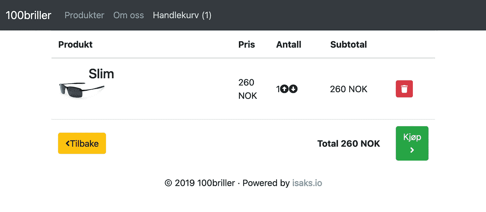
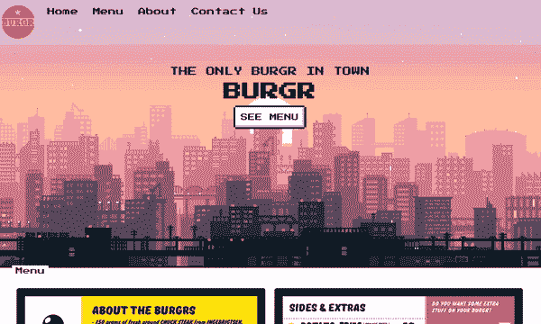
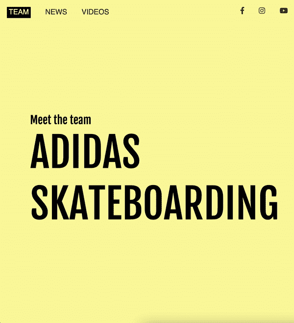

# 让我得到一份前端开发工作的投资组合

> 原文：<https://javascript.plainenglish.io/the-portfolio-that-got-me-a-job-as-a-frontend-developer-89af732dddab?source=collection_archive---------0----------------------->

向你展示我被聘为前端开发人员时创建的确切项目。

> 这篇文章最初发表在我的博客@ [isaks.io](https://isaks.io/) 上

What the landing page looked like

如果你是一个正在找工作的开发人员，也许你能做的最好的事情就是创建一个投资组合。如果你是自学的，这一点尤其正确，因为你没有可以向公司展示的学位。在这篇文章中，我将向你展示我自己的投资组合在 2019 年作为前端开发人员获得第一份工作时的样子。

## 在投资组合中寻找什么

首先，我们需要考虑通过投资组合我们想要完成什么。我们想展示我们拥有的技能。很多人用他们的作品集来写很多关于他们自己的东西。我不认为这是个好主意。它应该简洁，展示你的项目。没有人想阅读大段大段的文本。

我的文件夹中唯一的文本如下:

> 嗨，我是伊萨克·索尔海姆，一名**前端开发人员**，专注于创建**漂亮**和**用户友好**应用程序，同时编写**干净代码**。

另一个建议是避免自己的照片。添加一张图片无非是给他们提供了另一种评判你的方式。在我的情况下，我不想包括它，这样他们就不会根据我的年龄来判断我。如果你得到了面试机会，那么无论如何你都要去见他们。

# 设计和内容

专注于网站的设计。我建议保持简单，而不是做一些太高级的事情。

## 项目展示

这是我投资组合顶部的样子。它有一个简短的文本部分，当用户向下滚动时就会消失。这些项目都很清晰，有着清晰的图片。如果你悬停在一个项目上，它会显示这个项目是用什么技术构建的，一个到 Github 上代码的链接，以及一个到实时项目的链接。

Scrolling down from the top of the website

## 技能

在网站上有一部分列出你的技能。不包括百分比。我看到很多人写的都是“Java: 70%”之类的东西。这到底是什么意思？如果你使用过某项技术，把它列出来。在将这项技术融入你的体验之前，你不一定要精通它。

What my “skills” section looked like

## 接触

您还应该有一个“联系”部分，用户可以选择取得联系。我附上了我的 Github 账户和电子邮件的链接。

Contact section

# 这些项目

项目本身当然非常重要。你应该致力于创建不同的项目，都可以展示一些具体的东西。以下是我做过的 5 个项目，我可以推荐去做:

披萨店
我联系了当地的一家披萨店，与他们合作创建了一个网站，顾客可以在上面看到菜单和餐厅的相关信息。这表明我可以与他人合作，这在你的作品集里是非常有价值的东西。

**建用:** React，物化 CSS 框架，Firebase

Pizza restaurant website

这个项目非常棒，因为它展示了我可以从 API 获取和显示数据。拥有博客也表明你对编程充满热情，这是雇主乐于看到的。

**内置:** React，React 路由器，Sass，Bootstrap，Firebase

Programming blog

**电子商务网站:**
创建一个电子商务网站是展示一些更先进的国家管理的好方法。我用 Redux 进行状态管理。

**内置:** React，React 路由器，Redux，Sass，Bootstrap，Firebase

E-commerce website

**餐厅概念网站:**
又一个餐厅网站，不过这次我重新创建了一个已知餐厅的网站。这表明我可以使用 CSS 框架重新创建设计。

Restaurant concept website

**内置:** React，NES.css，Sass，Firebase

概念网站:
这最后一个项目是为了展示我的 CSS 技能而创建的。我使用 Animate.css 和 Fullpage.js 创建了一些很酷的滚动动画。

**内置:** React，Animate.css，Fullpage.js，Sass，Firebase

Adidas Skateboarding concept website

自从创建了这个投资组合，我已经改变了几次，现在看起来一点也不像以前了。这就是我喜欢开发人员投资组合的地方，他们总是在进化。我希望向你展示对我有效的方法可以帮助你创建自己的投资组合。如果你有兴趣看看我现在的网站，你可以访问这个网站

感谢您花时间阅读这篇文章。非常感谢任何反馈！

*更多内容请看*[***plain English . io***](http://plainenglish.io/)