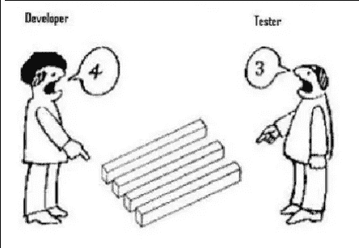
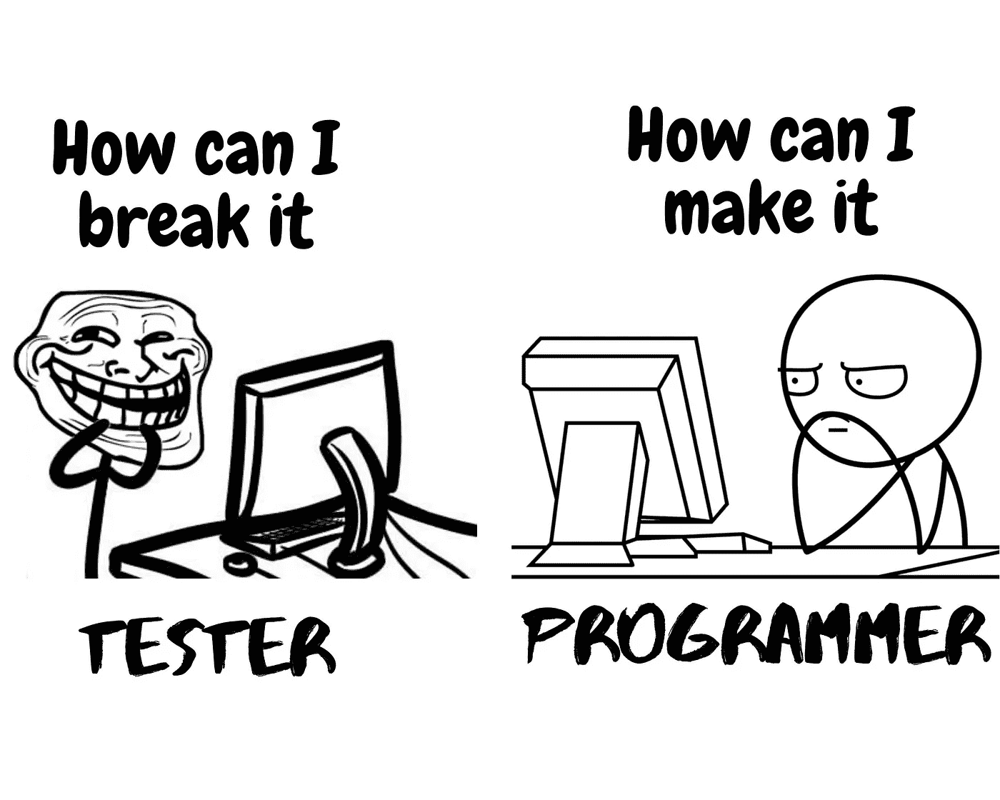
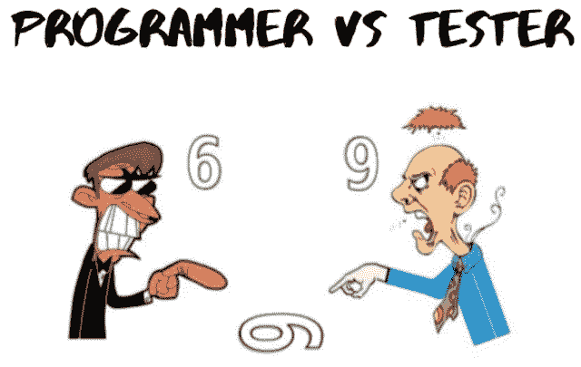
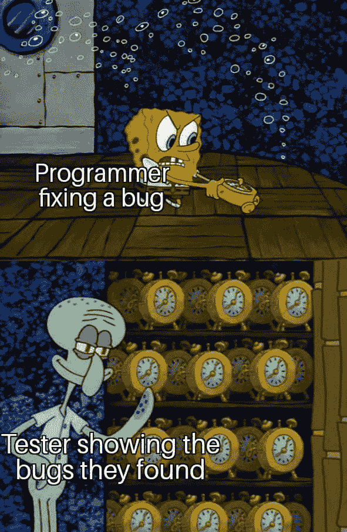
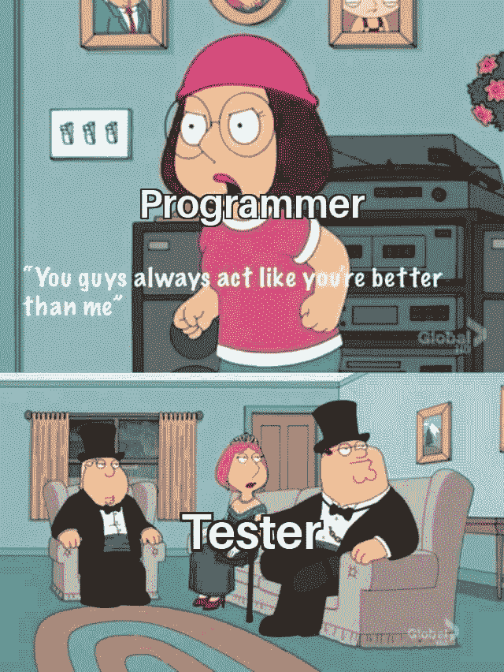
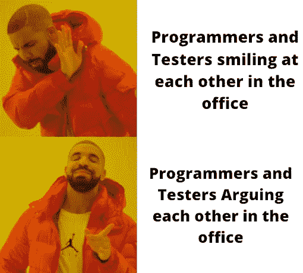
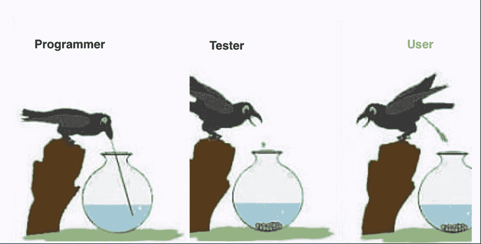
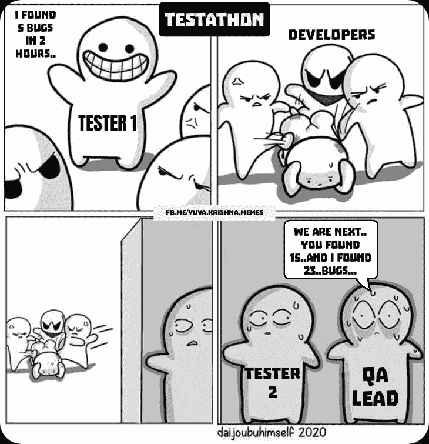

# 用简单的图片描述程序员和测试员之间的关系

> 原文：<https://javascript.plainenglish.io/the-programmer-tester-relationship-described-in-pictures-a61c85ed45b3?source=collection_archive---------1----------------------->

## 那会让你笑的。

Photo provided by the author

程序员和测试人员在软件或 web 开发中起着至关重要的作用。

他们比客户或用户更早发现问题。老实说，作为一名 web 开发人员，我非常感谢那些在我的代码中发现问题的测试人员。

这只是为了好玩。我的目标是在漫长的一天工作之后，让我们的程序员和测试员同事脸上露出笑容。

让我们开始吧。

## 1.当开发人员看到的是 4，而测试人员看到的是 3。

Source: [Imgur](https://imgur.com/r/ProgrammerHumor/2kjC0)

## 2.当一个程序员和一个测试人员有相同的目标，但是有不同的方法去实现它

Photo supplied by the author

## 3.当一个程序员和一个测试人员看到同样的东西却有不同的理解。

Source: [Imgur](https://imgur.com/a/d21MWVC)

## 4.当一个程序员和测试人员失去了它

Photo supplied by the author

## 5.当程序员在解决问题时

Photo provided by the author

## 6.当程序员认为测试人员比他们表现得更好时

Photo provided by the author

## 7.程序员和测试人员在工作中做什么

Photo provided by the author

## 8.成功完成一个项目后

Photo provided by the author

## 9.发现错误时的不同反应

Source: [Facebook Hfarazm](https://www.facebook.com/hfarazm/posts/developers-lifetester-developer-manager-hfarazm-software/1094463080725529/)

## 10.程序员做什么，测试人员做什么，用户做什么。

Source: [Reddit](https://www.reddit.com/r/programmingmemes/comments/i1l41j/programmer_vs_tester_vs_user/) — [u/nawinkhatiwada](https://www.reddit.com/user/nawinkhatiwada/)

## 11.程序员对测试员(你说你发现了什么？)

Source: [Reddit](https://www.reddit.com/r/ProgrammerHumor/comments/i1s61v/did_you_say_bugs/) | [yuva-krishna-memes](https://www.reddit.com/user/yuva-krishna-memes/)

## 12.当测试人员在代码中发现问题时

Source: [9gag](https://9gag.com/gag/ae5dvoQ)

## 13.每个测试人员和程序员都是这样的

Source: [Image flip](https://imgflip.com/i/32p8d5)

## 14.测试人员向开发人员展示 bug

Source: [Imgflip template](https://imgflip.com/memegenerator/170419332/What-the-hell-is-this)

## 15.当测试人员将问题移交给程序员时

Source: [Programming Humor](https://www.reddit.com/r/ProgrammerHumor/comments/e5vg3z/tester_developer_relationship/)

## 结论

我希望你喜欢我在网上制作和收集的这些简单的插图。再说一次，我无意冒犯，只是为了好玩。