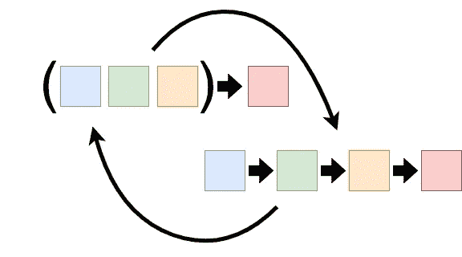

# 编程中 Currying 的目的是什么？

> 原文：<https://javascript.plainenglish.io/the-purpose-of-currying-a48fad5e9471?source=collection_archive---------11----------------------->

我看过很多关于这个话题的文章和评论。如果我相信这些评论的话，你们中的许多人似乎没有明白奉承的意义。

如果你问自己什么是奉承？“放心吧，我也会回答的。

## 首先，一点数学知识

在数学中，遇到依赖于多个参数的函数是相对常见的，尤其是当你处理代数 1 以上的东西时。Currying 是这样一个过程，其中一些参数被赋予一个固定值，这样您就可以在给定这些固定参数的情况下评估函数。

正式来说，currying 一次执行一个参数。结果是一个新函数，少了 1 个需要提供的参数。

这个想法对于任何学过微积分的人来说应该是非常熟悉的，以部分积分和部分导数的形式。

它在某些情况下对几何学也很有用，比如处理一个球体和一个平面的交点。

旋转以使平面平行于您不想固定的 2 轴，平移以将球体放置在(0，0)处，这允许您在平面的固定坐标上查找球体的方程，以获得圆形交点的方程。解平移，解旋转方程，得到最终结果。

这是做这件事的一种方法。

## 但是我们为什么要谈论数学呢？

事实证明，编程中 curry 的概念是从数学中借来的。考虑到编程只是数学的另一种应用，这应该是有意义的。

这个对话的关键是“编程是数学的一个**应用**”。这就是为什么有那么多人对在程序中使用 currying 感到困惑。

现在让我来回答这个问题:JavaScript 中的 currying 只是模板化的另一种形式。想想 C++模板，或者 C#和 Java 中的泛型。Currying 有非常相似的效果。事实上，currying 更像泛型，而不是 C++模板，因为它是一个运行时操作，而不是编译时操作。这应该已经给了你如何使用它的线索。

## 一些有用的例子

我知道你们中的许多人在阅读这篇文章的时候已经阅读了关于这个主题的其他文章，并且发现那里的例子仅仅是对“如何”的描述，而没有暗示你“为什么”想要这样做。我尽量给大家举几个“为什么”的例子。让我们从 OOP 和事件处理开始。

这是我正在开发的 UI 库(是的，是库，不是框架)的一段真实代码。

Example 1: Using currying for event handling

从第 10 行开始，您将看到我最喜欢的一个涂抹函数的几种用法:`Function.prototype.bind()`。因为我只使用了它的第一个参数，所以它甚至可以作为一个正式 currying 函数的例子。

由于函数通常不会传递它们被调用的上下文，所以我必须在将实例传递给`addEventHandler()`之前将实例绑定到函数，以确保所需的实例对象实际上被用作上下文。

如果 JavaScript 中不存在`Function.prototype.bind`,并且您想要将其存根化，它可能看起来像这样:

Example 2: Stub function for Function.prototype.bind()

你会注意到`Function.prototype.bind`允许你预设的不仅仅是一个函数的上下文，但是即使这样也可以用一种形式上满足所有参数的方式来拼写。我将把如何做到这一点作为练习留给读者。

## 一个非内置的例子怎么样？

好吧。所以我们都知道`Function.prototype.bind`可以用于 curry，但是为什么您想要自己创建一个 curry 函数呢？如果你看看下面的函数，你会明白有很多原因。

Example 3: Wrapping a function

这可能看起来不像是一种奉承，但它是。我甚至认为 JavaScript 中大多数高级函数的例子在某种程度上都是奉承的例子。在本例中，该函数用少量代码和一些属性将给定函数包装在另一个函数中，以确保目标函数的执行框架可以在运行时被识别。这允许我的 [ClassicJS](https://github.com/rdking/ClassicJS) 库识别请求代码是否有权限访问 ClassicJS 类的非公共成员。

## 也许是一个不那么复杂的？

React hooks 怎么样？他们的`usestate()`函数是一个奉承函数。它接受一个初始状态函数，并返回(作为返回数组的一部分)一个操作该状态的函数。我不想在这里张贴，因为网上有很多这样的代码，包括在他们的网站上。就在这里[看一下](https://reactjs.org/docs/hooks-reference.html#usestate)。

## 概括起来

总而言之，JavaScript 中的 currying 使用函数闭包来预初始化函数的参数，返回一个执行相同任务所需参数更少的函数。尽管我为此提供了 3 个不同的用例，但我仍然觉得有必要停下来告诉你它最近在 JavaScript 中流行的主要原因。

它伴随着函数式编程(FP)的推进而来。在许多情况下，携带状态是处理某些功能的最有效的方法。

然而，FP 不允许使用延迟状态变量。

为了解决这个问题，同时仍然保持 FP 的外观，JavaScript 程序员可以使用闭包将函数参数的值保持为保留状态，而不必显式声明状态变量。最后，这只是一个小技巧，让你保持 FP 的外观，而不必费心维护意图。

也就是说，无论您的编程风格是过程式的、函数式的还是面向对象的，它在许多情况下仍然非常有用。我并不反对 FP。对我来说，它只是我工具箱里的又一个工具。

同样，柯里也是。我非常支持提出这样一个概念，即我们不应该带着偏见看待任何特定的编程范例，因为它都有其用途。

我们只需要努力确保我们理解它们的用例以及在使用它们时的限制。

*更多内容看*[***plain English . io***](http://plainenglish.io)