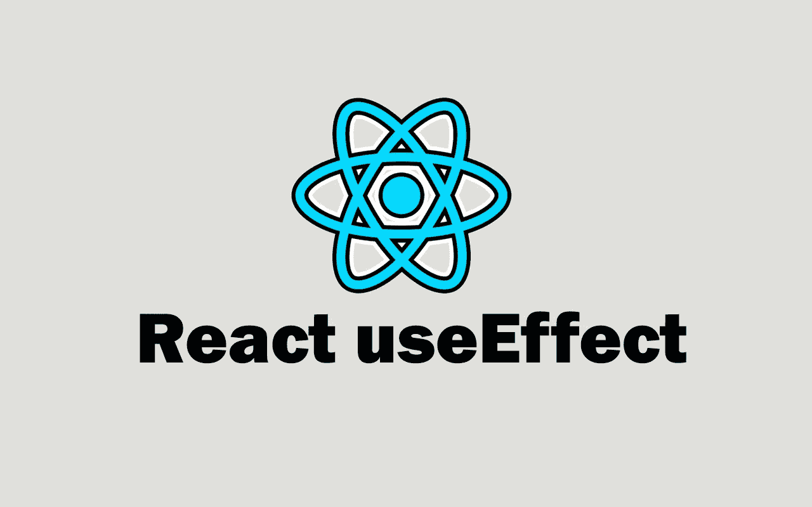

# React UseEffect 挂钩举例说明

> 原文：<https://javascript.plainenglish.io/the-react-useeffect-hook-explained-with-examples-95259b3ac89f?source=collection_archive---------7----------------------->

## 通过实例了解 React useEffect。



Image created with ❤️️ By [author.](https://mehdiouss315.medium.com/)

# 介绍

钩子`useEffect`是你必须知道的重要反应钩子之一。每当发生变化时，它允许您在功能组件中执行副作用。因此，使用`useEffect`钩子，您可以在 React 中做很多事情，比如获取数据、使用 DOM 等等。

在本文中，我们将通过一些实际例子来学习 React 中的 UseEffect 钩子。让我们开始吧。

# 如何使用 UseEffect？

钩子`useEffect`接受两个参数。第一个是强制的，是回调函数。另一方面，第二个参数(值数组或空数组)是可选的，当我们希望钩子在应用程序中呈现特定值之后运行时，我们会使用它。

要开始使用钩子`useEffect`，首先需要从 React 包中导入它。

这里有一个例子:

```
import React, **{ useEffect }** from 'react';
```

之后，您现在可以毫无问题地在您的功能组件中使用钩子了。

当你的应用程序更新时，你想做些什么，那么你应该使用`useEffect`。下面的例子访问 DOM 来改变带有`useEffect`的正文的背景:

```
**useEffect**(**()=>{**
  document.body.style.background = "black";
**}**);
```

函数`useEffect`将一个回调函数作为其第一个参数。该回调函数将在每次重新渲染时执行。如果你不想在每次重新渲染后都执行它，那么你必须添加第二个参数(空数组)。

下面是一个例子:

```
**useEffect**(**()=>{**
  document.body.style.background = "blue";
**},[]**);
```

在这种情况下，回调函数只会在组件呈现时运行一次。

当组件中的某个特定值发生变化时，我们也可以产生副作用。

这里有一个例子:

```
**useEffect**(**()=>{**
  console.log('Only run on name change')
**},[name]**);
```

在上面的例子中，只有当值`name`渲染或改变时，回调才会运行，副作用才会被执行。

# 清理功能

当您的应用程序需要定义许多副作用时，那么您将不得不使用一个清理函数来清理发生的每个副作用。否则，会影响应用程序的性能。

让我们举一个简单的例子，当用户调整页面大小时，您将拥有一个以像素为单位显示屏幕宽度的网页。为此，我们需要一个 resize 事件。

下面是一个例子:

```
import { useState, useEffect } from "react";
import ReactDOM from "react-dom";const App = () =>{const [screenWidth, setScreenWidth] = useState(window.innerWidth);**useEffect(()=>{
    window.addEventListener("resize", ()=>{
      setScreenWidth(window.innerWidth);
    });**// Return the cleanup function which cleans the effect(event). **return ()=>{
      window.removeEventListener("resize", ()=>{
        setScreenWidth(window.innerWidth);
      });
    }
  });**return <>
  <div>{screenWidth}</div>
  </>}const rootElement = document.getElementById("root");
ReactDOM.render(<App />,
  rootElement
);
```

正如你在上面看到的，我们使用了状态钩子来更新屏幕宽度。然后，我们使用效果挂钩`useEffect`来执行 resize 事件，该事件允许在浏览器中调整页面大小时更新屏幕宽度。

清理函数在回调函数中返回，它允许我们在事件发生后移除它们。

# 使用 UseEffect 提取数据

钩子`useEffect`的另一个副作用是从 API 获取数据。您可以像使用普通 JavaScript 一样获取数据，如果您使用`.then()`和`catch()`来处理返回的承诺，您只需要在钩子`useEffect`的回调函数中这样做。

下面是一个从 GitHub API 获取用户数据的例子:

```
const App = ()=>{
 // The API URL.
 const APIurl = '[https://api.github.com/users'](https://api.github.com/users');

// useState.
 const [users, setUsers] = useState([]);

// useEffect.
 useEffect(()=>{
  fetch(APIurl)
   .then(res => res.json())
   .then(data => setUsers(data));
},[]);return(
<>
 <ul>
 {users.map(user => (
  <li key={user.id}>{user.login}</li>
 ))}
 </ul>
</>
)
}
```

如果你使用 async/await，那么你必须创建一个单独的函数，因为效果回调是匿名的，不能是异步的。

这里有一个例子:

```
const App = ()=>{
// The API URL.
  const APIurl = 'https://api.github.com/users';// useState.
  const [users, setUsers] = useState([]);// useEffect.
  **useEffect**(()=>{
    **getUser()**;}
    ,[]);// Separate function.
  **async** function **getUser**() {
    const response = **await** fetch(APIurl);
    const data = **await** response.json();
    **setUsers**(data);
  }return(
    <>
    <ul>
      {users.map(user => (
        <li key={user.id}>{user.login}</li>
      ))}
    </ul>
    </>
  );
}
```

正如你在上面看到的，这就是如何用`useEffect`获取数据。它类似于普通的 JavaScript，你只是使用了效果钩子。

# 结论

`useEffect`是你在处理 React 时需要了解的最重要的钩子。它允许您轻松地在功能组件中添加特性和执行副作用。

感谢您阅读这篇文章。希望你觉得有用。

**延伸阅读**

[](/conditional-rendering-in-react-with-examples-eb6ae6ac981e) [## 反应示例中的条件呈现

### 通过实例了解 React 中的条件渲染。

javascript.plainenglish.io](/conditional-rendering-in-react-with-examples-eb6ae6ac981e) 

*如果你对 JavaScript 和 web 开发相关的更有用的内容感兴趣，可以* [*订阅*](https://mehdiouss.ck.page/) *我的简讯。*