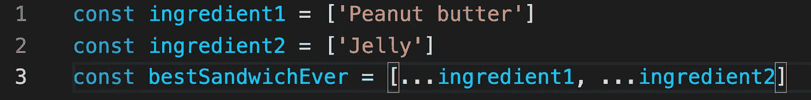

# ES6 扩展语法的秘密

> 原文：<https://javascript.plainenglish.io/the-secret-to-es6-spread-syntax-4066140678e0?source=collection_archive---------14----------------------->

## 用 ES6 的 spread 操作符编写更优雅的 JavaScript 应用程序。



在编写简洁优雅的 JavaScript 应用程序时，spread 语法变得越来越流行。通过使我们能够将一个对象的主体*扩展*到另一个，我们可以更无缝地编写纯粹的、不可变的函数。和往常一样，例子是最好的学习方法，所以让我们来看一个例子。假设我们正在编写一些包含基于 TypeScript 接口的 preferences 对象的社交媒体应用程序:

```
interface Preferences { 
  theme: "dark" | "light";
  language: string; 
  shareLocation: boolean; 
}
```

我们有以下默认偏好:

```
const defaultPreferences = {
  theme: "light",
  language: "English",
  shareLocation: false
}
```

现在考虑从 API 中提取登录的用户数据后，它缺少了一些首选项。假设我们从 API 收到了以下对象:

```
const apiResult = { language: "English" }
```

这可能是因为任何原因，比如它没有在帐户创建期间发布，它没有在后端初始化，或者它可能是一个新功能。在任何情况下，我们都希望避免错误，并从此使用我们的 *defaultPreferences* 对象来填充丢失的值。我们如何做到这一点？毕竟，在某些时候，我们需要知道这个用户是否想要分享他们的位置！让我们探索几种方法。

## 使用三元运算符

我们可以使用三元运算符来检查属性是否未定义，如下所示:

```
const userPreferences = {
  theme: apiResult.theme === undefined ? apiResult.theme : defaultPreferences.theme,
  language: apiResult.language === undefined ? apiResult.language : defaultPreferences.language,
  shareLocation: apiResult.shareLocation === undefined ? apiResult.shareLocation : defaultPreferences.shareLocation
}
```

那会有用…如果你讨厌你的同事！在我看来，虽然这种解决方案确实有效，但它很难阅读，而且具有重复性。让我们探索另一种选择。

## 使用[lodash](https://lodash.com/docs/4.17.15#get)“get”

Lodash 是一个非常棒的函数式 JavaScript 库，我强烈推荐它。我经常使用那里的方法，比如 curry、isNil、get、h as 等等。Lodash 的 *get* 函数接受 3 个参数:一个对象、一个属性的字符串路径和一个可选的替代值，如果路径返回 undefined，则提供该值。让我们看看如何在这个场景中实现 *get* 。

```
const userPreferences = {
  theme: get(apiResult, "theme", defaultPreferences.theme), 
  language: get(apiResult, "language", defaultPreferences.language),
  shareLocation: get(apiResult, "shareLocation", defaultPreferences.shareLocation)
}
```

虽然这种方法比第一种要干净一点，而且确实能防止错误，但这不是我最喜欢的。那是因为我们基本上写了三遍同样的东西，只有很小的变化。了解我这个开发者的人都知道我遵循的是干原则。如果您打算编写可读的代码，我建议您也这样做。

## 使用扩展语法

根据 [MDN 文档](https://developer.mozilla.org/en-US/docs/Web/JavaScript/Reference/Operators/Spread_syntax)，

> **Spread 语法** ( `...`)允许在需要零个或多个参数(用于函数调用)或元素(用于数组文字)的地方扩展可迭代对象，例如数组表达式或字符串，或者在需要零个或多个键值对(用于对象文字)的地方扩展对象表达式。

换句话说，你可以在另一个对象中展开这个对象，然后继续定义你正在定义的东西。在实现它作为我们最终的首选项解决方案之前，让我们看一些例子。

我们可以添加、组合和创建新对象:

```
//Given arrays
const abc = ['a', 'b', 'c']
const def = ['d', 'e', 'f']
//we can create
const abcdef = [...abc, ...def] 
/* returns ['a', 'b', 'c', 'd', 'e', 'f'] *///Given objects
const name = { first: 'josh', last: 'tal' }
const skillLevels = { javascript: 10, sports: 1, skateboarding: 5 }
//we can combine and contrive
const bio = { ...name, ...skillLevels } 
/* returns { first: 'josh', last: 'tal', javascript: 10, sports: 1, skateboarding: 5 } */
```

我们还可以覆盖属性:

```
//Given objects
const lowerPriority = { moneyInBank: 5, collegeMajor: 'economics', favoriteFood: 'pizza' }
const higherPriority = { moneyInBank: 20, favoriteFood: 'hummus', favoriteAnime: 'one piece' } 
const interests = ['keyboard', 'design', 'languages']//we can combine and overwrite to create
const result = { ...lowerPriority, ...higherPriority, otherInterests: ['art', 'culture', 'scary pockets', ...interests] } /* result returns...
{ 
  moneyInBank: 20, 
  collegeMajor: 'economics', 
  favoriteFood: 'hummus', 
  favoriteAnime: 'one piece', 
  otherInterests: ['art', 'culture', 'scary pockets', 'keyboard', 'design', 'languages'] 
} 
*/
```

注意*下级*的*美食*和*钱柜*被覆盖。这是因为在列表中，优先级较高的*优先于它，因为它被写在第二位。另外，请注意由于使用了 spread 语法，如何将*兴趣*附加到*其他兴趣*上。您可以使用 spread 操作符执行许多像这样的酷操作。*

现在让我们看看如何用它来解决我们的问题:

```
const userPreferences = {
  ...defaultPreferences,
  ...apiResult
}
```

就是这样！我们甚至不用再写属性名了。事实上，我的策略是尽量避免多次编写属性名，除非绝对必要。这就是 ES6 的强大之处。

*更多内容看* [***说白了. io***](http://plainenglish.io/)