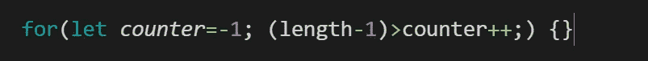
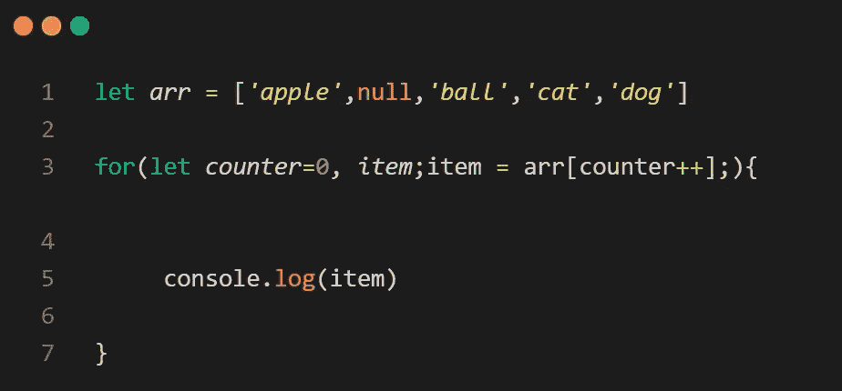
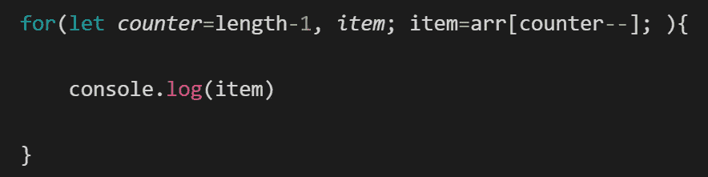

# 你不知道的使用 For 循环的秘密方法

> 原文：<https://javascript.plainenglish.io/the-secrets-surrounding-for-loops-in-javascript-3db58541caa9?source=collection_archive---------4----------------------->

## 揭开对大多数开发者隐藏的秘密

Photo by [Dan Meyers](https://unsplash.com/@dmey503?utm_source=medium&utm_medium=referral) on [Unsplash](https://unsplash.com?utm_source=medium&utm_medium=referral)

您偶尔会希望一组语句被多次执行。我们使用循环来完成这项任务。在大多数编程语言中，大部分代码执行时间都花在循环中。

对一系列值进行循环是编程中最常用的模式之一，因此也是必须集中精力提高性能的领域之一。

理解 JavaScript 中循环的性能影响尤其重要，因为无限或长时间运行的循环会严重影响整体用户体验。

# 你认识的那种——你不认识的那种。

JavaScript 提供了[四种](https://developer.mozilla.org/en-US/docs/Web/JavaScript/Guide/Loops_and_iteration)循环类型。在本文中，我们将重点介绍`**for**`循环。但是无论我们在这里学到什么，也可以应用于其他类型的循环。

`**for**` 循环非常适合您希望执行一组语句特定次数的情况。数组的本质要求我们能够遍历或迭代数组的值。

***for*** 语句简化了遵循通用模式的循环。大多数循环都有某种`counter` ***变量*** 。该变量在循环开始前被 ***初始化*** ，并在循环的每次迭代前被测试。

最后，变量`counter`在循环体 结束时 ***递增或更新，就在变量再次被测试之前。在这种循环中，**初始化**、**测试**和**更新**是循环变量的三个关键操作。***

`**for**`语句将这三种操作编码为一个表达式，并使这些表达式成为循环语法的显式部分:

for loop syntax in JavaScript

括号内定义的代码至关重要，它们控制着`***for***`循环的开始和结束。总之，我们将三个语句放在括号中，并用两个分号分隔它们。

*   **第一个语句称为初始表达式。** 我们用它来初始化一个或多个循环计数器。该语句在`**for**`循环开始时执行，并且只执行一次！
*   **第二条语句控制** `***for***` **循环何时停止。** 它会在每次循环之前执行。当第二条语句返回一个 falsie 值时,`***for***`循环将停止。第二条语句必须正确设置，否则可能会出现无限循环。
*   **最后一条语句是我们用来更新每个循环的语句。** 在每次循环结束时执行。

Codes defined inside the curly brackets will be repeatedly executed.

这就是我们对大多数地方的`**for**`循环的了解。虽然在大多数地方，他们从来没有超越这一点，但在本文中，我们将探索`**for**`循环中不为人知的一面。这不仅会让你对`**for**` 循环有更深的理解，还会让你成为更好的开发者。

# 有时候我们需要的只是一个全新的开始。

第一条语句可以在`for`循环之外定义。

initialization defined outside the for loop

The output of the above code

最后一句话也可以移到花括号里

post-loop-expression or increment gets defined into the curly brackets

The output of the above code

使 for 循环能够正常工作。只需确保第二条语句设置正确，并且两个分号*被封顶。嗯，没有那么强烈的对比！是吗？但是如果我说我们可以合并第二个****第三个*** 语句呢。🙀那么，我们该怎么做呢？**

*首先我们声明一个`counter`并将它的初始值设置为负 1。*

**

*Pay attention here it is negative 1, not 0*

*在第二个语句中，我们将最后一个元素索引与`**counter++**` 进行比较，我们可以通过从数组长度中减去 1 来获得最后一个元素索引。不需要设置后循环表达式或增量。*

**

*Pay attention to the conditional test here.*

*你可能想知道这个程序到底是如何工作的？*

**

*The second statement can be tested to either true or false*

*这里，第二条语句将在每个循环之前被测试和执行。所以每当一个新的循环开始时,`**counter**`变量的值就会增加 1。这就是为什么我们把`counters`的初始值设为负 1。
在第一次循环中，花括号中的`**counter**`值将变为 1。
最终，`counter`值将大于最后一个元素的索引。比较将返回 false 并关闭 for 循环。*

**

*让我们用 body 语句来测试一下*

****

*We can see the result is the same as before.*

*还有一种方法可以合并第二个和第三个语句。*

**

*First, we declare a counter and set its value to zero.*

**

*Then we declare another variable and name it item.*

*我们将使用`**item**`变量在第二条语句中存储一个数组元素。*

**

*We set the value for the item variable.*

*我们使用`**counter++**`作为索引来检索元素。*

**

*There is no need to set the third statement.*

*那么，这个程序是如何工作的呢？*

> *第二条语句在每次循环之前执行。*

*代码将首先使用`**counter**`作为索引检索一个数组元素，并将检索到的元素赋给变量`**item**`，然后`**counter**`的值将增加 1。*

*注意这里`**counter**` 的值不会改变，直到数组元素被检索和赋值。这是因为增量运算符位于`**counter**`之后，而不是之前。这意味着首先使用变量的原始值，然后给它加 1。所以当前行的`**counter’s**`值不会改变。这也是为什么我们将`**counter’s**`初始值设置为**零**而不是**负一，**在第一个循环中`**counter's**`值仍然为零。*

*它不会变成 **1** 直到第二个循环`**counter**`值将增加 1，每个循环最终它的值将大于最后一个元素的索引。如果我们使用数组中不存在的索引来检索一个元素，我们将得到`undefined`， **undefined** 是一个假值，因此，`**for**`语句将在花括号内停止。*

**

*Visualisation of the above code*

*我们可以直接输出 item 变量，我们可以看到每个元素都被输出了。*

**

*但是这个程序有一个问题。所有元素值必须真实。如果有一个`**false**`值，`for`循环将根据您的程序设计立即结束。*

**

*We added null as a second element in the array*

**

*The loop ends immediately after it found a null value in the array.*

*这个功能可以给你带来麻烦，也可以给你带来麻烦。*

*你累了吗？我们也要回去吗？我保证你会学到一些关于在代码中使用循环的深刻的东西，这是你在其他任何地方都不会发现的！请耐心等待，我们正在揭开循环的秘密。*

*首先，我们创建一个变量，命名为`counter`，并将其值设置为数组长度。*

**

*There is no need to subtract one from the array length.*

*然后我们创建一个 for 循环。第一个语句已经设置好了，但是您仍然需要保留分号。*

*知道如何设置第二个语句吗？*

**

*what should we replace ?? with?*

*我们将`counter`连接到`decrement operator`，并将其与零进行比较。*

**

*We require the counter to be bigger than zero*

*在花括号内，我们使用 counter 作为索引值来检索数组元素*

**

*让我们把所有的碎片拼在一起。*

****

*We can see all elements have been retrieved*

*在上面的代码中，每当一个新的循环开始时，数组就被向后迭代。*

*`counter`值将与零进行比较，然后每循环一次减 1。`counter` 的值将下降 1。最终结果是`counter`值将下降到零。比较表达式将返回一个关闭`**for**`循环的 falsie 值。*

**

*又想知道上面的代码究竟是如何工作的？*

*在上面的程序中，关键是减量运算符！
它被放在变量`counter`后面，如果圆括号中的`counter`值为 1，那么在花括号中，它的值将减少 1，变成 0。这就是为什么我们把`counters`的初始值设为数组长度，而不是数组长度减 1。*

*让我们试试第二种方法。*

*首先，我们声明两个变量。第一个名为`**counter**`，我们将其值设为数组长度-1*

**

*We name the second variable item.*

**

*we retrieve the array element using `**counter**- -` and assign it to item*

**

*in the curly brackets, we output variable item*

**

*we can see the program works*

*数组中输出的每个元素都被向后迭代。
`counter`的初始值是最后一个元素的索引。第二条语句将使用当前的`counter`检索元素，并将元素值赋给变量`**item**`，然后`**counter**`的值将减 1。*

*关键部分还是放在`counter`后面的减量运算符。在下一个循环中，`counter`的值将减少 1。最终，`counter`值会变成`**negative 1**`，这是一个非法的索引值。使用非法的索引值会给我们一个未定义的值，这是一个假值，结果，`for`循环会停止。*

**

*For better Visualisation*

*这两个程序的关键是，如果你在一个**变量**后面加上递增或递减运算符，变量值直到下一行才会改变。在当前行中，变量值保持不变。*

*唷！那是相当长的时间，不是吗？*

*如果你已经仔细阅读了所有的例子，那么到现在为止，你的大脑一定已经成长了一点，你一定会以不同的方式看待这些循环。*

*如果你还在这里，我有东西给你！*

# *环路性能🔥*

*使用哪个循环一直是争论的焦点。在 JavaScript 提供的四种循环类型中，只有一种明显比其他循环慢:即`**for-in**`循环。*

*由于循环中的每次迭代都会导致在实例或原型上进行属性查找，因此`for-in`循环每次迭代的开销要大得多，因此比其他循环要慢。*

*除了`**for-in**`循环之外，所有其他类型的循环都具有相同的性能特征，因此试图确定哪种循环最快是没有用的。*

*循环类型的选择应该基于您的需求，而不是性能考虑。如果循环类型对循环性能没有影响，那么什么有影响呢？*

## *只有两个因素:*

*   ***每次迭代完成的工作***
*   ***迭代次数***

*通过减少其中一个或两个，您可以积极地影响循环的整体性能。*

## *减少每次迭代的工作量*

*显而易见，如果一次循环需要很长时间来执行，那么多次循环将需要更长时间。*

*限制循环体中执行的高开销操作的数量是加速整个循环的好方法。*

**

*上面的例子在每次循环中对`arr.length`进行属性查找。这样做是浪费的，因为这个值在循环执行期间不会改变，因此是不必要的性能损失。*

*通过执行一次属性查找，将值存储在局部变量中，然后在控制条件中使用该变量，可以很容易地提高循环性能:*

**

*您还可以通过颠倒循环顺序来提高循环的性能。通常，数组项的处理顺序与任务无关，因此从最后一个项开始，向第一个项进行处理是一种可接受的替代方法。*

*反转循环顺序是编程语言中一种常见的性能优化，但通常并没有得到很好的理解。*

*当我们在最初的例子中改变编写`for`循环的通常方式时，两者都被牢记在心。所以，如果你关注了这些例子，那么恭喜你！现在，您可以编写性能循环了。*

## ***减少迭代次数***

*当迭代数千次时，即使是循环体中最快的代码也会累加起来。此外，执行循环体会产生少量的性能开销，这只会增加总的执行时间。*

*可以通过减少循环中的迭代次数来提高性能。限制循环迭代最广为人知的方法是一种叫做 [Duff's Device 的模式。](https://en.wikipedia.org/wiki/Duff%27s_device)*

*由程序员汤姆·达夫于 1983 年在卢卡斯影业有限公司工作时发明。Duff 的设备是一种展开循环体的技术，以便每次迭代完成多次迭代的工作。*

*我们应该感谢 Jeff Greenberg，因为他是第一个在 2001 年用 JavaScript 发布 Duff 的设备代码的人(*最初的实现是用 C 语言*)。*

*JavaScript 实现如下所示:*

**

*Here doSomething() is an operation that you want to execute more than once*

*Duff 的设备实现背后的基本思想是每次循环最多允许八次调用`doSomething()`。*

*通过将项目总数除以 8 来确定循环的迭代次数。*

*由于算法和流量控制的原因，并非所有的数字都能被 8 整除，`startAt`变量保存余数，并指示在第一次循环中对`doSomething()`的调用次数。*

*如果有 12 项，那么第一次循环调用 process() 4 次，然后第二次调用`process()` 8 次，总共两次循环，而不是 12 次。*

*是否值得使用 Duff 的设备，很大程度上取决于你已经在做的迭代次数。在循环迭代少于 1，000 次的情况下，与使用常规循环结构相比，您可能只会看到微不足道的性能提升。*

*然而，随着迭代次数增加到 1000 次以上，达夫设备的功效显著增加。例如，在 500，000 次迭代时，执行时间比常规循环少 70%。*

# *我们所学内容的总结*

*   *JavaScript 提供了四种循环类型。*
*   *第一条语句(initialize)可以在 for 循环之外定义。*
*   *最后一个语句(增量)也可以移到花括号中*
*   *我们可以合并第 ***第二*** 和第 ***第三*** 语句*
*   *如果测试中有一个`**false**`值，即`for`循环，它将立即结束。*
*   *`for-in` 由于属性查找，循环是最慢的。*
*   ***每次迭代完成的工作**和**迭代次数**决定了任何循环的性能。*
*   *[达夫的设备](https://en.wikipedia.org/wiki/Duff%27s_device)历史及其在 JavaScript 中的实际实现。*
*   *在较大的迭代中使用 Duff 的设备，执行时间比常规循环少 70%*

## *我们还没完呢！*

*如果你想巩固你在这里学到的东西，那么打开 [repl.it](https://repl.it/) ，试试文章中显示的代码。[测量性能](https://developer.mozilla.org/en-US/docs/Web/API/Performance/now)，并在评论中告诉我你认为哪个性能最好。*

# *感谢信*

*我想利用这最后的机会说声谢谢。*

*感谢您的光临！如果没有像你这样的人跟随并带着那种信念阅读我的帖子，我将无法做我所做的事情。*

*我希望你能 [**加入我的**](https://polymathsomnath.medium.com/subscribe) **[**我的未来博客**](https://polymathsomnath.medium.com/subscribe) 中的** 并留下来，因为我认为我们这里有一些很棒的东西。我希望在未来的许多年里，我能在你的职业生涯中帮助你！*

*下次见。再见！*