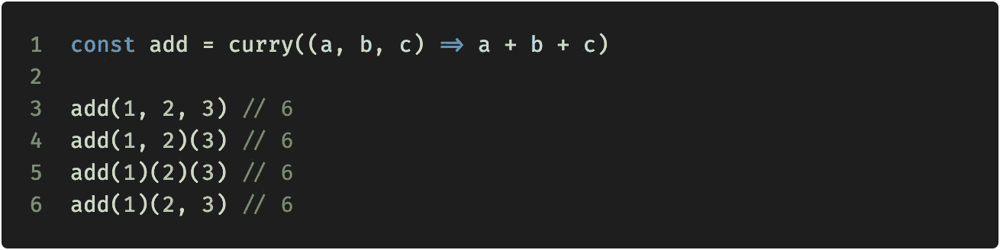

# JavaScript 中 Currying 的最简单介绍

> 原文：<https://javascript.plainenglish.io/the-simplest-intro-to-currying-in-javascript-c36b892f2597?source=collection_archive---------2----------------------->

也许是最古老而强大的函数式编程技术——**curry**，它基本上是一种记忆一些函数参数并推迟调用直到获得所有参数的方法。

An example of currying an add function that takes 3 arguments and can be called in several ways.

# 入门指南

## 理论部分

因此，当您使用 **N** 参数来调用某个函数时，如果您使用 **M** 参数来调用它，其中 **M < N** ，它会返回一个新的被调用的函数，该函数会记住已经传递的 **M** 参数，并期待剩余的所需参数(**N—M)**。

> **注意:**函数的 Currying 可以不止重复一次，可以根据需要重复多次，直到得到所有的参数。

## 实用部分

因此，让我们来看一个实际的实现:

需要注意一些事情:

*   `**fn.length**` —我们只是在使用 [Function.length](https://developer.mozilla.org/en-US/docs/Web/JavaScript/Reference/Global_Objects/Function/length) JS 特性，它表示函数期望的一些参数。

> **注:**一直计数到第一个参数有默认值或者[剩余参数](https://developer.mozilla.org/en-US/docs/Web/JavaScript/Reference/Functions/rest_parameters)为止。

*   `**curriedFn.bind(null, ...args)**` —这里我们返回另一个`curriedFn`，但现在我们实际上是在使用[function . prototype . bind()](https://developer.mozilla.org/en-US/docs/Web/JavaScript/Reference/Global_objects/Function/bind)保存已经传递的参数。因此，下次用新参数调用`curriedFn`时，旧参数将被加到新参数前面。

# 摘要

Currying 是一种非常方便的技术，它允许我们通过传递较少的参数来创建有用的函数。希望现在你知道 currying 是如何工作的，或者至少对它有了更好的理解。

更进一步说，currying 最初来自函数式编程世界，这就是为什么当你使用它时，你会无意中写出一种声明性的表达式，而不是命令性的指令。Currying 最好与其他 FP 相关的范例一起工作，比如**函数组合**。

更多文章将继续 FP 主题…

如果你觉得这篇文章有趣，欢迎随时关注我的[媒体](https://erzhtor.medium.com/)和[推特](https://twitter.com/erzhtor)。