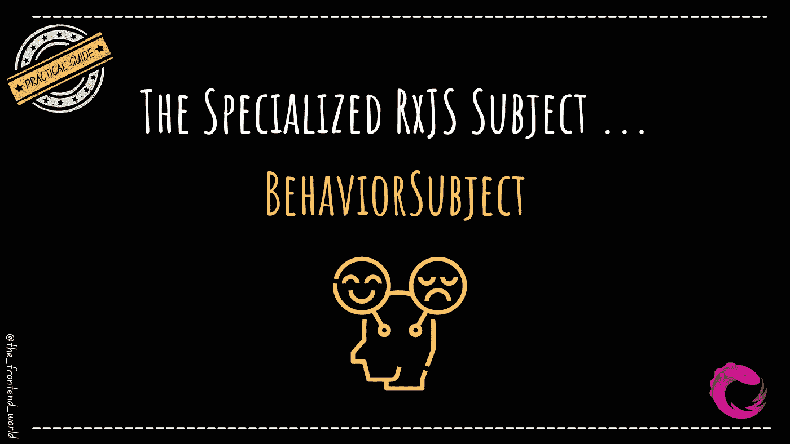

# 专业 RxJS 学科:行为学科

> 原文：<https://javascript.plainenglish.io/the-specialized-rxjs-subject-behaviorsubject-f2d296f2cf01?source=collection_archive---------13----------------------->

## RxJS 中关于行为主体的大图

By FAM

当您有专门的应用程序需求时，提前知道这些专门主题的存在以一种干净的方式解决问题并且不需要实现堆积如山的代码是非常值得的。

知道如何在你的用例中直接使用这些基础部分真的很有帮助。主题给了你很多关于可观测量如何执行和传递价值的控制。

在本文中，我将向您展示其中一个专业主题的大致情况:

*   `BehaviorSubject`

让我们开始吧！

如果你不知道我在说什么，我建议你先从这个开始:

 [## RxJS 像没见过一样！

### 关于 RxJS 你可能想了解或知道的一切！

levelup.gitconnected.com](https://levelup.gitconnected.com/rxjs-like-youve-never-seen-it-b99467557a54) 

我假设你有必要的知识跳到 RxJS 的以下高级部分。

# 主题(如果你熟悉，跳过这一部分)

为了学习专业课`publishBehavior`，我们首先需要了解一下`Subject`。

**快速刷新关于** `**Subjects**` **，下面是一个科目的特点:**

*   只不过是一个可观察的(耳语:这个家伙也有一个 subscribe()方法)
*   也是一个观察者。
*   可以产生和接受价值，因为他同时是一个可观察的人和观察者。
*   他可以有一个观察者的列表(不像可观察的物体)
*   他有一种状态(就像 React 应用程序一样)。他可以维护已经订阅他的观察者的列表。
*   可以同时将价值推送给多个观察者(与可观察不同，一次只能推送给一个观察者。如果另一个观察者订阅了相同的可观察值，它将被第二次执行。
*   因此，他是一个多播(不像可观察的)

`Subject`几乎用于所有通常和最常见的用例中。但有时，您需要一些独特的功能行为。这就是为什么一些特殊的主题存在，其中之一就是`publishBehavior`。

如果您想了解更多关于主题的信息:

 [## 实用 RxJS 指南终身学习 RxJS！

### 第 3 部分:深入理解 RxJS 模式(高级)

javascript.plainenglish.io](/practical-rxjs-guide-to-learn-rxjs-for-life-88f2ee508d5c) 

# `BehaviorSubject`

> `BehaviorSubject`是`Subject`的一个变体，它需要一个初始值，并在被订阅时发出它的当前值。

*   接收值，如果源尚未产生值，将立即向观察者发送该值。
*   如果在源开始产生值之后添加了观察器，它将向新的观察器发出最新的值，而不是种子值。
*   利用这种行为的操作符是`publishBehavior`
*   第一个订阅的用户会立即收到种子值，因为源可观察对象尚未产生值。
*   一旦源完成，就没有后期订阅者的值。

# 现在，让我们编码

## 示例:

## publishBehavior()运算符的示例:

## 说明

对于这个专门化的主题，源可观察对象立即发出种子值，这个种子值在源可观察对象产生值之前马上被发送。在这个例子中，我使用了数字**6。**

如您所见，第一个订阅的观察者立即收到了种子值，因为在那个时候，源可观察对象还没有产生值。

之后，源值开始出现。并且每个已经订阅的观察者立即接收最近发送的值。这就是为什么观察者 3 没有收到值 0，因为他后来订阅了。观察者 4 也是一样，他没有收到任何值，因为当他订阅时，可观察对象已经发送了所有产生的值并启动了 *complete()* 。

一旦源完成，就没有后期订阅者的值。

了解专门化`Subjects`的存在是必要的。首先，因为当你在应用程序中遇到特殊需求时，你会有一个使用什么的想法。第二，特定需求的实现将会更加容易和干净！

最后一个专门的主题将出现在下一篇文章中:

*   `ReplaySubject`

像往常一样，请告诉我您是否喜欢这篇文章，以及您是否希望我在以后的文章中给您更多关于`BehaviorSubject`和用例的例子😉

下次见！

我希望这篇文章对你有帮助！

 [## 如果你喜欢看我的文章… ♥️

### 如果你喜欢读我的文章… ♥️，当我的文章发表时，欢迎你第一个得到通知…

famzil.medium.com](https://famzil.medium.com/subscribe) 

> 谢谢你，❤

如果你有兴趣成为付费会员，你可以使用我的推荐链接。下次见！^^

亲爱的读者，感谢你在我生命中的存在。

**让我们在** [**上取得联系**](https://medium.com/@famzil/)**[**Linkedin**](https://www.linkedin.com/in/fatima-amzil-9031ba95/)**[**脸书**](https://www.facebook.com/The-Front-End-World)**[**insta gram**](https://www.instagram.com/the_frontend_world/)**[**YouTube**](https://www.youtube.com/channel/UCaxr-f9r6P1u7Y7SKFHi12g)**或**********

******参见我的关于网络要素和一般文化的电子书。******

*******更多内容请看*[***plain English . io***](http://plainenglish.io/)******