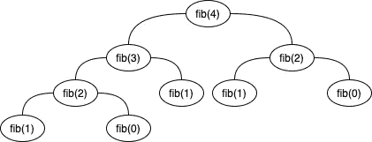
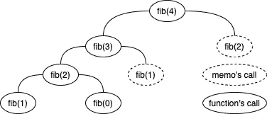

# 优化您的算法尾部调用优化

> 原文：<https://javascript.plainenglish.io/the-tail-call-optimization-how-to-optimize-your-algorithms-ce45dce80035?source=collection_archive---------10----------------------->

## 如何优化调用栈？


Library representing the call stack

在编写代码和算法时，您应该考虑尾部调用优化(TCO)。

## 什么是尾调用优化？

尾部调用优化是优化递归函数的事实，以避免建立一个高的**调用栈**。你也应该知道一些编程语言正在进行尾部调用优化。

比如 Python 和 Java 决定不使用 TCO。而 JavaScript 从 ES2015-ES6 开始允许使用 TCO。

即使你知道你最喜欢的语言是否支持本地 TCO，我还是建议你假设你的编译器/解释器不会为你做这些工作。

## 如何做一个尾调用优化？

有两个著名的方法来进行尾部调用优化和避免高调用栈。

## 1.自下而上

如你所知，递归正在构建调用栈，所以如果我们在算法中避免这样的递归，将允许我们节省**内存使用**。这种策略被称为**自底向上**(我们从头开始，而递归算法是在建立堆栈后从末尾开始，逆向工作。)

让我们以下面的代码为例(自顶向下—递归代码):

```
function product1ToN(n) {
  return (n > 1) ? (n * product1ToN(n-1)) : 1;
}
```

正如你所看到的，这段代码有一个问题:它建立了一个大小为 O(n)的**调用栈**，这使得我们的总内存开销为 O(n)。这段代码使我们容易受到**堆栈溢出错误**的影响，调用堆栈变得太大，耗尽了空间。

为了优化我们的例子，我们需要自下而上，消除递归:

```
function product1ToN(n) {
  let result = 1;
  for (let num = 1; num <= n; num++) {
    result *= num;
  }
  return result;
}
```

这次我们没有在**调用栈**中堆积我们的调用，我们使用了 O(1)空间复杂度(O(n)时间复杂度)。

## 2.记忆化

**记忆**通过记录函数的结果(通常在一个对象中),确保函数在不需要的时候不会运行超过一次。

让我们从一个经典的例子开始，斐波那契数列:

```
function fib(n) {
  if (n < 0) {
    throw new Error('You cannot start with a negative number!');
  }
  // Obvious cases
  if (n === 0 || n === 1) {
    return n;
  }
  return fib(n - 1) + fib(n - 2);
}
```

如果我们将**调用栈**表示为一个图形，我们将得到下图:



Fibonacci recursive

在本例中，我们将 4 作为参数传递给 Fibbonaci 序列，正如您所看到的，我们计算了两次 fib(0)和 fib(2)以及三次 fib(1)。如你所料，这是对计算资源的浪费。

为了避免这种计算资源的浪费，我们可以使用**记忆化**。

```
class Fibber {
  constructor() {
    this.memo = {};
  }

  fib(n) {
    if (n < 0) {
      throw new Error('You cannot start with a negative number!');
    }
    // Obvious cases
    if (n === 0 || n === 1) {
      return n;
    }
    // Check if we have already calculated this
    if (this.memo.hasOwnProperty(n)) {
      return this.memo[n];
    }
    const result = this.fib(n - 1) + this.fib(n - 2);
    // Memoize for the next possible calculation
    this.memo[n] = result;
    return result;
  }
}
```

如果函数已经被处理过，这次我们就不计算它了。

下面是我们的调用堆栈图:



Fibonacci memoization

正如您在这里看到的，我们只执行了一次函数，这使我们节省了调用堆栈。

*更多内容请看*[***plain English . io***](http://plainenglish.io)