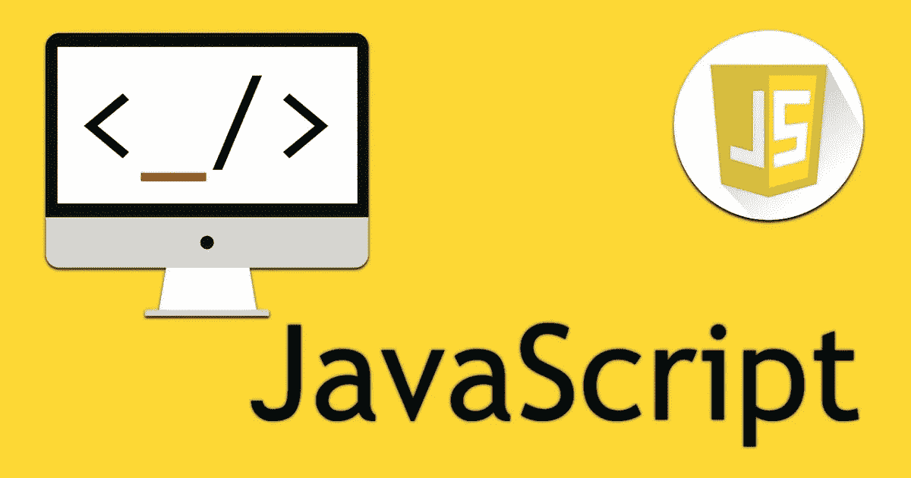

# JavaScript — JS 访谈系列中“this”关键字的详细指南

> 原文：<https://javascript.plainenglish.io/the-this-keyword-in-javascript-for-generic-and-arrow-functions-a-detailed-guide-5be2070184bf?source=collection_archive---------7----------------------->

JS 中的“this”关键字经常是 JS 初学者的困惑来源。那么到底什么是“这个”,你如何回答与这个话题相关的面试问题。如果这些是你心中的问题，那么你就来对地方了。

请记住，这是一个 DIY 指南，请检查 JS fiddle 中的代码，以更好地理解所包含的代码。另外，试着自己解决最后的练习。

开始吧！

## **定义‘这个’**

关键字“this”指出了当前正在执行的函数的上下文，或者换句话说，它指出了该函数所绑定的对象。这听起来可能很奇怪，但是 JS 中的函数和变量是绑定到(或属于)一个对象的。

然而，泛型函数和 arrow 函数的绑定方式是不同的，这也是初学者容易混淆的地方。

## **通用函数中的‘这个’**

在总结通用函数的上下文(“this”值)时，有三个规则(没有明确说明):

1.  在没有任何绑定(隐式或显式)的情况下,“this”关键字指出调用该函数的上下文。
2.  在隐式和显式绑定(见下文)中，函数的“this”关键字属于函数绑定到的对象。
3.  如果没有隐式或显式绑定，函数将失去它们的上下文，并且“this”关键字遵循规则 1。

考虑下面这段代码，猜测输出并在 js fiddle 中验证。

Try this here: [https://jsfiddle.net/](https://jsfiddle.net/)

你可以看到 foo()函数的上下文是窗口(或全局对象)参考规则 1。现在尝试执行下面的代码

Try this here: [https://jsfiddle.net/](https://jsfiddle.net/)

在这里你可以看到函数 foo()绑定到对象' a ',这从 console.log(this)中可以明显看出。这是因为函数 foo()在执行 a.foo()时被*隐式绑定*到对象‘a’。因此，根据规则 2,“this”关键字指向对象“a”。

现在您已经知道了上下文如何为隐式绑定工作，猜猜下面的 JS 代码的输出:

Try this here: [https://jsfiddle.net/](https://jsfiddle.net/)

正如我们看到的,' this '关键字现在指向全局对象。这是因为函数 newFoo()没有隐式或显式地绑定到任何对象——即使 Foo()是有界的——因此函数现在丢失了它的上下文并指向全局对象。

现在是考虑显式绑定的时候了(请在继续之前阅读关于[调用、应用和绑定](https://developer.mozilla.org/en-US/docs/Web/JavaScript/Reference/Global_Objects/Function/call#)的内容)。

Try this here: [https://jsfiddle.net/](https://jsfiddle.net/)

这里的 bind 函数用于将函数 foo()显式绑定到对象“a ”,并返回一个可以调用的有界函数。这里 newFoo()充当有界函数，因此指向对象“a ”,而不是全局对象，即使它是在全局上下文中执行的。

我们将在本文末尾的练习中再次讨论这些通用函数。

## **箭头中的‘this’功能**

箭头函数中“this”的工作方式不同于一般函数。箭头函数选择与封闭函数相同的上下文。因此“this”关键字指向封闭函数的上下文。考虑下面的例子

Try this here: [https://jsfiddle.net/](https://jsfiddle.net/)

箭头函数“a”的封闭函数是 foo()，foo()函数的上下文是全局对象。因此“this”关键字指出了这里的全局对象。现在考虑下面的例子

Try this here: [https://jsfiddle.net/](https://jsfiddle.net/)

函数 doo()的“this”关键字指向对象“a ”,因为封闭函数 foo()隐式绑定到对象“a ”,因此 doo()函数拾取 foo()的上下文。

考虑下面的显式绑定示例，猜测输出应该很简单。

Try this here: [https://jsfiddle.net/](https://jsfiddle.net/)

这里，doo 函数的“this”也指向对象“a ”,因为封闭函数 foo 被显式地绑定到对象“a”。

## **勇敢者的练习**

**练习 1:**

Try this here: [https://jsfiddle.net/](https://jsfiddle.net/)

## 说明

首先，在第 13 行，函数 func()被隐式绑定到 myObject，因此“this”指的是 myObject。在第 4 行，我们将 myObject 保存在变量 self 中。由于隐式绑定，第 5 行和第 6 行的 console.log 语句将如下所示

*   " outer func: this.foo = bar "
*   " outer func: self.foo = bar "

在第 7 行中，我们有一个立即调用的函数表达式(life ),由于这个函数没有绑定到任何对象(隐式或显式的),“this”将指向一个全局对象，因此 this.foo 是未定义的，因为 foo 不是全局对象上的变量。因此，第 8 行和第 9 行的输出如下

*   " inner func: this.foo = undefined "
*   " inner func: self.foo = bar "

这里 self 存储了我之前讨论过的对象，并且由于 JS 中的闭包，它可以被 IIFE 访问(这里有更多关于它的内容)。由此 self.foo 等于“bar”。

**练习 2:**

Try this here: [https://jsfiddle.net/](https://jsfiddle.net/)

由于箭头函数提取封闭函数(此处为 func()的上下文),“this”和“self”都指向 myObject，因此输出如下:

*   " outer func: this.foo = bar "
*   " outer func: self.foo = bar "
*   " inner func: this.foo = bar "
*   " inner func: self.foo = bar "

## 结论

我希望下面的例子和解释是清楚的，并帮助你获得更好的理解。如果你有任何建议或想法，请在评论中告诉我们。

*更多内容请看*[***plain English . io***](http://plainenglish.io)