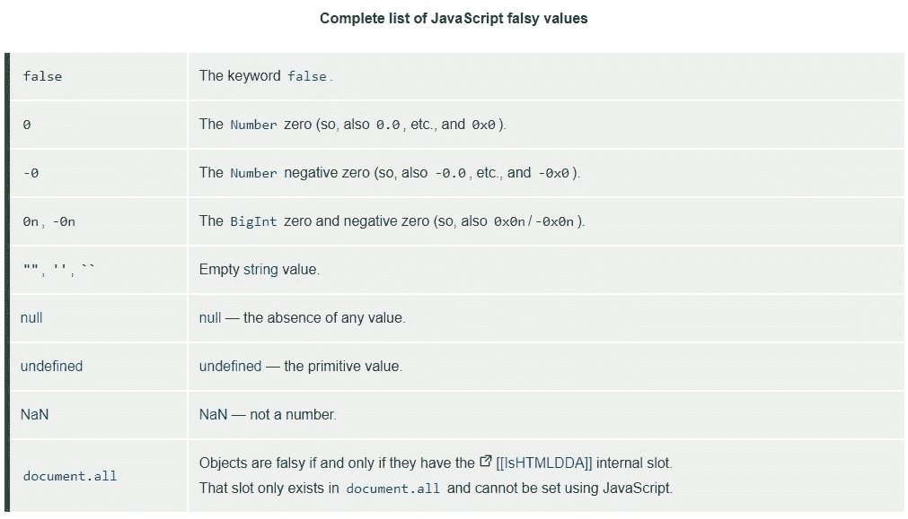

# 编码更快更干净的 6 大 Javascript 操作符

> 原文：<https://javascript.plainenglish.io/the-top-6-javascript-operators-to-code-faster-and-cleaner-3cb13cc8c6f?source=collection_archive---------9----------------------->

## 最新的 JS 操作符被设计成允许快速、干净的编码


Image courtesy [Pexels](https://www.pexels.com/photo/air-craft-during-day-time-40907/)

Javascript 在过去几年里发展很快。旧的冗长操作符和做事的技巧正在被短小精悍的操作符所取代，短小精悍的操作符可以用更少的代码完成同样的事情。

新的语法不仅仅是糖衣，它使你的代码更少出错，更简洁。这些运算符和语法将成为所有人使用的默认设置。

以下是能让你的代码大放异彩的 6 大操作符。

# 1.可选链接(？。)

如果你只有时间去学一样新东西，那就学这一样。这个操作符将为您节省数千行代码和数小时的错误跟踪时间。

你可能在三元运算符中使用过它，但在 2020 年，`?`被赋予了一个新的表演技巧。

可选的链接操作符将检查嵌套属性链中的`null`或`undefined`值。在下面的代码中，`?.`操作符将在返回`someNonexistant`之前检查对象`noProp`是否存在。**如果嵌套对象不存在，它返回** `undefined` **而不是在运行时抛出错误*。****不执行该检查，您会得到熟悉的*运行时错误* : `Uncaught TypeError: Cannot read property 'someNonexistant' of undefined`*

```
*const myObject = {};const someNonexistant = myObject.noProp?.someNonexistant;
console.log(someNonexistant); // undefined// Use with methods
console.log(myObject.noMethod?.()); // undefined*
```

*`?.`操作符节省了时间，因为如果您想要手动执行此检查，您必须使用更多代码，如下所示:*

```
*if (myObject && myObject.noProp) {
  const someNonexistant = myObject.noProp.someNonexistant;
}*
```

*您还可以对数组和表达式使用`?.`操作符。*

```
*let ob1 = {};const elem = ob1.myArray?.[5];
const myProperty = ob1.nestedObject?.[`expressionPrefix${suffix}`];
console.log(elem); // undefined
console.log(myProperty); // undefined*
```

# *2.零化合并运算符(`??)`*

*无效合并运算符`??`是当其左侧(LHS)为`null`或`undefined`时返回其右侧(RHS)的运算符(仅`null`或`undefined`=[无效](https://developer.mozilla.org/en-US/docs/Glossary/Nullish))。如果它的 LHS 不是无效的，它返回 LHS。*

***助记符记住它的作用:“仅当 LHS 值为** `**null**` **或** `**undefined**` **时才分配 RHS 值。”***

```
*const nullNullish = null ?? 'default value';
console.log(nullNullish); // default valuelet undefinedNullish;
const someNullishvalue = undefinedNullish ?? 'default value';
console.log(someNullishvalue); // default valueconst notNullishZero = 0 ?? "hello";
console.log(notNullishZero); // 0const notNullishEmptyString = "" ?? "hello";
console.log(notNullishEmptyString); // ""// COMPARE THE LAST TWO ASSIGNMENTS WHEN USING THE || OPERATOR
const notNullishZero = 0 || "hello";
console.log(notNullishZero); // helloconst notNullishEmptyString = "" || "hello";
console.log(notNullishEmptyString); // hello*
```

*这个操作符非常类似于`||`操作符，有一个主要的优点。`||`操作符的缺陷是，如果 LHS 为**任何**假值，`||`操作符将返回 RHS。然而，`??`操作员仅在 LHS 为`null`或`undefined` **时才返回 RHS。falsy 值列表如下所示。如果您认为除了`null`或`undefined`之外的任何 falsy 值都有效，那么您必须使用`||`。但是，大多数时候你只想检查`null`或`undefined`，这也是`??`比`||`应用更广泛的地方。这将避免许多错误，因为许多开发人员忘记了`||`将捕获**所有的**错误值，例如数字`0`和空字符串`“”`。***

*一旦你学会了这个运算符，你就会经常用到它！*

**

*Falsy values, [MDN Web Docs](https://developer.mozilla.org/en-US/docs/Glossary/Falsy)*

*对您来说最好的代码行之一是使用前面描述的可选链接操作符`?`和`??`操作符，如果在赋值期间没有找到，则给出一个默认值，如下所示:*

```
*let myObject = {
  one: 66667,
  two: "hello"
};// USING NEW SYNTAX - ONE LINE
const someNonexistant = myObject.nested?.three ?? "default value";
console.log(someNonexistant); // "default value"// USING OLD SYNTAX - FIVE LINES
if (myObject && myObject.nested && myObject.nested.three) {
  const someNonexistant = myObject.nested.three;
} else {
  const someNonexistant = "default value";
}*
```

# *3.无效赋值运算符(`??=`)*

*在表达式`a ??= b;`中，只有当`a`为空(`null`或`undefined`)时，`a`才会被赋予`b`的值。换句话说，只有在`null`或`undefined`的情况下，才给`a`赋值，否则，就不管它了。*

***助记符记住它的作用:“仅当当前自身值为** `**null**` **或** `**undefined**` **时，重新分配自身值。”***

```
*let myObject = {
  one: 66667,
  two: 0,
  three: null,
  four: ""
};myObject.one ??= 'reassigned';
console.log(myObject.one); // 66667myObject.two ??= 'reassigned';
console.log(myObject.two); // 0myObject.three ??= 'reassigned';
console.log(myObject.three); // "reassigned"myObject.four ??= 'reassigned';
console.log(myObject.four); // ""*
```

*与前面描述的无效合并运算符`??`的区别在于`??=`在重新分配其**自身值**之前检查其**自身值**是否为无效，而`??`检查**LHS**上的任何变量值是否为无效，并且可以将 RHS 值分配给**任何变量**。*

*显然，变量`a` **必须已经声明为**，否则默认为`undefined`。该运算符的目的是避免不必要地覆盖已经赋值的有效值。*

*您可能会说您可以只使用`a = a ?? b;`，但这和`a ??= b;`不一样。区别在于`a = a ?? b;`总是会将**重新分配给`a`，不管`a`是否有值。另一方面，如果`a`不是`null`或`undefined`，则`a ??= b;`将**中止**分配。***

*该运算符的一个警告是，如果您有一个 API 或一个值，它返回一个您想要重新分配的空字符串，那么最好使用下面描述的 or 赋值运算符`||=`。如果对空字符串使用`??=`，将会**而不是**重新分配空字符串的值，因为空字符串不是 will。*

# *4.OR 赋值运算符(`||=`)*

*在表达式`a ||= b;`中，如果`a`为假，则`a`只被赋予`b`的值。换句话说，只有当`a`当前是虚假的时候，才赋予它一个值，否则，让它去吧。*

***记忆它的作用:“只有当当前的自身价值是虚假的时，才重新分配自身价值。”***

```
*let myObject = {
  one: 66667,
  two: 0,
  three: null,
  four: ""
};myObject.one ||= 'reassigned';
console.log(myObject.one); // 66667myObject.two ||= 'reassigned';
console.log(myObject.two); // "reassigned"myObject.three ||= 'reassigned';
console.log(myObject.three); // "reassigned"myObject.four ||= 'reassigned';
console.log(myObject.four); // "reassigned"*
```

*与`??=`一样，变量`a` **必须已经声明**，否则默认为`undefined`。*

# *5.AND 赋值运算符(`&&=`)*

*在表达式`a &&= b;`中，如果`a`为真(任何不为假的都为真)，则`a`仅被赋予`b`的值。换句话说，只有当`a`当前为真时，才给它赋值，否则，就不要去管它。*

***用于记住其作用的助记符:“仅当当前自身值为真时，才重新分配自身值。”***

```
*let myObject = {
  one: 66667,
  two: 0,
  three: null,
  four: ""
};myObject.one &&= 'reassigned';
console.log(myObject.one); // "reassigned"myObject.two &&= 'reassigned';
console.log(myObject.two); // 0myObject.three &&= 'reassigned';
console.log(myObject.three); // nullmyObject.four &&= 'reassigned';
console.log(myObject.four); // ""*
```

*你会注意到这个操作符有一种让虚假的事情虚假的倾向。*

# *6.析构赋值语法*

*析构允许你通过直接从数组中取出元素或者直接从对象中取出属性来设置局部变量。下面的代码从`myArray`创建了三个新的局部变量`one, two, three`。这比手动操作要快得多。*

***记住它做什么的助记符:“通过直接从数组或对象中取出元素来声明变量。”***

```
*const myArray = [5, 7, 'ten'];
const [one, two, three] = myArray; // square brackets for arrays
console.log(one, two, three); // 5, 7, 'ten'const myObject = {one: 'hello', two: 'there'};
const {one, two} = myObject; // curly brackets for objects
console.log(one, two); // 'hello', 'there'// MANUAL SYNTAX
const one = myArray[0];
const two = myArray[1];
const three = myArray[2];*
```

*析构语法在下面描述的许多场景中非常有用。*

*通过跳过括号中的析构名称，可以跳过数组的一个元素。*

```
*const myArray = [5, 7, 'ten'];
const [one, , three] = myArray;
console.log(one, three); // 5, 'ten'*
```

*您可以使用 rest 语法`…`将`myArray`分成一个局部变量和另一个数组。*

```
*const myArray = [5, 7, 'ten', 25, 46];
const [one, , ...remainderArray] = myArray;
console.log(one, remainderArray); // 5, ['ten', 25, 46]*
```

*在析构括号中为来自源对象的`undefined`元素分配一个默认值。例如 `one = ‘ho’`*

```
*const myArray = [5, undefined, 'ten'];
const [one = 'ho', two = 'default', three = 'hi'] = myArray;
console.log(one, two, three); // 5, 'default', 'ten'const myObject = {one: 'hello', two: undefined};
const {one = 'def1', two = 'def2'} = myObject;
console.log(one, two); // 'hello', 'def2'*
```

*当析构对象时，你可以使用`:`重命名属性，例如`one: newName`。请参见下面的代码:*

```
*const myObject = {one: 'hello', two: undefined};
const {one: newName, two = 'def2'} = myObject;
console.log(newName, two); // 'hello', 'def2'*
```

*使用方括号中的计算运行时名称来访问对象键。*

```
*const runTimekey = 'computedKey';const myObject = {[runTimekey]: 'hello', two: undefined};
const {[runTimekey]: newName, two = 'def2'} = myObject;
console.log(newName, two); // 'hello', 'def2'*
```

*析构作为参数传递给函数的对象，从而避免了用于分配变量的额外代码行:*

```
*const myObject = {one: 'hello', two: 'there'};function myFunc({one = 'default1', two = 'default2'}) {
  console.log(one, two); // 'hello', 'there'
}myFunc(myObject);*
```

*在`for`循环中析构对象数组:*

```
*const myArray = [
  {name: 'Mark'},
  {name: 'Steve'},
  {name: 'Tracy'},
];for (const {name: theName} of myArray) {
  console.log(theName);
 // 'Mark'
 // 'Steve'
 // 'Tracy'
}*
```

*若要了解有关循环的更多信息，请参阅本文:*

*[](/javascript-loops-a-comprehensive-guide-eb7f98b7c455) [## JavaScript 循环:综合指南

### 对象、数组和字符串— for、forEach、for…of、for…in、includes、while、do…while、every、some

javascript.plainenglish.io](/javascript-loops-a-comprehensive-guide-eb7f98b7c455) 

# 包裹

感谢阅读。如果你喜欢这篇文章，可以考虑在这里[订阅](https://craftedwebpages.medium.com/membership)中级会员，以获得数以千计的其他文章。

以后我会贴更多的 Javascript 内容。你可能也会喜欢我的另一篇文章:

[](https://levelup.gitconnected.com/9-early-signs-you-will-be-a-successful-programmer-1a604f04be39) [## 你将成为成功程序员的 9 个早期迹象

### 不要放弃

levelup.gitconnected.com](https://levelup.gitconnected.com/9-early-signs-you-will-be-a-successful-programmer-1a604f04be39) [](https://medium.com/technology-hits/the-best-programming-languages-to-learn-first-a-roadmap-for-the-indecisive-beginner-f242e5ffeac5) [## 首先学习的最佳编程语言——犹豫不决的初学者的路线图

### 最省时、最具成本效益的学习方式以及免费和付费课程

medium.com](https://medium.com/technology-hits/the-best-programming-languages-to-learn-first-a-roadmap-for-the-indecisive-beginner-f242e5ffeac5) 

# 学习资源:

[可选链接(？。)](https://developer.mozilla.org/en-US/docs/Web/JavaScript/Reference/Operators/Optional_chaining)
[无效凝聚算子(？？)](https://developer.mozilla.org/en-US/docs/Web/JavaScript/Reference/Operators/Nullish_coalescing_operator)
[逻辑无效赋值(？？=)](https://developer.mozilla.org/en-US/docs/Web/JavaScript/Reference/Operators/Logical_nullish_assignment)
[逻辑或赋值(||=)](https://developer.mozilla.org/en-US/docs/Web/JavaScript/Reference/Operators/Logical_OR_assignment)
[逻辑与赋值(& & =)](https://developer.mozilla.org/en-US/docs/Web/JavaScript/Reference/Operators/Logical_AND_assignment)
[析构赋值](https://developer.mozilla.org/en-US/docs/Web/JavaScript/Reference/Operators/Destructuring_assignment)
[Falsy](https://developer.mozilla.org/en-US/docs/Glossary/Falsy)
[Truthy](https://developer.mozilla.org/en-US/docs/Glossary/Truthy)*