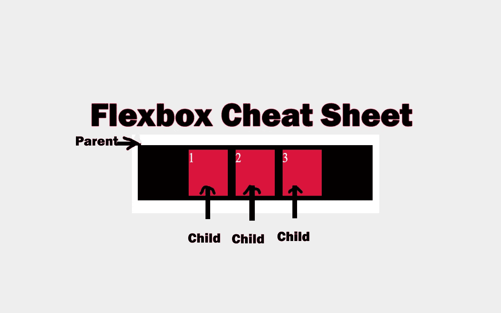
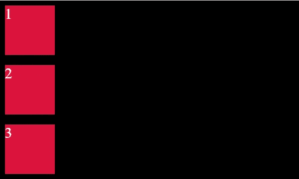
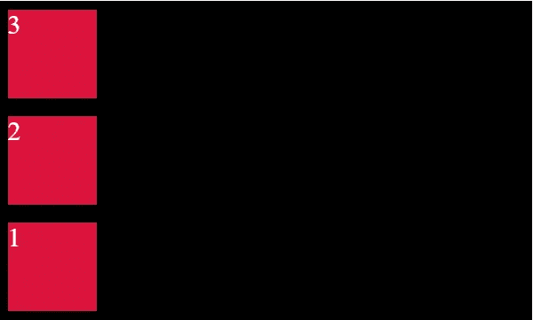
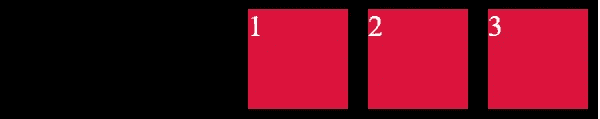
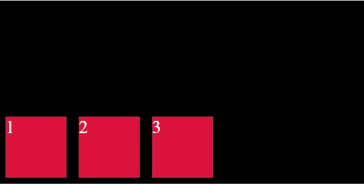
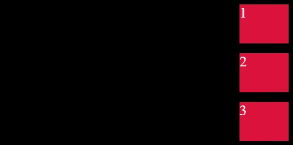
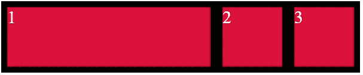
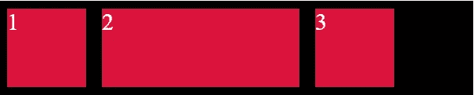

# 终极 CSS Flexbox 备忘单及示例

> 原文：<https://javascript.plainenglish.io/the-ultimate-css-flexbox-cheat-sheet-with-examples-7a62dce086dc?source=collection_archive---------6----------------------->

## 用通俗易懂的例子学习 CSS flexbox。



Image Created with ❤️ ️By author.

Flexbox 是当今每个 web 开发人员必须了解的重要 CSS 概念之一。这是一个允许我们轻松设计和构建响应性网页布局的特性。

Flexbox 有许多属性，我们可以使用它们来对齐元素并提供元素之间的空间。所以我们不用再用表格和 flotas 了，因为 flexbox 更简单。

这就是为什么在这篇文章中，我会给你一个非常有用的小抄，帮助你轻松学习 CSS flexbox。让我们开始吧。

# 父属性

## 1.显示属性

如果你想在 CSS 中使用 flexbox，首先要做的就是将属性`display`设置为`flex`。

我们在包含一个或多个子元素的父元素中使用属性`display`。当我们将属性设置为`flex`或`inline-flex`时，默认情况下所有的子元素都在一个行方向上。

下面的示例是一个包含 3 个子元素的父元素:

```
<div class="**parent**">
  <div class="child">1</div>
  <div class="child">2</div>
  <div class="child">3</div>
</div>
```

所以我们可以在 CSS 中使用 flexbox 来处理这些。让我们将父元素中的属性`display`设置为`flex`，看看会发生什么。

*CSS 代码:*

```
.parent{
  **display: flex;** /* display flex */
  width: 600px;
  height: auto;
  background: black;
}
.child{
  width: 100px;
  height: 100px;
  background: crimson;
  margin: 10px;
  color: white;
  font-size: 1.9rem;
}
```

*输出:*


A parent div that contains three flexible divs.

正如您所看到的，通过将属性`display`设置为`flex`，所有的子元素都变成了灵活的项目。现在我们可以使用其他 flexbox 属性将子元素放在父元素的中心，对齐它们，等等。

## 2.伸缩方向属性

属性`flex-direction`允许我们定义在父元素(列，行…)中以哪个方向堆叠子元素。

属性`flex-direction`可以取以下值:

*   圆柱
*   排
*   行反转
*   列-反向

看看下面的例子:

```
.parent{
  display: flex;
  **flex-direction: row;** /* row direction */
}
```

*输出:*


flex-direction: row

```
.parent{
  display: flex;
  **flex-direction: column;** /* column direction */
}
```



flex-direction: column

```
.parent{
  display: flex;
  **flex-direction: column-reverse;** /* column reverse direction */
}
```



flex-direction: column-reverse

```
.parent{
  display: flex;
  **flex-direction: row-reverse;** /* row reverse direction */
}
```


flex-direction: row-reverse

## 3.flex-wrap 属性

属性`flex-wrap`允许我们定义当我们调整屏幕大小时，是否在父元素中换行。

属性`flex-wrap`可以取以下值:

*   wrap:当您想要包装元素时。
*   不换行:当你不想换行的时候。
*   wrap-reverse:当您想要反转和环绕元素时。

```
.parent{
  display: flex;
  **flex-wrap: wrap;**
}
```

如果您希望所有子元素在父元素的宽度改变时环绕父元素，此属性非常有用。这很重要，尤其是对于响应性。

## 4.对齐内容属性

属性`justify-content`允许我们在主轴上对齐父元素内部的子元素。这意味着当子元素处于行方向时，它会将它们水平对齐。另一方面，当它们处于列方向时，它会将它们垂直对齐。

属性`justify-content`可以取以下值:flex-start、flex-end、center、space-between、space-around 和 space-equally。

看看下面的例子:

```
.parent{
  display: flex;
  **justify-content: flex-start;**
}
```

*输出:*


justify-content: flex-start

```
.parent{
  display: flex;
  **justify-content: center;**
}
```


justify-content: center

```
.parent{
  display: flex;
  **justify-content: flex-end;**
}
```



justify-content: flex-end

## 5.对齐项目属性

属性`align-items`也允许我们在 ***交叉*** 轴中对齐父元素内部的子元素。所以当子元素在行的方向时，它会将它们垂直对齐。另一方面，当它们处于列方向时，它会将它们水平对齐。

该属性可以取以下值:*伸缩起点*、*伸缩终点*、*中心*、*基线、*和*拉伸。*

看看下面的例子:

```
.parent{
  display: flex;
  **align-items: flex-end;**
  width: 600px;
  height: 300px;
  background: black;
}
```

*输出:*



align-items: flex-end

如果我们将父元素中的属性`flex-direction`设置为`column`，那么属性`align-items`将水平对齐子元素。

下面是一个例子:

```
.parent{
  display: flex;
  **flex-direction: column;** /* column direction */ **align-items: flex-end;**
  width: 600px;
  height: 300px;
  background: black;
}
```

*输出:*



align-items: flex-end in a column direction.

# 子属性

## 1.订单属性

属性`order`用在子元素上来改变元素的顺序。

这里有一个例子:

```
HTML:
<div class="parent">
  <div class="**child1**">1</div>
  <div class="**child2**">2</div>
  <div class="**child3**">3</div>
</div>CSS:
.parent{
  display: flex;
  width: 600px;
  height: auto;
  background: black;
}
.parent div{
  width: 100px;
  height: 100px;
  background: crimson;
  margin: 10px;
  color: white;
  font-size: 1.9rem;
}
**.child1{
  order: 1;** /* default is 0 */ **}**
```

*输出:*


order: 1

## 2.弹性增长属性

属性`flex-grow`允许子元素使用剩余空间增长。

这里有一个例子:

```
.parent{
  display: flex;
  width: 600px;
  height: auto;
  background: black;
}
.parent div{
  width: 100px;
  height: 100px;
  background: crimson;
  margin: 10px;
  color: white;
  font-size: 1.9rem;
}
.child1{
  **flex-grow: 1;** /* default is 0 */
}
```

*输出:*



flex-grow: 1

## 3.弹性基础属性

属性`flex-basis`允许我们给出子元素的宽度大小。它接受 px、%、rm 等形式的值。

这里有一个例子:

```
.child2{
  **flex-basis: 250px;**
}
```

*输出:*



flex-basis: 250px

## 4.弯曲收缩

属性`flex-shrink`指定子元素收缩的能力。它接受一个数字作为值(默认值为 1)。

值越高，子元素收缩得越多。

这里有一个例子:

```
.child1{
  flex-shrink: 1;
}
.child2{
  flex-shrink: 2;
}
.child3{
  flex-shrink: 4;
}
```


flex-shrink.

# 结论

正如您在上面看到的，我们涵盖了您将需要在项目中使用的大多数 flexbox 属性。所以你可以把这篇文章当作一个备忘单来帮助你轻松地了解 flexbox。

感谢您阅读文章。希望你觉得有用。

**更多阅读**

[](/10-awesome-front-end-development-tools-to-boost-your-productivity-b1d2efc4c4ba) [## 10 个令人敬畏的前端开发工具来提高您的生产力

### 你可能需要用到的有用的前端开发工具。

javascript.plainenglish.io](/10-awesome-front-end-development-tools-to-boost-your-productivity-b1d2efc4c4ba) [](/the-3-powerful-css-grid-functions-that-you-should-know-26748fbe0694) [## 你应该知道的 3 个强大的 CSS 网格函数

### 3 个强大的 CSS 网格函数，用例子说明。

javascript.plainenglish.io](/the-3-powerful-css-grid-functions-that-you-should-know-26748fbe0694) 

*更多内容尽在*[*plain English . io*](http://plainenglish.io/)