# 使用 React 的 useReducer 挂钩构建 Todo 应用程序的终极指南

> 原文：<https://javascript.plainenglish.io/the-ultimate-guide-to-build-a-todo-app-with-reacts-usereducer-hook-e00976412fed?source=collection_archive---------3----------------------->

## React 构建教程:这是如何工作的！

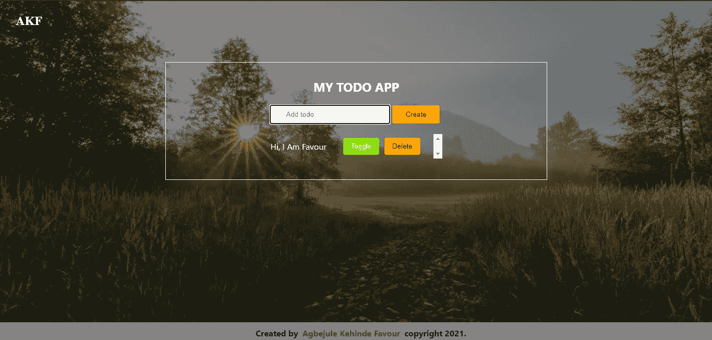

Screenshot by Author

待办事项应用程序是一个软件，允许你创建待办事项，阅读它们，删除它们，有时还可以切换是否完成。在本文中，我们将构建一个拥有上述所有功能的 Todo 应用程序。

在这个 React 构建中，我们将使用:

*   [Node.js](https://nodejs.org/en/download/)
*   [VScode](https://code.visualstudio.com/download)
*   [做出反应](https://reactjs.org/docs/getting-started.html)
*   useReducer 挂钩。
*   VScode 扩展，如更漂亮的，Es6/Es7 反应代码片段
*   [Firebase](https://firebase.google.com/) 用于托管

所以事不宜迟，我们开始吧！

```
**Contents**· [1\. Creating a React App](#9df7)
  ∘ [React App Installation](#047c)
  ∘ [Here is how this works!](#c63b)
  ∘ [React Project Clean-up](#c44c)
· [2\. Setting the Todo App’s Main Layout](#bcd9)
  ∘ [Now the styling!](#1a5e)
· [3\. Creating the todos Component](#288a)
  ∘ [The State](#fd27)
  ∘ [The Reducer and the Actions](#2cdf)
  ∘ [The Mutability](#cb14)
  ∘ [The Payload](#a491)
  ∘ [ Reading the todos](#3f67)
  ∘ [Now the styling!](#594c)
· [4\. Creating the Todo Component](#c663)
  ∘ [Destructed props](#50ad)
  ∘ [The Toggle and Delete Functionalities](#2172)
  ∘ [Now the styling!](#8cc4)
· [5\. Deployment to Firebase](#d9cb)
  ∘ [The Required Steps](#e025) 
  ∘ [Project Setup](#5c09)
  ∘ [Firebase Deployment Steps Begins](#23c7)
  ∘ [The Questionnaire](#2bf4)
· [In Conclusion](#50c3)
```

# 1.创建 React 应用程序

现在，让我们创建一个新文件夹，并将其命名为`todo-app`。右键单击文件夹，然后单击用代码打开。这一步是为了确保在编辑器中打开正确的文件夹。

现在你已经打开了你的编辑器，在 windows 上按`ctrl + j`或者在 Mac 上按`command + j`来打开你的终端。

现在，让我们安装和设置 React 应用程序。

## React 应用程序安装

对我来说，这个过程是迄今为止我用过的最简单的配置/安装过程。它是如此光滑。*谢谢脸书！*

因此,[脸书](https://reactjs.org/community/team.html)React 的开发者和创建者编写了一个脚本，可以毫无压力地为你安装和设置 React 应用。要使用这个脚本，只需在您的终端上运行它。

```
npx create-react-app  .
```

这需要一些时间来设置，让我来解释一下它的作用。

## 这是如何工作的！

**npx** 是节点包管理器 **(npm)** 的一部分，它安装 React 和其他第三方库，如:
*轻量级开发服务器
* [Web pack](https://flaviocopes.com/webpack/) ，用于捆绑我们的文件
* [Babel](https://babeljs.io/) ，用于编译我们的 JavaScript 代码和其他一些工具。

有趣的部分来了！

npx 运行一个远程脚本，确保您的项目中安装了 React 的最新版本，而不是本地安装。顺便说一下，create-react-app 是远程脚本的名称。

"."指定我们希望脚本在我们现在所在的同一文件夹中创建 React 应用程序，而不是创建另一个文件夹来创建 React 应用程序。

如果您必须创建一个新的文件夹名称，您可以只提供文件夹的名称来代替“.”，它将为您创建文件夹，并在其中创建 React 应用程序。

如果你看到“黑客快乐”，你就知道安装过程完成了在你的终端上。放松点。我们没有黑任何东西😂。

在安装过程结束时，您会看到这些文字。

```
We suggest that you begin by typing:cd todo-app
npm start
Happy hacking!
```

现在，我们的 React app 安装好了，该启动了。

在您的终端上，运行`npm start`。

```
npm start
```

一旦命令运行完毕，您的本地主机将在您的默认浏览器上打开。我会建议你使用谷歌浏览器，因为它的开发者工具是一个福音。

你的 React app 将在[**http://localhost:3000**](http://localhost:3000)**上运行。**

```
http://localhost:3000
```

## 反应项目清理

现在，我们需要从 todo-app 目录或文件夹中的 **src** 文件夹中删除这些文件。
* app . test . js
* logo . SVG
* setup tests . js。

我们正在删除这些文件，因为它们对我们没有用。

在您的 **App.js** 文件中，删除以下内容:

```
Import logo from "./logo.svg";
```

然后继续删除类名为 **app** 的 **< div >** 标签中的所有内容，并用包含“我是 todo app”的 h1 标签替换您删除的内容。

在你的 **App.css** 文件中，删除那里的所有内容。保存更改并检查您的浏览器。如果你做的一切都正确，你会在屏幕上看到文本**“我是一个待办事项应用程序】**。

是啊，太好了，我们正在进步！

现在，您将在文本的顶部和左侧看到一些空间。因此，在您的 **index.css** 文件中，将这段代码添加到顶部。

```
*{
  margin:0 ;
  padding:0;
}
```

这将消除页面的空白和填充。

现在，你不希望你的应用程序的标题是 React app 吧？

转到你的**index.html**文件，在 header 标签中，创建一个 title 标签并将“我的待办事项”放入其中。

```
<title>My Todo app</title>
```

# 2.设置待办事项应用程序的主布局

在我们进入 Todo 应用程序的各种元素之前，让我们设置主布局，这样我们就可以在主 CSS 文件中准备好颜色和其他重要的东西。

在您的 App.js 文件中，下面的代码片段将放在那里。

## 现在造型！

在您的 **App.css** 文件中，下面的代码片段将放在那里。

现在，我们将处理 todo 应用程序的组件:
* todos
* todo

# 3.创建 todos 组件

让我们创建一个新组件。我们将使用 [BEM](http://getbem.com/naming/) 约定作为命名约定。所以，我们需要创建一个名为 **Todos.js** 的文件和它自己的名为 **Todos.css** 的 CSS 文件。

因此，在您的 **Todos.js** 文件中，我们使用代码片段`rfce`创建一个新的功能组件，并将组件的 **< div >** 元素设置为类名`todos`。

## 国家

在上面的代码片段中，创建了表单—输入和创建/添加按钮。然后，创建事件处理程序来处理表单的提交和输入值的更改。

输入值的状态变化由通过 useState 钩子创建的状态来管理。

**useReducer**钩子管理 **todos** 的状态。这个钩子包含的参数有:
*它正在管理的状态(todos)
*函数(reducer)
* todos 的初始状态，以及
*调用包含特定条件的 reducer 函数的 Dispatch。

## 减速器和动作

reducer 接受 todos(状态)和 action 作为参数。switch case 方法用于设置每个调用动作的条件，由变量–ACTIONS 指定。

## 可变性

在没有 todos 在每个点的初始状态的情况下，todos 状态的突变是不可取的。因此，在 todos 必须被突变的情况下，todos 的状态通过使用 todos `[…todos]`前面的三点标记的传播方法被复制。

## 有效载荷

函数 **newTodo** 接受由 id、名称和完整元素组成的对象。有效负载充当包含这些元素的对象变量。

## 阅读 todos

map 函数遍历 todos 数组中的每个 todo，其中每个 todo、它的键、id 和分派都作为 props 传递。

## 现在造型！

在您的 **Todos.css** 文件中，这个代码片段放入。

# 4.创建 Todo 组件

让我们创建另一个组件。同样，我们将使用 BEM 约定作为命名约定。所以，我们需要创建一个名为 **Todo.js** 的文件和它自己的名为 **Todo.css** 的 CSS 文件。

因此，在您的 **Todo.js** 文件中，我们使用代码片段`rfce`创建一个新的功能组件，并将该组件的 **< div >** 元素的类名设置为 **todo** 。

## 毁坏的道具

在上面的代码片段中，ACTIONS 变量被导入，todo 和 dispatch 被析构为 props。

## 切换和删除功能

对于每个待办事项，您有两个按钮——切换和删除按钮。每个 todo 都有一个样式(颜色)条件，该条件由 dispatch 调用的 reducer 函数中的条件切换。

此外，当 todo 的 delete 按钮被单击时，正如预期的那样，todo 将根据 dispatch 调用的 reducer 函数中的条件被删除。

## 现在造型！

在您的 **Todo.css** 文件中，这段代码片段放入。

*现在我们已经基本完成了功能*

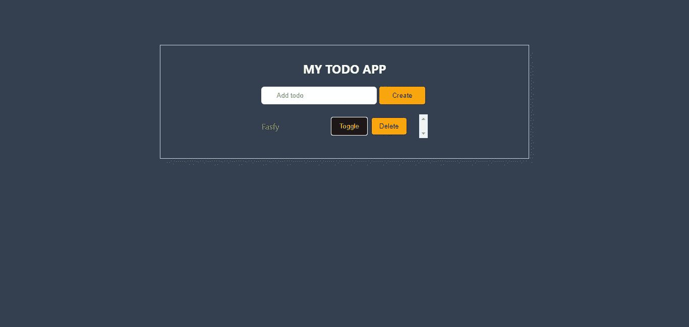

Screenshot by Author

你可以根据自己的喜好改变自己的风格——背景、按钮颜色等等。

# 5.部署到 Firebase

我们将使用 firebase 进行部署。

## 所需的步骤

现在，转到[https://firebase.goggle.com](https://firebase.goggle.com)，然后点击转到控制台。您需要登录您的 Google 帐户。登录后，请按照以下步骤操作:

## 项目设置

点击“添加项目”:

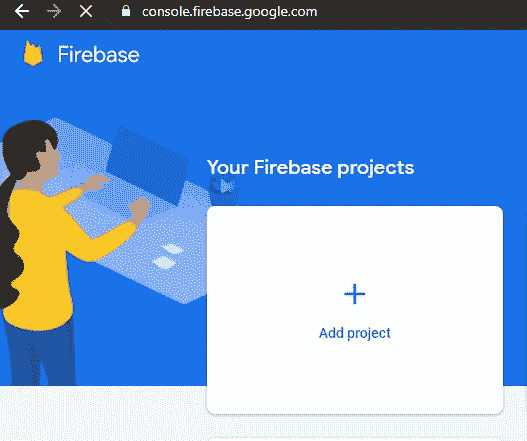

Screenshot by Author

为您的项目命名:

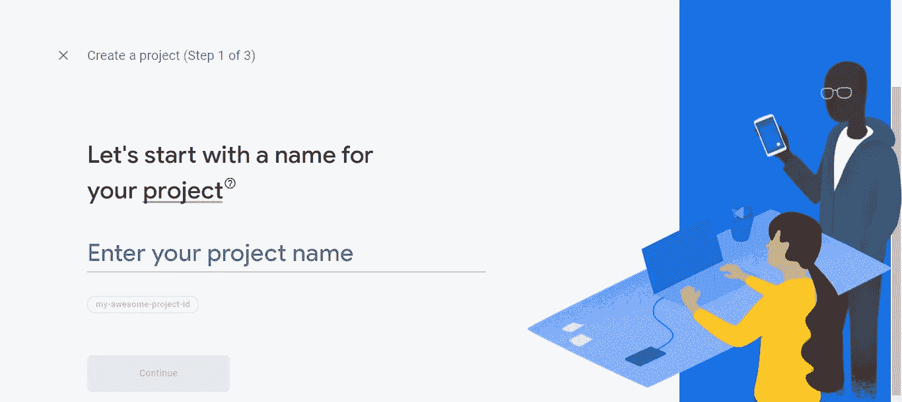

Screenshot by Author

你可以启用你的谷歌分析。如果你不愿意，也没有问题。但是在这种情况下，我们将只启用它。

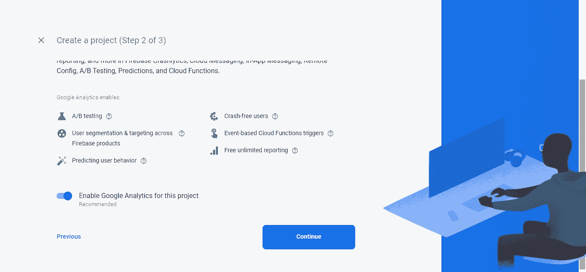

Screenshot by Author

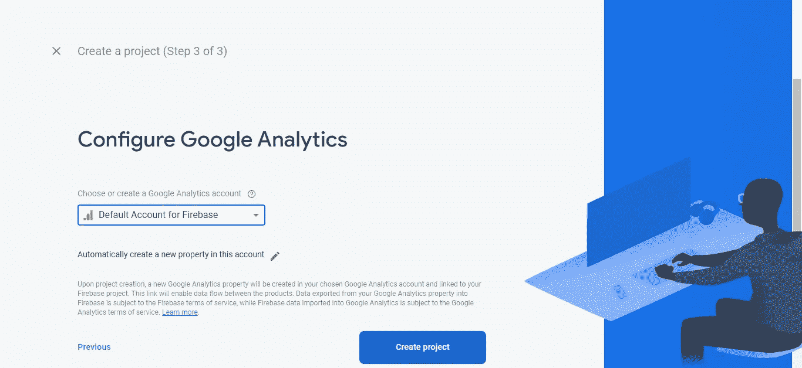

Screenshot by Author

然后单击继续。一旦你看到下面的图片，你的项目就准备好了，所以点击继续。

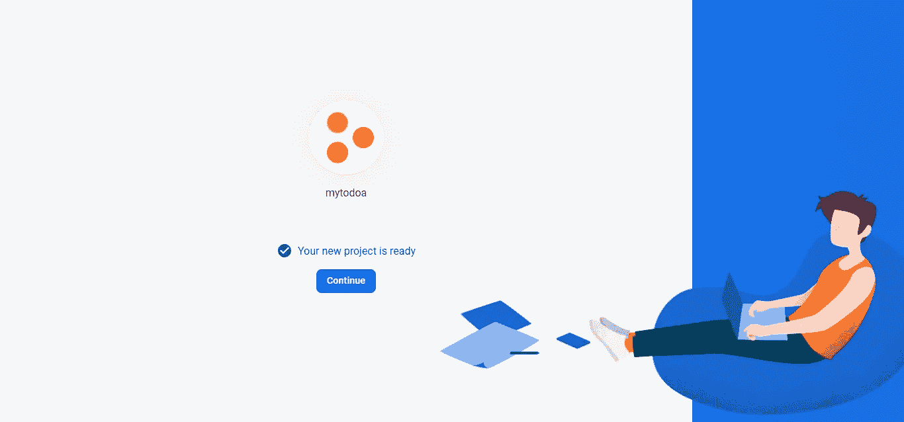

Screenshot by Author

点击网络图标>

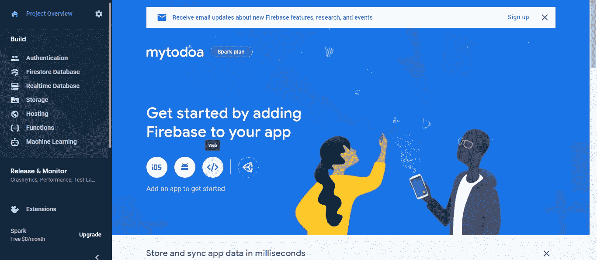

Screenshot by Author

注册您的应用程序，然后单击继续。

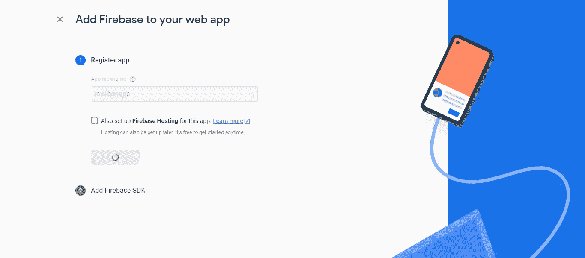

Screenshot by Author

继续点击继续到控制台。现在，在边栏菜单上，点击主机，然后点击开始。

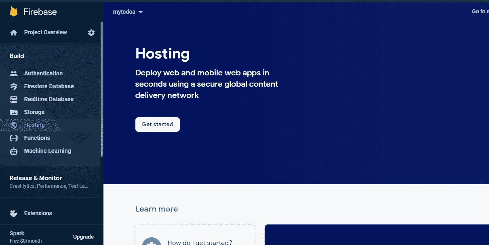

Screenshot by Author

## Firebase 部署步骤开始

所以在 windows 上使用命令行(cmd ),在 Mac 上使用终端。

运行`npm install -g firebase-tools`。

如果您做的一切都正确，您将不会看到任何错误，这意味着它已经安装。

然后运行`firebase login`。

如果它返回登录为“你使用的电子邮件”，你就可以走了。

然后 cd 到您的项目目录。

*如果您不知道该文件夹在哪里，请在 PC 上的文件浏览器中找到您保存该文件夹的位置。然后，单击该文件夹顶部的栏，将路径和 cd 复制到终端上的该路径。*

**高亮显示的文本是路径。**

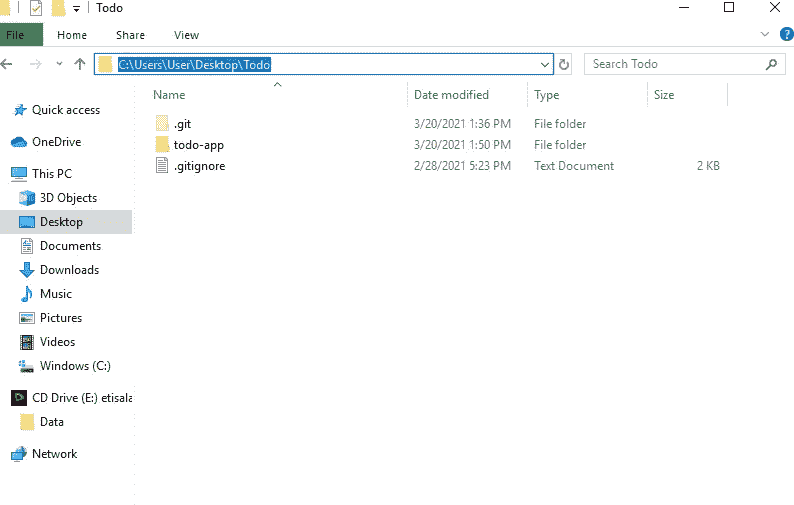

Screenshot by Author

然后跑`firebase init`

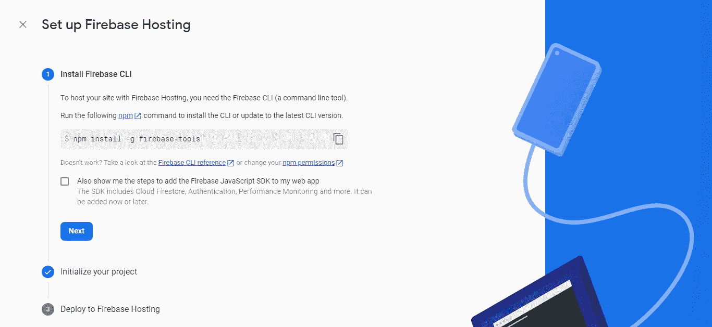

Screenshot by Author

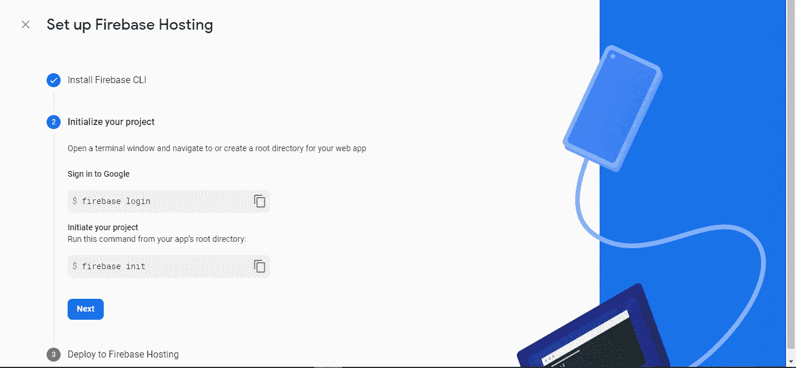

Screenshot by Author

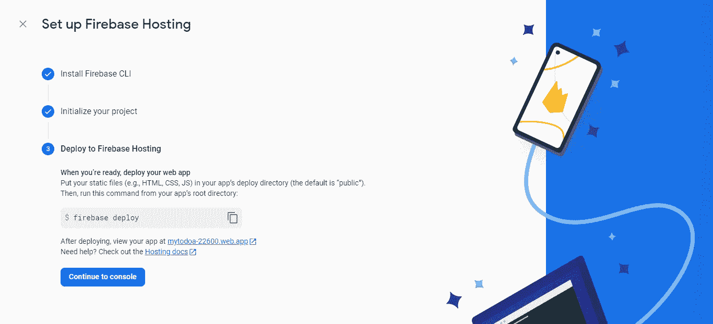

Screenshot by Author

## 问卷调查

它会给你一份问卷。y 代表是，n 代表否
#准备好继续了吗？y 型。

#使用箭头键导航到“主机”，到达“主机”后使用空格键选择，然后按 enter 键确认。

#选择“使用现有项目”。

#选择您刚刚注册的项目。

*在您的终端上运行 VS 代码，运行`npm run build`。

*流程完成后，返回命令行或终端完成问卷。*

#对于您的公共目录，请键入“build”。

#允许重写所有指向 index.html 的 URL。

#对覆盖说不。

然后您的初始化过程就完成了。

*最后一步是在命令行或终端上运行`firebase deploy` 。

部署完成后，您将获得一个 URL，可以在任何地方访问您的 Todo 应用程序。

*祝贺您，您刚刚构建了完全托管的您自己的 Todo 应用程序。*

# 最后

我们用 React 构建了自己的 Todo 应用程序，在这里我们学习了如何创建 React 应用程序、创建组件、使用 React 挂钩(尤其是 useReducer 挂钩)、设计我们的项目以及将我们的应用程序部署到 firebase。

这很有趣吗？有帮助吗？感谢您的宝贵时间！

*更多内容尽在*[***plain English . io***](https://plainenglish.io/)