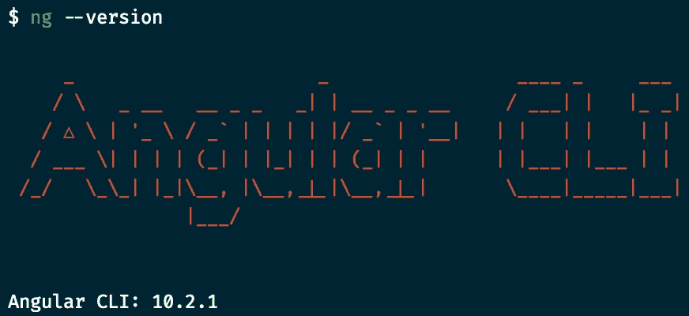
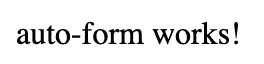
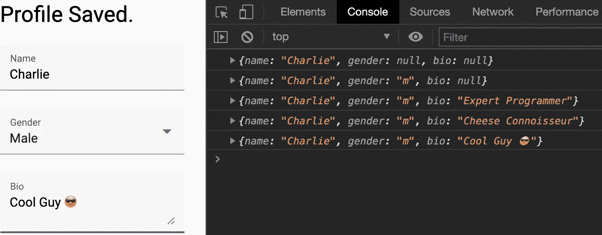

# 在 Angular 中创建自动保存表单的终极指南

> 原文：<https://javascript.plainenglish.io/the-ultimate-guide-to-creating-auto-saving-forms-in-angular-29806875364?source=collection_archive---------1----------------------->

## 极限角度导轨

## 由 RxJS 和角形材料提供动力



Angular 10

# 复制粘贴设置速度运行

以下命令创建一个新的 Angular 应用程序，生成自动保存窗体将驻留的组件，为应用程序提供服务，并在 Visual Studio 代码中打开项目。

```
ng new AutoForm --style=scss
ng g c auto-form
ng serve
cd AutoForm
code .
```

将**app.component.html**的内容替换为:

Sorry, <router-outlet></router-outlet>, we don’t need you for this one.



What you see at localhost:4200

# 添加角形材料

`ng add @angular/material`

现在从 **app.module.ts** 中的角形和角形材料导入必要的模块。

*我必须重启服务器才能应用更改。*

# 构建表单

该表格将是一个输入姓名，性别和生物概况。

表单组有一个名为 *valueChanges* 的可观察属性，每当它的一个表单控件中的值发生变化时，它就会发出一个事件。这种可观察性将成为自动保存功能的基础。

在 **auto-form.component.ts** 中，订阅 *valueChanges* ，添加 RxJS 管道控制自动保存流程。

> *但是假设(true) *的*实际上是一个将表单数据保存到数据库的可观察函数，因为这将是这种自动保存功能的真实实现。*

## RxJS 运算符

*   [*去抖时间*](https://www.learnrxjs.io/learn-rxjs/operators/filtering/debouncetime)

该操作符不允许从可观察对象中发出一个事件，直到发出最后一个事件经过了一段时间。换句话说， *valueChanges* 不会发出一个事件，直到连续 1.5 秒没有修改概要文件。这可以防止在每次修改表单后触发事件时不断更新数据库。1.5 秒是基于 [Cloud Firestore 每秒一次写入文档的限制。](https://firebase.google.com/docs/firestore/quotas)

*   [*开关图*](https://www.learnrxjs.io/learn-rxjs/operators/transformation/switchmap)

这个算符把可观测值转换成一个新的可观测值。为了我们的目的，这个新的可观测性将留给想象。然而，无论你和 Angular 一起使用什么样的后端技术，你几乎总会在更新用户数据的服务中使用它。无论如何，这将是我们想要订阅的可观察的。该算子无缝地取消了先前的可观测值，并订阅了新的可观测值。

# UX 改进

当我写这篇文章时，从 Medium 上的这个地方得到了灵感，看到我的作品何时被保存以及何时完成保存是很有帮助的。让我们用一个新的变量 *saveStatus* 来改进我们的表单，让用户知道正在发生什么。

在**auto-form.component.html**中，将变量添加到用户可以看到的地方。

```
{{ saveStatus }}
```

在 **auto-form.component.ts** 中，我们需要一个新的 RxJS 操作符*点击*，在每次表单控件被更改时运行一个函数。该功能将保存状态设置为“保存”。在订阅中，一旦保存了数据，保存状态将设置为“已保存”，再过两秒钟，如果状态仍然为“已保存”，则将设置为“空闲”，这是一个空字符串。

这是工作演示:



Voila!

希望您会发现本指南很有帮助。如果您喜欢或有任何问题请留言，我一定会回答。感谢您花时间阅读这篇文章。😎