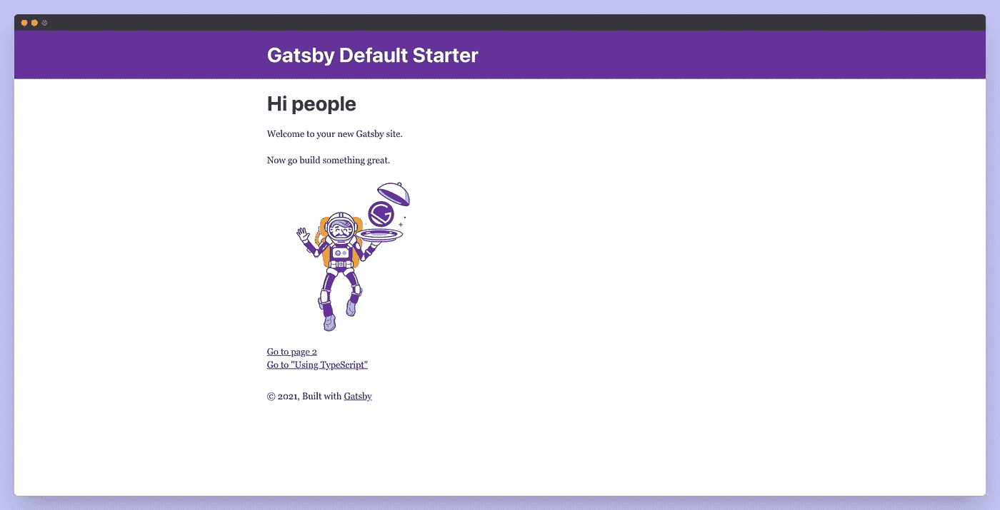
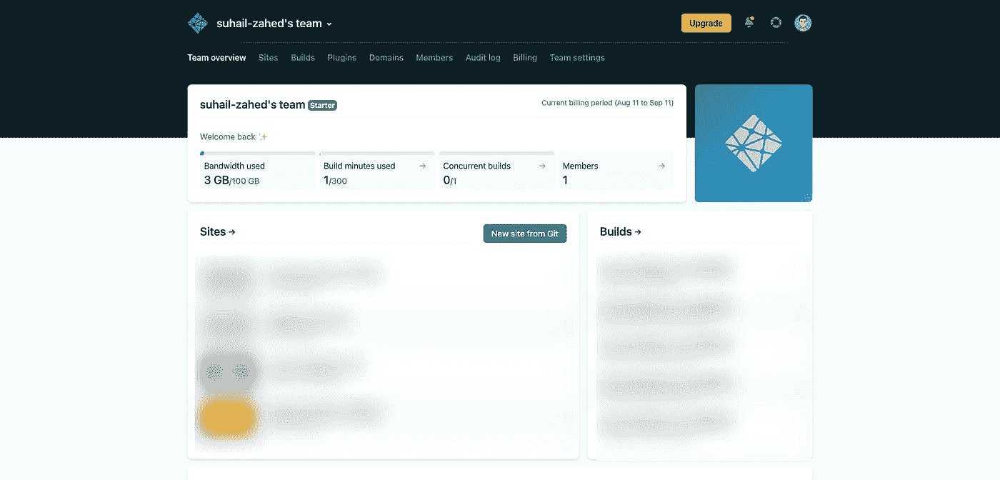
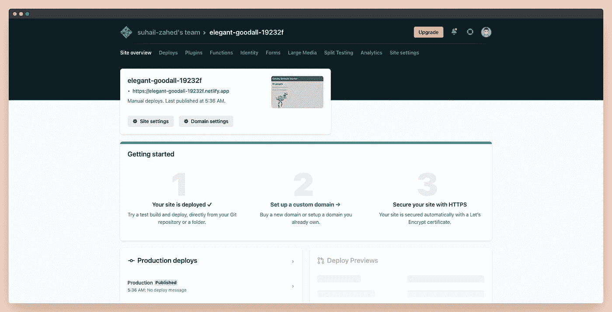

# 盖茨比终极指南

> 原文：<https://javascript.plainenglish.io/the-ultimate-guide-to-gatsby-57b6622d1726?source=collection_archive---------6----------------------->

## 从盖茨比开始之前你需要知道的一切


Photo by [Joshua Reddekopp](https://unsplash.com/@joshuaryanphoto?utm_source=medium&utm_medium=referral) on [Unsplash](https://unsplash.com?utm_source=medium&utm_medium=referral)

盖茨比网站正日益流行。现在大部分流行的网站都在用盖茨比，因为它的速度，SEO 等等，如果你对盖茨比一无所知，在 2021 年很可能值得学习。

# 盖茨比是什么？

GatsbyJS 是一个基于 React 的、GraphQL 支持的静态站点生成器。Gatsby 是一个开源框架，它将 React、GraphQL 和 Webpack 的功能结合到一个工具中，用于构建静态网站和应用程序。虽然“静态站点生成器”这个术语已经出现了一段时间，但 Gatsby 更像是一个现代前端框架，而不是传统的静态站点生成器。

# 什么是静态站点？

静态网站已经存在很久了。它们很可能是最初的网站，只有 HTML、CSS 和 JavaScript。它们不是实时呈现的，因为没有任何服务器端编程，没有数据库等等。

静态站点生成器是一种创建静态网页的工具。另一方面，JS 框架和库通常在运行时在客户端生成 HTML 内容。该材料由静态站点生成器在站点构建时生成。然后，在它被加载后，React 接管，你就有了一个单页的应用程序！

# 为什么你应该考虑使用盖茨比？

## 搜索引擎优化

GatsbyJS 的使用允许你的网站利用一些内部代码的优化策略。因此，搜索引擎会把你的网站排在更高的位置。有很多插件可以帮助你做到这一点。

## 插件

盖茨比有一些神奇的插件，可以在不同方面帮助你的网站。你可以使用 NPM 或 Yarn 安装这些插件。

一些流行的插件是源文件系统，内容丰富，插件尖锐等。你可以在他们的官网[这里](https://www.gatsbyjs.com/plugins)找到所有插件。

## 速度

Gatsby 站点比许多替代站点快得多，甚至比使用 WordPress 之类的缓存站点还要快，因为就速度和性能而言，静态站点是很难超越的。

## 模板

有足够多的 GatsbyJS Starter 存储库和模板可供使用，克隆和修改内容非常简单。这可以让你快速有效地建立网站，比如你的博客或作品集。

# 你为什么要避开盖茨比？

## 构建时间

随着网站内容的增长，制作内容所需的时间也在增长。这不仅在开发过程中不方便，而且在部署时也浪费时间。如果你想创建一个经常变化的网站，Gatsby 是不被建议的。

## 动态网站

有很多动态生成的路径的站点，因为如果你在构建的时候不知道静态生成的页面是什么，你就不能从静态生成的页面中获益。

## 复杂网站

因为复杂的网站扩展很快，需要很长时间来构建，所以他们会不断地添加新的页面和材料。尽管许多电子商务公司能够并且确实使用静态创建的站点，但是如果构建时间成为一个问题，最有可能的是放弃它们而支持像 Gatsby 这样的动态生成的站点。

# 建立你的第一个盖茨比网站

## 安装 Gatsby CLI

第一步是安装 Gatsby CLI，您可以使用 Gatsby 命令行界面创建和修改新站点。要安装 Gatsby CLI，只需运行:

```
npm install -g gatsby-cli
```

`-g`参数表明 Gatsby 命令行界面是全局安装的，而不是本地安装的。因此，您将能够在任何目录下使用该工具。

## 初学者模板

正如我之前提到的，你不需要从头开始创建一个网站，相反，我们可以使用一些入门模板，这些模板可以在盖茨比的官方网站上找到。

对于本教程，我们将使用`gatsby-starter-default`来完成，在您的终端上运行下面的命令。

```
gatsby new gatsby-starter-default https://github.com/gatsbyjs/gatsby-starter-default
```

`gatsby new`创建一个新网站。你会得到一个准系统网站，如果你利用盖茨比新闻本身。将 gatsby new 与一个初学者模板相结合是使用它的最典型的方法。

## 在本地运行您的应用

一旦完成，您应该会看到一条消息，表明 Gatsby 站点已经成功引导。现在快跑

```
cd gatsby-starter-default && gatsby develop
```

该命令导航到我们的新 gatsby 文件夹并初始化文件，以便我们可以在本地查看它。打开你的浏览器并导航到`http://localhost:8000/`，你会看到一个默认的 stater 页面，如下图所示。



如果你想让搜索引擎找到你的网站，正确安排你的网站的元数据是很重要的。gatsby-config.js 文件允许您自定义网站的数据。

为了让全球的每个人都能访问你的网站，你需要在托管服务中部署你的网站。你可以在 Netfliy，Vercel，Azure，Gatsby Cloud，Heroku，AWS，IIS，Firebase 等部署一个 Gatsby 网站。但是对于这个例子，我们将使用 Netlify

## 将网站部署到网络

在部署我们的网站之前，首先，我们需要生成一个包含静态文件的构建文件夹。去跑步

```
gatsby build
```

一旦完成，你应该会看到一个名为`public`的文件夹。就是这样，我们只需要在 Netlify 中部署那个文件夹。

访问 [Netlify](https://www.netlify.com/) 网站，如果您没有帐户，请点击注册按钮创建一个帐户。别担心，Netfliy 是免费托管的，不会向你收取任何费用。注册后，您应该会被重定向到 Netfliy dashboard，如下所示。



现在点击 Netlify 菜单上的 sites，您应该会看到一个页面，上面有一段文字“想在不连接 Git 的情况下部署一个新站点吗？将您的站点输出文件夹拖放到此处。将您的公共文件夹拖放到占位符上，等待一段时间，然后您的网站将被部署到 Netfliy 上。如果部署成功，您应该会看到类似下图的内容。



# 结论

我希望这篇文章对你有所帮助。如果你需要任何帮助，请在评论区告诉我。

你想给我买杯咖啡吗，你可以在这里买。

让我们在[推特](https://twitter.com/suhailkakar)和 [LinkedIn](https://www.linkedin.com/in/suhailkakar/) 上连线。

👋感谢阅读，下次见。

*更多内容请看*[***plain English . io***](http://plainenglish.io)