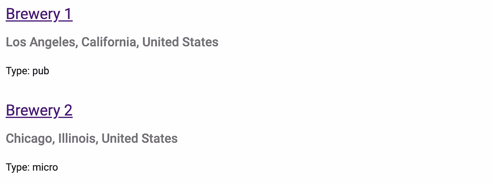

# Angular 11 中无限滚动的终极指南

> 原文：<https://javascript.plainenglish.io/the-ultimate-guide-to-infinite-scrolling-in-angular-11-36d3bbce9fff?source=collection_archive---------3----------------------->

## 极限角度导轨

## 由 Open Brewery DB、NGX-Infinite-Scroll 和角状材料提供动力


Photo by [Kate Torline](https://unsplash.com/@kate_torline?utm_source=medium&utm_medium=referral) on [Unsplash](https://unsplash.com?utm_source=medium&utm_medium=referral)

# 道德免责声明

> 无限滚动很容易让人上瘾。

我推荐[格兰特·柯林斯](https://medium.com/u/ceee6ebf074c?source=post_page-----36d3bbce9fff--------------------------------)的文章《[无限卷轴为何如此令人上瘾](https://uxdesign.cc/why-the-infinite-scroll-is-so-addictive-9928367019c5)》。它深入探究了诱使用户永不停止滚动的心理因素。

我也强烈推荐网飞的《社会困境》。这部纪录片调查了社交媒体对人类的强烈负面影响，这种影响往往伴随着无限滚动。不要让我开始谈论我在 Instagram 上浪费了多少时间。

也就是说，无限滚动无疑是向用户展示无限数据列表的一种非常有效的方式。

事不宜迟，让我们直接开始吧。

# 使用角形材料设置

这个命令将创建我们的角度应用程序。

```
ng new infinite-scroll --routing=false --style=scss --skip-tests
```

现在，我们将[角形材质](https://material.angular.io/)添加到我们的应用程序中。

```
ng add @angular/material
```

# NGX-无限卷轴

> [角状无限卷轴](https://github.com/orizens/ngx-infinite-scroll)

安装软件包。

```
npm i ngx-infinite-scroll
```

现在我们可以在 **app.module.ts** 中导入`InfiniteScrollModule`，并将其添加到我们的导入中。让我们对`HttpClientModule`和`MatCardModule`做同样的事情，我们稍后会用到它们。

```
*...
import* { HttpClientModule } *from* '@angular/common/http';
*import* { MatCardModule } *from* '@angular/material/card';
*import* { InfiniteScrollModule } *from* ‘ngx-infinite-scroll’;
...
    imports: [..., HttpClientModule, MatCardModule, InfiniteScrollModule],
...
```

现在我们可以服务我们的应用程序了，因为我们已经安装了所有需要的包。

```
ng serve
```

> 在这个演示中，我们将创建一个无限的啤酒厂列表。

让我们创建一个无限滚动组件，其中包含一个包含每个啤酒厂信息的角状材料卡片列表。

*   如果`[infiniteScrollDistance]`被设置为 1，那么当用户向下滚动页面 90%时`onScroll()`将被触发。如果是两个，那么是 80%，以此类推。
*   如果`[infiniteScrollThrottle]`设置为 500 毫秒，那么`onScroll()`将仅在用户停止滚动 500 毫秒时触发。
*   `(scrolled)`是当用户向下滚动时触发的事件，由上述属性定义。

我们想要这样的东西。



Screenshot by Author

# 打开啤酒厂数据库

> Open Brewery DB 是一个免费的数据集和 API，提供关于啤酒厂、苹果酒、啤酒店和瓶装店的公共信息。

让我们为啤酒厂创建一个界面。

```
ng g i brewery --type=model
```

现在让我们创建一个获取啤酒厂的服务。

```
ng g s brewery
```

在我们的服务中，我们希望使用 API 的[列表啤酒厂端点](https://www.openbrewerydb.org/documentation/01-listbreweries)。

亲自查看一下终点:【https://api.openbrewerydb.org/breweries】T4。如果你这样做了，我推荐你使用一个名为 [JSON Formatter](https://chrome.google.com/webstore/detail/json-formatter/bcjindcccaagfpapjjmafapmmgkkhgoa?hl=en) 的 Chrome 扩展来查看解析后的 JSON 数据。

注意我们是如何利用 URL 中的查询参数进行分页的。我们配置每页获取 10 个啤酒厂。

现在，在我们的组件中，当页面加载时，我们加载前十个啤酒厂。然后，用户每滚动一次，页面就增加一，这样就可以获取下面的十家啤酒厂。

# 结果

我在 Giphy [这里](https://media.giphy.com/media/8VYABkBrS0wDfbFanm/giphy.gif)发表了结果。

请注意，当我将页面向下滚动 80%时，滚动条是如何收缩的，这表示已经加载了更多的数据。

另外，可以在 Github 上查看源代码。

[](https://github.com/charlielevine/infinite-scroll) [## 查理莱文/无限卷轴

### 此项目是使用 Angular CLI 版本 11.1.4 生成的。为开发服务器运行 ng serve。导航到…

github.com](https://github.com/charlielevine/infinite-scroll) 

本指南到此为止。感谢您的阅读！我希望我为你简化了无限滚动的角度。

在推特[上找到我](https://twitter.com/charliechamp616)！