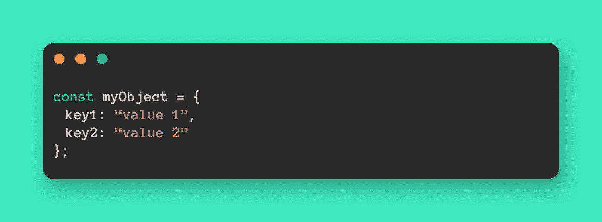
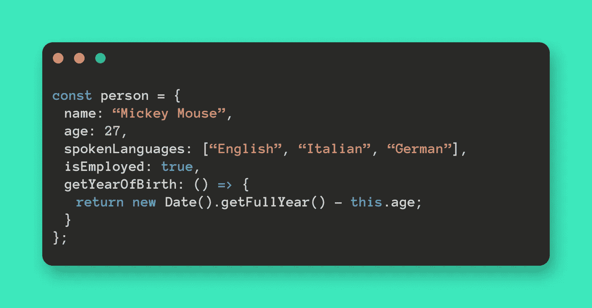
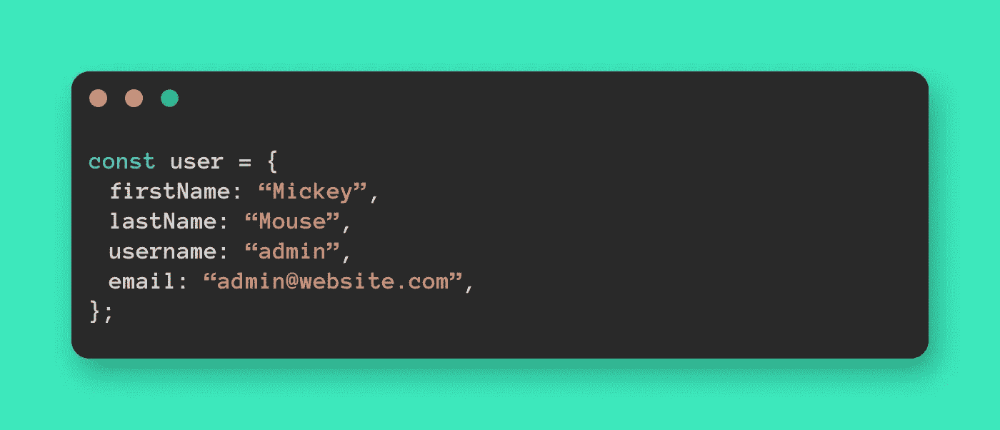
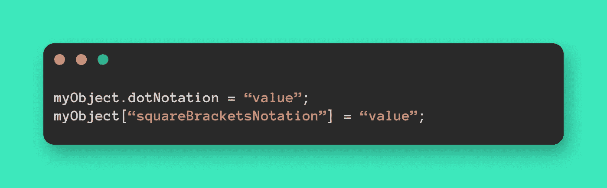
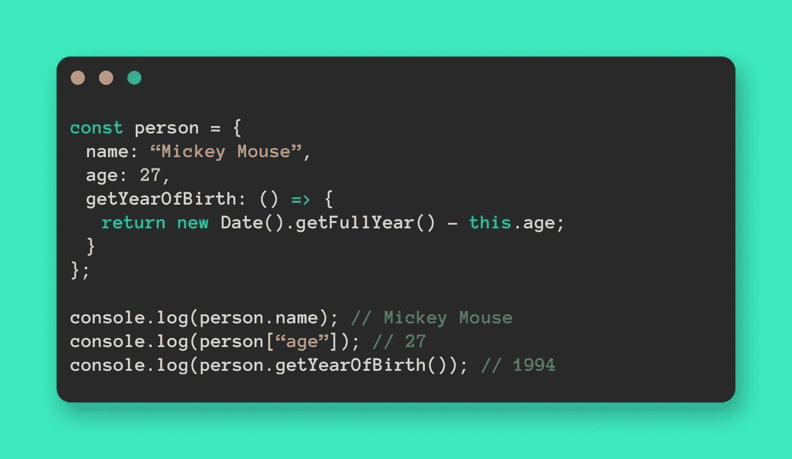
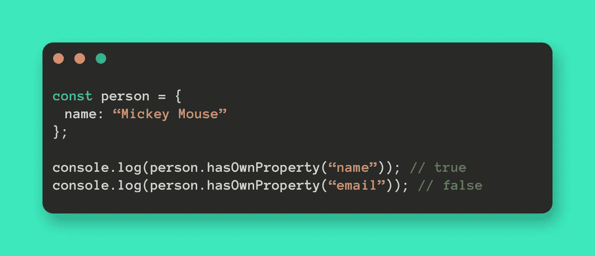
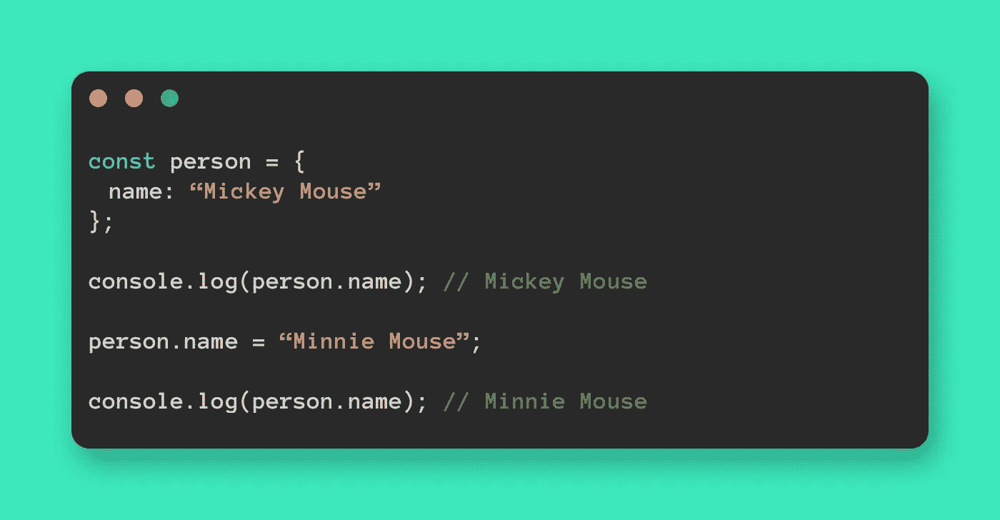
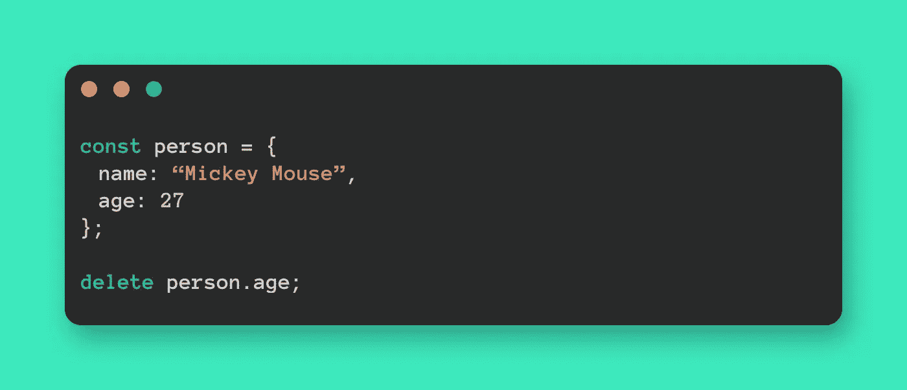
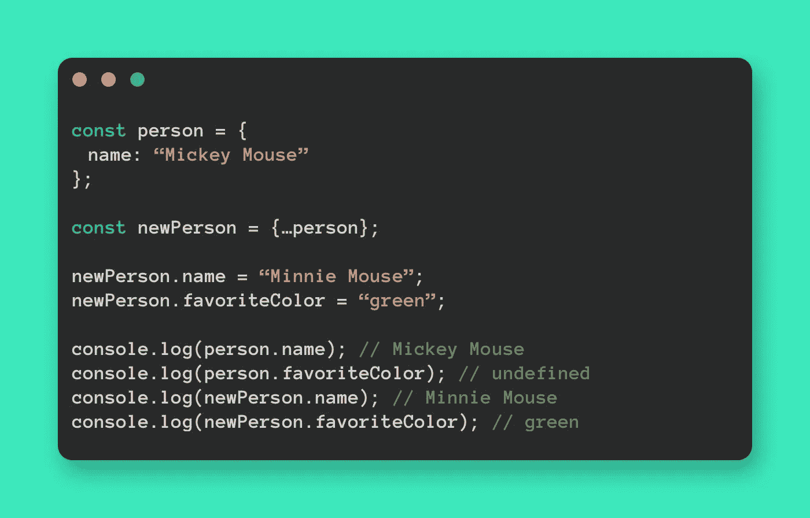

# 带示例的 JavaScript 对象终极指南

> 原文：<https://javascript.plainenglish.io/the-ultimate-guide-to-javascript-objects-with-examples-1de0c2651cbc?source=collection_archive---------11----------------------->

## *如果你正在开始学习 JavaScript，你必须对对象有很好的理解。它们是 JavaScript 中几乎所有有用东西的基础。*

Photo by [Javier Allegue Barros](https://unsplash.com/@soymeraki?utm_source=unsplash&utm_medium=referral&utm_content=creditCopyText) on [Unsplash](https://unsplash.com/?utm_source=unsplash&utm_medium=referral&utm_content=creditCopyText)

自从我开始使用 JavaScript 框架，对象已经成为我最好的朋友，我在这里的主要目标是**让对象比以往任何时候都更容易。**

# 🙋🏼什么是对象？

对象基本上是一种特殊的变量。它们可以保存多个值,因为一个对象由不确定数量的属性组成。

每个属性由**一对键和值**组成。

**键**是属性的**名称。**

**值**可以是一个**字符串**，一个**数字**，一个**布尔**，一个**数组**，**另一个对象**(称为*嵌套对象*)或者一个**函数**。

如果一个键*的*值*包含一个函数声明*，这个属性就叫做**方法**。

# ➕创造了一个物体

根据 [MDN](https://developer.mozilla.org/en-US/docs/Web/JavaScript/Reference/Operators/Object_initializer) ，有 **3 种方式来初始化对象**:

1.  使用文字符号
2.  使用[对象()构造函数](https://developer.mozilla.org/en-US/docs/Web/JavaScript/Reference/Global_Objects/Object/Object)
3.  使用 [Object.create()](https://developer.mozilla.org/en-US/docs/Web/JavaScript/Reference/Global_Objects/Object/create)

我的首选方法是**文字符号**，因为它是初始化一个对象的简短形式，这个对象包含在**中，用花括号括起一个由零个或多个属性组成的逗号分隔的列表。**

# ✍🏼向对象添加属性

属性可以用两种可能的符号来声明:

1.  **圆点符号**，`.property`
2.  使用**方括号**、`["property"]`

# 🔐访问属性值

为了*访问对象属性*，点符号**和方括号**都可以使用。
*如果属性是一个方法*，它的值只能使用带括号的点符号来访问**。**

如果你需要确定**一个对象是否有属性**，使用`hasOwnProperty()`方法检查它是否存在。

# 🆙更新属性值

为了*更新一个对象的特定属性的值*，首先**访问属性**，然后使用`=`到**为其分配新值**。

# 🗑删除属性

要从一个对象中删除一个属性，使用 JavaScript 的`delete`操作符。

# 👯复制一个对象

很多时候，我需要操纵一个保持原样的物体。

要拥有一个对象的**独立副本，实现目标的唯一方法是使用**`...`**扩展操作符**:仅仅将对象重新分配给另一个变量是不行的，它只能通过两个不同的变量使对象可访问。****

****

# **🎓结论**

**我希望这篇文章已经帮助你更熟悉对象。
**对象会是你最好的朋友**，相信我。😉**

**如果您有任何*疑问*或*问题*，请随时**发表评论**。😄**

***更多内容请看*[***plain English . io***](http://plainenglish.io/)***。*** *报名参加我们的* [***免费每周简讯这里***](http://newsletter.plainenglish.io/) ***。*****