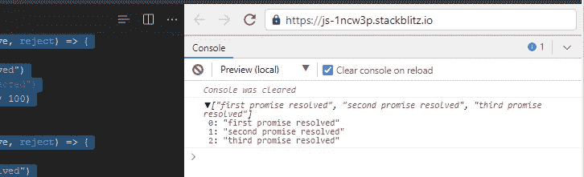
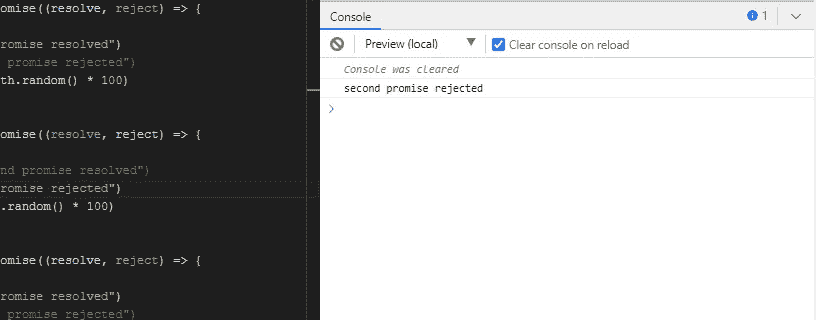
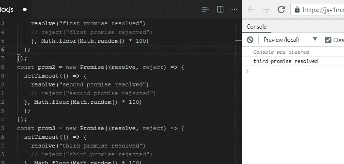
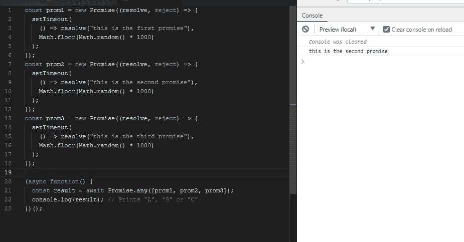
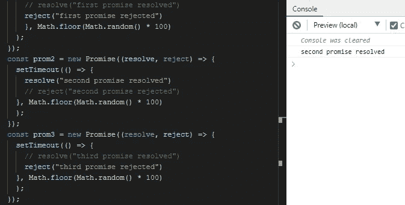
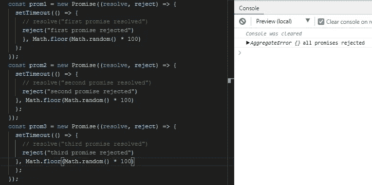
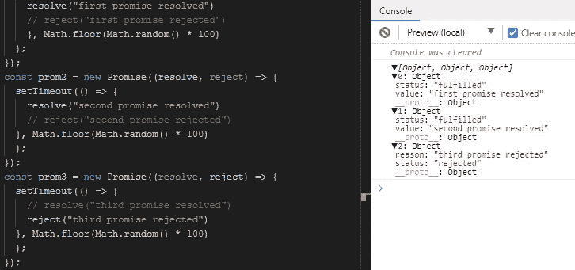

# JavaScript 的终极指南承诺

> 原文：<https://javascript.plainenglish.io/the-ultimate-guide-to-javascript-promises-76f2df318ce8?source=collection_archive---------11----------------------->

## promise.all()、promise.any()、promise.race()和 promise.allsettled()的区别


在本教程中，我们将讨论所有的 JavaScript 承诺，它们的区别和它们的用例。

# 介绍

承诺是在 JavaScript(ES6)中实现`async`编程的一种方式。承诺将成为未来价值的容器。通俗地说，你在亚马逊上下单订购一件商品。下订单后，您会在邮箱中收到一张注明交付日期的收据。在这种情况下，收据代表您的订单将交付给您的承诺。收据就像容器或你订购物品的证明(未来价值)。

对于异步编程，JavaScript 使用回调，但是使用回调有一个问题，那就是`**callback hell**`。

回调对于小的应用程序来说似乎是可以的。但是当涉及到有很多回调的复杂应用程序时，你开始有很多深度嵌套的回调函数，这些函数可能变得很难阅读、理解或管理。

**回调地狱的一个例子**

```
 func1(function(a){ 
 func2(a, function(b){ 
 func3(b, function(c){ 
 … 
 }); 
 }); 
}); 
```

## 对救援的承诺

当我们不确定分配的任务是否会完成时，承诺就产生了。Promise 对象表示异步操作的最终完成(或失败)及其结果值。顾名思义，一个承诺要么遵守，要么打破。
承诺总是处于以下状态之一:
*履行:与承诺相关的动作成功。
*拒绝:与承诺相关的行动失败。
*待定:承诺仍处于待定状态，即尚未履行或拒绝。
*已结算:承诺已履行或拒绝

句法

```
 const promise = new Promise((resolve,reject) => {….}); 
```

例子

```
 const myPromise = new Promise((resolve, reject) => { 
 if (Math.random() > 0) { 
 resolve(‘Hello, I am positive number!’); 
 } 
 reject(new Error(‘I failed some times’)); 
})
```

我发表了一篇关于 dev.to 的文章

[](https://dev.to/faithfulojebiyi/new-features-in-ecmascript-2021-with-code-examples-302h) [## ECMAScript 2021 中的新特性(带代码示例)

### 在本教程中，我们将了解最新版本的 ECMAScript 2021 中可以使用的新功能…

开发到](https://dev.to/faithfulojebiyi/new-features-in-ecmascript-2021-with-code-examples-302h) 

在那里我谈到了`promise.any()`。有人问我 JavaScript 承诺之间的区别。所以我在这里用另一篇文章来澄清你可能对 JavaScript 承诺的各种实现的任何困惑。

## 保证。全部()

`Promise.all()`方法将一个可迭代的承诺作为输入，并返回一个承诺，该承诺解析为输入承诺的结果数组。当输入的所有承诺都已解析时，或者如果输入 iterable 不包含承诺，则返回的承诺将被解析。如果任何一个承诺被拒绝，`promise.all()`会抛出第一个被拒绝的承诺的错误。

下面举个例子。我们创建 3 个承诺，在随机时间解决。

```
 const prom1 = new Promise((resolve, reject) => {
 setTimeout(() => {
 resolve(“first promise resolved”)
 // reject(“first promise rejected”)
 }, Math.floor(Math.random() * 100)
 );
});
const prom2 = new Promise((resolve, reject) => {
 setTimeout(() => {
 resolve(“second promise resolved”)
 // reject(“second promise rejected”)
 }, Math.floor(Math.random() * 100)
 );
});
const prom3 = new Promise((resolve, reject) => {
 setTimeout(() => {
 resolve(“third promise resolved”)
 // reject(“third promise rejected”)
 }, Math.floor(Math.random() * 100)
 );
});(async function() {
 try {
 const result = await Promise.all([prom1, prom2, prom3]);
 console.log(result);
 } catch (err) {
 console.log(err)
 }

})(); 
```

如果我们在控制台中查看我们的结果，我们可以看到所有三个承诺都解决了。



现在，如果我们的一个承诺被拒绝了呢？我们已经在 try catch 块中轻松处理了这个错误。

```
 const prom1 = new Promise((resolve, reject) => {
 setTimeout(() => {
 resolve(“first promise resolved”)
 // reject(“first promise rejected”)
 }, Math.floor(Math.random() * 100)
 );
});
const prom2 = new Promise((resolve, reject) => {
 setTimeout(() => {
 // resolve(“second promise resolved”)
 reject(“second promise rejected”)
 }, Math.floor(Math.random() * 100)
 );
});
const prom3 = new Promise((resolve, reject) => {
 setTimeout(() => {
 resolve(“third promise resolved”)
 // reject(“third promise rejected”)
 }, Math.floor(Math.random() * 100)
 );
});(async function() {
 try {
 const result = await Promise.all([prom1, prom2, prom3]);
 console.log(result);
 } catch (err) {
 console.log(err)
 }

})(); 
```

查看控制台，我们可以看到控制台中记录的被拒绝的承诺。



## 承诺.竞赛()

一旦 iterable 中的一个承诺履行或拒绝，方法就返回一个履行或拒绝的承诺，并带有该承诺的值或原因。

例子

```
 const prom1 = new Promise((resolve, reject) => {
 setTimeout(() => {
 resolve(“first promise resolved”)
 // reject(“first promise rejected”)
 }, Math.floor(Math.random() * 100)
 );
});
const prom2 = new Promise((resolve, reject) => {
 setTimeout(() => {
 resolve(“second promise resolved”)
 // reject(“second promise rejected”)
 }, Math.floor(Math.random() * 100)
 );
});
const prom3 = new Promise((resolve, reject) => {
 setTimeout(() => {
 resolve(“third promise resolved”)
 // reject(“third promise rejected”)
 }, Math.floor(Math.random() * 100)
 );
});(async function() {
 try {
 const result = await Promise.race([prom1, prom2, prom3]);
 console.log(result);
 } catch (err) {
 console.log(err)
 }

})(); 
```

如果我们只检查控制台，会返回一个承诺，这是最先解决的承诺，无论是解决还是拒绝。



## Promise.any()

`Promise.any()`就像是`Promise.all()`的反义词。`**Promise.any()**`如果解决了任何供应承诺，则解决。不像 `promise.all()`，要等所有承诺都解决了才解决。让我们看看下面的例子。
基本上，我们有 3 个承诺会随机兑现。我们使用了`setTimeout()`功能来设置每个承诺的解决时间。我们使用 `Math.floor(Math.random)`给`setTimeout()`函数一个随机时间，所以我们真的不知道哪个承诺先解决。这是真实生活中发生的真实事件。

```
 const prom1 = new Promise((resolve, reject) => {
 setTimeout(
 () => resolve(“this is the first promise”),
 Math.floor(Math.random() * 100)
 );
});
const prom2 = new Promise((resolve, reject) => {
 setTimeout(
 () => resolve(“this is the second promise”),
 Math.floor(Math.random() * 100)
 );
});
const prom3 = new Promise((resolve, reject) => {
 setTimeout(
 () => resolve(“this is the third promise”),
 Math.floor(Math.random() * 100)
 );
});(async function() {
 const result = await Promise.any([prom1, prom2, prom3]);
 console.log(result); // Prints “A”, “B” or “C”
})(); 
```



`promise.any()`的好处是，即使其中一个承诺被拒绝，它也会继续解决另一个承诺。如果所有承诺都被拒绝，它只会抛出一个聚合错误。

在第一个例子中，只有一个承诺被拒绝，但它继续解决。在第二个例子中，所有的承诺都被拒绝，因此，我们得到一个总的错误

```
 const prom1 = new Promise((resolve, reject) => {
 setTimeout(() => {
 // resolve(“first promise resolved”)
 reject(“first promise rejected”)
 }, Math.floor(Math.random() * 100)
 );
});
const prom2 = new Promise((resolve, reject) => {
 setTimeout(() => {
 resolve(“second promise resolved”)
 // reject(“second promise rejected”)
 }, Math.floor(Math.random() * 100)
 );
});
const prom3 = new Promise((resolve, reject) => {
 setTimeout(() => {
 // resolve(“third promise resolved”)
 reject(“third promise rejected”)
 }, Math.floor(Math.random() * 100)
 );
});(async function() {
 try {
 const result = await Promise.any([prom1, prom2, prom3]);
 console.log(result);
 } catch (err) {
 console.log(err, ‘all promises rejected’)
 }

})(); 
```



```
 const prom1 = new Promise((resolve, reject) => {
 setTimeout(() => {
 // resolve(“first promise resolved”)
 reject(“first promise rejected”)
 }, Math.floor(Math.random() * 100)
 );
});
const prom2 = new Promise((resolve, reject) => {
 setTimeout(() => {
 // resolve(“second promise resolved”)
 reject(“second promise rejected”)
 }, Math.floor(Math.random() * 100)
 );
});
const prom3 = new Promise((resolve, reject) => {
 setTimeout(() => {
 // resolve(“third promise resolved”)
 reject(“third promise rejected”)
 }, Math.floor(Math.random() * 100)
 );
});(async function() {
 try {
 const result = await Promise.any([prom1, prom2, prom3]);
 console.log(result);
 } catch (err) {
 console.log(err, ‘all promises rejected’)
 }

})();
```



## Promise.allSettled()

`Promise.allSettled()`方法返回一个承诺，该承诺在所有给定的承诺都被履行或拒绝后解析，并带有一个对象数组，每个对象描述每个承诺的结果。
在下面的示例中，其中一个承诺被拒绝，但`promise.allSettled()`仍返回所有已结算的承诺。

```
 const prom1 = new Promise((resolve, reject) => {
 setTimeout(() => {
 resolve(“first promise resolved”)
 // reject(“first promise rejected”)
 }, Math.floor(Math.random() * 100)
 );
});
const prom2 = new Promise((resolve, reject) => {
 setTimeout(() => {
 resolve(“second promise resolved”)
 // reject(“second promise rejected”)
 }, Math.floor(Math.random() * 100)
 );
});
const prom3 = new Promise((resolve, reject) => {
 setTimeout(() => {
 // resolve(“third promise resolved”)
 reject(“third promise rejected”)
 }, Math.floor(Math.random() * 100)
 );
});(async function() {
 try {
 const result = await Promise.allSettled([prom1, prom2, prom3]);
 console.log(result);
 } catch (err) {
 console.log(err)
 }

})(); 
```



# 结论

在本教程中，我们已经能够指出 JavaScript 承诺及其不同用例之间的区别。

如果您有任何补充或保留，请在下面的评论区告诉我。

*更多内容请看*[***plain English . io***](https://plainenglish.io/)