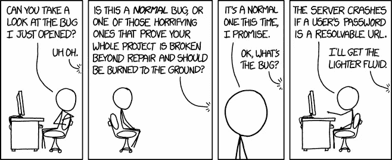

# 编写自文档化代码的终极指南

> 原文：<https://javascript.plainenglish.io/the-ultimate-guide-to-writing-self-documenting-code-998ea9a38bd3?source=collection_archive---------0----------------------->

## 厌倦了在代码中写注释吗？我们停止这样做，而是编写自文档化的代码


关于在代码中添加注释的讨论由来已久，一个人说你必须添加注释，另一个人说只是偶尔添加，但是一般来说，你应该在代码中添加注释，以使代码可读。

我在这里告诉你那是错误的。

相反，您的代码应该是自文档化的。除非当然不应该。给你的代码添加注释是有正当理由的，但是这应该是*为什么*事情是这样做的，而不是*它正在做什么。*

[](/when-self-documenting-code-is-not-enough-a964da7e74e) [## 当自文档化代码还不够时

### 自记录代码很好，但是什么时候不行呢？什么时候代码中有注释会让你受益？

javascript.plainenglish.io](/when-self-documenting-code-is-not-enough-a964da7e74e) 

但是让我们更深入地研究一下自文档化代码。

**先关？什么是自文档化代码？**

自文档化代码，顾名思义，是对自身进行文档化。这并不意味着您可以轻松地从中生成文档，而是使您的代码可读性更好，您不需要文档或注释。

# 命名功能

首先让我们看看函数名。你能通过看调用者告诉我这个函数是做什么的吗？

```
getUserId()
```

您可能回答了，*“嗯，它得到了用户 ID”*。这在技术上是正确的(最好的正确方式？).但是它留下了下面的问题:“它从哪里得到 ID？”

那么什么会是更好的名字呢？嗯，那要看上下文，这就是为什么你需要一个更好的名字。

如果`UserId`来自曲奇呢？那你的名字应该是`getUserIdFromCookie()`。

如果`UserId`来自某种持久存储呢？那么这个名字应该是类似于`getUserIdFromStorage()`的东西。

如果它返回的`UserId`来自你发送给那个函数的属性呢？然后函数名应该描述你要发送给它什么，一些例子

```
getUserIdFromBlogpost(blogpostdata);
getUserIdFromChat(chatObject);
getUserIdFromFriend(friendObject);
```

或者，如果您需要基于与该用户相关联的特定其他属性来获取`UserId`该怎么办？

```
getUserIdWithEmail(email);
getUserIdWithIP(ip); // this is bad, but, you know, an example
```

正如你在第一个例子中看到的，我使用了`from`，而在第二个例子中，我使用了`with`。这种区别很重要，我们将在下一节(命名约定)中讨论。

一旦你清楚地定义了一个好的函数名，你总是能够立即知道你的代码做了什么。未来你会幸福的！

你的任何同事，无论是现在的还是未来的，都会感谢你确保你的命名惯例是正确的。

# 命名变量

命名变量和命名函数同样重要。我通常看到的最糟糕的罪犯之一是这样的:

```
var a = "John";
var b = 65;
var c = 20;
```

从这些属性中，你可能会得出结论，这是关于一个人。`a`明明是用户的名字。但是……什么是`b`和`c`？`b`可能是用户的年龄吗？体重？朋友数量？他开车的次数？他去过的国家？然后`c`又是什么鬼？

也许您可以从更多的代码中提取出它可能是什么，但是这已经太远了。你不应该看到更多的代码来理解这一点。应该是这样的:

```
var userFirstName = "John"
var userWeightInKG = 65;
var userBMI = 20;
```

你猜对属性了吗？你希望身体质量指数成为这里的财产吗？你认为约翰会是 65 岁还是 20 岁？我很确定你猜错了，如果你没有我祝贺你，你猜对了，但你不知道会是什么，你只是运气好。

运气不应该成为阅读代码的一个因素。

奇怪的是，由于变量命名的特殊性，你总能立即理解代码，而不必猜测。这也将防止变量碰撞。

这将防止这一点:



[XKCD 1700](https://xkcd.com/1700/)

[](/how-to-prevent-unexpected-variable-mutation-in-javascript-2612b898732c) [## 如何防止 JavaScript 中意外的变量突变

### 所以当你使用 JavaScript 时，你可以灵活地用任何东西覆盖任何变量。你怎么…

javascript.plainenglish.io](/how-to-prevent-unexpected-variable-mutation-in-javascript-2612b898732c) 

# 命名规格

遵循变量、函数和文件的命名惯例是很重要的。我在“命名函数”一节中提到过，我将`from`和`with`定义为命名方法，这也是您可以为自己的项目定义的。然后坚持下去！

**那么什么是命名约定呢？**

好吧，让我们从简单的开始。命名约定可以是，就像我前面定义的“`from`”和“`with`”。

*   `from`在函数名定义中，你应该提供一个对象，函数可以从该对象返回函数的第一部分。

一些例子

```
var userId = getUserIdFromBlog(blog)
var url = getUrlFromBlog(blog)
var numberOfWords = getNumberOfWordsFromBlog(blog)
```

正如你所看到的，函数名定义了你从它那里得到了什么，它定义了为了让你得到你想要的，它需要什么。我们在这里使用单词`from`,这样我们就知道函数从提供的数据中获取信息*。*

所以 userId 可能是嵌入在 blog 对象中的某个地方，但是我们希望有一个建设性的、单一的点来提取它。如果我们以后进行重构，这会使代码更易于维护，并且增加了对相同数据的不同情况的支持。就像 Twitter 有转发一样，一条推文的 userId 是什么？原帖还是转发者？这取决于具体情况，可以在这些特定功能中进行配置。

*   `with`在函数名中，定义了函数将能够根据你给定的信息从另一个源获取数据。

一些例子

```
var userId = getUserIdWithEmail(email)
var blog = getBlogWithDateStamp(date)
var user = getUserWithUserId(userId);
```

正如您所看到的，`with`返回信息，但是我们得到的信息是在没有外部来源的情况下我们不可能知道的。这个外部来源可以是一个数据库，它可以进行 API 调用，它可以已经在内存中，谁知道呢，但你不必。

**这如何帮助我提高代码可读性？**

这很容易，如果你知道什么时候在你的函数命名中使用 T2 或 T3，你的同事也知道，那么你就不需要在函数上加注释来解释它是如何工作的

```
// provide email address to get a userId back
function getUserId(email) {}
```

然后在调用者代码中:

```
var user = getUserId();
```

然后你会想。

*“我还需要提供什么？是电子邮件吗？是用户名吗？好的，让我检查一下这个功能，看看它需要什么。”*

那么你刚才浪费了多少时间？1 分钟？两分钟？一个同事会浪费多少时间去理解你两年前写的函数？

# 文件名的命名约定

对于文件名，完全相同的规则很重要。请确保您的文件结构，并确保您的文件名称正确。更重要的是，不要让你的文件变得太大，不要害怕在不同的组件之间分割。

例如，我经常有一个`user`目录，而不是一个用户文件。

```
/user
  api.js
  properties.js
  friends.js
  blogs.js
```

当涉及一对多的关系时，你会自然而然地看到我总是用复数，但当涉及一对一的关系时就不会了。`user`只是一个，我希望我在那个目录中调用的任何东西都是关于一个用户的，但是有了`user/friends`我希望能够与那个用户的多个朋友*互动。*

**如果我需要处理多个用户怎么办？**

嗯，新目录时间！

```
/users
  leaderboard.js
  search.js
  statistics.js
```

同样，`leaderboard`是单数，因为关于`users`只有一个排行榜，但关于统计数据是复数，因为我有不止一个关于用户的统计数据。

重要的是，只要看一眼代码，你就能知道你期望从代码中得到什么。

在同一行中，您必须知道在查看目录结构时会发生什么。

如果我的统计文件是一个很长的文件，该怎么办？

嗯，新目录时间！

```
/users
  leaderboard.js
  search.js
  /statistics
    count.js
    friendrelations.js
    usage.js
```

是的，添加更多的文件，添加更多的目录。

# 变量命名约定

现在让我们看看变量和它们的命名约定。对于变量，使用非描述性的名字更容易，但是你仍然应该知道会发生什么。

例如，让我们有变量名`user`。这是什么？

可能是

*   用户对象
*   用户标识
*   用户电子邮件

当然应该是用户对象。将变量改为`userObject`是处理它的一种方法，我强烈推荐这种方法。然而，这不是唯一的解决方案。

你也可以使用一般定义`user`应该包含用户对象，无论何时在你的代码中使用变量名`user`，你都应该能够对它做`user.id`。

不要在广泛的应用中混合使用一个变量，这样可以防止经典错误`user is not an object`。

然后，每当你处理与用户对象无关的事情时，使用正确的命名。所以`userEmail`还是`userId`。

## 布尔运算

布尔也很经典，我可以直截了当地说，根据上下文明智地命名它们。

```
hasSessionId
userIsLoggedIn
userAllowedGPS
passwordHasExpired
```

明白了，就用短句。让他们描述他们是什么，这样你就可以做出完全有意义且可以作为一个句子来阅读的 if 语句。

```
if (userIsLoggedIn && userAllowedGPS)
```

尤其是当您将这些类型的变量名与逻辑命名的函数结合在一起时

```
if (userIsLoggedIn && userAllowedGPS) {
   var currentCoordinates = getCurrentUserCoordinates();
}
```

没有必要在这段代码上面添加注释来描述发生了什么，代码本身已经解释得很清楚了。而那个**就是**自文档化代码是什么。

当然这些都是简单的例子，但是要确保你为你的代码定义了你自己的规则，每个人都能理解，然后坚持下去。

# 代码是一个故事

因此，一旦你理解了应该如何命名事物，应该遵循什么规则，以及如何避免添加注释，你的代码应该读起来像一个故事。

如果代码读起来像一个故事，并且你保持你的文件和函数紧凑，没有人会有阅读你的代码的困难。

你应该如何保持你的函数简短？你如何改进它们？我强烈推荐我之前写的一篇关于这个主题的文章。

[](/5-ways-to-improve-your-functions-in-javascript-fea32984122e) [## 提高 JavaScript 功能的 5 种方法

### 通过将这些方法应用到您的函数中，让您的 JavaScript 生活变得更加简单

javascript.plainenglish.io](/5-ways-to-improve-your-functions-in-javascript-fea32984122e) 

但至少现在，你的代码应该是可读的，你可以停止注释你的代码，至少在大部分情况下。有些评论确实有道理，尤其是关于*为什么*事情是这样做的，而不是如何做的解释。

现在你知道了如何避免写评论，不要忘记在真正需要的时候添加评论！

[](/when-self-documenting-code-is-not-enough-a964da7e74e) [## 当自文档化代码还不够时

### 自记录代码很好，但是什么时候不行呢？什么时候代码中有注释会让你受益？

javascript.plainenglish.io](/when-self-documenting-code-is-not-enough-a964da7e74e) 

## 进一步阅读

[](/5-dev-tools-for-documenting-react-code-like-a-pro-b9bb70420a9d) [## 像专家一样记录 React 代码的 5 个开发工具

### 游泳，合流，咕噜，组队堆栈溢出，平板。这些是你应该在 2023 年尝试的顶级 React doc 工具

javascript.plainenglish.io](/5-dev-tools-for-documenting-react-code-like-a-pro-b9bb70420a9d) 

*更内容于* [***普通英语***](https://plainenglish.io/) *。报名参加我们的* [***免费周报***](http://newsletter.plainenglish.io/) *。* [***推特***](https://twitter.com/inPlainEngHQ)[***LinkedIn***](https://www.linkedin.com/company/inplainenglish/)*[***YouTube***](https://www.youtube.com/channel/UCtipWUghju290NWcn8jhyAw)*以及*[**T42 不和**](https://discord.gg/GtDtUAvyhW)***。****

****对扩展你的软件启动感兴趣*** *？查看* [***电路***](https://circuit.ooo?utm=publication-post-cta) *。**