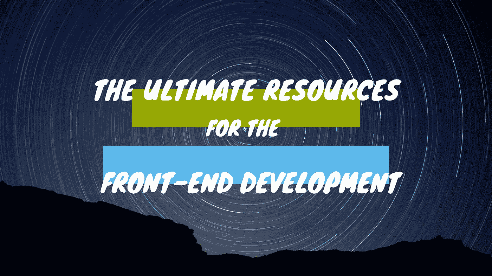

# 前端开发的终极资源

> 原文：<https://javascript.plainenglish.io/the-ultimate-resources-for-the-front-end-development-1abf471725d5?source=collection_archive---------23----------------------->

# 介绍

我在专业 web 开发环境中有 5 年多的经验。在过去的 8 年里，我收集了大量的网站/工具，通过智能工作提高了我的生产力，减轻了我的工作压力。

在这篇文章中，我分享了我个人用来提高工作效率的网站列表。我不会说，这些是改善网络开发的最好的网站，但它对改善我的网络开发载体有很大帮助。

在新的信息时代，数据被认为是黄金/石油，所以如果你有数据，那么最终你会比你的大学同事更富有

**请创建您自己的网站列表**来提高您的工作效率，并与全世界分享这些列表，以便其他人可以从这些链接中受益，他们可能会从您列出的网站中推荐一些您可能不知道的网站或更好的网站。

书签这个概念的网址，我会不断更新在即将到来的日期的链接。

 [## Web 开发的终极资源

### CSS 教程搜索项目| Behance Dribbble 上的照片、视频、徽标、插图和品牌

www . opinion . so](https://www.notion.so/naveenda/Ultimate-Resource-for-Web-Development-a59f7f89efe446d8a355b12e7ebc97ce) 

我经常看一些帖子，比如“ **200 多种网络开发资源**”，但是相信我，在你的生活中，你永远不会用到所有的网站。下面的列表只包含 48 个，收集了超过 8 年(包括我的大学时代和专业承运人的日子)，你应该把这个网站添加到你的个人列表，只有当你使用这个网站，它提高了你的生产力。

## 一般

**1。**CSS-Tricks—[https://css-tricks.com/](https://css-tricks.com/)

**2。** CSS 教程—[https://www.w3schools.com/css/](https://www.w3schools.com/css/)

## 灵感

**3。**Adobe 旗下设计师的社交媒体—[https://www.behance.net/](https://www.behance.net/)

**4。**设计师最好的社交之一——[https://dribbble.com/](https://dribbble.com/)

**5。【https://bestwebsite.gallery/】真实网站[提供灵感](https://bestwebsite.gallery/)**

**6。**利用真实网站提供灵感—[https://www.awwwards.com/](https://www.awwwards.com/)

7 .**。**网页设计灵感 CSS 图库— CSS 甘露—【http://cssnectar.com/ 

## 说明

**8。**开源插图—[https://undraw.co/](https://undraw.co/)

**9。**一个巨大的免费 3D 图形库—[https://www.shapefest.com/](https://www.shapefest.com/)

**10。**高质量 3D 插图—[https://www.figma.com/community/file/890095002328610853](https://www.figma.com/community/file/890095002328610853)

**11。**角色生成器—[https://sapiens.ui8.net/](https://sapiens.ui8.net/)

12。【https://illlustrations.co/】开源插图套件—[T21](https://illlustrations.co/)

## 颜色

13。超快速配色方案生成器—[https://coolors.co/](https://coolors.co/)

14。美丽的彩色渐变—[https://uigradients.com/#Zinc](https://uigradients.com/#Zinc)

15。最佳渐变场地尽在一处——[https://cssgradient.io/gradient-backgrounds/](https://cssgradient.io/gradient-backgrounds/)

## 发电机

16 岁。盒子阴影 CSS 生成器—[https://cssgenerator.org/box-shadow-css-generator.html](https://cssgenerator.org/box-shadow-css-generator.html)

**17。**为谷歌字体翻船——【https://seek-oss.github.io/capsize/ 

**18。**为您的设计创建 SVG 波形—[https://getwaves.io/](https://getwaves.io/)

**19。**为您的设计制作 SVG 形状—[https://www.blobmaker.app/](https://www.blobmaker.app/)

20。缓和渐变—[https://larsenwork.com/easing-gradients/#editor](https://larsenwork.com/easing-gradients/#editor)

**21。** CSS 图像双色调生成器—【https://cssduotone.com/ 

## 形象

**22。**谷歌颜色—[https://picular.co/](https://picular.co/)

**23。**高质量的免费图像—[https://unsplash.com/](https://unsplash.com/)

**24。**为你的网络项目提供免费纹理—[https://www.toptal.com/designers/subtlepatterns/](https://www.toptal.com/designers/subtlepatterns/)

**25。**pattern pad——为演示、社交媒体或品牌创建漂亮的图案。—[https://patternpad.com/](https://patternpad.com/)

## 核标准情报中心

26。【https://www.flaticon.com/】flat icon，最大的自由矢量图标数据库—

27。免费图标—[https://freeicons.io/](https://freeicons.io/)

28。 SVG 上色器，自动给 SVG 图标和 SVG 矢量上色—[https://www.iconshock.com/svg-color/](https://www.iconshock.com/svg-color/)

## 字体

**29。**谷歌字体—[https://fonts.google.com/](https://fonts.google.com/)

三十。在你自己的设计上预览 800 多种谷歌字体，而不必先下载。——[https://fontflipper.com/](https://fontflipper.com/)

**31。**免费排版扫描仪—【https://typoscan.com/ 

**32。**免费字体| 79000+字体下载—[https://www.fontspace.com/](https://www.fontspace.com/)

## 表演

**33。**https://css.github.io/csso/csso.htmlCSSO—CSS 优化器—

## 清单

34。https://frontendchecklist.io/✨你最好的前端工具✨ —

## Chrome 插件

**35。** Zoho Annotator — [https://chrome.google.com/webstore/detail/zoho-annotator/dmlmcpcjndojhbflolmdgf?hl=en (T3)](https://chrome.google.com/webstore/detail/zoho-annotator/dmlmcpcjndojhbflolmdgfpojnjfdlbj?hl=en)

(T4)37。ColorZilla — [https://chrome.google.com/webstore/detail/colorzilla/bhlhnicpbhignbdhedgjhgdocnmhomnp?hl=en (T7)](https://chrome.google.com/webstore/detail/colorzilla/bhlhnicpbhignbdhedgjhgdocnmhomnp?hl=en)

”(T8)38。 VisBug — [https://chrome.google.com/webstore/detail/visbug/cdockenadnadldjbbgcallicunedbeoc?hl=en](https://chrome.google.com/webstore/detail/visbug/cdockenadnadldjbbgcallicgledbeoc?hl=en)

(T12) 39。 响应式查看器 — [https://chrome.google.com/webstore/detail/responsive-viewer/inmopeiepgfljkpkidclfgbmfcennb?hl=en](https://chrome.google.com/webstore/detail/responsive-viewer/inmopeiepgfljkpkidclfgbgbmfcennb?hl=en)

## 喜欢 Fonts

(T16)40。 Sen — [https://fonts.google.com/specimen/Sen?query=sen#standard-styles](https://fonts.google.com/specimen/Sen?query=sen#standard-styles)

(T20) 41。Nunito Sans — [https://fonts.google.com/specimen/Nunito+Sans](https://fonts.google.com/specimen/Nunito+Sans)

(T24) 42。 Numans — [https://fonts.google.com/specimen/Numans?query=Numans (T27)](https://fonts.google.com/specimen/Numans?query=Numans)

”(T28)43。Tondocorp — [http://legionfonts.com/fonts/tondocorp-bold](http://legionfonts.com/fonts/tondocorp-bold)

(T32)44。Crimson Text — [https://fonts.google.com/specimen/Crimson+Text](https://fonts.google.com/specimen/Crimson+Text)

”(T36)45。 Quicksand — [https://fonts.google.com/specimen/Quicksand#standard-styles](https://fonts.google.com/specimen/Quicksand#standard-styles)

(T40) 46。Comfortaa — [https://fonts.google.com/specimen/Comfortaa](https://fonts.google.com/specimen/Comfortaa)

**48。**弗雷德里克大帝-【https://fonts.google.com/specimen/Fredericka+the+Great 

**感谢您的阅读！**如果你喜欢这篇文章，可以考虑[在 Twitter](https://twitter.com/NaveenDA_) 上关注我，并与你的开发者朋友分享这篇文章。

*更多内容请看*[***plain English . io***](http://plainenglish.io/)