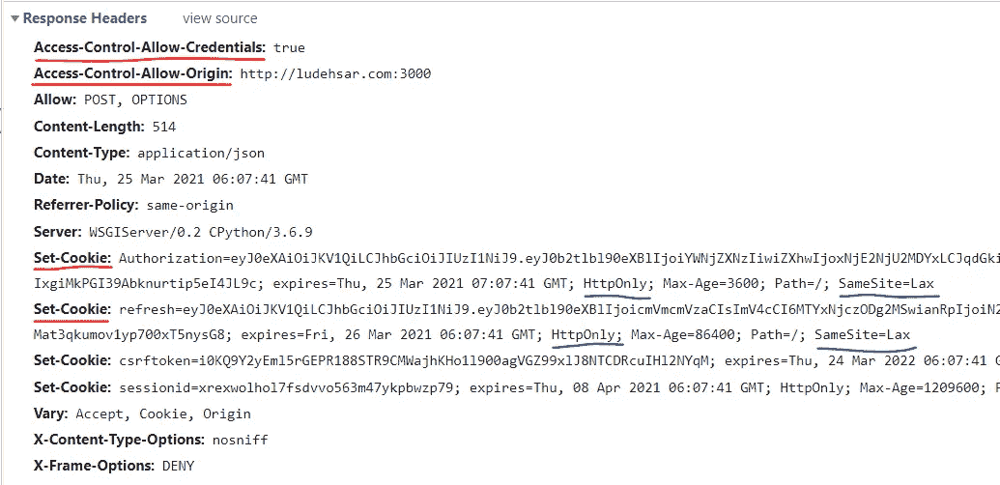

# 在 JavaScript 中存储身份验证令牌的最终方式

> 原文：<https://javascript.plainenglish.io/the-ultimate-way-to-store-authentication-tokens-in-javascript-41900756c1ae?source=collection_archive---------1----------------------->

## 像专业人士一样处理认证

Photo by [iMattSmart](https://unsplash.com/@imattsmart?utm_source=medium&utm_medium=referral) on [Unsplash](https://unsplash.com?utm_source=medium&utm_medium=referral)

在从事一个项目时，我遇到了一些关于存储身份验证令牌的问题。我不知道如何在前端安全地保存身份验证令牌，这样用户在刷新后就不会注销。经过几天的头痛，我已经学会了在用户浏览器中存储身份验证令牌的最终方法。今天，我将分享我关于如何存储和保护认证令牌的想法。首先，我们将讨论为什么我们不应该在客户端代码中存储认证令牌。然后，我们将看到推荐的选项，我们可以应用这些选项来存储我们的身份验证令牌。

# 为什么我们不应该使用客户端代码来处理认证令牌呢？

作为初学者，我们可能不知道除了使用客户端代码存储身份验证令牌之外，是否还有其他方法。通常，使用客户端 JavaScript 代码存储数据有两种方式:cookies 和本地存储。如果您在本地存储中处理认证令牌，您很容易受到 [XSS 攻击](https://en.wikipedia.org/wiki/Cross-site_scripting)。另一方面，如果你试图将你的认证令牌放在 cookies 中，你的项目就有可能受到 [CSRF 攻击](https://en.wikipedia.org/wiki/Cross-site_request_forgery)。从这两个角度来看，很明显，在前端存储和管理身份验证令牌对于您的项目来说可能会变得很危险。

# 那么有哪些选择呢？

一种方法是使用内存。如果您正在开发一个高度安全的系统，这是最好的选择。但是它对用户不友好，因为每当用户刷新页面时就会被注销。

另一种方法是使用 [HttpOnly Cookie](https://owasp.org/www-community/HttpOnly) 。每当用户成功登录 web 应用程序时，服务器都会向 web 浏览器发送一个 HttpOnly cookie。使用 HttpOnly cookie 的好处是它不能通过任何客户端 JavaScript 代码访问。因此没有客户端脚本能够检索这个 cookie。每当客户端请求授权内容时，服务器从浏览器获取 cookie，验证它，并响应请求。

为了防止 CSRF 攻击，您可以将`SameSite=Lax`属性添加到 cookies 中，尽管大多数现代浏览器都默认这样做。如果您的前端域不同于您的服务器域，浏览器将不会存储这些 cookies。为此，您需要将属性更改为`SameSite=None`，并向 cookies 添加另一个名为`Secure`的属性。它需要为您的 web 应用程序启用 HTTPS。

好的，我们现在通过服务器向浏览器发送 cookies。但是为什么浏览器没有存储 cookies 呢？嗯。要解决这个问题，首先启用`Access-Control-Allow-Credentials: true`。之后，将属性`credentials: “include”`添加到客户端 JavaScript 的 HTTP 客户端配置中(如果使用 Axios 或 Ajax，则为`withCredentials: true`)。此外，在`Access-Control-Allow-Origin`中提供准确的原点，以修复其他与 CORS 相关的问题。

# 让我们看一个例子

如果你想恰当地教授一些东西，举例子总是更好的。在这个例子中，我展示了我的项目中的一些代码片段。我们使用 React JS，Redux 作为前端，Django 作为后端。我们在系统中使用了 JWT 认证。我们在 Django 中使用的身份验证包在我们成功登录系统时会在浏览器中自动发送一个 HttpOnly cookie，所以我们现在不会关注后端。相反，我们将看到如何在 React JS 中管理我们的访问令牌和刷新令牌。如果你之前没有用过 React 或者 Redux，我想你还是会理解这个例子的。

首先，我们来看看 HTTP 客户端。在这个项目中，我们使用 Axios 向 API 发送请求并获得响应。

注意，在`defaultOptions`的结尾，我们用了`withCredentials: true`。然后我们用那个`defaultOptions`实例化一个 Axios 对象。

现在，让我们看看授权操作。

首先，让我们关注一下`authLogin`和`authSignup`方法。在认证用户之后，我们将访问令牌附加到我们的`apiClient`的授权头。对于我们的前端，我们不需要访问令牌和刷新令牌。后端服务器会自动为我们设置 cookie。

Response Header Sent from the Backend after Successful Login

我们只需要查看红色下划线的属性。将`Access-Control-Allow-Credentials`设置为`true`。我们还在`Access-Control-Allow-Origin`中提供了前端原点。其中一个重要的属性是`Set-Cookie`属性。后端正在我们的网络浏览器中设置 cookies。看，我们在`Set-Cookie`属性中有了`HttpOnly`和`SameSite`属性(用蓝色下划线标记)。

在`logout`方法中，我们请求一个登出后端的请求，然后后端从浏览器中删除 cookies。然后我们从`apiClient`中删除授权头。

Response Header Sent from the Backend after Logout

您可以看到，令牌在注销后已被设置为空字符串。

现在，我们已经成功登录并将令牌存储在 cookies 中。是时候保持登录状态了。我们有`authCheckState`方法获取当前登录的用户，有`refreshToken`方法在访问令牌到期前及时刷新访问令牌。在`refreshToken`方法中，当我们向后端发送请求时，服务器会自动从浏览器中获取 cookie，所以我们不需要担心共享刷新令牌。如果我们没有得到任何刷新令牌，我们调度`logout`方法。然后我们在 React **App.js** 文件中调用这些方法。

# 结论

在任何状态下，前端都不负责将访问令牌和刷新令牌存储在浏览器 cookies 或本地存储中。cookies 仅由后端发送到浏览器。它保护我们用户的隐私，强化我们应用程序的安全性。

综上所述，**不处理前端的任何敏感信息**。

*多内容于* [***中***](https://plainenglish.io/)