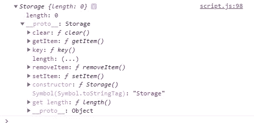
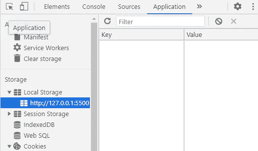
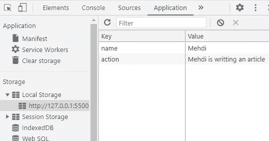
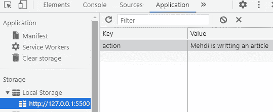
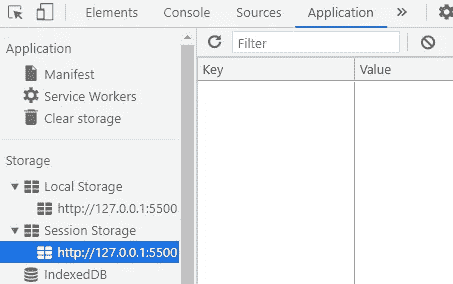

# 举例说明 JavaScript 中的 Web 存储 API

> 原文：<https://javascript.plainenglish.io/the-web-storage-api-in-javascript-explained-with-examples-85a5fac65155?source=collection_archive---------6----------------------->

## 通过示例了解 JavaScript 中的 web 存储 API。


Photo by [ThisisEngineering RAEng](https://unsplash.com/@thisisengineering?utm_source=medium&utm_medium=referral) on [Unsplash](https://unsplash.com?utm_source=medium&utm_medium=referral)

# 介绍

JavaScript 中的 web 存储 API 用于在用户的浏览器中存储数据。数据保存为键-值对，这使得处理数据更加容易。Web 存储 API 还提供了一些机制，通过这些机制，浏览器可以以比使用 cookies 更直观的方式存储键值对。

在本文中，我们将通过一些实例来了解 JavaScript 中的 web 存储 API。让我们开始吧。

# 局部存储器

Web 存储 API 的存储接口提供对永久保存数据的本地存储的访问。

JavaScript 中的 LocalStorage 是一个属性，它允许我们保存要存储在浏览器中的数据，即使是在用户刷新或关闭页面时。localStorage 中存储的数据没有到期时间，这有点类似于 cookies。它受到所有主流网络浏览器的支持，我们可以通过浏览器开发工具访问它。

以下是我们如何在控制台中访问本地存储的示例:

```
**console.log(window.localStorage);**
```

*输出:*



The output from the console.

正如您在输出中看到的，本地存储对象有许多属性和方法，我们可以使用它们来存储、添加和删除存储在浏览器中的数据。

正如我所说的，我们可以在开发工具中访问本地存储。

这里有一个例子:



The output from the dev tools.

如您所见，数据存储为键值对。因此，现在我们可以使用本地存储的属性和方法来添加、获取或删除数据。

下面是我们如何使用方法`setItem`在本地存储中添加一些数据:

```
**window.localStorage.setItem("name", "Mehdi");**
```

添加其他数据:

```
**window.localStorage.setItem("action", "Mehdi is writting an article");**
```

如您所见，方法`setItem`有两个参数:数据的名称和我们想要添加的数据。你可以给它起任何你想要的名字，我在这里用了`name`,因为数据是一个名字。

现在，所有这些数据都将添加到用户浏览器的本地存储中:



The output from the dev tools.

我们可以通过使用`getItem`方法获取这些数据，并将其显示在网页或控制台上:

```
console.log(window.localStorage.**getItem("name")**); 
//Mehdiconsole.log(window.localStorage.**getItem("action")**);
//Mehdi is writting an article
```

您还可以从本地存储中移除一个项目或清除所有项目。下面的例子删除了项目`name`:

```
window.localStorage.**removeItem("name")**;
```

*输出:*



The output from the dev tools.

或者，您可以使用`clear()`方法从存储中移除所有物品:

```
**localStorage.clear();**
```

# 会话存储

Web 存储 API 的存储接口还提供对会话存储对象的访问，该对象存储当前页面会话的数据，而不是永久作为本地存储。一旦用户关闭页面，保存的数据将会丢失，不会传输到服务器。会话存储提供 5MB 的存储限制，优于 cookies。它与本地存储做同样的事情，唯一的区别是当用户关闭浏览器时，数据将会丢失。

会话存储也有一些方法和属性，通过它们可以设置、检索和移除数据项。

我们还可以在开发人员工具中访问会话存储:



Session storage.

下面是我们如何使用方法`setItem`在会话存储中添加一些数据:

```
window.sessionStorage.**setItem("name" , "John Doe")**;
```

在控制台中使用获取项目，例如:

```
console.log(sessionStorage.**getItem("name")**);
//John Doe
```

移除项目:

```
sessionStorage.**removeItem("name")**;
```

本地存储的所有其他方法和属性都可以应用于会话存储。

# 结论

web 存储 API 是一个非常棒的特性，因为它比使用 Cookies 简单得多，而且可以保存更多的数据。所有的浏览器都支持这个 API，你不必为此烦恼。

感谢您阅读本文，希望您觉得有用。

# 更多阅读

*如果你对 JavaScript 和 web 开发相关的更有用的内容感兴趣，也可以* [*订阅*](https://mehdiouss.ck.page/) *我的快讯。*

*下面是另一篇有用的文章，请点击链接查看:*

[](https://medium.com/javascript-in-plain-english/factory-functions-in-javascript-explained-with-examples-8b93e98de117) [## 用例子解释 JavaScript 中的工厂函数

### 通过示例了解 JavaScript 中的工厂函数。

medium.com](https://medium.com/javascript-in-plain-english/factory-functions-in-javascript-explained-with-examples-8b93e98de117)