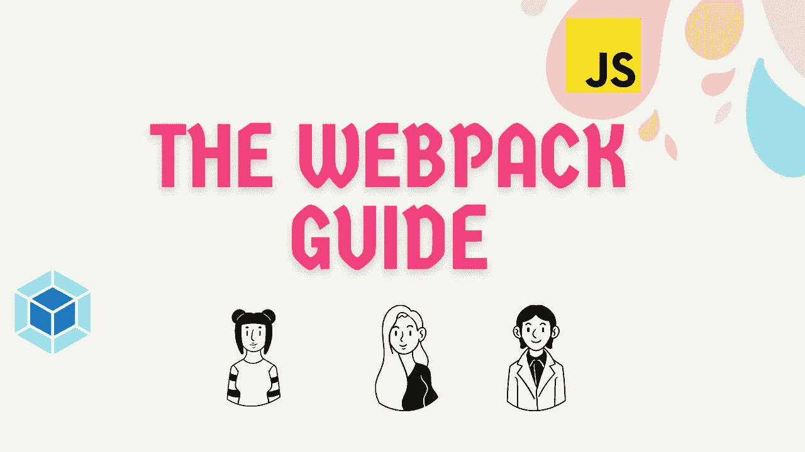
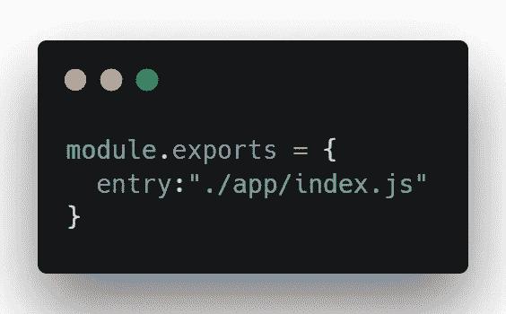
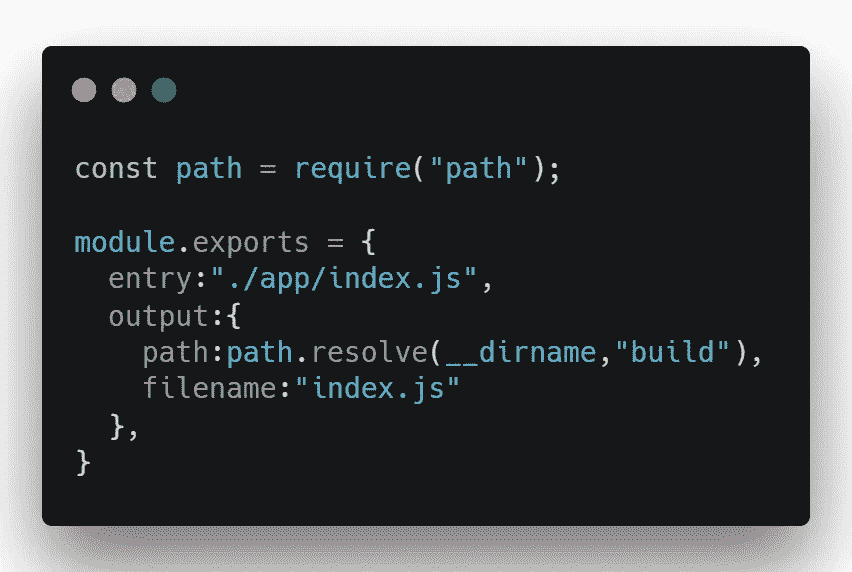
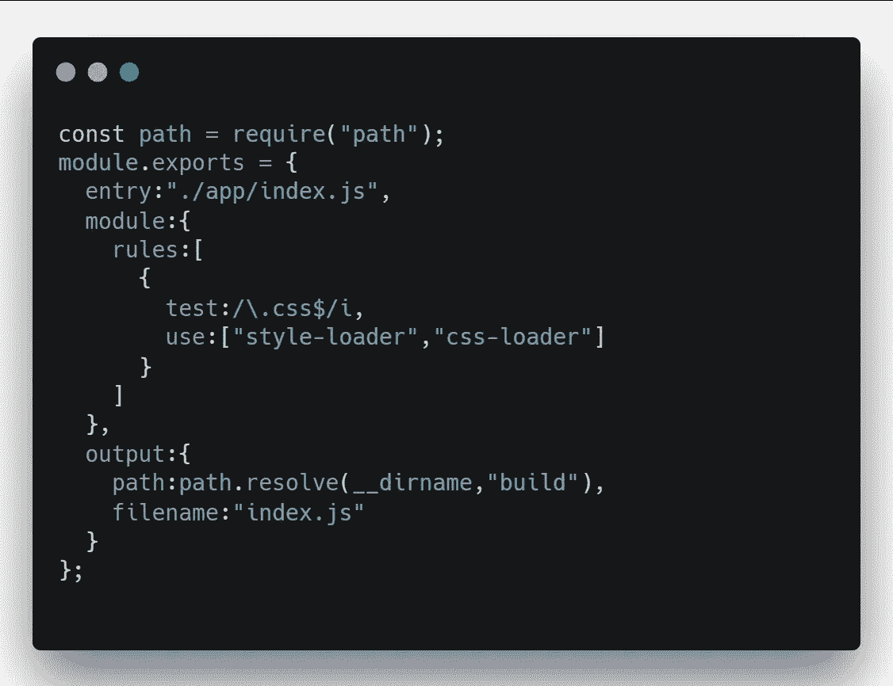
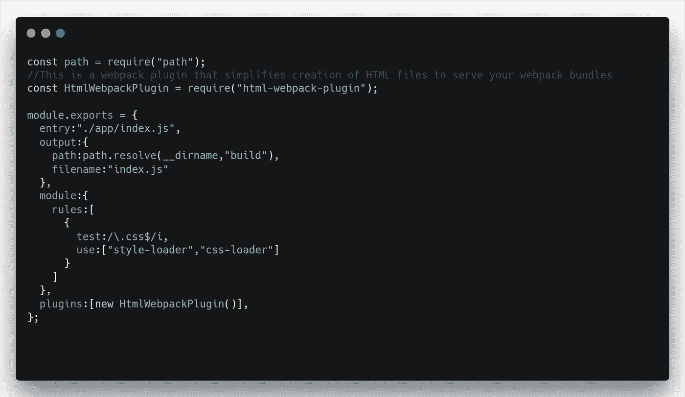
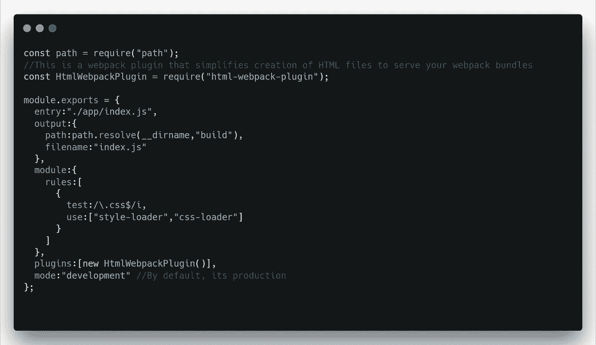

# 面向初学者的网络包指南

> 原文：<https://javascript.plainenglish.io/the-webpack-guide-for-beginners-87b5dce89400?source=collection_archive---------2----------------------->



前端开发已经从传统方法转变为模块化方法，改进了代码库的封装和结构。工具成为任何项目的关键部分，现在有很多可能的选择。但是浏览器只知道 HTML，CSS，JavaScript。因此，模块打捆机在现代工作流程中发挥着至关重要的作用。

理解工具是任何项目的关键部分，理解项目的工具也很重要。

Webpack 因其强大的配置和可伸缩性在过去几年中广受欢迎，但一些开发人员发现其配置过程令人困惑，难以采用。*本文让您对 webpack 配置和模块如何工作有一个基本的了解。*

## **什么是 Webpack？**

Webpack 是一个静态模块捆绑器。它的主要目的是捆绑 JavaScript 文件以便在浏览器中使用，但它也能够转换、捆绑或打包任何资源或资产。

webpack 背后的动机是**收集您所有的依赖关系**，不仅包括代码，还包括其他资产，并生成依赖关系图。捆绑器只准备处理 JS 文件，所以 webpack 需要在捆绑所有其他文件和资产之前对它们进行预处理。

## **web pack 中的依赖图是什么？**

一个文件依赖于应用程序中的任何文件类型，例如(JavaScript、CSS /SCSS，以及图像、SVG、web 字体等非代码资产)——web pack 将其视为依赖项。

当 webpack 捆绑您的应用程序时，它从您的 *webpack.config.js* 文件中的一个入口点开始，并递归地构建一个依赖关系图，其中包括您的应用程序需要的每个依赖关系，并根据您的需要将它们捆绑到一个或多个文件中，它由浏览器加载。

# 核心概念

## **条目**

一个**条目**属性表示一个模块的起点，开始构建一个内部依赖图对 webpack 是有用的。

默认情况下，其值为。 */src/index.js* ，但是您可以通过在 webpack 配置文件中设置 entry 属性来指定不同的一个(或多个)入口点。

首先，让我们开始在根文件夹中创建 webpack.config.js，并将单个入口点指定为。 */app/index.js* 。



entry demo at webpack.config.js

用法:`entry: string | [string]`

要添加多个条目，可以在 entry 属性中分配一个文件数组。

## **输出**

一个**输出**属性告诉 webpack 把它生成的包放在哪里，以及如何命名这些文件。默认情况下，需要。/dist/main.js 作为主输出文件。/dist 文件夹中的任何静态内容。

您可以通过在配置中指定输出字段来配置这部分流程:



output demo at webpack.config.js

## **装载机**

正如该属性的名称所示，它允许 webpack 处理任何类型的文件，并将它们转换为您的应用程序使用的有效模块，并添加到您的依赖关系图中。因为 webpack 只懂 javascript 和 JSON 文件。

它在单个文件级别的包生成之前或开始时工作。

加载器还可以使用适当的加载器将文件从不同的语言(如 TypeScript)转换为 javascript，或者将内嵌图像作为数据 URL 加载，还允许您在 JavaScript 模块中直接导入 CSS 文件。

概括地说，webpack 有两个属性，即“测试”和“使用”

1.  一个**测试**属性，用于指示需要处理哪个或哪些文件。
2.  一个**使用**属性来告诉 webpack 哪些加载器用来将文件转换成有效的模块。

在您的 *webpack.config.js 中使用加载器之前，*我们需要将它们作为依赖项安装在您的应用程序中。

```
*npm install -D style-loader css-loader*
```



loader demo at webpack.config.js

这里是几个流行的加载器，我们在创建我们的前端应用程序时使用。

1.  这个包允许使用 babel 和 webpack 传输 JavaScript 文件。
2.  [*ts-loader*](https://www.npmjs.com/package/ts-loader)*-*加载 [TypeScript](https://www.typescriptlang.org/) 2.0+喜欢 JavaScript
3.  [SASS-loader](https://www.npmjs.com/package/sass-loader)-加载并编译一个 SASS/SCSS 文件
4.  一个 webpack 加载器，它以 utf-8 编码的 DataUrl 字符串的形式加载 svg 文件。

## **插件**

虽然加载器用于转换某些类型的模块，但是插件可以用来执行更广泛的任务，比如包优化、资产管理和环境变量的注入。

它在包级别的包生成结束时或之后工作，因此它对包有更多的控制。

要使用一个插件，您需要将它作为一个依赖项安装，并使用 *require()* 方法导入它，并将其添加到 webpack 配置文件中的插件数组中。



plugin demo at webpack.config.js

这里是几个流行的插件，我们在创建我们的前端应用程序时使用。

1.  这个插件使用`[eslint](https://eslint.org/)`来发现并修复你的 JavaScript 代码中的问题。
2.  [webpack-bundle-analyzer](https://www.npmjs.com/package/webpack-bundle-analyzer)
3.  clean-webpack-plugin-一个 web pack 插件，用于删除/清理你的构建文件夹。
4.  这个插件使用 [terser](https://github.com/terser/terser) 来缩小/最小化你的 JavaScript。
5.  [purge css-web pack-plugin](https://www.npmjs.com/package/purgecss-webpack-plugin)-web pack 插件移除未使用的 CSS。
6.  这个插件使用 [uglify-js](https://github.com/mishoo/UglifyJS2) 来缩小你的 JavaScript。

## **模式**

模式属性接受三个值，即生产、开发和无。您可以根据每个环境启用 webpack 内置优化。



mode demo in webpack.config.js

**参考文献**

1.  [https://webpack.js.org/concepts/](https://webpack.js.org/concepts/)
2.  [https://www.youtube.com/watch?v=yiwSVeHYosQ](https://www.youtube.com/watch?v=yiwSVeHYosQ)

**感谢您的阅读！**如果你喜欢这篇文章，可以考虑[在 Twitter](https://twitter.com/Urs_Vijay_) 上关注我，并与你的开发者朋友分享这篇文章。

*更多内容请看*[***plain English . io***](http://plainenglish.io/)