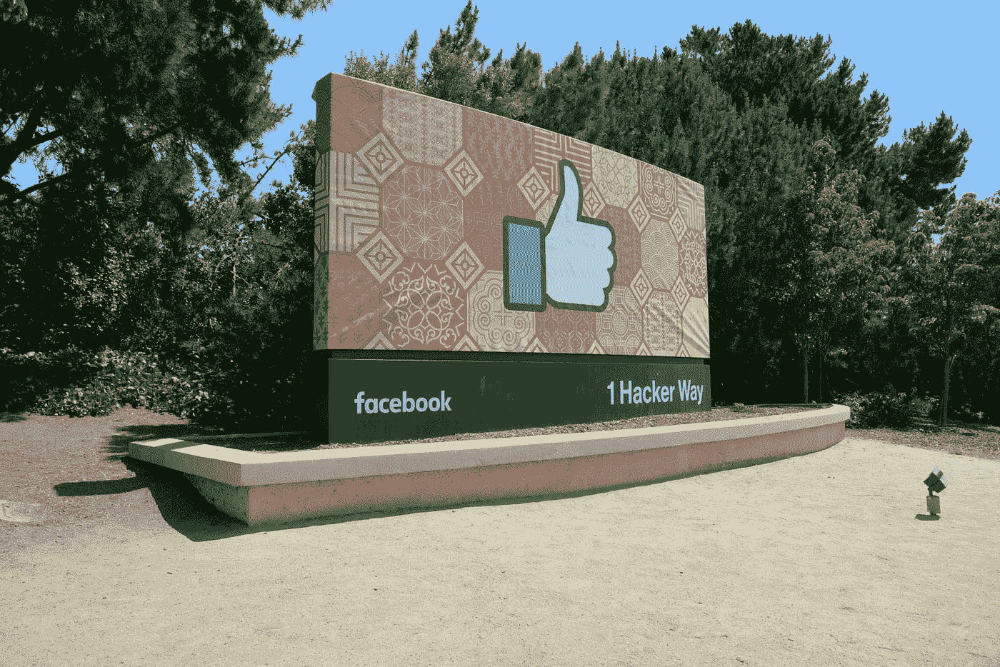
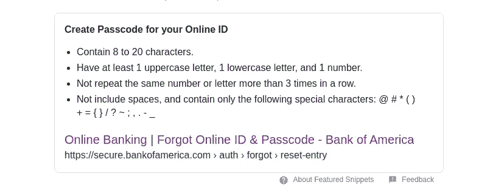
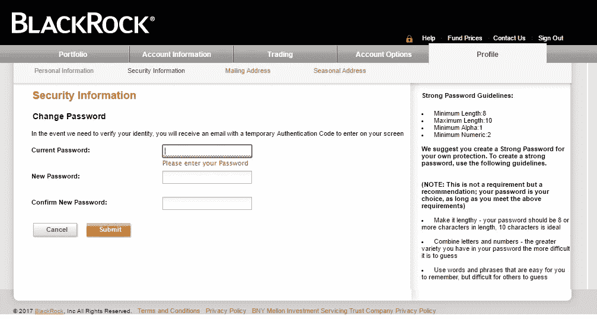

# 公司犯的最严重的密码错误

> 原文：<https://javascript.plainenglish.io/the-worst-password-mistakes-companies-make-457f872d7cfe?source=collection_archive---------4----------------------->

## 不充分的密码要求、不安全的令牌处理等等

Photo by [Greg Bulla](https://unsplash.com/@gregbulla?utm_source=medium&utm_medium=referral) on [Unsplash](https://unsplash.com?utm_source=medium&utm_medium=referral)

如今，数据是公司最有价值的资产之一。应该不惜一切代价保证它的安全，因为泄漏会对用户的信任和业务发展造成灾难性的后果。然而，许多公司在安全问题上犯了巨大的错误。这对中小企业来说尤其如此，尽管即使是大企业有时也会因为致命的错误而遭到黑客攻击，这可能会导致丑闻。

## 用户的密码要求不正确

大多数网络应用程序需要你注册一个帐户才能使用。我们都很熟悉某些登录系统强制执行的密码要求，从最小长度到至少使用一个特殊字符。然而，一些公司完全误解了这一点。

你能想到的最蠢的密码规则是什么？你大概可以在[这个 GitHub 库](https://github.com/duffn/dumb-password-rules)里找到。它包含了一系列现实中的公司强加给客户的不适当的要求

[美银](https://secure.bankofamerica.com/)不允许超过 20 个字符或者不允许特殊字符怎么办？不是应该保证你的钱安全吗？

Bank of America password requirements.

你认为不允许超过 10 个字符的密码是什么？[贝莱德](https://nge01.bnymellon.com/NextGenV4/dflt/Login.blk)真的成功了！

Black Rock password requirements.

实施这样的限制极大地减少了破解散列的时间，并且告诉黑客特定网站的密码是什么样的，完全免费。

## 将令牌视为密码

许多公司通过某种认证令牌来提供服务。这从本质上来说并不是一种不好的做法，但是您应该始终检查令牌是否来自可信任的来源，或者是否已经遭到破坏。您不应该允许不同的设备使用同一个会话令牌，也不应该让一个令牌单独授予对经过身份验证的会话的访问权限。

令牌的问题在于，它们可以相对容易地被窃取，因为它们大多存储在浏览器中，很少受到保护。这会使您的应用程序面临[会话劫持](https://en.wikipedia.org/wiki/Session_hijacking)攻击，甚至伪造登录页面。最近，我遇到了一家学校管理软件公司——我不会透露它的名称，因为他们目前还没有解决这个问题——它不检查他们的会话和登录请求令牌。

## 以纯文本形式存储密码

这似乎是一个只有没有经验的开发人员才会犯的错误，但许多大公司，如脸书、谷歌和 GitHub，实际上都这么做过。

我们都知道，如果您的数据库系统出现数据泄露，您所有的用户帐户都很容易受到威胁。但是，您可能不会想到通过错误配置的日志记录系统过滤敏感信息。2019 年，数百万脸书和 Instagram 用户在以可读格式存储的日志中找到了他们的密码([about.fb.com](https://about.fb.com/news/2019/03/keeping-passwords-secure/))。

## 赋予密码太多的权力

密码不足以在任何系统中执行任何关键操作。特权角色必须始终受到双因素身份认证的保护，因为一个受损的特权帐户可能会导致灾难性的攻击。

另一个类似的问题是没有为您的用户提供双因素身份认证选项。令人难以置信的是，许多公司仍然完全不支持这种方法。

## 强制定期更改密码

众所周知，时间过得越久，密码被破解的可能性就越大。这就是为什么许多公司要求他们的客户定期更改他们的身份验证凭据，将选择强密码的责任留给他们。

然而，这可能是一个问题，因为用户通常坚持可预测的模式，例如将“Summer2020”修改为“Summer2021”，并且他们通常会尝试绕过不安全的密码策略。国家标准与技术研究所([【NIST】](https://www.nist.gov/))[建议实施一个禁用密码列表](https://www.packetlabs.net/periodic-password-changes/)，以阻止用户选择脆弱且可预测的密码，包括字典单词、用户名和连续字符，如“1234”。

此外，应该定期对照公共数据泄露数据库检查凭据，以确定使用特定密码是否安全。不过，要小心，不要通过互联网发送你珍贵的未加密字符串:如果在本地发送，会安全得多。

## 不加盐和胡椒

尽管计算机已经变得比以往任何时候都更强大，但密码破解从未如此之快。问题是技术大大进步了，但常用密码还是老样子。

[加盐](https://en.wikipedia.org/wiki/Salt_(cryptography))在于添加唯一的随机化数据作为密码散列函数的附加输入。然后，随机盐将被存储在数据库中，并在登录请求时被检索。

[加密](https://en.wikipedia.org/wiki/Pepper_(cryptography))在于添加一条秘密数据，作为密码散列函数的附加输入。与盐和哈希不同，胡椒是分开储存的，以防数据库泄露。

添加到密码中的这些额外数据使密码变得独一无二，因此使用[彩虹表](https://en.wikipedia.org/wiki/Rainbow_table)更难破解。加盐和胡椒可以增加弱密码的安全性，使复杂的密码几乎无法破解。

## 结论

总而言之，安全性并不意味着 100%不会失败。而是研究保护系统免受已知威胁的最佳实践，并在恶意黑客之前发现新的漏洞。

这些只是在密码处理领域犯的许多错误中的几个，但是它们仍然是重要的，在任何需要某种安全级别的应用程序中都应该避免。

我希望你喜欢这篇文章。如果你知道任何其他关于密码的大错误，请在评论中分享。**感谢阅读！**

如果你喜欢这篇文章，我建议你也看看下面这个故事:

 [## 奇异的编程语言:为什么黑客使用它们

### 世界在不断发展，网络罪犯也在不断发展。跟上变化很重要，这样才不会成为受害者…

javascript.plainenglish.io](/exotic-programming-languages-why-hackers-use-them-5c96f534e9dc) 

*更多内容看* [***说白了就是***](http://plainenglish.io/) ***。*** *报名参加我们的* [***免费每周简讯这里***](http://newsletter.plainenglish.io/) ***。***