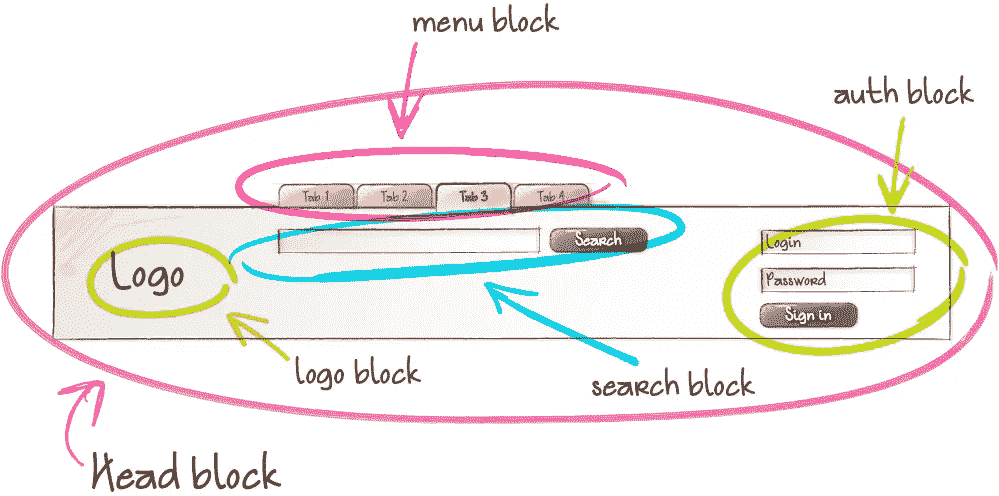

# 这两种方法会让你重新思考 CSS 中的命名

> 原文：<https://javascript.plainenglish.io/these-2-methodologies-will-make-you-rethink-naming-things-in-css-cd15e2e3469c?source=collection_archive---------18----------------------->

## *计算机科学只有两个硬东西:缓存失效和事物命名。菲尔·卡尔顿。*

Photo by **@surface** on: Unsplash.

前端开发是 IT 中最具欺骗性的领域。当你进入它时，一切似乎都很容易，你花一些时间学习 HTML，然后你转向 CSS，你甚至不理解它的大部分原理，但你转向 JavaScript。

一旦你决定用 HTML、CSS 和 JavaScript 构建一个有趣的东西，现实会让你意识到这些东西的复杂性，尤其是 CSS。

CSS 是骗人的；它简单的语法隐藏了构建健壮布局和响应界面的复杂性，甚至隐藏了如何在 CSS 中命名事物的复杂性。

你可能不会认真对待 CSS 中的命名，但它的重要性揭示了持久开发和如何处理旧项目。

## 如何在 CSS 中命名事物

在严肃的前端项目中命名东西是很重要的，考虑到其他开发人员甚至将来的你应该理解你的 CSS 代码如何影响你的标记中的每一个收缩。

更好的 CSS 命名是关于使用类选择器，一个语义类。为什么要使用语义类选择器？

类选择器具有较低的特异性，这意味着它们很容易在您的项目中重用。如果你不知道特异性到底是什么，你可以看看我的一篇文章，我在那里解释得很清楚。

 [## 如何计算 CSS 选择器特异性

### 关于 CSS 选择器你不知道的是

javascript.plainenglish.io](/how-to-calculate-css-selector-specificity-72aa076c6a18) 

我提到了语义这个词。当我们使用语义这个词时，我们指的是有意义的事物。与语义 HTML 一样，语义类名意味着类名应该描述它做了什么或者它影响了标记中的哪些内容。

比如，你不应该使用这几种类名:`red-text`、`blue-button`、`fontw-900`为什么？这与现有的设计有关。考虑到设计可能会改变。

使用`class="blue-button"`作为主要动作按钮很好，但是如果主要按钮变成棕色怎么办？现在我们的类按钮是混乱的，没有意义。更好的选择是使用像`.primary-btn`这样的名字。

在简单讨论了 CSS 中的命名之后，让我们看看在 CSS 中命名事物的两种方法。每一个都有一个独特的用例在开发过程中帮助你。

## **块-元素-修改器(BEM)**

Block-Element-Modifier 或 BEM 是一种在 CSS 中命名事物的方法，由 Yandex 创建。这种方法的核心思想是把你的网站想象成一个可重用组件块的集合来构建界面，就像 React 库中的组件一样..

BEM 中的块代表文档中作为页脚、页眉或侧边栏的一个部分。一个*块*可以包含其他块，例如，一个节可以包含两篇文章，一个标题可以包含导航和一个徽标，如下图所示。

Photo from [**BEM website**](https://en.bem.info/methodology/key-concepts/#element)

有了 BEM，事情不会就此停止。我们可以更深入地研究*元素*和*修饰符。* E *元件*是*块*的底层结构。

BEM 文档将*元素*定义为:

> [**块**](https://en.bem.info/methodology/key-concepts/#block) 的组成部分，不能在它之外使用。例如，菜单项不在菜单块的上下文之外使用，因此它是一个元素。

例如，一个菜单*块*包含许多菜单元素(如下图)，BEM 方法建议不要在其他元素中使用元素[。](https://en.bem.info/methodology/faq/#why-not-create-elements-of-elements-block__elem1__elem2)

Photo from [**BEM website**](https://en.bem.info/methodology/key-concepts/#element)

根据边界元法的规则， [**块**](https://en.bem.info/methodology/key-concepts/#block) 名称在一个项目中必须是唯一的，一个 [**元素**](https://en.bem.info/methodology/key-concepts/#element) 名称在一个块中必须是唯一的，对于一个可能根据用户喜好而变化的块外观，使用 [**修饰符**](https://en.bem.info/methodology/key-concepts/#modifier) **。** [块](https://en.bem.info/methodology/key-concepts/#block)、[元素](https://en.bem.info/methodology/key-concepts/#element)和[修改器](https://en.bem.info/methodology/key-concepts/#modifier)都称为边界元实体。

**根据边界元法的命名规则:**

`block-name__elem_name--mod-name--mod-val`

*   名字是用小写拉丁字母写的。
*   BEM 实体名称中的单词由连字符(`-`)分隔。`menu-bloc`
*   元素名和块名之间用双下划线(`__`)隔开。`menu__item`
*   修饰符名称通过双连字符(`--`)与块或元素的名称分开。`menu--theme`
*   修饰符的值和它的名字用一个双连字符(`--`)分开。`menu--theme--dark`

和往常一样，看比解释容易多了。

在上面的例子中，menu-theme-dark 和 menu _ _ item-theme-dark 是附加的类名，以防我们在菜单上使用了黑暗模式。类选择器是 BEM 方法中唯一使用的选择器，但是使用子代、后代和类型选择器是安全的。

边界元法具有以下优点:

*   你可以重用你的 CSS。
*   你不会纠结于特异性，因为你用的是低级选择器(类选择器)。
*   阶级之间没有冲突。

对于它的缺点

*   类名可能会变得有点长且难看
*   HTML 可以有很多类

BEM 在一开始可能看起来很复杂。一旦你尝试过，你会像我一样喜欢它。关于 BEM 的更多信息，它的优点和缺点，你可以查看 Johan Ronsse 的这篇[伟大的文章，或者访问](https://mono.company/frontend/learning-to-love-bem/) [BEM 的官方网站。](https://en.bem.info/methodology/key-concepts/)

## 原子 CSS

在 CSS 中命名事物的另一种方法是原子 CSS，由 Thierry Koblentz 在“[挑战 CSS 最佳实践](https://www.smashingmagazine.com/2013/10/challenging-css-best-practices-atomic-approach/)”中命名和解释。原子 CSS 使用类选择器作为边界元。

Atomic 使用的命名系统非常接近 Bootstrap 使用的系统(见下文)。原子 CSS 中的大多数类名都描述了它们的用途，但没有说明它们影响了哪些内容。

An example of using Boostrap classes.

为了说明原子 CSS 是如何工作的，我们将创建一些 CSS 代码并在 HTML 标记中使用它。

现在我们有一堆 CSS 类可以在我们的标记中使用。简而言之，每个类代表一个 CSS 属性。这就是为什么我们有大量的 CSS 代码。在我们的标记中的用法如下:

`
`

我们使用的标记将创建一个显示错误的消息框。我们在这里使用了很多类名。但是当你意识到把消息框从错误框变成警告框需要改变一个字母时，这是值得的。

`
`

如您所见，我们刚刚将`bg-`和`bc-`中的字母`e`改为`w`，将错误消息框变为警告消息框。

原子 CSS 有一些优点，例如:

*   通过使用低特异性选择器来避免冲突。
*   创建高度可重用的类。
*   你知道你要改变什么，因为每个类代表一种风格，删除或添加一个类很简单。

对于它的缺点，原子 CSS 是一个烂摊子。感觉像是使用了 web 早期的样式属性。原子 CSS 的主要问题是将内容与表示分离。

如果`class="gray"`将文本颜色改为灰色，如果我们决定将带有`.gray` 类的所有内容都改为黑色，该怎么办？

我们可以删除`.gray` 并添加另一个类，例如`.black,`，但是现在我们改变了我们的 HTML，打破了 [*将内容与表示*](https://learn.co/lessons/separation-of-content-and-presentation) 分开的规则。

## 我应该用原子 CSS 还是 BEM？

很明显，原子 CSS 适用于那些喜欢编写 CSS 规则库，然后将它们应用于标记的人，一个开发人员或一个知道每个规则的小团队。

BEM 为大型团队工作。本 BEM 中的命名系统是描述性的。团队中的大多数开发人员会弄清楚每个类是做什么的，以及它会影响哪种事情。

## 最后

我们已经走了很长的路来理解如何命名我们的 CSS 代码。我们可以使用语义类选择器或 BEM 或原子 CSS 方法。这些方法中的每一种都有其独特的命名系统。

现在由您来决定是使用原子 CSS、BEM 方法，还是都不使用。

*更多内容请看*[***plain English . io***](http://plainenglish.io/)