# 你不知道的 JavaScript 内存泄漏的秘密

> 原文：<https://javascript.plainenglish.io/these-5-bad-javascript-practices-will-lead-to-memory-leaks-and-break-your-program-9cf692303043?source=collection_archive---------2----------------------->

## 用 Chrome DevTools 调试，找到解决方案！


你有没有在面试的时候被问到过这样的问题:如果一个网页死机了，你觉得可能是什么原因造成的？有什么办法找到原因并解决吗？

这是一个广泛而深入的问题，涉及到很多页面性能优化的问题。我还记得我在面试中被问到这个问题时是怎么回答的:

1.  首先检查网络请求是否过多，导致数据传输变慢。这个问题可以通过缓存来优化。
2.  也有可能某个资源的捆绑量太大，我们可以考虑拆分。
3.  检查我们的 JavaScript 代码，看看是否有太多的循环占用了主线程太多的时间。
4.  可能是浏览器在某一帧渲染了太多东西。
5.  在页面渲染过程中，可能会有大量重复的回流和重绘。
6.  也许是别的，我不知道…

后来，我意识到页面的长时间感觉口吃也可能是由内存泄漏引起的。在这篇文章中，我将和你讨论这个话题。

# 什么是内存泄漏？

内存泄漏是由于疏忽或某些程序错误而无法释放不再使用的内存。简单来说，如果一个变量消耗了 100M 内存，而你并不需要它，但是它没有被手动或自动释放，它仍然消耗 100M 内存。这是内存浪费或内存泄漏。

# 堆栈内存和堆内存

JavaScript 内存分为堆栈内存和堆内存，前者用于简单变量，后者用于复杂对象。

*   简单变量是指原始数据类型，如`String`、`Number`、`Boolean`、`Null`、`Undefined`、`Symbol`、`Bigint`。
*   复杂对象是指引用数据类型，如`Object`、`Array`、`Function` …

# JavaScript 中的垃圾收集

根据内存泄漏的定义，一些变量或数据不再被使用或需要，那么它就是垃圾变量或垃圾数据。如果将它保存在内存中，最终会导致内存的过度使用。这时候就需要回收这些垃圾数据了。这里，我们介绍垃圾收集机制的概念。

垃圾收集机制分为两类:手动和自动。

C 和 C++使用的是手动回收机制，即开发者先通过代码为一个变量手动分配一定量的内存，然后在不需要的时候，开发者会使用代码手动释放内存。

另一方面，JavaScript 使用自动收集，这意味着我们不关心给变量分配多少内存或何时释放内存，因为这都是自动的。但这并不意味着我们不需要关心内存管理！否则，就不会出现本文中讨论的内存泄漏。

接下来，我们来讨论一下 JavaScript 垃圾收集机制。

一般来说，全局变量不会自动回收，所以我们将重点放在本地作用域内存收集上。

下面是一段代码:

上面代码的调用栈如下图所示:

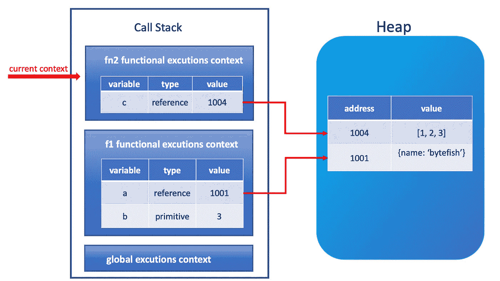

图的左侧是堆栈空间，用于存储执行上下文和原始类型数据。右边是堆空间，用于存储对象。

当代码执行到`fn2()`时，调用栈中的执行上下文从上到下依次是`fn2 functional execution context`=>`fn1 functional execution context`=>=`global execution context`。

当函数`fn2`已经完成其内部执行时，是时候通过向下移动箭头来退出`fn2`执行上下文了。`fn2`执行上下文被清除，堆栈内存空间被释放，如下图所示:

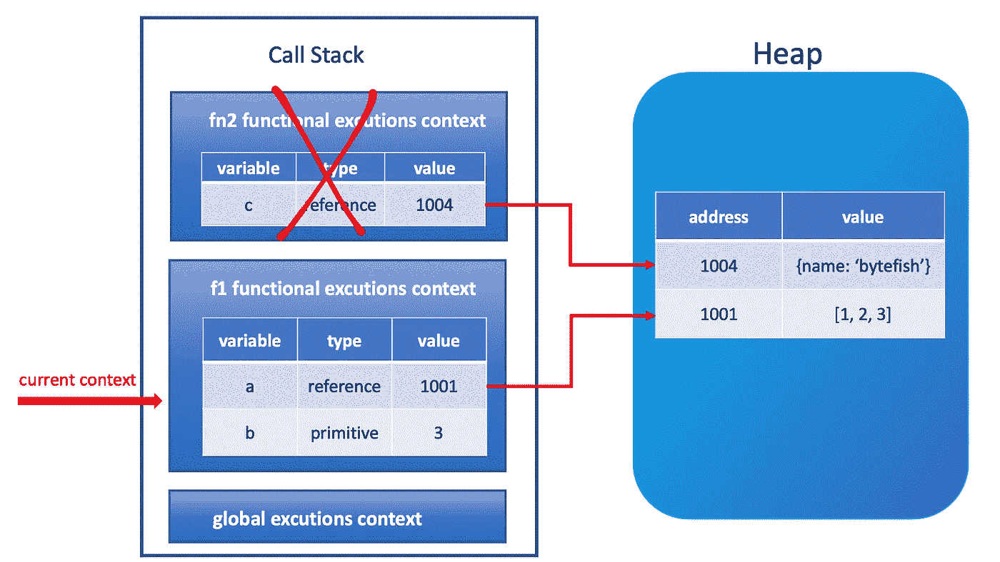

函数`fn1`内部执行完成后，是时候退出`fn1 functional execution context`了，也就是箭头再次下移。此时`fn1 functional execution context`将被清零，相应的堆栈内存空间将被释放，如图所示:

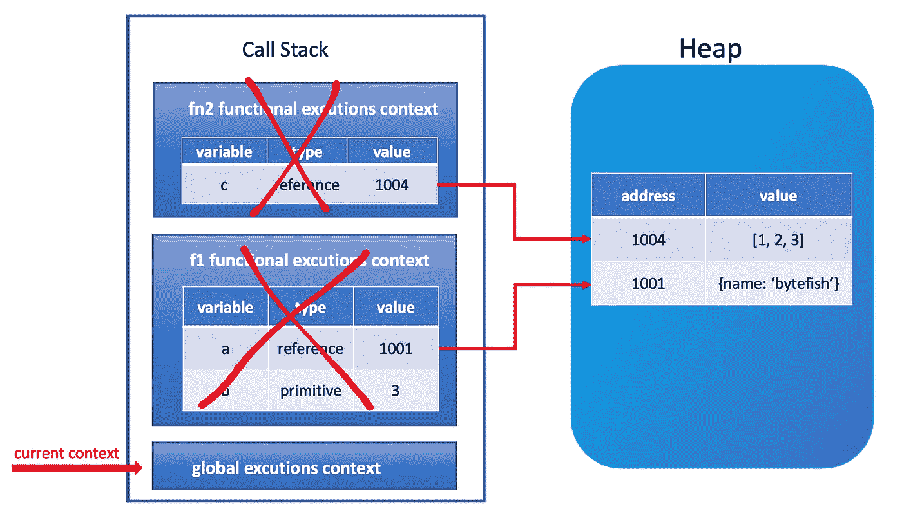

此时，我们的程序处于全局执行上下文中。

JavaScript 垃圾收集器每隔一段时间遍历一次调用堆栈并收集垃圾。假设此时触发了垃圾收集机制。当垃圾收集器遍历调用栈时，发现变量`b`和`c`没有被使用，于是确定它们是垃圾数据，并对它们进行标记。因为`fn1`函数执行后返回变量`a`并存储在全局变量`res`中，所以被识别为活动数据并做相应标记。在空闲时，所有标有垃圾数据的变量都会被清除，释放出相应的内存，如图所示:

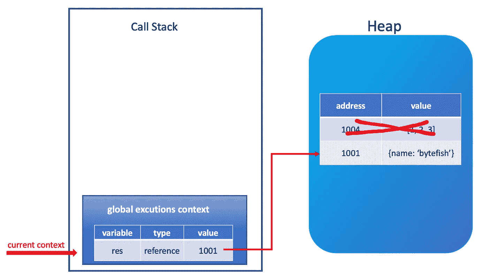

这里有一个简短的总结:

1.  JavaScript 的垃圾收集机制是自动化的，标签用于识别和清理垃圾数据。
2.  离开局部作用域后，如果该作用域中的变量没有被外部作用域引用，它将在以后被清除。

# 使用 Chrome DevTools 观察内存使用情况

使用 Chrome DevTools 的性能和内存面板，我们可以观察一个 JavaScript 应用程序的内存使用情况，这让我们对内存管理机制有了更深入的了解。

*注:如果你还不知道如何使用 Chrome DevTools，可以看看我之前的文章*[](/use-chrome-devtools-like-a-senior-frontend-developer-99a4740674)**。**

*首先，让我们准备一个简单的 JavaScript 程序:*

*这个页面很简单:页面上只有一个按钮，我们每次点击这个按钮，我们的程序都会创建一个新的数组，并存储在数组`res`中。*

*在您的电脑上创建此文件，然后复制文件地址并在 Chrome 浏览器中打开该文件:*

*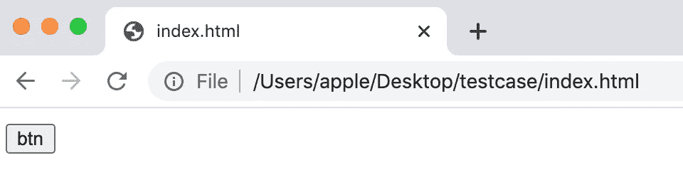*

*注意:请确保使用文件地址直接打开文件，不要使用 VSCode 或其他 IDE Live Server 功能打开文件。后者将热更新代码插入到文件中，使得我们的内存观察不准确。如果有必要，你也应该暂时禁用你的浏览器的扩展，以免干扰我们随后的测试。*

*然后，我们打开浏览器开发工具的性能面板:*

*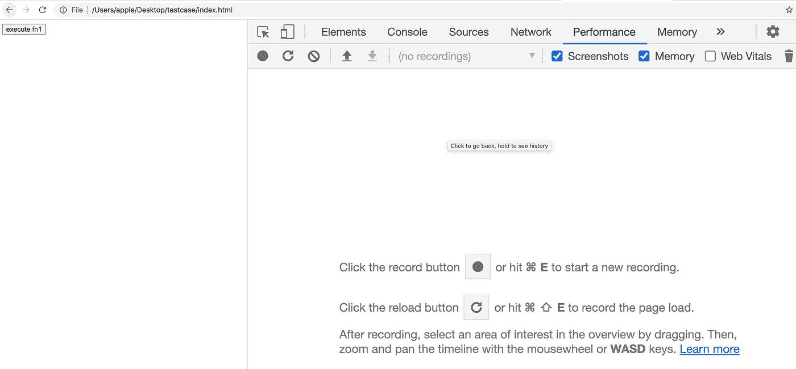*

*这个面板有很多功能。上面的灰点是记录程序内存使用情况的按钮。点击圆点开始记录，然后反复点击`execute fn1`按钮，得到如下结果:*

*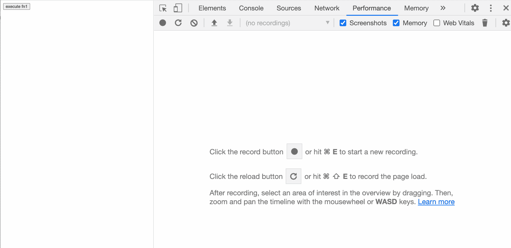*

*结果:*

*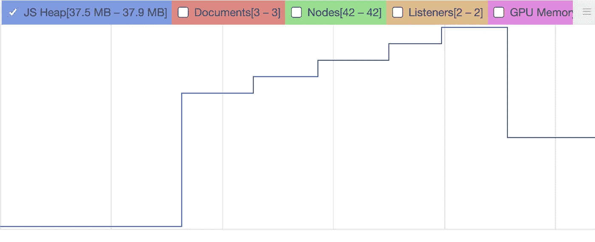*

*下面的折线图是堆内存使用情况。我们可以看到，每次点击按钮，堆内存使用量都会增加，因为我们的函数`fn1`创建了一个新对象，这个对象存储在数组`res`中，没有被垃圾收集器收集。*

*如果折线图呈上升趋势，没有回调的迹象，那么程序在不断消耗内存，程序很可能存在内存泄漏。*

## *内存面板*

*内存面板允许我们实时查看内存使用情况。*

*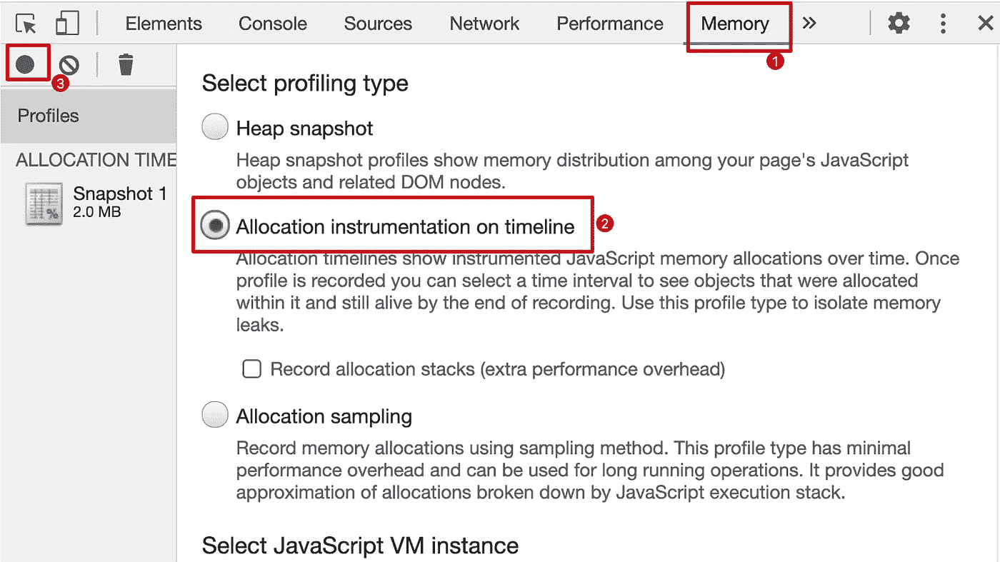*

*用法:*

*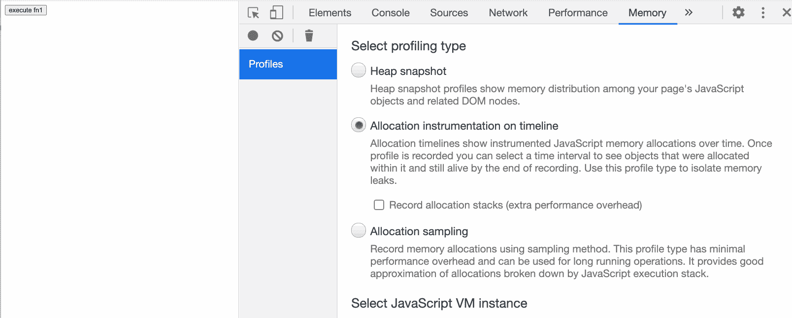*

*在我们开始记录之后，我们可以看到在图形的右侧生成了一个蓝色的直方图，它表示时间轴下的当前内存量。*

*或者我们可以打开 Medium 的主页，用同样的方法记录直方图。*

**

*在这里，我们可以看到图中起伏的蓝色和灰色条形图。灰色表示先前占用的内存空间已经被清除和释放。*

*如果您的项目中只生成了蓝色直方图，并且没有变成灰色，那么内存就没有被释放，您的程序可能有内存泄漏。*

# *内存泄漏示例*

*那么发生内存泄漏的情况有哪些呢？以下是一些常见的:*

*   *不当使用封闭物*
*   *意外生成的全局变量*
*   *分离的 DOM 节点*
*   *控制台打印*
*   *未被清除的计时器*

*接下来，浏览场景，并尝试使用前面描述的 Chrome DevTools 来捕获问题。*

## *1.不当使用封闭物*

*在本文开头的例子中，在退出`fn1`函数执行上下文后，该上下文中的变量`a`将被作为垃圾数据收集。但由于`fn1`函数最终返回变量`a`并赋给全局变量`res`，生成了对变量`a`的值的引用，所以变量`a`的值被标记为活动的，一直占用相应的内存。假设变量`res`以后再也不会被使用，这就是一个没有被正确使用的闭包的例子。*

*我们来看看闭包使用性能和内存导致的内存泄漏问题。为了使内存泄漏的结果更加明显，我们稍微修改了本文开头的例子。代码如下所示:*

*我们在这个页面上设置了一个按钮，每当我们点击它时，这个按钮会将函数`fn1`的返回值添加到全局变量`res`中。接下来，我们可以在性能面板中记录内存曲线。*

*   *首先，我们点击灰点开始记录*
*   *然后，我们手动进行垃圾收集，以确保我们有一个稳定的初始内存基线*
*   *然后我们点击几次按钮来执行`fn1`功能*
*   *最后，我们再次进行垃圾收集*

*操作如下:*

*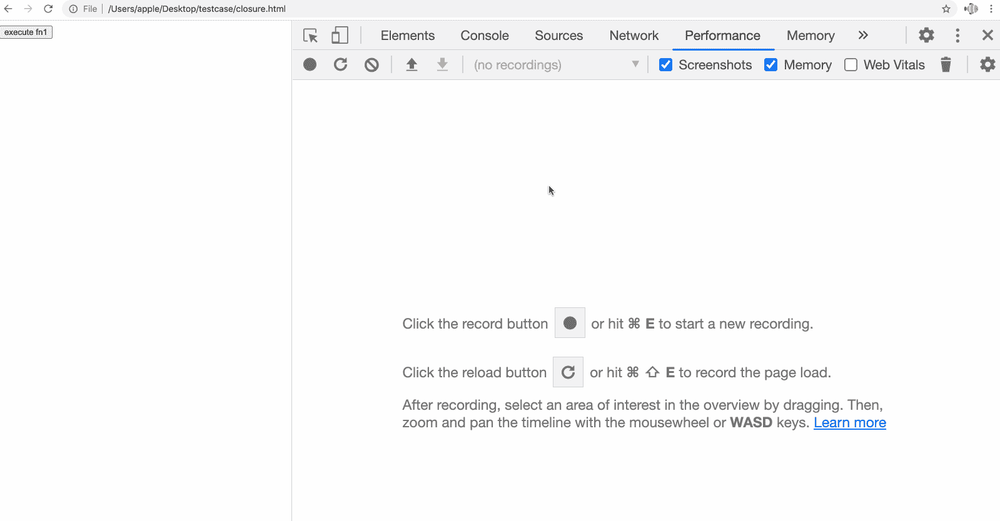*

*结果:*

*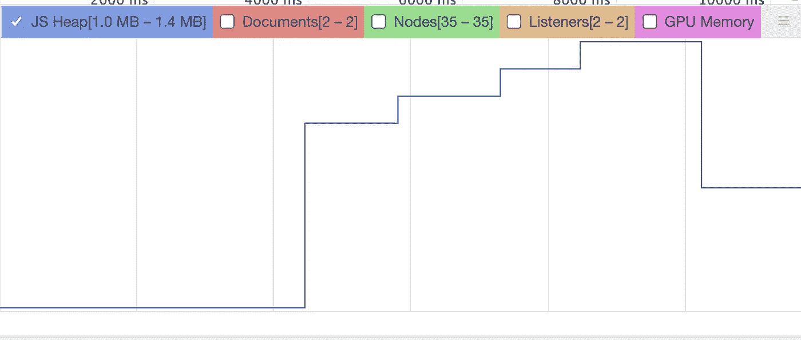*

*从结果可以看出:每次调用函数`fn1`后，堆内存空间增加，整体曲线呈阶梯状增加。然后在最后一次内存清理后，可以发现最终曲线高度高于基线，说明程序中可能存在内容泄漏。*

*当已知存在内存泄漏时，我们可以使用内存面板来更明确地识别和定位问题。*

***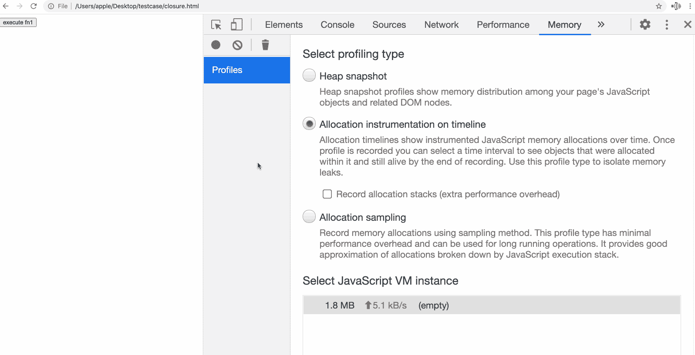*

*每次我们点击按钮，动态内存分配图上就会出现一个蓝条，在我们触发垃圾收集后，蓝条并没有变成灰条，说明分配的内存还没有被清除。*

*然后，我们可以使用堆快照来找出是哪个函数导致了内存泄漏。*

*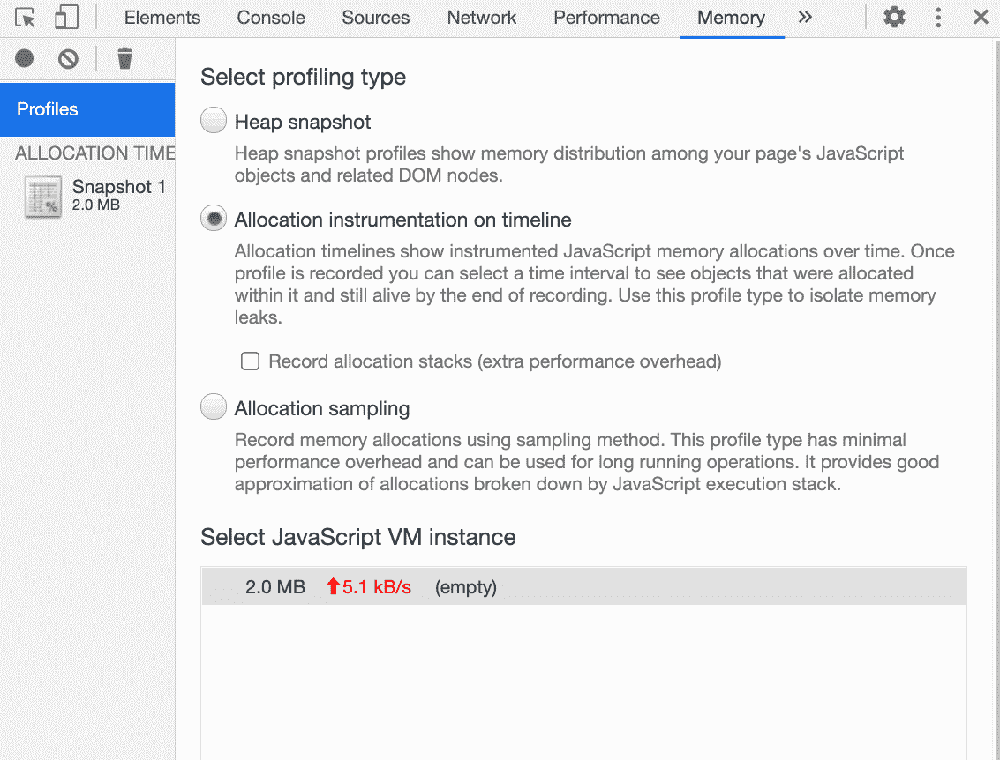*

*通过将光标移动到蓝色列上，我们可以看到在此期间创建的对象。然后，您可以单击该对象，查看哪个函数创建了该对象。这个函数是内存泄漏的罪魁祸首。*

## *2.意外生成的全局变量*

*我在本文开头提到过，垃圾收集器通常不收集全局变量。如果没有必要，我们应该尽量少用全局变量。有时开发人员会无意中向全局丢失一些变量，例如在没有声明的情况下为变量赋值，导致变量被全局创建。示例代码如下:*

```
*function fn1() {
   // `name` is not declared
   name = new Array(99999999)
}
fn1()*
```

*在这种情况下，变量`name`被自动全局创建，一个大数组被分配给`name`。而且因为是全局变量，内存空间永远不会被释放。*

*所以你需要在日常编码中多加注意，不要在变量声明之前赋值。或者我们可以打开严格模式，这样当我们在不知道的情况下犯了一个错误时，我们会收到一个错误警告，例如:*

```
*function fn1() {
    'use strict';
    name = new Array(99999999)
}
fn1()*
```

## *3.分离的 DOM 节点*

*假设您手动删除了一个 DOM 节点。您应该已经释放了 DOM 节点的内存，但是某些代码仍然引用了被移除的节点，并且无法释放内存。例如:*

*这段代码删除了点击按钮后的节点`.child001`。虽然点击后确实从 dom 中移除了节点，但是全局变量`child001`仍然有对节点的引用，所以节点的内存并没有被释放。*

*我们可以用内存面板测试一下:*

*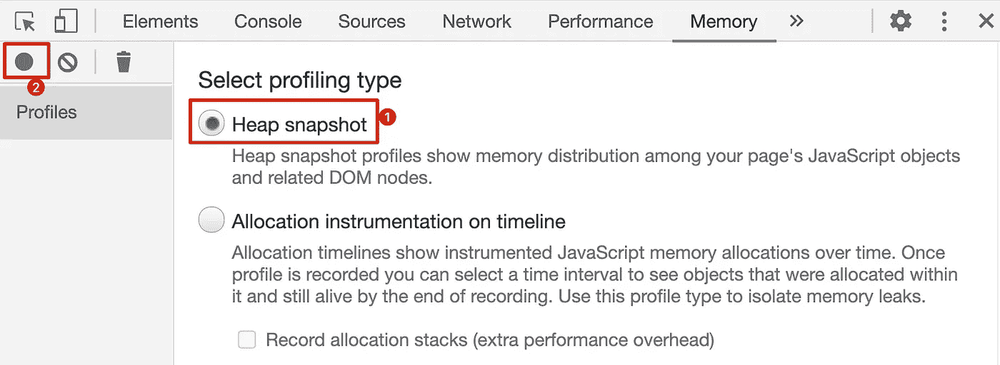**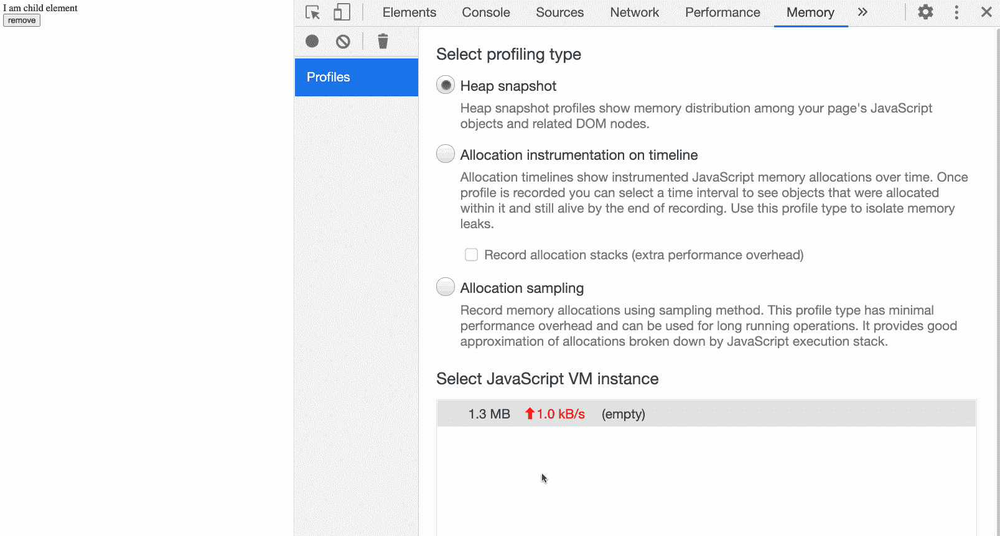*

*我们首先在程序开始时使用堆快照特性记录堆内存使用情况，然后我们单击按钮删除`.child001` DOM 元素并再次记录堆内存使用情况。*

*如果我们在第二个快照中搜索关键字`detached`，就可以过滤掉从 DOM 树中分离出来但没有被移除的 DOM 节点。然后我们发现元素`.child001`确实存在，这意味着该元素没有被垃圾收集器回收。*

*这也是一种常见的内存泄漏场景。解决方案如下所示:*

```
*let btn = document.querySelector("button");btn.addEventListener("click", function () {
    let child001 = document.querySelector(".child001");
    let root = document.querySelector("#root");
    root.removeChild(child001);
});*
```

*更改非常简单，只需将对`.child001`节点的引用移动到 click 事件的回调函数中。然后当我们移除节点并退出回调函数的执行时，对节点的引用会被自动清除，不会出现内存泄漏。*

*让我们验证一下:*

*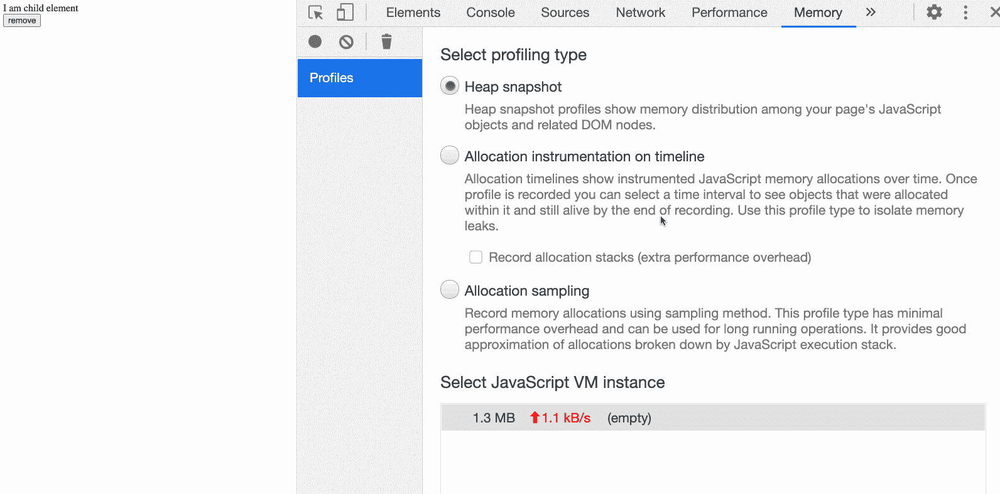*

*结果是我们在第二个堆快照中再也找不到这个元素，表明它已经被收集了。我们成功地解决了内存泄漏问题。*

## *4.控制台打印*

*控制台打印也会导致内存泄漏吗？是的，如果浏览器并不总是存储我们打印的对象的信息，那我们每次打开控制台时怎么会看到具体的数据呢？让我们来看看测试代码:*

*我们在按钮的点击回调事件中创建一个大数组对象并打印它。然后让我们记录下来。*

*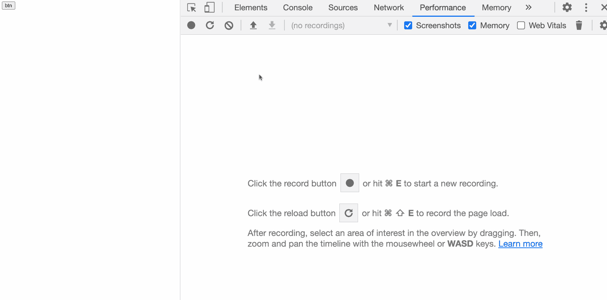*

*记录开始时，将触发垃圾收集来确定内容的基线。然后点击按钮几次，最后再次触发垃圾收集。查看记录结果，我们看到堆内存曲线逐渐升高，最终保持在比初始基线高得多的位置，这意味着每次点击创建的大数组对象 obj 被浏览器保存，并且由于`console.log`而无法收集。*

*接下来，取下`console.log`并查看结果:*

*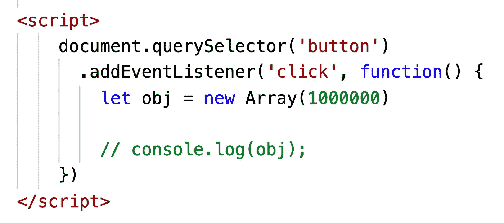*

*GIF:*

**

*结果:*

*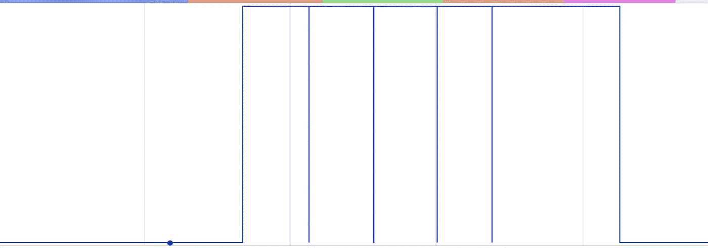*

*你可以看到，没有了`console.log`，每当`obj`被创造出来的时候，它就会立刻被毁灭。最后，当垃圾收集被触发时，新的内存线与原始基线的高度相同，表明没有内存泄漏*

*同样，我们可以使用内存再次验证这一点:*

*   *同`console.log`*

*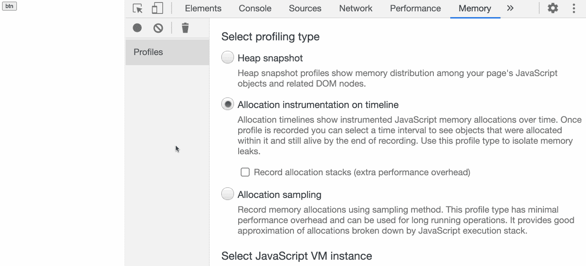*

*   *无`console.log`*

*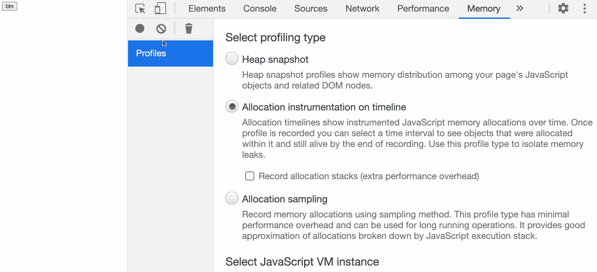*

*快速摘要:在开发环境中，您可以使用控制台打印变量以进行调试，但在生产环境中，请尽量不要从控制台打印数据。所以很多 JavaScript 编码风格规范要求我们不要使用`console.log`。*

*如果您真的想打印一个变量，您可以写:*

```
*if(isDev) {
    console.log(obj)
}*
```

*这避免了生产中不必要的变量打印，以及`console.log`、`console.error`、`console.info`、`console.dir`等。，这也不应用于生产*

## *5.尚未清除的计时器*

*如果定时器未被清除，定义定时器也可能导致内存泄漏。*

*看看一个代码示例:*

*点击按钮后执行功能`fn1`，功能`fn1`创建一个大数组`largeObj`，同时创建一个设置间隔定时器。定时器的回调只是引用`largeObj`，所以让我们看看它的整体内存分配:*

*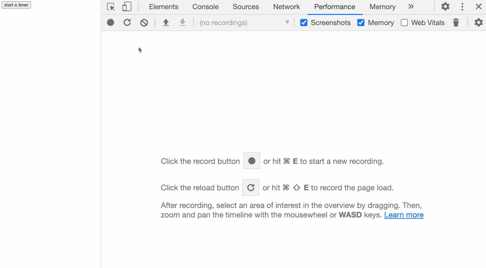**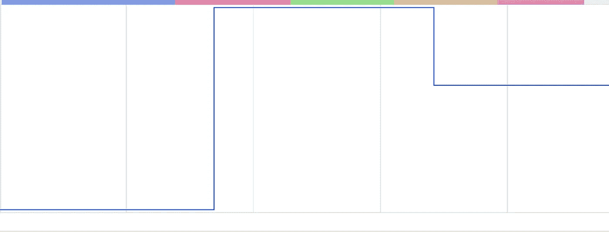*

*点击该按钮将执行`fn1`函数，然后退出该函数的执行上下文，函数体中的局部变量将被清除。但是，图中的记录结果显示似乎存在内存泄漏，即最终曲线高度高于基线高度。*

*所以再次使用内存确认:*

*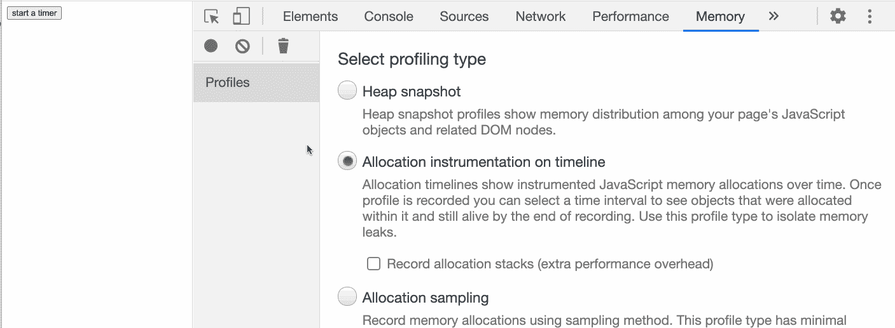*

*单击按钮后，我们会在动态内存分配图中看到一个蓝色条，表示浏览器为变量`largeObj`分配了一块内存。但是后来这块内存没有被释放，说明确实存在内存泄漏。*

*原因是 setInterval 回调对`largeObj`有引用，定时器还没有清零，所以`largeObj`的内存没有释放。*

*怎么才能解决这个问题？假设我们只需要让计时器执行三次，我们可以修改代码:*

*那我们来测试一下:*

*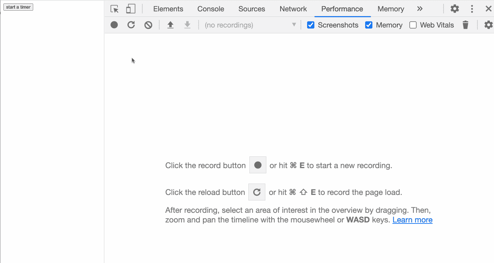**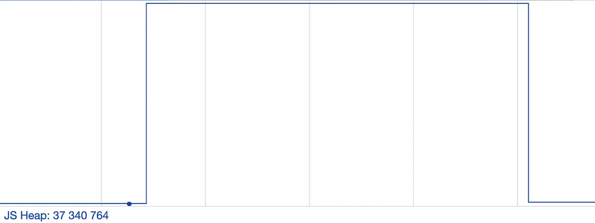*

*从这个记录的结果可以看出，最终曲线的高度与初始基线的高度相同，这表明没有内存泄漏。*

# *结论*

*在开发项目的过程中，如果遇到一些可能与内存泄漏有关的性能问题，可以参考本文列举的五种情况进行故障排除，一定能找到问题所在并给出解决方案。*

*虽然 JavaScript 垃圾收集是自动的，但我们有时需要考虑是否手动清除某些变量的内存。例如，如果您知道在某些情况下不再需要某个变量，但它将被外部变量引用，因此无法释放内存，您可以将`null`赋给该变量，以便在后续垃圾收集期间释放内存。*

# *原作者*

*这篇文章的核心思想来自于我的朋友， *zero2one，*目前在字节跳动工作。经他授权，我整理了相关内容，发表在 Medium 上。*