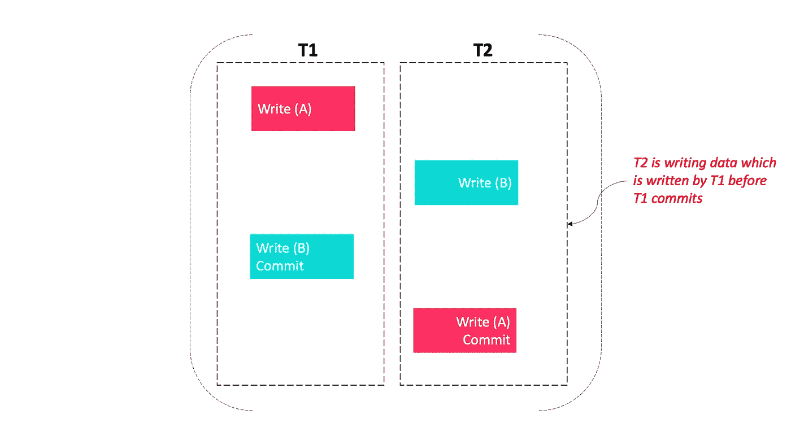

# 这些瓶颈正在扼杀你的代码

> 原文：<https://javascript.plainenglish.io/these-bottlenecks-are-killing-your-code-f2b3393de9d4?source=collection_archive---------9----------------------->

## 高性能系列

## 超过 25 个常见瓶颈以及如何解决它们


Photo by [Andrew Seaman](https://unsplash.com/@amseaman?utm_source=medium&utm_medium=referral) on [Unsplash](https://unsplash.com?utm_source=medium&utm_medium=referral)

瓶颈是指整个系统的性能或容量受到单个或有限数量的组件或资源限制的现象。为了提高性能，我们需要删除这些。

当你听到“*性能瓶颈*这几个字的时候，你脑海中浮现的典型热点就是 CPU、内存、磁盘、网络。但在实践中，常见的瓶颈有 20 多个，分为以下 10 类:*、数据库、虚拟化、编程、磁盘、OS、缓存、CPU、网络、进程、内存(RAM)* 。

# 数据库ˌ资料库

## 工作大小超出了硬件限制

为了在一定程度上缓解数据库工作大小超过 RAM 的问题，可以使用分区来限制数据库引擎需要运行/更新的数据量。根据您的访问模式，您应该基于插入顺序或选择位置进行分区。

## 长时间和短时间运行的查询

在数据库环境中，长时间运行的查询/语句/事务有时是不可避免的。在某些情况下，长时间运行的查询可能是灾难性事件的催化剂。

如果您关心您的数据库，优化查询性能和检测长时间运行的查询必须定期执行。

## 写-写冲突

```
It is also called as a blind write operation.
```

这里，事务 T2 正在写入已经由另一个事务 T1 写入的数据。T2 会覆盖 T1 写入的数据。

*   a，B -来自数据库的两个不同的数据对象
*   T2 t1-两种不同的交易



*T2 is writing data which is written by T1 before T1 commits*

T1 写入的数据已经消失。所以是**数据更新丢失**。

## 占用内存的大型连接

检索数据可能涉及多个连接以创建单个结果集。虽然这些连接通常很简单，但在某些情况下，系统可能会发出非常大的连接来集合大量的表。

但是，过大的连接可能会导致数据库性能问题。

# 虚拟化

云计算作为一种虚拟化数据中心和提高计算资源使用灵活性的方式越来越受欢迎。对于云计算来说，有以下瓶颈。

*   进出云提供商的带宽
*   共享硬盘，磁盘寻死
*   云中的网络 I/O 波动
*   在不考虑故障转移的情况下实现高可用性

# 编程；编排

## 线

线程是可由调度程序管理的最小编程指令序列。

线程不会加速代码的执行，也不会让计算机运行得更快。但是，如果做得正确，写得好的线程可以利用浪费掉的时间来提高效率。

在某些过程中，这将减少运行时间。

## 僵局

死锁是指共享同一资源的两个计算机程序有效地阻止对方访问该资源，导致两个程序都停止运行。

例如，程序被用来一次运行一个。当我们学会变得更有效率时，计算机会动态地分配资源。但是如果程序 A 正在等待程序 B 正在使用的东西，而程序 B 正在等待来自程序 A 的东西，这就是死锁。其中一个必须停下来。数据的组织方式必须能够避免这种情况。

## 无伸缩性:非线性伸缩性，非水平伸缩性

线性可扩展，这也称为“*垂直扩展*”，它指的是系统的资源最大化，以扩展其处理不断增加的负载的能力，例如，我们通过添加 RAM 和 CPU 来增加服务器的功率。

水平扩展意味着通过向您的资源池中添加更多的机器来进行扩展。

你的应用程序还应该能够纵向和横向扩展，这意味着你不仅必须升级服务器部件，如处理器内存，还必须添加更多的机器。

## 事件驱动编程

这种设计风格在某些情况下非常有用。对于您希望在事件(例如，鼠标点击)之后进行操作的应用程序，这很好。然而，在某些情况下，即使有一些好的编码实践，事件驱动的代码也很难维护。如果你的程序遇到了瓶颈，你可以检查这里。

## 回调复杂度

在某些情况下，您可能会编写代码来指示系统花一些时间来产生结果，而不是立即返回结果。回调用于下载东西和与数据库对话。但是如果被误用或应用到其他地方，回调将会减慢其他应该立即返回结果的函数的速度。

## 有状态应用

不要实现有状态的应用，尽可能选择无状态的实现。

## 糟糕的设计

开发人员开发了一个可以在他们的电脑上运行的应用程序。该应用程序投入生产，运行良好，有几个用户。几年后，该应用程序无法运行成千上万的用户，需要完全重新构建和重写。

## 单点故障

这是系统的一部分，如果它发生故障，会导致整个系统停止工作。这是一个需要纠正的明显瓶颈。

## **算法复杂度**

虽然一些代码必须复杂才能执行所需的功能，但糟糕的设计或缺乏复杂性管理会导致意外的复杂性，从而降低应用程序的速度。

# 唱片

计算机或服务器内部最慢的组件通常是长期存储，包括硬盘和固态硬盘，通常是不可避免的计算机瓶颈。即使是最快的长期存储解决方案也有物理速度限制，这使得这个瓶颈成为更难解决的问题之一。

*   本地磁盘访问
*   随机磁盘 I/O ->磁盘寻道
*   磁盘碎片
*   一旦写入的数据大于 SSD 大小，SSD 性能就会下降

在许多情况下，可以通过减少碎片问题和提高 RAM 中的数据缓存率来提高磁盘使用速度。在物理层面，通过切换到更快的存储设备和扩展 RAID 配置来解决带宽不足的问题。

# 操作系统（Operating System）

*   Fsync 刷新，linux 缓冲区缓存填满
*   TCP 缓冲区太小
*   文件描述符限制
*   功率分配

# 贮藏

缓存是提高许多应用程序性能的重要一步。我们在以下情况下面临瓶颈。

*   不使用 memcached(数据库敲打)
*   在 HTTP: headers，etags，not gzipping，等等..
*   没有充分利用浏览器的缓存
*   字节码缓存(如 PHP)
*   L1/L2 贮藏处

# *中央处理器*

## CPU 过载

当处理器太忙而无法响应时间请求时，就会发生这种情况。“简单来说，就是 CPU 超负荷，无法及时执行任务。

## 上下文切换

一个内核上有太多的线程，linux 调度程序运气不好，太多的系统调用，等等…

## IO 等待

所有的 CPU 以相同的速度等待。

## CPU 缓存

缓存数据是一个细粒度的过程(例如在 Java 中认为是 volatile ),目的是在拥有多个具有不同数据值的实例和保持缓存数据一致的大量同步之间找到正确的平衡。

## 背板吞吐量

背板容量是设备最大吞吐量的上限。

# 网络

当两台设备之间的通信缺乏必要的带宽或处理能力来快速完成任务时，就会出现网络瓶颈。

当服务器过载、网络通信设备过载以及网络本身失去完整性时，就会出现网络瓶颈。

*   网卡饱和，IRQ 饱和，软中断占用 100%的 CPU
*   DNS 查找
*   丢弃的数据包
*   网络中的意外路由
*   网络磁盘访问
*   共享 San
*   服务器故障(服务器不再回应)

要解决网络利用率问题，通常需要升级或添加服务器，以及升级路由器、集线器和接入点等网络硬件。

有许多软件服务为企业的在线平台提供负载测试和监控工具，这些工具可以很好地识别阻碍性能和运行系统瓶颈测试的性能瓶颈。

# 过程

实际上，一个团队可能会收到比其最大吞吐能力所能处理的更多的工作请求。这是一种流程瓶颈。存在以下流程瓶颈。

*   测试和开发时间
*   团队规模
*   预算
*   代码债务

流程瓶颈是项目延期、预算因延期增加的成本而激增以及整个流程变得不可预测的原因之一。这导致了工作流程的中断和整个生产过程的延迟。我们应用 DevOps 和精益原则，通过消除瓶颈和低效工作来优化流程

# 记忆

内存瓶颈意味着系统没有足够或足够快的 RAM。

*   内存不足时，我们可以终止进程，进入交换&研磨，直至停止。
*   在系统没有足够内存的情况下，计算机会开始将存储卸载到速度慢得多的硬盘或固态硬盘上，以保持运行。

为了解决这个瓶颈，我们可以安装更高容量和/或更快的 RAM。

*   如果现有的 RAM 太慢，就需要更换。
*   而容量瓶颈可以通过增加内存来解决。

在其他情况下，问题可能源于称为“内存泄漏”的编程错误，这意味着程序在使用完内存后没有释放内存供系统再次使用。

*   内存库开销
*   内存碎片
*   在 Java 中需要 GC 暂停
*   在 C 语言中，malloc 开始永远占用

要解决此问题，需要一个程序补丁。

# 结论

不同的系统有不同的瓶颈。对于某些系统，瓶颈可能是等待 I/O 或网络，可能是线程间的同步，也可能是实际的 CPU 使用率。对于其他人来说，瓶颈可能是垃圾收集时间。一个系统可能有不止一个瓶颈，我们需要消除它们来加速我们的系统。

## 参考

[https://web . archive . org/web/20170927085904/http://www . server watch . com/trends/article . PHP/3912821/Uncover-Your-10-Most-paired-Performance-bottoms . htm](https://web.archive.org/web/20170927085904/http://www.serverwatch.com/trends/article.php/3912821/Uncover-Your-10-Most-Painful-Performance-Bottlenecks.htm)

*更多内容尽在*[***plain English . io***](http://plainenglish.io)