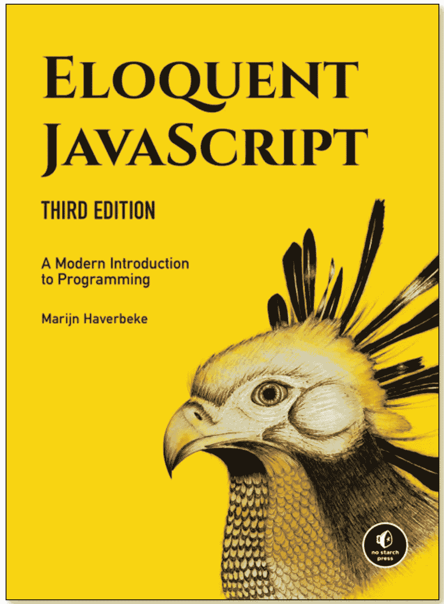

# 这些免费的 JavaScript 资源帮助我在 Mozilla 找到了一份工作

> 原文：<https://javascript.plainenglish.io/these-free-javascript-resources-helped-me-land-a-job-at-mozilla-1c2c81846a02?source=collection_archive---------13----------------------->

## 因此，您不必为开发人员训练营支付 1 万英镑

Photo by [Pankaj Patel](https://unsplash.com/@pankajpatel?utm_source=unsplash&utm_medium=referral&utm_content=creditCopyText) on [Unsplash](https://unsplash.com/s/photos/code?utm_source=unsplash&utm_medium=referral&utm_content=creditCopyText)

在我在 Mozilla 找到第一份有报酬的工作之前，我是一名经济学学生，想从事科技行业。在我的大学生涯中，我一直在寻找用自己的时间和最低的成本来学习和提高我的技术技能的方法。学生贷款和伦敦昂贵的生活费用意味着我真的没有钱去参加昂贵的训练营。我列出了一些我觉得特别有用的资源，以及那些帮助我进入这个行业的资源。

## [FreeCodeCamp](https://www.freecodecamp.org/)

***好去处:一站式学习全栈开发***

不用说，FreeCodeCamp 已经成为学习 JavaScript 开发的圣杯。这是我开始编码之旅的地方。作为一个初学者，我没有真正的学习路线图，不知道从哪里开始。FreeCodeCamp 的结构非常好。它假设没有知识，从头开始，所以你可以理解编程的基础，JavaScript 语法和算法思想。自从 5 年前我第一次使用 FreeCodeCamp 以来，它也取得了很大的进步。他们现在有多种语言支持，超过 10 种学习途径，还可以帮助准备面试。

## [你不知道的 JS 书系列](https://github.com/getify/You-Dont-Know-JS/blob/1st-ed/README.md)

***擅长:JavaScript 深潜***

一旦你掌握了你的基本原则，你就不会知道 JS 会让你意识到你知道的越多，你不知道的就越多！JavaScript 有很多可移动的部分，多年来一直在发展，引入了新的范例，淘汰了旧的范例。这本书系列深入探究了编程语言的所有复杂和核心机制，包括更高级的概念，如作用域和闭包。

## [雄辩的 JavaScript](https://eloquentjavascript.net/)

***适合:通过 JS*** 理解编程的概念

除了介绍 JavaScript，雄辩的 JavaScript 的突出之处在于它对编程基本原则的解释。它首先将 JavaScript 纯粹作为一种编程语言进行解构，在这些基础上扩展其在工程领域和浏览器中的用途。作者详细解释了概念，但避免了用大量的技术术语使读者超载，使这本书成为初学者的好读物。

## [卫斯理免费课程](https://wesbos.com/courses)

***擅长:视觉学习者***

加拿大 Web 开发人员 Wes Bos 在 JavaScript 社区非常有名。虽然他的大部分课程是付费的，但他也提供一些高价值的免费课程，这些课程不仅可以很好地介绍 JavaScript，还可以介绍成为一名熟练的 web 开发人员所需的其他技能，如[编写 CSS](https://cssgrid.io/) 和[掌握命令行](https://commandlinepoweruser.com/)。

## [web.dev](https://web.dev/learn/)

***适合:面试准备***

我广泛使用 web.dev 来准备我的面试。Web.dev 是一个非常全面的资源，涵盖了构建渐进式 Web 应用程序(PWA)的所有方面，超出了编写代码的基础。他们有关于实现可访问性、网络安全和性能的指南。
我强烈建议在面试前通读 web.dev，尤其是如果你是一名没有从事过大型 web 应用的初级开发人员，因为这将有助于你理解与构建 PWA 相关的所有活动部分。

## [AirBnB JavaScript 风格指南](https://github.com/airbnb/javascript)

***有益于:了解最佳实践***

AirBnB JavaScript 风格指南是为那些从为自己的项目编写代码过渡到构建大型企业应用程序的人准备的一份备忘单。它会给你一个“最佳实践”指南，让你的代码看起来像企业级的。虽然大多数公司遵循自己的代码编写方式和最佳实践，但其中很多都是以 AirBnB 的风格指南为蓝本。当你有疑问的时候，看看专业人士是怎么做的是有好处的！

## [代码大战](https://www.codewars.com/)

***擅长:练习算法思维***

在阅读了所有关于编写代码的理论和编程语言的语法之后，我准备好运用我新发现的技能来解决一些真正的挑战。随之而来的是强烈的挫败感，但也经常是解决基于代码的小挑战的即时满足感。这是我真正迷上解决简单和复杂问题的过程的地方！

## [用 Scrimba 学习 React】](https://scrimba.com/learn/learnreact)

***适用于:将您的 JavaScript 知识提升到一个新的水平——React***入门

如果你想学 React，我强烈推荐 Scrimba！在这个全面的交互式教程中，您可以学习构建多个基于 react 的动态应用程序。该课程不需要任何知识，从最基础的开始，非常互动，周围有一个完整的社区，所以你永远不会觉得你是在自学！

## 结论

这就是所有的人！我想让这个列表保持简短，只突出那些对我有用的资源。互联网上可能有很多噪音，而且很难找到最好的学习资源，所以我希望这能帮助你成为一名开发人员。