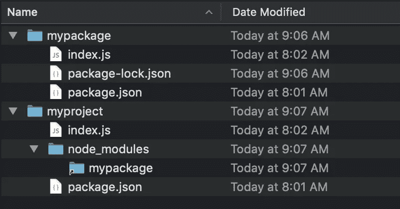
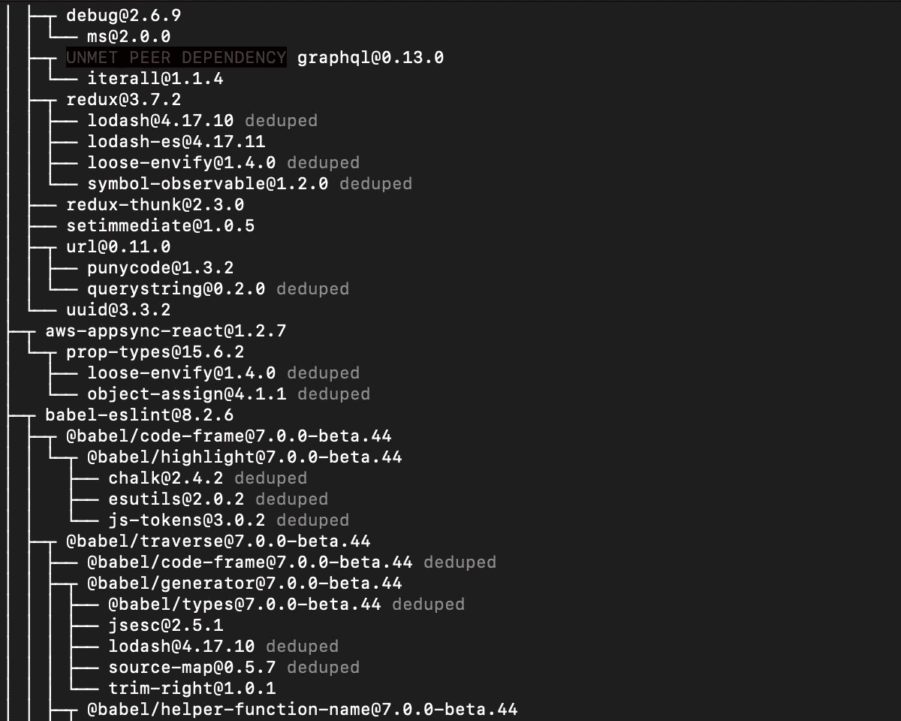
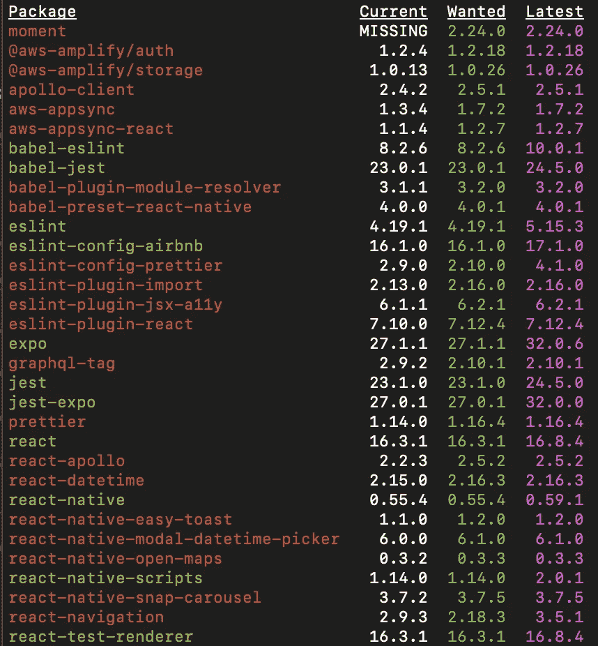
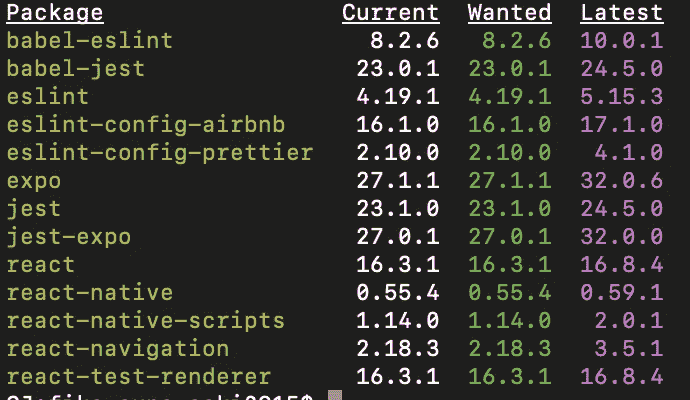
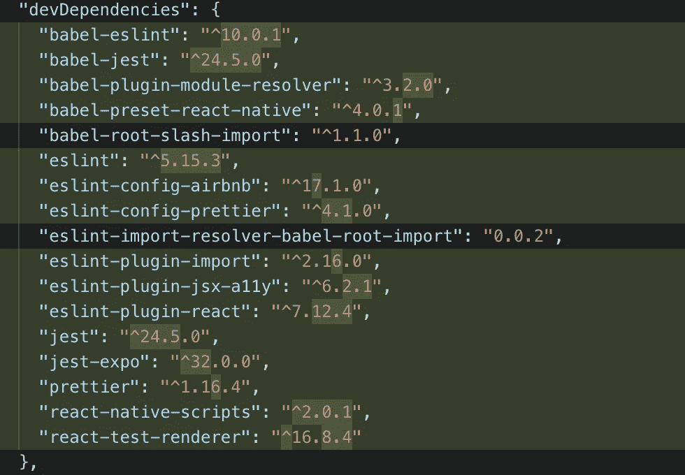

# 这些 NPM 技巧将使你成为一名职业选手

> 原文：<https://javascript.plainenglish.io/these-npm-tricks-will-make-you-a-pro-1373e7fd34f7?source=collection_archive---------14----------------------->


Photo by [Cytonn Photography](https://unsplash.com/@cytonn_photography?utm_source=medium&utm_medium=referral) on [Unsplash](https://unsplash.com?utm_source=medium&utm_medium=referral)

我一路走来学到了很多我希望一开始就知道的东西。让我们称之为技巧吧，这些技巧极大地改善了我与 NPM 合作的方式。今天我想和你分享我的 5 大诀窍。

# 1.节省时间。使用快捷方式

这是最有用的特性之一，但是没有很好的记录。一个命令的快捷方式可能看起来微不足道，但事实是你将会少写 30-60%的代码。你可以把节省下来的时间花在有意义的事情上，比如多喝一杯咖啡，☕️？

不写`npm **install** <package>`
而写`npm **i** <package>`。

把`npm **install** **--save** <package>`写成`npm **i -S** <package>`而不是
。

把`npm **install** **--save-dev** <package>`写成`npm **i -D** <package>`而不是
。

而不是`npm **install** **--global** <package>`
写`npm **i -G** <package>`。

？奖金捷径！想给你的同事留下深刻印象吗？？它来了…

不写`npm **test**`
而写`npm **t**`。

# 2.在一个命令中安装多个软件包

能写一行为什么要写多行？？如果你对你的软件包了如指掌，最快的选择是把它们全部安装在一行程序中，但是要小心！一个拼错的包，整个命令都会失败。如果你不确定名字，就一个一个地安装。

```
npm i -S react redux react-redux
```

# 3.安装不同来源的软件包

默认情况下，运行`npm-install`时，https://registry.npmjs.org*NPM-registry*()会安装 NPM 的最新版本

但还有更多！NPM 也可以从其他来源安装软件包，比如 URL 或 tarball 文件。

当您创建自己的包或对现有包进行拉式请求时，这个特性非常强大。比如你有自己的 [Redux](https://redux.js.org/) 的 fork，你可以直接从你的 fork 安装包。*(把* `*username*` *改成你在 GitHub 上的用户名。)*

```
npm i
```

更好的是，如果您使用的是 GitHub 存储库，您可以使用以下快捷方式:

`npm i **username/redux**`

还有呢！您也可以从特定的分支安装软件包。在测试未来版本时非常有用。只需在末尾加上`#`和分支名称即可。

```
npm i username/redux#
```

？奖金捷径！你不是在用 GitHub 吗？别担心，BitBucket 和 GitLab 也有快捷方式:

```
npm i bitbucket:username/myrepositorynpm i gitlab:username/myrepository
```

# 4.链接包

有时你想在一个项目上工作，同时开发它的包。对于您想要尝试的每一个更改，将您的包提交并推送到远程存储库是令人厌烦的！？相反，你可以使用一个叫做*包链接*的特性。

*包链接*的工作原理是在 node_modules 文件夹中创建一个符号链接，指向包的本地存储库。通过这种方式，您可以在本地编辑包，并且所做的更改会立即在使用它的项目中生效。

理解*包链接*最简单的方法就是尝试一下！假设我们有一个名为`myproject`的项目和一个名为`mypackage`的包。我们希望`mypackage`成为`myproject`的附属品。

去文件夹`mypackage`写

```
npm link
```

不错！现在，去文件夹`myproject`写

`npm link mypackage`

搞定了。仔细看看文件夹结构



如您所见，`myproject/node_modules/mypackage`现在是文件夹`mypackage`的符号链接！现在您可以继续开发`mypackage`，您所做的所有更改都将在`myproject`中立即生效。

# 5.监控和清理您的项目

为了解决问题并使依赖关系树和最终的包尽可能小，在安装包时理解发生了什么是很重要的。

首先，我们需要对依赖树有一个很好的概述，以及实际上已经安装了哪些包版本。使用命令`npm list`。添加标志`--depth=0`以仅列出顶层包，添加`-g`以列出您的全局包。

`npm list --depth=0 -g`



NPM 擅长动态维护自己和展平依赖树，但是在发布之前对你的项目进行重复数据删除总是一个好习惯。它可能会为您删除一些包。

`npm dedupe`

这也是一个很好的想法，让您的过时和丢失的软件包有一个很好的概述。很难不喜欢这种精心组织的圆柱和圣诞氛围的配色方案？？

`npm outdated`



The outdated list is really beautiful!

如果您得到很多红色的行，您需要运行`npm update`来根据您的 package.json 将您的包更新到最新的版本，这在 **wanted** 列中也有说明

`npm update`

太好了！现在，如果您再次运行`npm oudated`，所有红色的行应该会消失。



如果您在 package.json 中的版本前面使用插入符号`^`,主要版本将不会更新(因此出现黄色行)。这很好，因为更新到一个新的主要版本可能会有突破性的变化。

如果你还想把所有东西都更新到最新版本，可以使用工具`npm-update-all`。就像在项目文件夹中运行这个命令一样简单。

`npx npm-update-all`

酷！现在您已经获得了所有依赖项的最新版本。您的 package.json 也更新了。⚠️意识到⚠️的突破性变化



As you can see, npm-update-all will update all your packages to the latest version.

这些是我给 NPM 的建议！如果你有更多的技巧和诀窍想要分享，请在下面添加评论！

*更多内容请看*[***plain English . io***](http://plainenglish.io/)