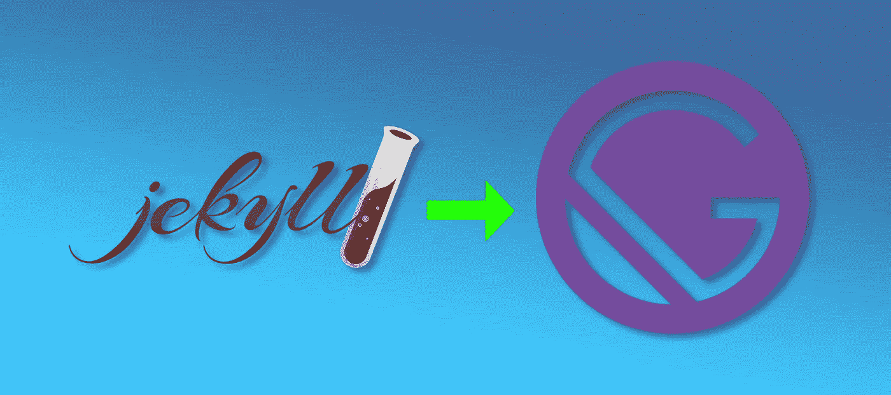

# 我从《盖茨比》中学到的几个重要教训

> 原文：<https://javascript.plainenglish.io/things-i-have-learned-about-gatsby-js-c660aee05c58?source=collection_archive---------26----------------------->



Illustration by David Fekke

到目前为止，在将我的网站转移到一个新的站点生成器的过程中，我真的很喜欢使用 Gatsby。在我之前的帖子中，我谈到了我与 Jekyll 和 Ruby 之间的一些问题。我已经在其他应用程序中使用了 Node.js 很多次，所以它使得转换更加容易。

# 分层路径

使用模拟层次结构的 URL 模式是非常常见的。如果您在网站上列出了不同的产品，您可能会有一个名为`products`的父目录。然后在`parents`下面，你可能有一个关于棒球的特定产品的页面。这条道路可能看起来像`/products/baseball`。在 Gatsby 中，通过创建一个类似的文件夹结构，可以非常容易地做到这一点。

```
src/ 
--pages/ 
----index.js 
----contact.js 
----about.js 
----products/ 
------index.js 
------baseball.js
```

# 反应

盖茨比是建立在[反应](https://reactjs.org/)之上的。React 不完全是 JavaScript，它实际上是 JSX。有些事情你在 JSX 可以做到，但在真正的 JavaScript 中却做不到。最重要的是能够在同一个类或函数中混合 HTML 和 JavaScript。

过渡到 Gatsby 的一个好处是，它给了我一个机会来学习更多关于 React 和 GraphQL 的知识。很多时候，我会使用 jQuery 或普通的 JavaScript 来操作文档对象模型。移动到 React 迫使我使用 React 来操作 DOM。React 在幕后使用一个影子 DOM 来实际操作 DOM。

React 的另一个优点是它使创建可重用组件变得容易。面包屑部分是可以转化为可重用组件的一个很好的例子。

对于这个组件，我创建了一个 CSS 模块。

这可以很容易地包含在您的页面中，并使用以下实现进行调用:

# 插件

通过使用插件，可以将许多功能添加到 Gatsby 项目中。盖茨比项目有一个列表，你可以在他们的[插件网站](https://www.gatsbyjs.org/plugins/)上搜索。Gatsby 插件有两种基本类型，源代码和转换。源插件用于获取不同的数据源，这些数据源可以在您的 Gatsby 站点中使用。Transformer 插件用于获取数据并将其转换成对您的站点更有用的东西。`gatsby-transformer-remark`插件将把 markdown 内容转换成 frontmatter 和 HTML。

这里有一些插件，我用来帮助我很容易地添加东西，如果我没有插件会很难。

## 盖茨比-备注-普里姆斯

`gatsby-remark-prismjs`将 Prism.js 框架添加到您的站点，使得在文章和帖子中显示代码示例更加容易。

## 盖茨比-插件-反应-头盔

基于 React-helmet 插件，用于在你的标题中添加元数据。当你试图将 SEO 添加到你的站点和文章中时，这变得很重要。这是一个我如何在我的网站上使用它的例子。

正如你从上面的例子中看到的，我在我的标题中添加了一些谷歌字体和图标。生成的 HTML 如下所示:

## 盖茨比插件网站地图

`gatsby-plugin-sitemap`插件可以让你在页面标题上添加一个`sitemap.xml`文件，这样搜索引擎和机器人就可以抓取你网站的完整布局。

## 谷歌分析

`gatsby-plugin-google-analytics`插件允许你将谷歌分析添加到你的网站 JavaScript 中。您需要从 Google Analytics 控制台获得一个 trackingId，并将以下插件配置添加到 gatsby-config.js 文件中。

```
...
plugins: [{
        resolve: `gatsby-plugin-google-analytics`,
        options: {
          trackingId: "ENTER_YOUR_TRACKINGID",
          // Puts tracking script in the head instead of the body
          head: false,
          // Setting this parameter is optional
          anonymize: true,
          // Setting this parameter is also optional
          respectDNT: true,
          // Avoids sending pageview hits from custom paths
          cookieDomain: "yourdomain.com"
        },
      }
],
...
```

# 摘要

这只是一些非常有用的盖茨比插件的一小部分。我将在以后的文章中介绍如何在您的 Gatsby 项目中配置图像处理和降价内容。

*最初发布于*[*https://fek . io*](https://fek.io/blog/things-i-have-learned-about-gatsby-js/)*。*

*更多内容请看*[*plain English . io*](http://plainenglish.io/)