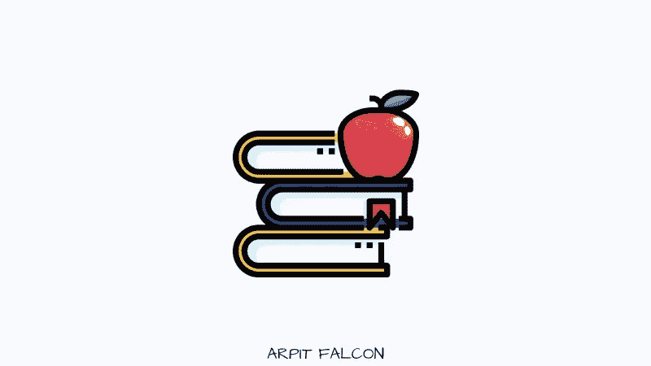

# 当我开始学习编码时，我希望能早点避免的事情

> 原文：<https://javascript.plainenglish.io/things-i-wish-i-had-avoided-sooner-when-i-started-learning-to-code-1840b64ea5d9?source=collection_archive---------2----------------------->

## 不要犯和我一样的错误

Photo by author

过去一年半我一直在编码，几乎每天都是。到目前为止，这段旅程非常美妙。通过写一堆字符凭空创造出有价值的东西的能力是令人兴奋的。

在封锁期间，我觉得每个人都参与了编码。有些人可能比其他人学得更多。有些人可能已经找到了他们梦寐以求的工作，而有些人可能通过自由职业赚了很多钱。我认识一些人，他们开发了一个产品，现在正在经营他们的生意。

**编码可以为你的职业生涯打开一百万扇新的大门。我可以不停地说这是每个人都应该学习的东西。**

但这里难的是需要时间和努力。你可能会花几天时间解决一个阻碍你整个旅程的复杂问题。由于其复杂性，犯错误的可能性很大。

这里有几件我希望早点避免的事情。

# 1.专注于多种语言而不是一种语言

今天，有几十种语言可供选择。如果你问 10 个不同的人，他们可能会推荐你学习 10 种以上不同的语言。

好的一面是他们都是正确的。**编程语言没有好坏之分。每种语言都有它的用例。**你可以用 JavaScript 做你的前端项目，用 Python 做数据科学。你可能会听到有人告诉你学习 C，因为他们在大学或学校开始学习 C。

糟糕的是，当你开始的时候，你不知道你想去哪里。你不太了解这个行业。你可能觉得建网站很好玩，另一方面，做自动驾驶汽车似乎更有趣。

**选择哪种编程语言开始我的编码之旅，我困惑了很久。我选择 C++是因为我所有的朋友都在用它来解决 LeetCode 的问题。当我看到 Python 的时候，我立刻就想学习它。看起来太酷了。当我投身自由职业时，我的客户，通常给我数据分析项目，要求一个 Java GUI 项目。当即没多想，就开始学习 Java。**

把自己拉向三个方向让我付出了代价。我有时在 Java 文件中编写 C++语法，然后花时间找出错误。

整个过程花了很多时间。

后来我决定专注于一门语言，Python。**我看书，做项目，做的很好。它帮我在世界上最大的金融科技公司之一找到了一份工作。**

擅长一件事比在很多事情上表现平平要好得多。你应该专注于一门编程语言，直到你了解它的大部分。我并不是说全部，因为并不要求学习所有的东西。你永远不会使用任何语言中的大多数特性。

# 2.消费过多的文学作品

不管我读了多少关于飞行的书，我都不能驾驶飞机，除非我先练习。

这适用于我们生活中的很多事情，同样适用于编码。**不管你对编程、不同的功能和概念了解多少，除非你先从小项目开始，否则很难构建大项目。**

对我来说，失败是一个有趣的概念。**它是所有老师中最棒的，然而我们仍然尽可能地避开它。**

构建项目的概念是尽可能多地遇到失败和障碍。编程很复杂，你在构建东西的时候会遇到很多意想不到的路障。**书本和网络课程都教不了你这个。你必须自己去发现它们，通过创造和学习它们。**

我花了很多时间狂看在线课程，却什么也没做。结果呢？我忘记了我所学的一切。我对这些概念只有模糊的熟悉。如果有人要求我执行它们，我会一片空白。

**当我开始独立做项目时，我完全掌握了事情是如何运作的**并采取不同的方法来解决各种问题。

构建和**实践是学习任何东西并坚持下去的捷径**。

失败了也不用担心。你会失败的。但是你会学会的。

# 3.独自面对并怀疑自己。

编程会变得孤独。你每走一步都会遇到各种各样的问题。有时你马上就能解决它们。有时可能需要几个小时或几天才能解决。

**但是你解决一个复杂问题的瞬间是无法形容的。感觉你能成就任何事。**

这里的艰难时刻是— **当你独自纠结一个问题的时候。你可能会开始怀疑自己。即使是经验丰富的开发人员也有这种感觉。**

当我纠结一个问题的时候，我是如此怀疑自己，以至于我曾经认为这个职业不是一条正确的道路。我应该把我的时间和精力放在别的事情上。

我做的一件改变游戏规则的事情是加入一个由志同道合者组成的社区。

如果你和那些想和你一起从 A 点到 B 点的人在一起，你会更加自信和安全。社区帮助你克服自我怀疑。你看到其他人也在和你一样的事情上挣扎。**它激励你付出更多努力去克服它，然后帮助别人也这样做。**

这是关于社区的有趣的部分。人们互相帮助，让他们成长，而**编程不会突然感到势不可挡或富有挑战性。**

你可以很快在 Twitter 上找到社区。

因此，我在旅途中犯了许多错误，并从中吸取了教训。但是这些是我希望早点避免的错误，这样我的时间就能有巨大的回报。

你想更快地学习新技能吗？ [***抓住我的免费 7 步学习框架，加速你的学习，让技能坚持下去。***](https://dedicated-innovator-3432.ck.page/47cebcc022)

如果你是新来的，喜欢这篇文章，在 Medium 上还有很多这样的文章。你可以注册阅读它们，每月只需 5 美元。

[**这里是无限制访问媒体上所有内容的链接。如果你用这个链接注册，我会赚一小笔钱，不需要你额外付费。**](https://arpitfalcon.medium.com/membership)