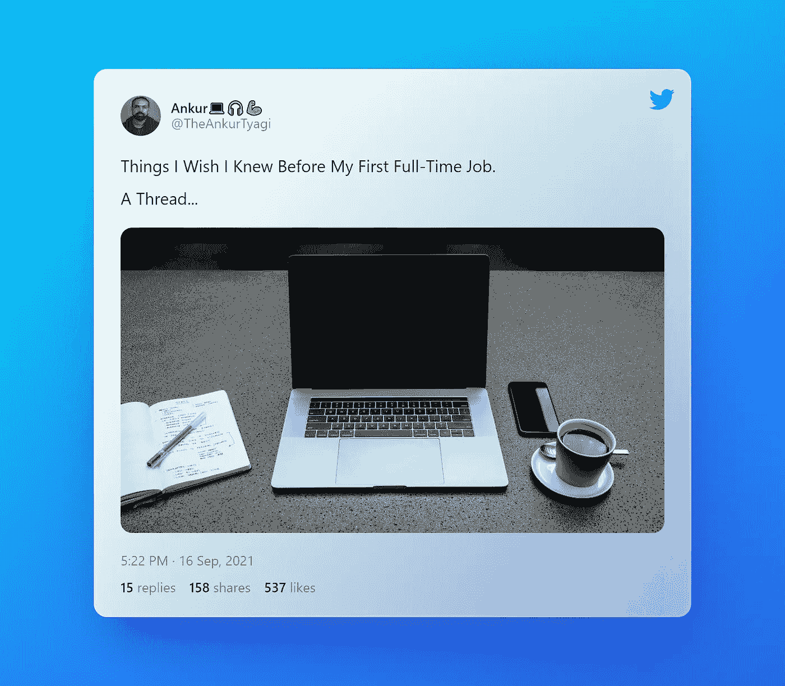

# 我希望在第一份全职工作之前就知道的事情

> 原文：<https://javascript.plainenglish.io/things-i-wish-i-knew-before-my-first-full-time-job-5659d1717f1?source=collection_archive---------17----------------------->

# 你的 20 多岁可能是你最具决定性的十年。

你将拥有更多的自由&比你过去或将来拥有的更多的选择。

这将是一次伟大的冒险。

每个人都试图吓唬你的“真实的技术世界”实际上真的很棒。

# 但是你知道，有些事情我希望在我第一份全职工作之前就知道。

*   不要害怕在工作中学习。
*   不要假装知道的比你实际知道的多
*   你要对你的职业负责，而不是你的雇主
*   一切都可以商量
*   活着是为了工作，但正确的方式
*   加班被高估了
*   草总是更绿

# 1.不要害怕在工作中学习:

*   如果你只是做办公室里分配给你的任务，你不会学到很多东西。
*   如果你要求更多的工作，得到单调的工作，你也不会前进。
*   慢下来，做正确的事情，阅读基本面。

# 2.不要假装知道的比你实际知道的多:

*   如果你这样做，团队会很快察觉到不妙。
*   你的同事会对你失去尊重。
*   不要不好意思提问。
*   没有什么会听起来太傻，事实上，你的团队会更尊重你。

# 3.你要对你的职业负责，而不是你的雇主:

*   我们大部分时间都在工作，但我们知道你当然没有义务告诉你的雇主你在找工作。
*   尊重你的工作生活平衡。
*   永远不要让你的老板微观管理你。
*   找一个导师

# 4.(几乎)生活中的一切都是可以商量的:

也许你收到的第一份工作正好符合你的期望，但通常情况并非如此。

当你刚开始工作时，很容易认为你在工作机会方面没有多少优势。

> 最危险的谈判是你不知道自己正在进行的谈判。

永远不要让薪水左右你的职业生涯。

在职业生涯中，你会得到你有勇气要求的东西。

# 5.活着是为了工作，但正确的方式是:

“我应该为了生活而工作还是为了工作而生活？”

> ***工作不是诅咒，而是上帝给我们的礼物。***

工作是你生活的中心。你永远不会觉得自己做了足够多的工作。

从长远来看，找到平衡是关键。

# 6.加班被高估了:

*   你的工作是关于长期的价值创造，而不是你今天工作了多少小时。
*   如果你超负荷了，不要害怕从你的盘子里拿走一些东西。
*   创造一种环境，在这种环境中，工作可以以一种有益的、令人满意的、富有成效的方式进行。

# 7.草总是更绿:

在你的职业生涯中，最大的诱惑之一就是➡的“下一步是什么？”

*   总会有更好的工作。
*   有些不适是每份工作的一部分。
*   你学会欣赏你现在拥有的东西。

当我开始职业生涯的时候，我在寻找一个职业成长的导师。

最初几年，我没有导师&我挣扎了很久。

这是痛苦，但不是现在，我已经与你分享了我的所有经验，开始在我的书&像冠军开发者一样成长。

我从社区收到了非常棒的反馈。看看下面这本书。

现在就拿起这本书… [时间指南](https://theankurtyagi.gumroad.com/l/nextgendev)

感谢阅读。

如果你经常阅读，谢谢你，你是我能够与你分享我的生活/职业经历的重要原因。

在[推特](https://twitter.com/TheAnkurTyagi)上与我联系

【https://theankurtyagi.com】最初发表于**。**

**更多内容请看*[***plain English . io***](http://plainenglish.io/)*