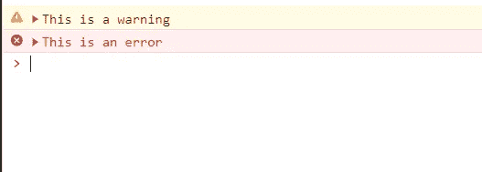
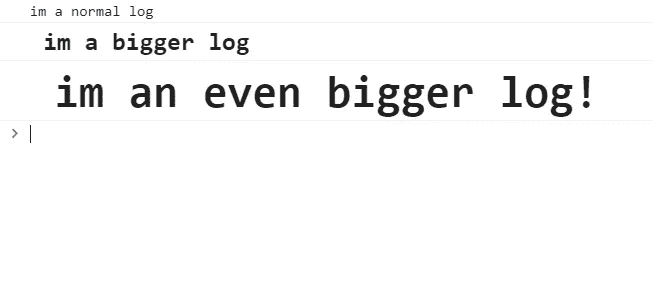

# 关于 console.log()你可能不知道的事情

> 原文：<https://javascript.plainenglish.io/things-you-probably-didnt-know-about-console-log-b32baed688c2?source=collection_archive---------16----------------------->


Photo by [MART PRODUCTION](https://www.pexels.com/@mart-production?utm_content=attributionCopyText&utm_medium=referral&utm_source=pexels) from [Pexels](https://www.pexels.com/photo/man-people-woman-relaxation-7605191/?utm_content=attributionCopyText&utm_medium=referral&utm_source=pexels)

您知道在将输出记录到控制台时可以使用 CSS 样式吗？

我敢打赌你们大多数人都回答不。我知道我肯定回答了。

直到一年前，我偶然发现 YouTube 上的一个教程，解释了 JavaScript 中的某些方法是如何工作的，突然之间，程序员以我从未见过的方式使用 console.log ()

# 我们已经知道的

好了，如果你是任何类型的 JavaScript 程序员，你已经知道 console.log()是做什么的了。它只是一行代码，允许我们打印出变量的内容或变量的连接字符串。真的没什么大不了的。我们可以在下面看到一个基本的例子。

```
const person = 'rick sanchez'console.log(`hello my name is ${person}`);// output: hello my name is rick sanchez
```

超级简单对吧？

嗯，接下来会变得更有趣一点…

# 你可能不知道的是

有一次，当我在工作中做一个项目时，我注意到有人像这样使用 console.log():

```
console.log({person});
```

起初我很困惑，因为我以前从未见过这样做，但它实际上非常有用。当我们像这样使用 console.log()时，我们告诉 JavaScript 我们希望看到变量的名称以及内容。如果我们在上面的例子中使用这个，我们得到这个。

```
const person1 = 'rick sanchez'
const person2 = 'morty smith'console.log({person1});
console.log({person2});// output: {person1: "rick sanchez"}
//         {person2: "morty smith"}
```

现在请注意，我们能够看到哪个变量包含什么。当我们一次记录多件事情而不必记住哪个日志首先执行时，这变得非常有用。

关于 console.log()您可能还不知道的是，我们可以使用参数将一个变量连接到我们想要的消息，如下所示。

```
const person = 'rick sanchez'console.log('hello my name is',person)//output: hello my name is rick sanchez
```

这种记录输出的方式就像:

```
console.log('hello my name is ' + person);
```

但是前一个例子可读性更强，也不那么乏味。

# 警告和错误⚠

我知道这在技术上与 console.log()没有任何关系，但它是 Node.js 控制台模块的一部分，在打印我们的错误或警告时非常有用。

调试一段代码时，您在控制台输出中看到过这些小小的警告或错误消息吗？



使用控制台模块，我们可以在代码中做同样的事情，如下所示:

```
console.warn('This is a warning')
console.error('This is an error')
```

第一行以警告的形式记录我们的输出，另一行记录错误。这在调试代码以显示所记录内容的严重性时非常有用。

# 为您的日志添加样式

那么 YouTube 视频中的程序员做的事情有什么有趣的呢？

显然，您可以将 CSS 样式添加到 console.log()输出中，如果您不喜欢整天盯着日志看，这会很有帮助。

看看这个:

```
console.log(`im a normal log`)
console.log('%c im a bigger log','font-size: 20px; font-weight: bold')
console.log('%c im an even bigger log!','font-size:36px; font-weight: bold')
```



这绝对让我大吃一惊。我以前从未见过有人这样使用 console.log()，我甚至不知道它可以这样使用。在这个例子中，我们使用所谓的*说明符*，它的工作方式基本上与 **sprintf()** 相同。第一个参数中的%c 说明符允许我们向日志添加样式，第二个参数是我们想要添加的样式。

我不在乎你是谁，但这很酷。😎

现在，我可能不会很快使用它，除非出于某种原因，我真的需要我的日志非常可读…但我只是想我会分享这个整洁的小技巧给那些不知道它存在的人。

# 结论

我希望您对使用 console.log()可以做的不同事情有了更多的了解。我喜欢寻找这样的 JavaScript 小秘密，因为有时你可以找到改变你下一个项目编码方式的东西。

谢谢你的阅读，我们下一集再见👋