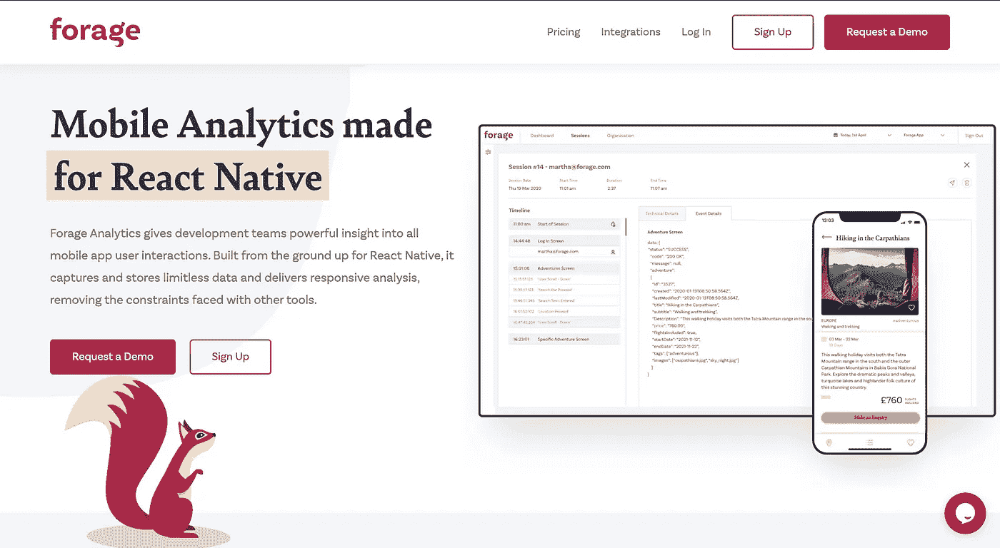
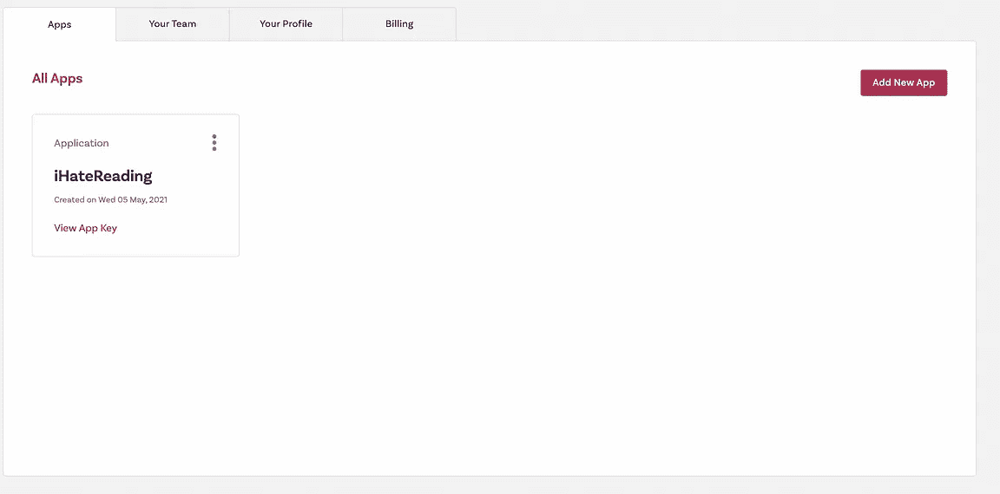
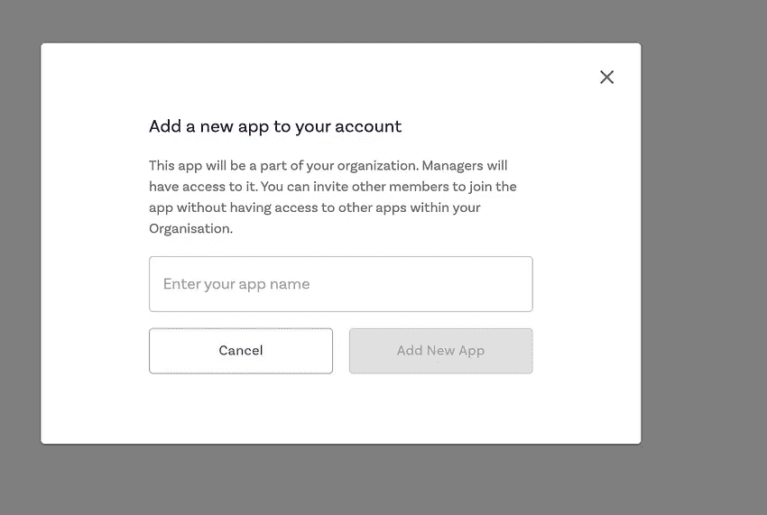

# 这家公司开发了一个分析工具，用于 React 本地应用程序

> 原文：<https://javascript.plainenglish.io/this-company-has-developed-an-analytical-tool-for-react-native-application-c9110b33a8e4?source=collection_archive---------14----------------------->

饲料分析入门，React 本机应用的新分析工具。


Photo by [Obi Onyeador](https://unsplash.com/@thenewmalcolm?utm_source=medium&utm_medium=referral) on [Unsplash](https://unsplash.com?utm_source=medium&utm_medium=referral)

最近，我和饲料分析公司的产品经理开了一次会。他和他在 feed 的团队开发了一个分析工具，用来深入了解 React 原生应用程序的用户体验。

饲料团队在一次会议上向我简要介绍了该产品及其应用。今天，我将对饲料分析工具进行同样的简要分析，并介绍如何将其集成到您的 React 原生应用程序中。

让我们开始聚会吧！

# 饲料分析概述

feed analytics 是 React 原生开发者的开发工具，用于跟踪用户体验和交互，并从中获得响应性分析和见解。该工具从您的应用程序中收集实时交互信息，以产生富有成效的必要见解。feed analytics 会实时收集诸如有多少用户登录、有多少用户到达特定页面(如登录、结账等)等信息。



Forage analytics website

让我们举一个现实世界的例子，你开发了一个移动应用程序，并通过应用程序商店或 play store 向用户推出该应用程序。你肯定需要追踪以下因素-

*   你的应用程序的总下载次数？
*   人们正在使用的应用程序的版本数量？
*   您的用户正在使用哪个版本的应用程序？
*   有多少用户在使用 Android 或 IOS？
*   您的应用在特定用户的手机上如何运行，或者
*   有多少用户遇到了应用程序崩溃等等

运行您的应用程序和理解用户通常需要这些类型的问题。但是它们很难被追踪，并且很难通过立即为你提供这些有用且富有成效的见解来进行分析。

如果你还没有理解我之前想说的话，就看看安装过程，看看它是如何工作的。

# 入门指南

要使用饲料分析，我们需要一个应用程序密钥。您将创建的每个特定应用程序都需要一个应用程序密钥。

每个项目或 React 本机应用程序都将有一个唯一的应用程序键，因为这个唯一的应用程序键 feed 将跟踪您的特定应用程序的分析，以将其显示在您的特定 feed 项目上。

## 如何获取应用密钥

*   前往 [**牧草分析网站**](https://www.forage-analytics.com/) 并在网站上注册
*   注册成功后，您将被重定向至 [**仪表盘**](https://app.forage-analytics.com/) 页面
*   在仪表板页面中，点击顶部导航栏上的 [**组织**](https://app.forage-analytics.com/organization) 按钮
*   通过单击添加新应用程序，您可以在模式中输入您的应用程序名称来创建新应用程序
*   申请完成后，您可以查看您的应用密钥

添加图像以便更好地参考



Organization page on the left-hand side image and add app name in the right-hand side image.

如果您在创建新应用程序或获取应用程序密钥时遇到任何问题，请联系我，我会与 [**饲料**](http://support@forage-analytics.com) 的支持团队直接联系，并尽快帮助您解决问题。

接下来，提取 app 键并在饲料控制面板上创建新的应用程序后，我们就完成了饲料控制面板中所需的设置。接下来，我们需要在 React 本地应用程序中集成 feed SDK，以跟踪应用程序的用户交互数据。这样，我们将能够测试饲料分析工具。

# 安装软件包

为了安装饲料分析 SDK，我们有一个由他们开发的名为 react-native-feed 的 npm 包。

```
yarn add react-native-forage
```

请注意——当您的用户使用应用程序时，feed 会收集数据，这些数据会存储在本地设备上，直到会话完成。会话完成后，信息被上传到饲料服务，并在几秒钟内在 web 应用程序中可用。

一旦用户离线，为了防止用户数据的任何误导或延迟，当用户离线时，草料会将数据暂时存储在用户的手机中，一旦他/她恢复连接，草料分析工具会从用户的手机中提取存储的数据。

因此，将数据存储在用户的手机搜索中依赖于第三方库，如 react-native async storages、react-native-device-info 等。

要安装每个必需的软件包，请运行以下命令

```
yarn add react-native-forage @react-native-async-storage/async-storage @react-native-community/netinfo react-native-device-info react-native-localize
```

或者你可以在这里阅读指令[T5](https://www.npmjs.com/package/react-native-forage)

一旦安装了软件包，我们需要使用我们的应用程序密钥连接我们的应用程序。

```
import Forage from 'react-native-forage';    
import { AppState } from 'react-native';

// Call Forage.start with your unique app key
// TIP: Don’t forget to pass in AppState    
Forage.start(YOUR_APP_KEY_HERE, AppState);
```

Ta-Daaaa，我们的基本设置已经完成，我们准备使用饲料工具。

# 分析方法

feed 提供了几种跟踪用户体验的方法。这些问题如下-

*   **setUserId** —这个方法只是帮助给每个登录的用户一个不同的用户 Id。您甚至可以提供与您在后端使用的相同的用户 id，以便使用该 id 跟踪用户。避免提供 JWT 或任何其他身份验证令牌或任何其他用户数据，如电子邮件，因为这些都是敏感信息

```
Forage.setUserId('User1');
```

*   **trackEvent** —该方法允许您跟踪应用程序上的用户交互。例如，一旦用户单击了登录按钮，您就可以用其他键值属性存储该按钮单击事件。

```
trackEvent('Customer Checkout Press');
trackEvent(‘Item Added to Basket’, {
  label: 'Dining Room Chair',
  currency: '£',
  cost: ‘99.99’,
  discount: ‘10%’,
  total: ‘90.00’
});
```

每个添加的属性都记录在特定应用程序内分析的仪表板页面中。收集该属性对于了解有多少用户到达了我们的结帐页面或者有多少用户到达了其他需要的页面是很重要的。

*   **trackScreen** —这种方法有助于区分你的 React 原生应用在饲料仪表盘中的页面。应用程序的每一页都应该用这个方法命名，并由用户跟踪应用程序中的屏幕变化。

此外，您添加的每个赛道活动都将被记录并分类到“饲料”仪表盘的“屏幕名称”部分。

```
trackScreen('Product A - View');
trackScreen('Checkout Screen');
```

*   **start timer**&**end timer**——这是我最喜欢的部分。有时你需要知道一个特定的页面需要多少时间来渲染，或者任何特定的 API 需要多少时间来响应，使用 endTimer 和 startTimer，你可以记录时间。

```
startTimer('API X Called');
const data = await callApi();
endTimer('API X Called');
```

这个方法对于检查 React 应用程序的性能非常有用。

# 结论

我使用过 React Native 的所有分析工具，但我仍然相信我们需要更多这样的工具来简化我们的工作，并获得应用程序的详细分析。下次见。祝大家愉快。

```
For more such stories visit our website 💻 [**iHateReading**](http://ihatereading.in)
```

*更多内容请看*[*plain English . io*](http://plainenglish.io/)