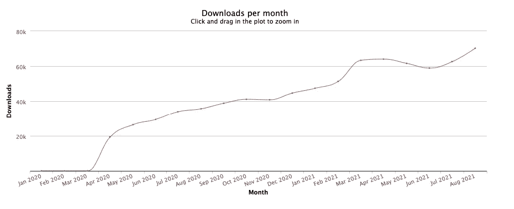
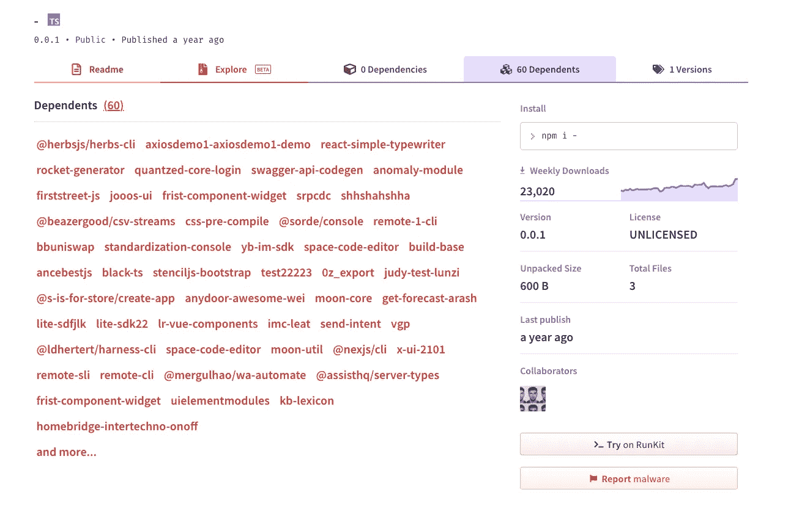

# 这个空的 NPM 包有超过 70 万的下载量

> 原文：<https://javascript.plainenglish.io/this-empty-npm-package-has-over-700-000-downloads-7718b48bf997?source=collection_archive---------0----------------------->

## 原因如下。


Photo by [Kira auf der Heide](https://unsplash.com/@kadh?utm_source=medium&utm_medium=referral) on [Unsplash](https://unsplash.com?utm_source=medium&utm_medium=referral)

让我告诉你这个不起眼的软件包，它在过去的一年里产生了超过 70 万次的下载。

这个包的名字是`-`，它实际上什么也不做。它包含通常的空样板。然而，人们仍然为他们的项目下载它。我无法理解，所以我做了点调查。

在这个故事中，我将分享我的发现。

# 为什么有人下载它？

令人难以置信的是，人们真的在下载这个包。下载量每月都在上升。下图说明了自软件包在 npm 上发布以来的下载次数。



Number of downloads per month (source: [npm-stat](https://npm-stat.com/charts.html?package=-&from=2020-01-25&to=2021-08-25))

但是如果你对此感到惊讶，等我告诉你更疯狂的部分。它被用作 60 多个 npm 包的依赖项。我感觉会有一些读者质疑这种说法。

我直接从 npm 上截图了。但是如果你还觉得我只是个 Photoshop 高手，你可以[自己去](https://www.npmjs.com/package/-)看看。



Number of dependents (source: [npm](https://www.npmjs.com/package/-))

起初，我认为这就是为什么它有这么多下载。我打赌你也在考虑这个问题。但这与事实相差甚远。事实上，所有这些软件包都只有少量下载。

虽然他们可能会产生一些额外的下载量，但这还远远不是最终的数字。那么这些下载都是从哪里来的呢？这是谜题的最后一块，我一会儿就给你揭晓。

如果我告诉你，你也把它下载到你的项目里了。它在你不知情的情况下发生了。也许它现在正静静地坐在你的`package.json`里。你对此一无所知。也许你是那 70 万人中的一员。

但它怎么会在那里？

我们都知道，为了安装 npm 包，我们需要运行以下命令之一。或者事实上，它的许多变体。

```
npm i package# ornpm install --save package# or npm i -g package
```

因为你和我都是人，我们容易犯错。有时你按空格键太早，有时你忘了一个字母。或者如果你像我一样，有时你最终会写出完全不同的东西。重点是，打错字非常容易。注意`-`和`g`之间的空间。

```
npm i - g package
```

这是如何将`-`安装到你的项目中的一个例子。

我很好奇想在我的系统上尝试一下。除了错误之外，我看不出这会导致什么别的结果。但是你可以想象当命令成功完成时我有多惊讶。我的项目增加了 3 个新成员。他们的名字分别是`-` `g`和`package`。

你可能已经猜到了。下载量高是用户打字错误的结果。在 npm 命令中犯了一个愚蠢的错误。你可能会得到你不想要的包裹。就像我和我的三个朋友一样。不用说，我们的友谊没有持续多久。

现在你知道所有下载背后的原因了。让我们进一步检查一下这个包裹。它真的什么都不做吗？作者对此有什么看法？

# 包裹里面是什么？

我花时间亲自查看了这个包的源代码。但是很快，我遇到了一个小问题。你见过没有 Github 库的 npm 包吗？今天，我找到了第一个。直到今天，我都不知道这是可能的。

不管怎样，经过几分钟的侦探工作。我追踪到了作者和他的 Github 档案。幸运的是，这个库是公开的。考虑到它的内容，这很有意义。

我找到了正确的存储库，并最终能够检查它。我立刻意识到，这个包裹就像男人的乳头一样有用。除了配置文件。在`src`目录中只有一个`index.ts`文件。它包含以下代码。

```
export default null;
```

我知道这不算多。但正如我的同事常说的，“你做得越少，你打破的就越少。”


GIF by [Giphy](https://giphy.com/gifs/culture--think-hmm-d3mlE7uhX8KFgEmY)

我不禁想知道为什么要创建这个包。事实上，它为什么会被出版？然后这个想法闪过我的脑海。这位作者是某种狡猾的骗子。努力在 npm 的世界里出名。

但我们不能只凭我的猜测。我们必须进一步调查。

# 作者是谁？

正如我已经提到的，我找到了作者。我打赌你在想包裹后面的神秘人是谁。他的名字是 Dmitry Parzhitsky，从他的知识库来看，他喜欢打字稿。

正如德米特里在[哔哔声电脑](https://www.bleepingcomputer.com/)的采访中明确表示的，他无意以任何方式对任何人造成任何伤害。这个方案背后的想法很简单。测试是否有可能向 npm 注册表发布一个名为`-`的包。

很明显是这样。

Dmitry 还澄清说，虽然该软件包目前没有任何作用，但他计划通过在人们试图意外安装它时抛出错误信息来扩展它。虽然这听起来毫无意义，但它最终可以为您节省 1kb 的包大小。

既然我们发现了作者是谁。以及`-`背后的动机是什么。很明显，这个包裹没有造成任何伤害，将来也不会。但是`-`并不是唯一的解决方案。其他人呢？还有有没有什么安全性要考虑？

# 为什么会有危险？

可以说，现在`-`中没有任何东西让它变得恶意。然而，我们应该小心像`-`这样的包不要意外地溜进我们的构建中。

还有其他单字母包裹的例子。举几个例子: [i](https://www.npmjs.com/package/i) 、 [g](https://www.npmjs.com/package/g) 、[安装](https://www.npmjs.com/package/install)或 [s](https://www.npmjs.com/package/s) 。都不危险，但还是有潜在风险。如果有不纯意图的人误用这个命名怎么办？你很容易因为一个愚蠢的打字错误而导致不必要的依赖。

另一个问题是，在安装软件包时，npm 会显示一条摘要成功消息。它不会向您显示安装了哪些软件包。它只显示最终的数字。谢谢你认为，结束一个不必要的依赖可能更容易。

# 总结想法

正如我们今天所学的，在终端中键入 npm 命令时，我们应该注意。尤其是使用标志的时候。不时检查和审计你的`package.json`也不会伤害你。

我不知道你，但当我第一次听说这件事时，我立即查看了我的`package.json`档案。问题是，你会吗？

[](/i-left-my-job-because-of-typescript-3df0cb38bdbf) [## 因为打字稿，我离职了

### 所以你可以从我的错误中吸取教训

javascript.plainenglish.io](/i-left-my-job-because-of-typescript-3df0cb38bdbf) [](/dear-developer-this-is-how-you-center-a-div-e526e7cfcc9d) [## 亲爱的开发者:这就是你如何将一个 Div 居中

### 让我们一起终结迷因

javascript.plainenglish.io](/dear-developer-this-is-how-you-center-a-div-e526e7cfcc9d) 

*更多内容请看*[***plain English . io***](http://plainenglish.io/)