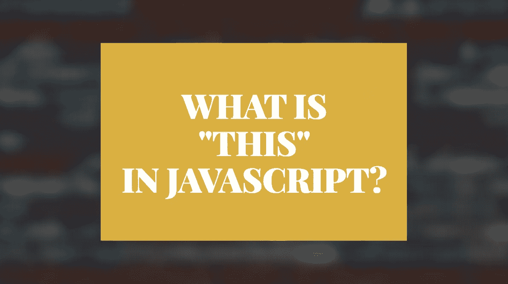
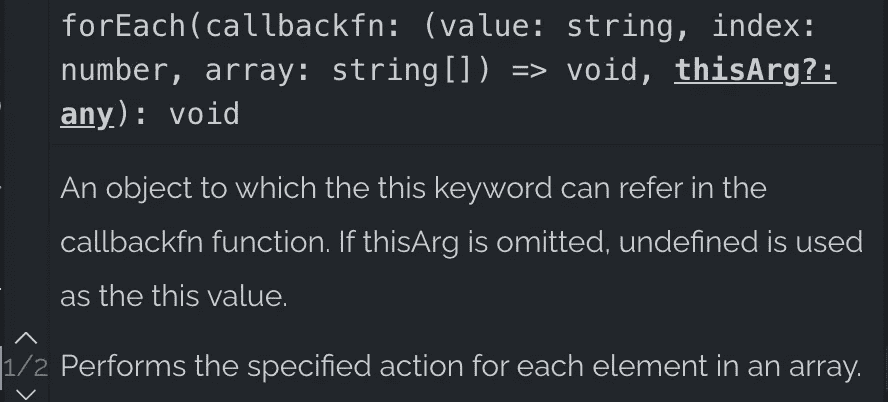

# JavaScript 中的“this”是什么？

> 原文：<https://javascript.plainenglish.io/this-in-javascript-451bb6d4be31?source=collection_archive---------6----------------------->

## 了解如何在 JavaScript 程序中使用“this”关键字。



在 JavaScript 中，`**this**`是执行当前函数的对象。

*   如果函数是对象的方法，`**this**`表示对象本身。
*   如果函数没有绑定到一个对象，`**this**`指的是[全局对象](https://www.contentful.com/blog/2017/01/17/the-global-object-in-javascript/)。

如果您不熟悉全局对象，简而言之，它是:

*   控制台中的`Window`对象。
*   node.js 中的`Global`对象
*   `undefined`在严格模式下。

# Javascript 函数中“this”的例子

让我们看一堆在不同语境下理解和使用`**this**`的例子。

## 这在一个方法中

让我们创建一个`person`对象和一个`getInfo`方法。让我们在`getInfo`方法中调用`**this**`:

调用`person.getInfo()`记录控制台中的 person 对象。

```
{name: "Jack", getInfo: ƒ}
```

这是因为`getName()`方法属于`person`对象，所以`**this**`指的是对象本身。

## 这在函数内部

让我们看另一个例子。

这一次，让我们创建一个不依赖于任何对象的函数:

现在`**this**`指向全局对象，即控制台中的`Window`对象:

```
Window {0: global, window: Window, self: Window, document: document, name: "", location: Location, …}
```

## 这在构造函数中

让我们看看`**this**`如何与**构造函数**一起工作。

如果你不记得了，一个**构造函数**是一个创建对象实例的函数。在 JavaScript 中，通过关键字`**new**`调用构造函数。

让我们创建一个用于创建 person 对象的构造函数`Person`:

```
**function** Person(name) {
  this.name = name;
  console.log(this);
}
```

现在您可以使用它来创建初始化 person 对象:

```
**const** employee = **new** Person('Jack');
```

现在输出的是新的`Person`对象:

```
{name "Jack"}
```

但这怎么可能呢？我们刚刚看到`**this**`是函数中的`Window`对象。这个函数与我们之前使用的函数有什么不同吗？

这是因为您使用`**new**`操作符创建了`employee`。使用`**new**`创建一个**新对象**并设置`**this**`指向它。

## 这在回调函数中

作为最后一个例子，让我们创建一个`person`对象，它有一个`name`和一组存储在数组中的兴趣。为了打印出兴趣，我们给`person`对象添加一个`showInterests()`方法。该方法调用`interests`数组上的`forEach`,并以如下格式打印利息:

```
Matt is interested in Golf.
Matt is interested in Tennis.
Matt is interested in Padel.
```

在代码中，它看起来像这样:

但是现在输出看起来像这样:

```
is interested in Golf.
is interested in Tennis.
is interested in Padel.
```

缺少`name`零件。这意味着在`forEach`回调函数内部调用`this.name`由于某种原因失败。

让我们看看回调中只打印`this`而不是`this.name`是怎么回事:

输出:

```
[object Window] is into Golf.
[object Window] is into Tennis.
[object Window] is into Padel.
```

啊哈！现在`**this**`指向全局对象`Window`而不是`person`。但是为什么呢？`forEach`回调住在`person`里面，那么`**this**`不应该指`person`本身吗？

没有。这是因为`forEach`里面的函数只是一个常规函数。这不是`person`对象的方法。正如您所记得的，一个`**this**`指的是一个函数内部的全局对象，它不依赖于一个对象。因此，在`forEach`中调用`**this**`是指`Window`对象。

既然您已经理解了为什么会发生这种情况，那么让我们来看看如何修复这个问题。

`forEach`方法碰巧接受另一个参数。这个参数就是`**this**`在回调里面引用的对象。



如果您想在回调函数中调用`this.name`，您需要将`**this**`作为第二个参数传递给`forEach`方法:

输出:

```
Matt is into Golf.
Matt is into Tennis.
Matt is into Padel.
```

现在`showInterests()`方法如预期的那样工作了。

# 结论

感谢阅读。我希望你喜欢它。

在 JavaScript 中，`**this**`对象是执行当前函数的对象。

*   在一个对象的方法中`**this**`是对象本身。
*   在函数中`**this**`指的是[的全局对象](https://www.contentful.com/blog/2017/01/17/the-global-object-in-javascript/)。

编码快乐！

# 进一步阅读

[](https://www.codingem.com/50-buzzwords-of-web-development-and-design-in-2021/) [## 2021 年网络开发和设计的 50 多个流行语

### 学习创业公司使用的网页开发和网页设计语言。这篇文章是关于…的很好的入门读物

www.codingem.com](https://www.codingem.com/50-buzzwords-of-web-development-and-design-in-2021/) [](https://betterprogramming.pub/25-useful-javascript-shorthands-for-web-developers-771ac550a7ba) [## 25 个对 Web 开发人员有用的 JavaScript 简写

### 学习这些惊人的简笔和一行程序来编写干净快速的代码

better 编程. pub](https://betterprogramming.pub/25-useful-javascript-shorthands-for-web-developers-771ac550a7ba) 

# 参考

[](https://developer.mozilla.org/en-US/docs/Web/JavaScript) [## JavaScript | MDN

### JavaScript (JS)是一种轻量级、解释型或即时编译的编程语言，具有一流的…

developer.mozilla.org](https://developer.mozilla.org/en-US/docs/Web/JavaScript) 

*更多内容请看*[***plain English . io***](http://plainenglish.io/)