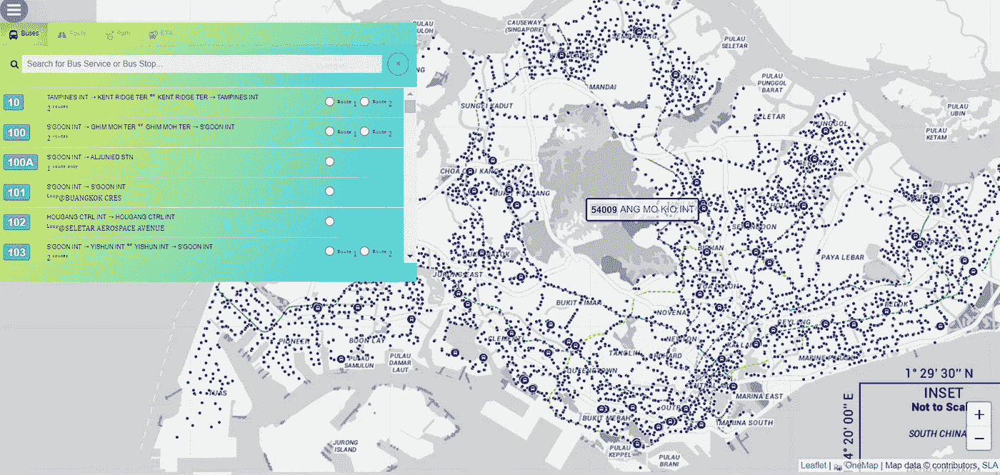
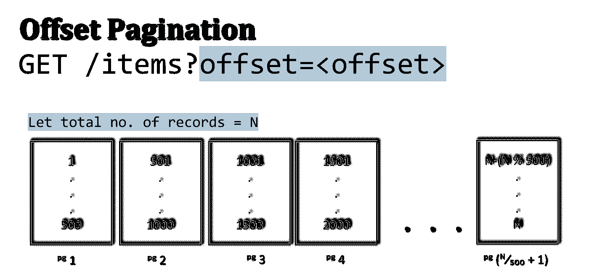

# 如何在普通 JavaScript 中通过分页 API 调用检索所有数据

> 原文：<https://javascript.plainenglish.io/this-is-how-you-can-retrieve-all-data-via-paginated-api-calls-in-vanilla-javascript-a8258e208ea0?source=collection_archive---------3----------------------->

## 没有插件。两种方法—1 .递归& 2。聚合数据块的迭代。

几个月前，当我在构建一个实时网络应用程序来监控🚌公交车到达时间，主要要求之一是**在第一次加载时将所有公交车站渲染到底图上**:



Screenshot by Author | An image of rendered Bus Stops on the [web application](https://sg-transportation.herokuapp.com/) | Data was retrieved via a paginated API from transport provider

> 总共有 5，098 个公交车站，交通数据 API 每页最多返回 500 个条目。

为了在第一次加载时呈现所有的公交车站，有必要首先在 Node.js 后端服务器上聚集所有分页的数据块。



Illustration by Author | A diagram which represents the above API pagination format and offset

虽然网上有几个代码示例可供参考，但我遇到的所有代码片段*要么是围绕**的***(1)递归 *或* **(2)迭代**算法方法。为了方便起见，这两种方法及其各自的代码片段都包含在本文的以下部分，以供参考。请随意调整并在您的用例中使用它们。

## (1)递归

下面是我实现的聚合所有数据块的递归代码片段:

**注意要点:**

*   **停止条件:**

**解释:**当返回的项数小于 500(每页返回的最大项数)时，函数`**callAPIService**(transportation, offset)`返回数组`**arr_result**` **，其中聚集了来自先前 API 调用的每个块包含 500 个项的所有数据块。**

*   **不满足停止条件时:**递归，即改为执行方法本身来传播递归过程。

## (2)迭代—While-Loop+Async-Await & Promises

或者，也可以使用 **async-await** 语法通过**循环**来实现迭代，从而聚合所有数据块。

**使用 Async-Await & Promise:** 实现`**async-await**`语法，`**async**`必须始终出现在实现`**await**`的函数中:

```
async function func() {
  let dataObj = await getData();
}
```

**代码逻辑解释:**与递归类似，`**while-loop**`也有终止条件，即`**if(result.length<PAGE_SIZE)**`

*   **停止条件满足:**`**while-loop**`停止运行，返回响应。布尔被设置为`**false**`以停止迭代`**toContinue=false;**`
*   **否则:** `**while-loop**`继续运行，更多的数据块被连接到数组`**arr_result**`

## 递归与迭代的总体思路:

在上面的用例中，公交车的**号停了大约 5K** ，我个人更喜欢使用递归，因为**比迭代**的代码长度更短。

但是，在聚合数据数组中返回的总项数未知并且最终项数可能非常大的情况下，更明智的做法是对每个 API 调用使用迭代方法，比如 while-loop。这是因为，在递归算法中，大量的 API 调用会导致**堆栈溢出，导致你的程序在运行时崩溃**🙃

另一个需要注意的是，递归算法的复杂度 O(n)随着 API 调用的增加而呈指数增长。因此，当检索到的项目数量很大，并且预期的 API 调用数量也相应很高时，坚持使用迭代方法比递归方法更明智，这样可以避免损害应用程序的性能。

## 非常感谢你坚持到这篇文章的结尾！❤希望你发现上面的两个代码片段很有用，如果你想了解更多与数据分析相关的内容，请随时关注我。会非常感激😀

**参考消息:**如果您对前面提到的公交路线 web 应用程序感兴趣，请随时查看以下文章。

[](https://towardsdatascience.com/building-a-real-time-web-app-in-nodejs-express-with-socket-io-library-d9b50aded6e6) [## 用 Socket.io 库在 NodeJS Express 中构建实时 web app

### 服务器+客户端代码实现来检索公交车到达时间

towardsdatascience.com](https://towardsdatascience.com/building-a-real-time-web-app-in-nodejs-express-with-socket-io-library-d9b50aded6e6) [](https://towardsdatascience.com/tackling-heroku-h12-timeout-errors-of-node-js-web-apis-handling-long-response-times-8fbafe46cd40) [## 解决 Node.js Web APIs 的 Heroku H12 超时错误—处理长响应时间

### 带有 Redis 缓存的混合(服务器+客户机)API 分页

towardsdatascience.com](https://towardsdatascience.com/tackling-heroku-h12-timeout-errors-of-node-js-web-apis-handling-long-response-times-8fbafe46cd40) [](https://geek-cc.medium.com/membership) [## 通过我的推荐链接加入灵媒——李思欣·崔

### 获得李思欣·崔和其他作家在媒体上的所有帖子！😃您的会员费直接…

geek-cc.medium.com](https://geek-cc.medium.com/membership) 

*更多内容请看*[***plain English . io***](http://plainenglish.io/)