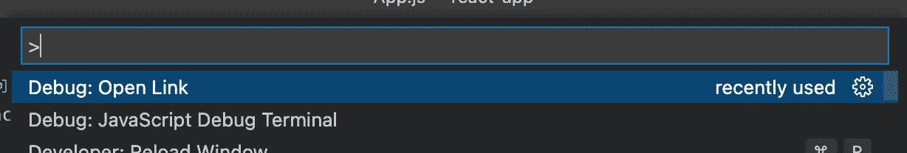
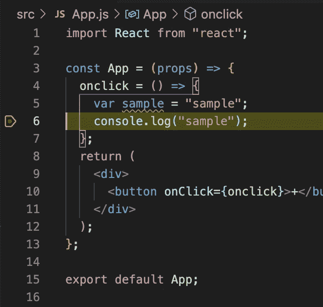

# 这就是现在在 VSCode 中调试 React 本机应用程序的方式

> 原文：<https://javascript.plainenglish.io/this-is-how-you-debug-react-native-apps-in-vscode-now-ba2e2e8666e3?source=collection_archive---------5----------------------->

## 在 VSCode 中调试 React 本机应用程序的简单分步指南。

Photo by [Tudor Baciu](https://unsplash.com/@baciutudor?utm_source=medium&utm_medium=referral) on [Unsplash](https://unsplash.com?utm_source=medium&utm_medium=referral)

*作为程序员，我们总是希望从编辑器中执行调试。下面是在 VSCode 中设置 React 本机调试的三个简单步骤。以前，它是通过* `*React native Tools*` *完成的，但现在已经失效。*

# 第一步

安装过程中需要的东西。

*   打开扩展视图(ctrl+shift+x)并搜索`@builtin @id:ms-vscode.js-debug`
*   右键单击`JavaScript Debugger`扩展并`Disable`它。
*   在扩展视图中搜索`@id:ms-vscode.js-debug-nightly`。
*   安装扩展

View -> Command Palette (shortcut — cmd+shift+p)

那么

debug: Javascript debug terminal

*   `npm install && react-native start`

**第二步**

*   在 IDE [ `AndroidStudio`和`Xcode` ]中打开原生项目[即`./android`和`./ios` ]
*   等待`gradle`同步，等待`pod install`iOS
*   本机构建和运行

**第三步**

*   打开`ios [cmd+d]`和`android [adb shell input keyevent 82]`模拟器上的调试菜单，点击`debug`
*   这将在[http://localhost:8081/debugger-ui](http://localhost:8081/debugger-ui)打开一个新的选项卡

Paste `[**http://localhost:8081/debugger-ui**](http://localhost:8081/debugger-ui)` here

**Make Sure this is selected**

> 粘贴上面的 URL 并关闭选项卡。这将在 Google Chrome 中打开该 URL 并关闭前一个选项卡。

Start Debugging now.

仅此而已。调试愉快，感谢阅读。

*更多内容请看*[***plain English . io***](http://plainenglish.io/)